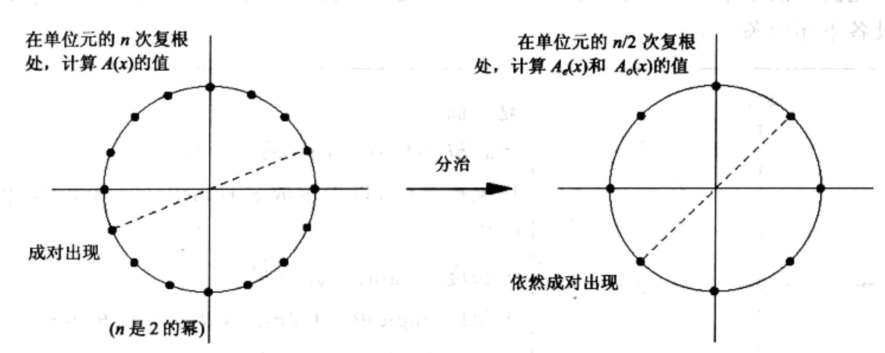
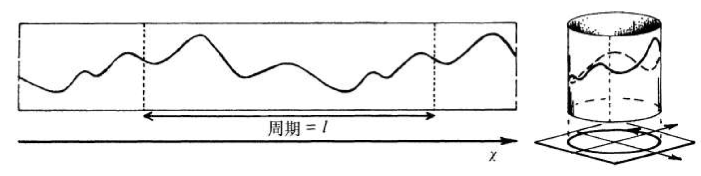

# 卮言快速傅立叶变换中的对称

1.	【原文】：利用量子的这些特性，可以实现相对于传统计算机的性能，有指数级的提升。【Comment】：此处表述不准确，不是所有量子算法都具有量子优势，也不是所有量子算法对经典算法有指数级的加速（如Grover算法仅具有平方量级的加速。）“有指数级的提升”可以改为“对部分计算问题有指数级的提升”。

2.下图这一部分叫“Shor’s Algorithm的例子”有一点不合适，因为这部分主要在讲解“大数分解问题”和“周期求解问题”的互相转化，并且这个问题相互转化的部分是经典算法，只有周期求解部分是量子的。我比较建议这一段的标题改为“大数分解问题和周期求解问题的归约”。

3．后面的【shor’s algorithms计算流程简述】部分，实际上是“周期求解问题”的算法。虽然给出了一个具体的例子，但是具体流程不是特别清晰。或许可以像下面这样举例，读者会更清楚算法中量子态的变化和各个register的定义。TODO，参考https://zhuanlan.zhihu.com/c_1242529033193308160，并调整结构。

- 引子：赤壁赋，变中的不变，结构化编程
- 绪论：抽象性，对称性
- FFT
- 分析FFT得以成立的原因，对称，引入群论
- 欧拉定理，群论证明和普通证明
- QFT：量子计算机，Shor 算法
- 不同编程语言中的对称性：error的处理
- 数学思想

# 群论简述

希尔伯特在《几何基础》（Grundlagen der Geometrie, 1899）中说：

> 必须可以用‘点、线、面’以外的概念（如‘桌子、椅子、啤酒杯’）替代几何对象，只要它们满足公理。

数学界的亚历山大大帝强调，几何的本质是抽象关系，如 2 点确认 1 条直线，而非具体的对象。因此，只要抽象关系成立（公理），任何事物都可以替代几何元素。关系重于实体，形式高于具象。关系在数学中通常表述为结构。

人类第一个真正的抽象学科是抽象代数，抽象代数是从伽罗华的群论发展起来的。伽罗华是数学从计算，转向结构的关键人物，或者说是数学从古代转向近现代的关键人物。在其之前，数学是靠计算解决问题。伽罗华以超凡的洞察力，构建了从数学结构来研究数学本质的群论，这是从具体到抽象的巨大跨越。

# 快速傅立叶变换

来自 John Lipson 书籍的对快速傅立叶变换的评价：

> 一个有着许多理由值得鉴赏的算法：在技术上，他高效地解决了一个至关重要的实际问题；从美学上，他十分优雅；并且开创了若干崭新且意料之外的应用领域。很有可能是因为快速傅立叶变换（fast Fourier transform， 下文均简称FFT）在上述方面都很出色，自从 20 世纪 60 年代中叶发现他以来，他就一直被视为计算机科学中的“超级”算法之一。

## 快速傅立叶变换的慢传播

在 19 世纪早期，高斯（Gauss）发表的一篇关于插值的论文中，也蕴含了与 FFT 算法相同的思想。只是高斯的论文长期以来，一直不为外人所知，而这主要得益于一种老式的加密技术：与当时大多数的科学论文一样，它是用拉丁文撰写的。

在 20 世纪 30 年代后期，英国工程师使用 FFT 算法进行手工计算。

在 1965 年普林斯顿大学的数学家图基（John Tukey）和 IBM的库利（James Cooley）发表 FFT 算法论文。库利是算法的提出者，但对发表论文不热心，论文有库利执笔。图基不热心的原因，并非因为利益，而是因为他认为 FFT 算法不过是一个简单的观察结论。

## 观察多项式乘法

问题：给定 2 个多项式 p(x) 和 q(x)，计算他们的乘积 p(x) * q(x)。

考察一个 1 次多项式 $a_1x+a_0$，该多项式（线性函数）可以由 2 个系数 $a_1$ 和 $a_0$ 确定。同时，该函数对应平面的一条直线，他也可以由直线上的任意 2 个点确定。将这些点的取值，对应相乘，很容易完成。这种表示法，对多项式乘法很方便。

例如，多项式 $q(x)=2x^2-x+3$ ，可以由点 (1,4)、(2,9)、(3,18)表示。多项式 $p(x)=x^2+3x+1$ 可以由点 (1,5)、(2,11)、(3,19)表示。二者的乘积 $p(x)q(x)$ 包含值 (1,20)、(2,99)、(3,342)。由于 $p(x)q(x)$ 的次数是 4， 3 个点不足以表示其乘积以后的多项式。再添加 2 个点即可。我们只需要经过 $O(n)$ 运算，就能计算 2 个 n 次多项式的乘积。

**多项式运算的表示形式对比**  

| **多项式表示形式** | **系数表示** | **点表示** |  
|-------------------|-------------|------------|  
| **加法**          | 便捷         | 困难        |  
| **乘法**          | 困难         | 便捷        |  

不同的表示方式，各有千秋。如果能高效地从一个种表示方式，转换为另一种方式，就可以得到一个高效的多项式乘法。FFT 就是这样的算法。

## 正向傅立叶变换

从系数表示转为点的表示，用霍纳（Horner）规则​​，可以使用 n 次乘法，计算多项式在任意一点的值。需要处理任意 n 个点，所以共需 $n^2$ 次乘法运算。

从点的表示，转变为系数表示的过程，称之为插值，通常需要 $O(n^2)$ 次运算。

由于可以自由选取 n 个点，，FFT 就选取了一组特别的点集合，使得求值和插值，都能很快的完成。

对任意的一个 $n-1$ 次多项式，$P=\sum_{i=0}^{n-1}a_ix^i$ 在 n 个不同点进行求值，需找到 n 个点，使得多项式更容易求值。为了简单，假定 n 是 2 的幂。

使用矩阵，表示多项式在 n 个点 $x_0,x_1,...,x_{n-1}$ 的取值：

$$
V \mathbf{a} = \mathbf{P}
$$

其中：

$$
V = \begin{bmatrix}
1 & x_0 & x_0^2 & \cdots & x_0^{n-1} \\
1 & x_1 & x_1^2 & \cdots & x_1^{n-1} \\
\vdots & \vdots & \vdots & \ddots & \vdots \\
1 & x_{n-1} & x_{n-1}^2 & \cdots & x_{n-1}^{n-1}
\end{bmatrix}, \quad
\mathbf{a} = \begin{bmatrix}
a_0 \\
a_1 \\
\vdots \\
a_{n-1}
\end{bmatrix}, \quad

\mathbf{P} = \begin{bmatrix}
P(x_0) \\
P(x_1) \\
\vdots \\
P(x_{n-1})
\end{bmatrix}.
$$

# 快速傅立叶变换中的对称

# 量子计算机简介

量子力学是科幻作品中的常客，刘慈欣先生的《球状闪电》中，很生动描述的量子力学的哥本哈根诠释。量子力学中还有名鼎鼎的物理学四大神兽之一，薛定谔的猫。其他三只是拉普拉斯兽，麦克斯韦妖，芝诺的乌龟。薛定谔的猫让人疑惑的问题之一，是量子力学的量子态的叠加。

设死猫的量子态:
$$
|0\rangle
$$

活猫的量子态:
$$
|1\rangle
$$

箱子中的猫就是这两个量子态的叠加：

$$
\alpha|0\rangle + \beta|1\rangle
$$

其中 $\alpha$ 和 $\beta$ 是概率幅，可以是正数、负数、复数。Shor's Algorithm 中量子傅立叶变换就跟概率幅可以为负数相关，可以放大我们想要的量子态的概率幅，从而测量的时候有更高的概率获取到我们想要的结果。

去测量猫是死还是活的时候，结果是死猫 $\|0\rangle$ 概率是 $\alpha^2$，同理活猫的概率是 $\beta^2$。薛定谔的猫不生不死，就是叠加态。

在传统计算机中，1 比特要么是高电平 1，要么是低电平 0，一个比特的值是确定的。量子计算机中比特既可以是 0，也可以 1，二者叠加在一起。考察这个存储上的特点，在 L 个比特上，量子计算机可以同时表达 $2^L$ 个数，而传统计算机只能表达 1 个数，量子计算机是传统计算机的  $2^L$ 倍。

除了存储，还有计算操作上的不同。传统计算机中通过门电路计算。量子计算机是幺正变换，实现量子门。例如 Hadamard 变换实现单比特的 H 门，是一个幺正矩阵：

$$
\frac{1}{\sqrt{2}} \begin{bmatrix}1&1\\1&-1\\ \end{bmatrix}
$$

H 门的作用，把一个量子比特转换为 $\|0\rangle$ 和 $\|1\rangle$ 的叠加态。

$$
|0\rangle \to \frac{1}{\sqrt{2}} \left( |0\rangle + |1\rangle \right)
$$

$$
|1\rangle \to \frac{1}{\sqrt{2}} \left( |0\rangle - |1\rangle \right)
$$

H 变换的逆矩阵是他自身。即： $H*H = I$。那么在量子计算机里面，连续做两次变换，就相当于没有做变换，会把量子比特变会原来的样子，也就是量子计算是可逆的。这与传统计算机迥然不同。

当有 L个比特，表示的 $ 2^L $ 个数据，在量子门中一次就操作完成了。在传统计算机中分别对 $ 2^L $ 个数据处理，则需要  $ 2^L $ 次操作。忽略量子门和传统电路计算速度的差异，量子计算机相对传统计算机，相当于做了 $ 2^L $ 加速。效果很像传统计算机中的并行计算，并非严格意义上并行计算。

量子之间可以叠加，还可以纠缠。当2个电子纠缠在一起，一个电子自旋向上，另一个电子自旋向下。此时，测量一个电子自旋，若为向上，另一个电子必然会向下，反之亦然。即使两个电子之间隔着一个银河系也是如此。量子纠缠有大名鼎鼎的贝尔不等式实验证明。刘慈欣先生的《三体》中智子，与三体人的通信，设定上是通过量子纠缠实现。

综上所述，量子计算的计算是可逆的。量子态可以叠加，也可以纠缠在一起。利用量子的这些特性，可以实现相对于传统计算机的性能，有指数级的提升。

# Shor's Algorithm

Shor's Algorithm 是数学家彼得·秀尔（Peter Williston Shor）在1994年发现的算法，又称量子质因数分解算法。这个算法在量子计算机领域很重要，在量子计算机领域独领风骚。

1982年，诺贝尔物理学奖得主费曼在演讲《用计算机模拟物理》（Simulating Physics with Computers）提出经典计算机无法高效模拟量子系统。12年后，秀尔提出能在多项式时间内分解大整数（RSA加密的基础），引发量子计算研究的热潮。Shor 因此获得了理论计算机科学成就的最高奖——内万林纳奖（Nevanlinna Prize）。

Shor's Algorithm 影响深远，时至今日，说起量子计算机的进展，常用秀尔算法的实现规模来描述，如支持能把 15 分解为 $5 \times 3$ 之类的叙述（2001 年IBM的量子计算机）。

## Shor's Algorithm 例子

使用 Shor's Algorithm 算法来分解 N：15。步骤如下：

- 先选一个小于 15 的整数，如 a：2；
- 计算  $2^r \mod 15$ ;

  | 指数 $r$    | $2^r$         | $2^r\mod15$   |
  |------------|---------------|------------------|
  | *0*        | 1             | *1*              |
  | 1          | 2             | 2                |
  | 2          | 4             | 4                |
  | 3          | 8             | 8                |
  | *4*        | 16            | *1*              |
  | 5          | 32            | 2                |
  | 6          | 64            | 4                |
  | 7          | 128           | 8                |
  | *8*        | 256           | *1*              |
  | 9          | 512           | 2                |
  | 10         | 1024          | 4                |
  | 11         | 2048          | 8                |

- 考察一下  $2^r \mod 15$ 的结果，以 4 为周期循环出现：$1 \to 2 \to 4 \to 8$，以此重复，周期 r 等于 4;
- 通过周期 r 来分解 15:

$$
2^r \equiv 1 (\mod 15) \\
2^r - 1 \equiv 0 (\mod 15) \\
(2^{r/2} + 1)(2^{r/2} - 1) \equiv 0 (\mod 15)
$$

$(2^{r/2} + 1)(2^{r/2} - 1)$中，$2^{r/2} + 1 $ 或者 $2^{r/2} - 1$ 是 15 的质因数。这里得到了 15 的分解结果： $5 \times 3$。

在这个例子中，$2^r \mod 15$ 是否一定就是周期性呢？答案是肯定的。数论中的欧拉定理：

> 若 n，a 为正整数，且n和a互素（$gcd(a,n) = 1$），则 $a^{\phi(n)} \equiv 1 (\mod p) $。

即 $a^{\phi(n)} $ 与 1 在模 n 下同余。$\phi(n)$ 为欧拉函数，是小于 n 的正整数中，与 n 互质的数的数目。当 n 是质数的时候，$phi(n)$ 的值为 $p - 1$，欧拉定理就变为费马小定理：$a^{n - 1} \equiv 1 (\mod n)$

所举的例子是简单的情况。遇到 r 是奇数，则需要重新计算。遇到 $a^{p - 1} \equiv 1 (\mod k \times n) $，其中 k 为正整数，则需要 $gcd(a^{r/2} + 1,k \times n)$ 或 $gcd(a^{r/2} - 1,k \times n)$。这样我们就把分解合数 N，转换化求周期 r。

# Shor's Algorithm 计算流程简述

## 1. 制造等概率叠加态，操作寄存器1: register1
用 H 门制作正整数 N 的长度为 L 的处于叠加态的量子比特，存入寄存器 register1 中；

## 2. 求模，制造纠缠态，操作寄存器2: register2
用 register1 中的值计算 $a^x \mod N$ ，并使二者纠缠，存入寄存器 register2 中；

以 $2^r \mod 15$ 为例子，经过1和2，此时得到如下结果：

  | 指数 $r$   |register1：$2^r$|register2：$2^r\mod15$|
  |------------|---------------|------------------|
  | *0*        | 1             | *1*              |
  | 1          | 2             | 2                |
  | 2          | 4             | 4                |
  | 3          | 8             | 8                |
  | *4*        | 16            | *1*              |
  | 5          | 32            | 2                |
  | 6          | 64            | 4                |
  | 7          | 128           | 8                |
  | *8*        | 256           | *1*              |
  | 9          | 512           | 2                |
  | 10         | 1024          | 4                |
  | 11         | 2048          | 8                |

  由数论中的欧拉定理，寄存器 register2 中的值，会以 r 为周期重复出现；为了简化问题的论述，假设 $r \mod L = 0$;若 r 不为偶数，则重新选择 a 计算；

## 3. 量子傅立叶变换

周期 r 在 register2 中，我们需要设法获取周期 r 的值，利用 $(a^{r/2} + 1)(a^{r/2} - 1) \equiv 0 (\mod N)$，求得 N 的因数。我们的重心是周期 r， $a^x \mod N$ 的具体值并不重要，由于每次测量只能获取一个值，我们也无法通过直接测量值来计算周期。

为了获取周期，考虑使用量子傅立叶变换，获取频率ν，从而取得周期 $r = 1 / ν$。这里的量子傅立叶变换的效果，相当于光栅。光通过光栅以后，因光的干涉，会形成明暗相间的条纹，相长干涉产生明条纹，相消干涉产生暗条纹。含周期的量子态经过量子傅立叶变换，也会出现相长相消。

为了使量子傅立叶变换更好处理，我们可以只用保留周期 r 中的某一个值，把其他值变为0，这一操作不影响最终结果，却使得计算和测量更好处理。对 register2 进行一次测量以后，得到一个值 γ。因为 register1 与 register2 纠缠，register1 中的量子也坍缩，剩下与 γ 相关的量子态；

假设 register2 测量的所得值为 1，此时两个寄存器量子态如下：

  | 指数 $r$   |register1：$2^r$|register2：$2^r\mod15$|
  |------------|---------------|------------------|
  | *0*        | 1             | *1*              |
  | 1          | 0             | 0                |
  | 2          | 0             | 0                |
  | 3          | 0             | 0                |
  | *4*        | 16            | *1*              |
  | 5          | 0             | 0                |
  | 6          | 0             | 0                |
  | 7          | 0             | 0                |
  | *8*        | 256           | *1*              |
  | 9          | 0             | 0                |
  | 10         | 0             | 0                |
  | 11         | 0             | 0                |

## 4. 测量，并计算周期 r

周期 r 依然隐含在量子态中。此时进行量子傅立叶变换 QFT，与周期不相关的量子态的概率幅会相消，与周期相关的量子态概率幅会增加（概率幅的平方即概率）。

叠加态经过 QFT 后，只有在 $2^L/k$ 的整数倍的位置不为0，其他元素均为 0。对这一叠加的量子态采样（一次采样，即一次测量），得到值是 $2^L/k$ 倍数，设值为 γ 。下文" Shor 算法求周期 r"部分会给出详细的计算过程。

$$
  γ = k2^L/r
$$

周期 r 为：

$$
  r = k2^L/γ
$$

进一步处理即可求得周期。这里也有小概率会失败，就需要重新计算。下文会给出成功的概率 p，概率 p 与 L 正相关，L 越大，概率越高。

# Shor's Algorithm 成功求得 r 的概率

假设有 k 个互相独立的样本均匀分布：

$$
0,M/k,2M/k,...,(k-1)M/k
$$

则采用中获取到这些样本的最大公因数是 $M/k$ 的概率至少为 $1 - k/2^k$ 。

考虑最大公因数不是 $M/k$ 的情况。

所有的采样的值是 $jM/k$，其中 $j >= 2$，采样获取这一值的概率 p 最多是：$1/j$。

因 $j >= 2$，则这一概率 $p <= 1/2$。有最多有 k 种可能，计算乘积，即：$p^k <= (1/2)^k$。

以上考虑的是特定的数字 j。这种情况最多是对 j 取不同的值求和。j最多有 k 个值，则总概率：$kp^k <= k(1/2)^k$。

则采样的样本是最大公因数不是 $M/k$ 的概率是：$1 -  k(1/2)^k$。

k 为周期个数，数目越大，则测量获取最大公因数是 $M/k$ 的概率越大。

设量子比特的数目为 L，共可以表示 $2^L$ 个值。为了保证最后测量获取正确的值的概率够大，需要保证 $2^L$ 长度内有足够的周期数 k。设要分解的合数为 N，则需要满足：

$$
 N^2 \leq 2^L \leq 2N^2
$$

# Shor's Algorithm

## 制造量子态

利用 H 门制作等概率的量子叠加态 $\|x\rangle$ 存入寄存器 register1。

设函数 $f(x) = a^x(mod N)$ ，利用受控 U 门构造 $\|f(x)\rangle$，存入寄存器 register2，并使之与寄存器 register1 中量子态纠缠。两个寄存器中的量子态如下：

$$
\begin{cases}
\mathinner{|\Phi_1 \rangle}=\frac{1}{\sqrt{2^L}}\sum_{x=0}^{2^L-1} \mathinner{|x \rangle}&register1\\

\mathinner{|\Phi_2 \rangle}=\frac{1}{\sqrt{2^L}}\sum_{x=0}^{2^L-1} \mathinner{|x \rangle} \mathinner{|a^x(mod\;N) \rangle}&register1\oplus register2\\
\end{cases}\\
$$

通过欧拉定理可知，$f(x)$ 为周期函数，设周日为 r，A 为周期数，总长度为 $2^L$，则：

$$
  A = 2^L/r
$$

设 l 为第一个周期内（序号值小于周期 r）, 在第 b 个周期中的 $\|x\rangle$ 可表示为：

$$
 |x\rangle = | l +  br\rangle
$$

因此，寄存器 register1 的 量子态 $\|\Phi_1 \rangle$ 可表示为：

$$
|\Phi_1\rangle = |l\rangle + |l+r\rangle + |l+2r\rangle + ... + |l+(A - 1)r\rangle
$$

寄存器 register2的 量子态 $\|\Phi_2 \rangle$ 可表示为：

$$
|\Phi_2\rangle = |l\rangle|f(l)\rangle + |l+r\rangle|f(l + r)\rangle + |l+2r\rangle|f(l + 2r)\rangle + ... + |l+(A - 1)r\rangle|f(l + (A - 1)r)\rangle
$$

## 第一次测量寄存器 register2

对寄存器 register2 进行计算基上的测量，则量子态坍缩为周期值的一个值，因寄存器 register1 中的量子态与之纠缠，其中的量子态变为：

$$
\begin{align}
  \mathinner{
    |\Phi_1 \rangle}&=\frac{1}{\sqrt{A}}\sum_{j=0}^{A-1} \mathinner{|l + jr \rangle}\tag{1}\\
                    &=\frac{1}{\sqrt{\frac{2^L}{r}}}\sum_{j=0}^{\frac{2^L}{r}-1} \mathinner{|l + jr\rangle
  }
\end{align}\\
$$

## 量子傅立叶变换 QFT

对寄存器 register1 中的量子态进行QFT：

$$
QFT(\mathinner{|l + jr \rangle})=\frac{1}{\sqrt{2^L}}\sum_{\gamma=0}^{2^L-1}e^{2\pi i(l + jr)\gamma/2^L}\mathinner{|\gamma \rangle}
$$

因寄存器 register2 中的量子态与之纠缠，则量子态变为：
$$
QFT(\mathinner{|\Phi_{2} \rangle})=\frac{1}{\sqrt{A}}\sum_{j=0}^{A - 1}QFT(\mathinner{|jr+l \rangle})\\
$$

因对寄存器 register1 做过一次测量，求和从 $2^L-1$ 变为 $A - 1$，其中 A 为周期数。

将 $QFT(\mathinner{\|l + jr \rangle})$ 代入，并交换求和顺序：

$$
\begin{align}
  QFT(\mathinner{|\Phi_{2} \rangle}) &= \frac{1}{\sqrt{A}}\sum_{j=0}^{A-1}[\frac{1}{\sqrt{2^L}}\sum_{\gamma=0}^{2^L-1}e^{2\pi i(l + jr)\gamma/2^L}]\mathinner{|\gamma \rangle}\\
                                     &=\sum_{\gamma=0}^{2^L-1}[\frac{\sqrt{r}}{2^L}\sum_{j=0}^{A-1}e^{2\pi i(l + jr)\gamma/2^L}]\mathinner{|\gamma \rangle}
\end{align}\\

$$

因寄存器 register2 做过一次测量，量子态坍缩为 r 个值中的一个值，每一个值对应于寄存器 register1 中 A 个叠加态，设上式中括号里面的为：

$$
\begin{align}
 C_\gamma &=\frac{\sqrt{r}}{2^L}\sum_{j=0}^{A-1}e^{2\pi i(jr+l)\gamma/2^L}\\
          &=\frac{\sqrt{r}}{2^L}e^{2\pi il\gamma/2^L}[\sum_{j=0}^{A-1}e^{2\pi ijr\gamma/2^L}]\\
\end{align}\\
$$

 此时存在2中情况：

 1. $2^L \mod r = 0$，即 $2^L$ 能够整除周期 r 的情况。说明每一个波峰刚好在 $ γ = k2^L/r $；
 2.  $2^L \mod r \neq 0$，即 $2^L$ 不能够整除周期 r 的情况；说明值非常接近播放，此时需要加入微调参数；本文不分析这种情况；

 当 $2^L \mod r = 0$ 时，在(5)式中，$A = 2^L/r$，只有 γ 是 $ 2^L/r$ 整数倍时，出现相长干涉，其他的为相消干涉，值趋近为0，有：

$$
C_\gamma=\begin{cases}
  \frac{1}{\sqrt{r}}e^{2\pi il\gamma/2^L}&\gamma=k2^L/r\\
  0&\gamma\ne k2^L/r\\
\end{cases}\\
$$

计算 $C_\gamma$ 这个等比数列：

$$
\begin{align}
C_\gamma &=\frac{\sqrt{r}}{2^L}e^{2\pi il\gamma/2^L}[\sum_{j=0}^{A-1}e^{2\pi ijr\gamma/2^L}]\\
         &=\frac{\sqrt{r}}{2^L}e^{2\pi il\gamma/2^L}[\frac{e^{2\pi iAr\gamma/2^L}-1}{e^{2\pi ir\gamma/2^L}-1}]\\
\end{align}\\
$$

代入 $A = 2^L/r$ 得：

$$
C_\gamma=\frac{\sqrt{r}}{2^L}e^{2\pi il\gamma/2^L}[\frac{e^{2\pi i\gamma}-1}{e^{2\pi ir\gamma/2^L}-1}]\\
$$

由于 $e^{2\pi ir\gamma/2^L}-1 = 0$，也就是 $\gamma\ne k2^L/r$ 时，值为0.

将这一结果，代入可得：

$$
\mathinner{|\Phi_{n} \rangle}=\frac{1}{\sqrt{r}}\sum_{k=0}^{r-1}e^{2\pi ik/r}\mathinner{|\frac{k2^L}{r} \rangle}\\
\rho(\mathinner{|\Phi_{n} \rangle})=|\frac{1}{\sqrt{r}}|^2=\frac{1}{r}
$$

测量 $\gamma\rangle$ 值，会等概率 $1/r$ 的选择一个态，由 $\gamma=k2^L/r$ 可得：

$$
\frac{\gamma}{2^L}=\frac{k}{r}\\
$$

如果有 $gcd(k, r) = 1$，r 就可以从 $\frac{k}{r}$ 的不可约分数求得。

#  Shor's Algorithm 背后的数学物理

## 量子的叠加态和纠缠态

### 叠加态 (Superposition State)
叠加态是指单个量子系统可以同时处于多个基态的线性组合状态。数学表示为：
$$ |\psi\rangle = \alpha|0\rangle + \beta|1\rangle $$
其中：
- $ \|0\rangle $ 和 $ \|1\rangle $ 是计算基态
- $\alpha$ 和 $\beta$ 是复数概率幅，满足 $ \|\alpha\|^2 + \|\beta\|^2 = 1 $

### 纠缠态 (Entangled State)
纠缠态是指两个或多个量子系统之间存在非局域关联的状态，数学表示为：
$$ |\Psi\rangle = \frac{1}{\sqrt{2}}(|00\rangle + |11\rangle) $$

### 叠加态例子
单个量子系统，如：电子自旋处于自旋向上和自旋向下的叠加态。

$$ |\psi\rangle = \frac{1}{\sqrt{2}}(|\uparrow\rangle + |\downarrow\rangle) $$

测量时有50%概率得到 $|↑\rangle$，50%概率得到 $|↓\rangle$
测量后状态坍缩到其中一个本征态。

### 纠缠态例子（Bell不等式）

$$ |\Phi^+\rangle = \frac{1}{\sqrt{2}}(|00\rangle + |11\rangle) $$

特点：
1. 测量第一个量子比特为 $\|0\rangle$ 时，第二个必定为 $\|0\rangle$
2. 测量第一个为 $\|1\rangle$ 时，第二个必定为 $\|1\rangle$
3. 关联性不受空间距离限制

## 欧拉定理
### 定理陈述
设 $ n $ 为正整数，$ a $ 为整数且满足 $ \gcd(a, n) = 1 $，则：
$$ a^{\phi(n)} \equiv 1 \pmod{n} $$
其中，$ \phi(n) $ 是欧拉函数，表示 $ 1 \leq k \leq n $ 中与 $ n $ 互质的整数 $ k $ 的个数。

### 证明过程
#### Step 1：构造简化剩余系
设 $ r_1, r_2, \dots, r_{\phi(n)} $ 是所有小于 $ n $ 且与 $ n $ 互质的正整数。这些数构成模 $ n $ 的**简化剩余系**，即：
$$ \gcd(r_i, n) = 1, \quad 1 \leq r_i < n, \quad i = 1, 2, \dots, \phi(n). $$

#### Step 2：考察 $ a \cdot r_i $ 的性质
由于 $ \gcd(a, n) = 1 $，且 $ \gcd(r_i, n) = 1 $，故：
$$ \gcd(a \cdot r_i, n) = 1. $$
因此，$ a \cdot r_i \mod n $ 仍然与 $ n $ 互质，且落在 $ 1 $ 到 $ n-1 $ 之间。

#### Step 3：证明 $ \{a \cdot r_i \mod n\} $ 是 $ \{r_i\} $ 的排列
假设存在 $ i \neq j $ 使得：
$$ a \cdot r_i \equiv a \cdot r_j \pmod{n}. $$
由于 $ \gcd(a, n) = 1 $，可两边约去 $ a $ 得：
$$ r_i \equiv r_j \pmod{n}. $$
但 $ r_i $ 和 $ r_j $ 是简化剩余系中不同的元素，矛盾。因此：
$$ \{a \cdot r_1 \mod n, a \cdot r_2 \mod n, \dots, a \cdot r_{\phi(n)} \mod n\} = \{r_1, r_2, \dots, r_{\phi(n)}\}. $$

#### Step 4：乘积相等性
将两组数分别相乘：
$$ \prod_{i=1}^{\phi(n)} (a \cdot r_i) \equiv \prod_{i=1}^{\phi(n)} r_i \pmod{n}. $$
左边提取 $ a^{\phi(n)} $：
$$ a^{\phi(n)} \cdot \prod_{i=1}^{\phi(n)} r_i \equiv \prod_{i=1}^{\phi(n)} r_i \pmod{n}. $$

#### Step 5：约去 $ \prod r_i $
由于 $ \gcd\left(\prod r_i, n\right) = 1 $，存在逆元，故两边可约去 $ \prod r_i $：
$$ a^{\phi(n)} \equiv 1 \pmod{n}. $$

### 例子验证
**问题**：验证 $ n = 10 $, $ a = 3 $ 满足欧拉定理。
**解**：
1. $ \phi(10) = 4 $（因 $ 1, 3, 7, 9 $ 与 10 互质）。
2. 计算 $ 3^4 \mod 10 $:
   $$ 3^4 = 81 \equiv 1 \pmod{10}. $$
   结果与定理一致。

### 欧拉函数计算公式
若 $ n $ 的质因数分解为 $ n = p_1^{k_1} p_2^{k_2} \cdots p_m^{k_m} $，则：
$$ \phi(n) = n \prod_{i=1}^m \left(1 - \frac{1}{p_i}\right). $$

**示例**：
- $ n = 12 = 2^2 \times 3 $，则：
  $$ \phi(12) = 12 \left(1 - \frac{1}{2}\right)\left(1 - \frac{1}{3}\right) = 4. $$

---

# 酉空间

- 傅立叶变换的广泛性（薛定谔方程、热传导）
- 为什么可逆

- [如果把傅里叶变换突然一键删除，世界上会发生什么变化？](https://www.zhihu.com/question/13671804165/answer/1888868718425134475)
