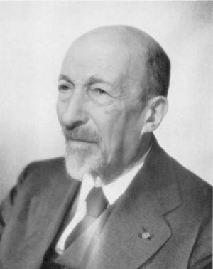
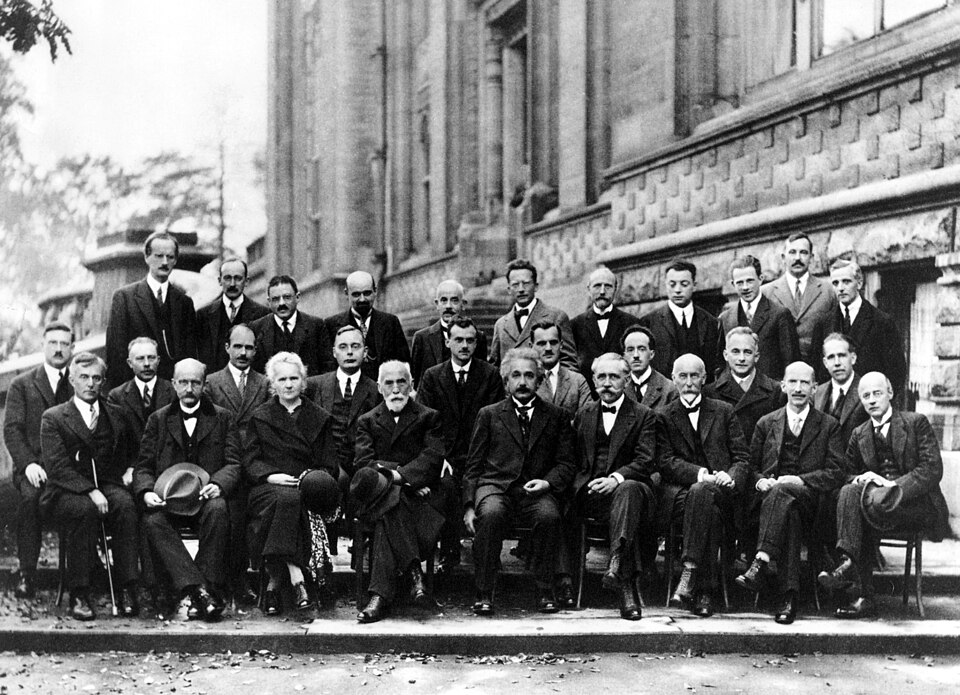
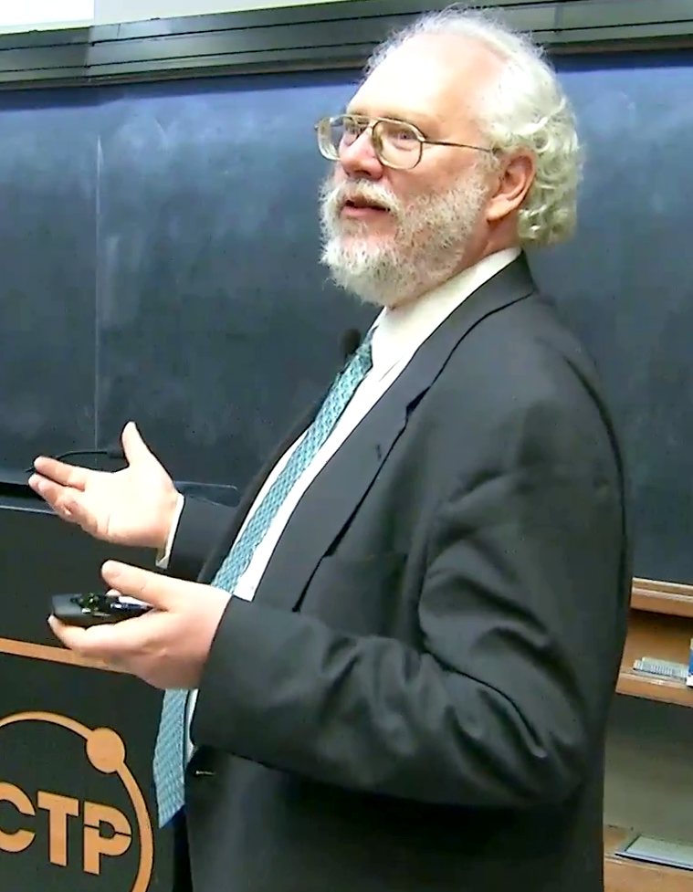
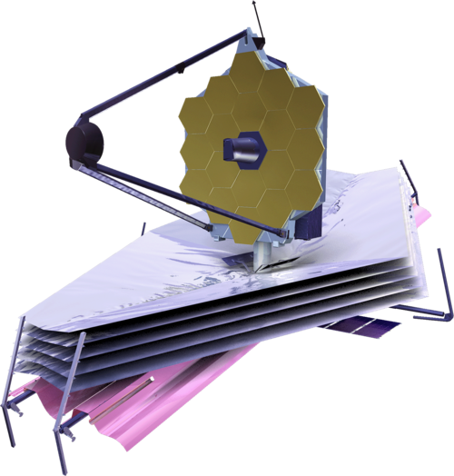

# 卮言 Shor's Algorithm

# 量子计算机简介

量子力学是科幻作品中的常客，刘慈欣先生的《三体》的前传《球状闪电》中，很生动描述了量子力学的现象。

> 我以后再也没有看到蓝色玫瑰，但知道它在那里就够了。有时夜深人静，我就将水晶花瓶移到窗前，然后背对着它站着，这时我往往能闻到缥缈的花香，就知道它肯定已经在那里了，心灵的眼睛能看清它的每一个细节。我用心来抚摸着它的每一个花瓣，看它在来自窗外的夜风中微微摇曳……它是一朵我只能用心来看的花。不过，我还是希望在此生再用自己的眼睛看到一次蓝色玫瑰，据丁仪说，从量子力学的角度来讲，人的死亡过程就是由一个强观察者变为弱观察者再变为非观察者的过程，当我变成弱观察者时，玫瑰的概率云向毁灭态的坍缩速度就会慢一些，我就有希望看到它。

> 当我走到人生的尽头，当我在弥留之际最后一次睁开眼睛，那时我所有的知性和记忆都消失在过去的深渊中，又回到童年纯真的感觉和梦幻之中，那就是量子玫瑰向我微笑的时候。

> 《球状闪电》结尾

量子力学中有大名鼎鼎的物理学四大神兽之一，薛定谔的猫。其他三只是拉普拉斯兽，麦克斯韦妖，芝诺的乌龟。薛定谔的猫让人疑惑的问题之一是量子态的叠加。

设死猫的量子态:
$$
|0\rangle
$$

活猫的量子态:
$$
|1\rangle
$$

箱子中的猫就是这两个量子态的叠加：

$$
\alpha|0\rangle + \beta|1\rangle
$$

其中 $\alpha$ 和 $\beta$ 是概率幅，可以是正数、负数、复数。Shor's Algorithm 进行量子傅立叶变换，就跟概率幅可以为负数相关。

去测量猫是死还是活的时候，结果是死猫 $\|0\rangle$ 概率是 $\alpha^2$。同理，活猫的概率是 $\beta^2$。薛定谔的猫不生不死，就是叠加态。

在传统计算机中，1 比特要么是高电平 1，要么是低电平 0，一个比特的值是确定的。量子计算机中 1 个比特既可以是 0，也可以 1，二者叠加在一起。考察这个存储上的特点，在 L 个比特上，量子计算机可以同时表达 $2^L$ 个数，而传统计算机只能表达 1 个数，量子计算机是传统计算机的  $2^L$ 倍。

除了存储，还有计算操作上的不同。传统计算机中通过门电路计算。量子计算机是幺正变换，用的是量子门。例如阿达玛（Hadamard）变换，即单比特的 H 门，是一个幺正矩阵：

$$
\frac{1}{\sqrt{2}} \begin{bmatrix}1&1\\1&-1\\ \end{bmatrix}
$$

H 门的作用，把一个量子比特转换为 $\|0\rangle$ 和 $\|1\rangle$ 的叠加态。

$$
|0\rangle \to \frac{1}{\sqrt{2}} \left( |0\rangle + |1\rangle \right)
$$

$$
|1\rangle \to \frac{1}{\sqrt{2}} \left( |0\rangle - |1\rangle \right)
$$

H 变换的逆矩阵是他自身。即： $H*H = I$。那么在量子计算机里面，连续做两次变换，就相当于没有做变换，会把量子比特变会原来的样子，也就是量子计算是可逆的。这与传统计算机迥然不同。

> Hadamard 的八卦：Hadamard最不能忘怀的事情，是关于自己当初考试的。以至于年纪大的时候，仍然耿耿于怀，甚至到俄国和 Kolmogorov 都提这件事。就是 Hadamard 做学生的时候，参加数学的会考（相当于数学竞赛吧），得了第二名，第一名后来也是一个数学家，Hadamard 对 Kolmogorov 说："事实证明后来他做得没有我好，其实他一直没有我好。"

> 引文来自ukim编辑的《我心目中的英雄》

当有 L个比特，表示的 $ 2^L $ 个数据，在量子门中一次操作，就完成了计算。在传统计算机中分别对 $ 2^L $ 个数据处理，则需要  $ 2^L $ 次操作。忽略量子门和传统电路计算速度的差异，量子计算机相对传统计算机，相当于做了 $ 2^L $ 加速。效果很像传统计算机中的并行计算，并非严格意义上并行计算。

量子之间可以叠加，还可以纠缠。例如：当 2 个电子纠缠在一起，一个电子自旋向上，另一个电子自旋向下。此时，测量一个电子自旋，若为向上，另一个电子必然会向下，反之亦然。即使两个电子之间隔着一个银河系也是如此。量子纠缠有大名鼎鼎的贝尔不等式实验证明。

> EPR佯谬（Einstein-Podolsky-Rosen Paradox）​​可以被视为爱因斯坦与玻尔（Niels Bohr）在量子力学解释上的“最后一战”，但这场争论的影响远超两人，成为现代物理学的重要基石。

刘慈欣先生的《三体》中智子，与三体人的通信，设定上是通过量子纠缠实现。

> 智子是从一个质子展开成二维后，蚀刻电路制成的智能微观粒子。​​两个智子之间可以通过量子纠缠实现瞬时通信​​，无视距离限制……三体人将智子加速到接近光速，发射至地球，它们能潜伏在人类的高能加速器中，干扰基础物理实验。
> 《三体II：黑暗森林》

综上所述，量子计算机中的计算是可逆的。量子态可以叠加，也可以纠缠在一起。利用量子的这些特性，在部分计算问题上，可以实现指数级的提升。

## 量子的叠加态和纠缠态

### 叠加态 (Superposition State)
叠加态是指单个量子系统可以同时处于多个基态的线性组合状态。数学表示为：
$$ |\psi\rangle = \alpha|0\rangle + \beta|1\rangle $$

电子自旋处于自旋向上和自旋向下的叠加态：

$$ |\psi\rangle = \frac{1}{\sqrt{2}}(|\uparrow\rangle + |\downarrow\rangle) $$

测量时有50%概率得到 $\|↑\rangle$，50%概率得到 $\|↓\rangle$ 。测量后状态坍缩到其中一个本征态。

### 纠缠态 (Entangled State)
纠缠态是指两个或多个量子系统之间存在非局域关联的状态。

纠缠态经典例子，Bell不等式：

$$ |\Phi^+\rangle = \frac{1}{\sqrt{2}}(|00\rangle + |11\rangle) $$

测量第一个量子比特为 $\|0\rangle$ 时，第二个必定为 $\|0\rangle$。同理，测量第一个为 $\|1\rangle$ 时，第二个必定为 $\|1\rangle$

# Shor's Algorithm

1977年RSA算法，是首个实用的非对称加密算法，是现代网络安全的基础。Ronald Rivest（里维斯特）、Adi Shamir（萨莫尔）、Leonard Adleman（阿德曼）获得了​​2002年​​的图灵奖。

1982年，诺贝尔物理学奖得主费曼（Feymann）在演讲《用计算机模拟物理》（Simulating Physics with Computers）提出经典计算机无法高效模拟量子系统。12年后数学家彼得·秀尔（Peter Williston Shor）在1994年发现了量子质因数分解算法，又称 Shor's Algorithm 。

> 费曼的八卦：Feymann 那扯淡的直觉。他有个最大的毛病，就是喜欢装牛b，明明自己也是费尽九牛二虎之力才作出来的。非得装着一晚上想出来的，用来打击别人。不过他也碰上过对手，有次碰上个速算的大牛，从此他知道在某些人面前不能吹牛b。

> 物理学家的八卦

Shor's Algorithm 在多项式时间内分解大整数，能破解RSA加密，使得这个算法在量子计算机领域独领风骚。

这一算法影响深远，时至今日，说起量子计算机的进展，常用 Shor's Algorithm来描述。例如，支持能把 15 分解为 $5\times3$ 之类的叙述（2001 年IBM的量子计算机）。

## 大数分解问题和周期求解问题的归约

使用 Shor's Algorithm 算法来分解 N：15。步骤如下：

- 先选一个小于 15 的整数，如 a：2；
- 计算  $2^r \mod 15$ ;

  | 指数 $r$    | $2^r$         | $2^r\mod15$   |
  |------------|---------------|------------------|
  | *0*        | 1             | *1*              |
  | 1          | 2             | 2                |
  | 2          | 4             | 4                |
  | 3          | 8             | 8                |
  | *4*        | 16            | *1*              |
  | 5          | 32            | 2                |
  | 6          | 64            | 4                |
  | 7          | 128           | 8                |
  | *8*        | 256           | *1*              |
  | 9          | 512           | 2                |
  | 10         | 1024          | 4                |
  | 11         | 2048          | 8                |

- 考察一下  $2^r \mod 15$ 的结果，以 4 为周期循环出现：$1 \to 2 \to 4 \to 8$，以此重复，周期 r 等于 4;
- 通过周期 r 来分解 15:

$$
2^r \equiv 1 (\mod 15) \\
2^r - 1 \equiv 0 (\mod 15) \\
(2^{r/2} + 1)(2^{r/2} - 1) \equiv 0 (\mod 15)
$$

$(2^{r/2} + 1)(2^{r/2} - 1)$中，$2^{r/2} + 1 $ 或者 $2^{r/2} - 1$ 是 15 的质因数。这里得到了 15 的分解结果： $5\times3$。

在这个例子中，$2^r\mod15$ 是否一定就是周期性呢？答案是肯定的。数论中的欧拉定理：

> 若 n，a 为正整数，且n和a互素（$gcd(a,n) = 1$），则 $a^{\phi(n)} \equiv 1 (\mod n) $。

即 $a^{\phi(n)} $ 与 1 在模 n 下同余。$\phi(n)$ 为欧拉函数，是小于 n 的正整数中，与 n 互质的数的数目。当 n 是质数的时候，$\phi(n)$ 的值为 $p - 1$，欧拉定理就变为费马小定理：$a^{p - 1} \equiv 1 (\mod p)$

所举的例子是简单的情况。遇到 r 是奇数，则需要重新计算。遇到 $a^{p - 1} \equiv 1 (\mod k \times p) $，其中 k 为正整数，则需要 $gcd(a^{r/2} + 1,k \times p)$ 或 $gcd(a^{r/2} - 1,k \times p)$。这样我们就把分解合数 N，转换化求周期 r。

# Shor's Algorithm 计算流程简述

## 1. 制造等概率叠加态，操作寄存器1: register1
用 H 门制作正整数 N 的长度为 L 的处于叠加态的量子比特，存入寄存器 register1 中；

## 2. 求模，制造纠缠态，操作寄存器2: register2
用 register1 中的值计算 $a^x \mod N$ ，并使二者纠缠，存入寄存器 register2 中；

以 $2^r \mod 15$ 为例子，经过1和2，此时得到如下结果：

  | 指数 $r$   |register1：$2^r$|register2：$2^r\mod15$|
  |------------|---------------|------------------|
  | *0*        | 1             | *1*              |
  | 1          | 2             | 2                |
  | 2          | 4             | 4                |
  | 3          | 8             | 8                |
  | *4*        | 16            | *1*              |
  | 5          | 32            | 2                |
  | 6          | 64            | 4                |
  | 7          | 128           | 8                |
  | *8*        | 256           | *1*              |
  | 9          | 512           | 2                |
  | 10         | 1024          | 4                |
  | 11         | 2048          | 8                |

  由数论中的欧拉定理，寄存器 register2 中的值，会以 r 为周期重复出现；为了简化问题的论述，假设 $r\mod L = 0$。

## 3. 量子傅立叶变换

周期 r 在 register2 中，我们需要设法获取周期 r 的值，利用 $(a^{r/2} + 1)(a^{r/2} - 1) \equiv 0 (\mod N)$，求得 N 的因数。我们的重心是周期 r， $a^x \mod N$ 的具体值并不重要，由于每次测量只能获取一个值，我们也无法通过直接测量值来计算周期。

我们可以只用保留周期 r 中的某一个值，把其他值变为0，这一操作不影响最终结果，却使得计算和测量更好处理。对 register2 进行一次测量以后，得到一个值 γ。因为 register1 与 register2 纠缠，register1 中的量子也坍缩，剩下与 γ 相关的量子态；

假设 register2 测量的所得值为 1，此时两个寄存器量子态如下：

  | 指数 $r$   |register1：$2^r$|register2：$2^r\mod15$|
  |------------|---------------|------------------|
  | *0*        | 1             | *1*              |
  | 1          | 0             | 0                |
  | 2          | 0             | 0                |
  | 3          | 0             | 0                |
  | *4*        | 16            | *1*              |
  | 5          | 0             | 0                |
  | 6          | 0             | 0                |
  | 7          | 0             | 0                |
  | *8*        | 256           | *1*              |
  | 9          | 0             | 0                |
  | 10         | 0             | 0                |
  | 11         | 0             | 0                |

为了获取周期，考虑使用量子傅立叶变换，获取频率ν，从而取得周期 $r = 1/ν$。这里的量子傅立叶变换的效果，相当于光栅。光通过光栅以后，因光的干涉，会形成明暗相间的条纹，相长干涉产生明条纹，相消干涉产生暗条纹。含周期的量子态经过量子傅立叶变换，也会出现相长相消。

> 韦伯望远镜六角星芒就是光栅衍射造成的，傅立叶变换可以处理星芒

## 4. 第二次测量并计算周期 r

周期 r 依然隐含在量子态中。此时进行量子傅立叶变换 QFT，与周期不相关的量子态的概率幅会相消，与周期相关的量子态概率幅会增加（概率幅的平方即概率）。

叠加态经过 QFT 后，只有在 $2^L/k$ 的整数倍的位置不为0，其他元素均为 0。对这一叠加的量子态采样（一次采样，即一次测量），得到值是 $2^L/k$ 倍数，设值为 γ 。下文" Shor's Algorithm 求周期 r"部分会给出详细的计算过程。

$$
  γ = k2^L/r
$$

周期 r 为：

$$
  r = k2^L/γ
$$

进一步处理即可求得周期。这里也有小概率会失败，就需要重新计算。下文会给出成功的概率 p，概率 p 与 L 正相关，L 越大，概率越高。

# Shor's Algorithm

## 制造量子态

利用 H 门制作等概率的量子叠加态 $\|x\rangle$ 存入寄存器 register1。

设函数 $f(x) = a^x(mod N)$ ，利用受控 U 门构造 $\|f(x)\rangle$，存入寄存器 register2，并使之与寄存器 register1 中量子态纠缠。两个寄存器中的量子态如下：

$$
\begin{cases}
\mathinner{|\Phi_1 \rangle}=\frac{1}{\sqrt{2^L}}\sum_{x=0}^{2^L-1} \mathinner{|x \rangle}&register1\\

\mathinner{|\Phi_2 \rangle}=\frac{1}{\sqrt{2^L}}\sum_{x=0}^{2^L-1} \mathinner{|x \rangle} \mathinner{|a^x(mod\;N) \rangle}&register1\oplus register2\\
\end{cases}\\
$$

通过欧拉定理可知，$f(x)$ 为周期函数，设周期为 r，A 为周期数，总长度为 $2^L$，则：

$$
  A = 2^L/r
$$

设 l 为第一个周期内（序号值小于周期 r）, 在第 b 个周期中的 $\|x\rangle$ 可表示为：

$$
 |x\rangle = | l +  br\rangle
$$

因此，寄存器 register1 的 量子态 $\|\Phi_1 \rangle$ 可表示为：

$$
|\Phi_1\rangle = |l\rangle + |l+r\rangle + |l+2r\rangle + ... + |l+(A - 1)r\rangle
$$

寄存器 register2的 量子态 $\|\Phi_2 \rangle$ 可表示为：

$$
|\Phi_2\rangle = |l\rangle|f(l)\rangle + |l+r\rangle|f(l + r)\rangle + |l+2r\rangle|f(l + 2r)\rangle + ... + |l+(A - 1)r\rangle|f(l + (A - 1)r)\rangle
$$

## 第一次测量寄存器 register2

对寄存器 register2 进行计算基上的测量，则量子态坍缩为周期值的一个值，因寄存器 register1 中的量子态与之纠缠，其中的量子态变为：

$$
\begin{align}
  \mathinner{
    |\Phi_1 \rangle}&=\frac{1}{\sqrt{A}}\sum_{j=0}^{A-1} \mathinner{|l + jr \rangle}\tag{1}\\
                    &=\frac{1}{\sqrt{\frac{2^L}{r}}}\sum_{j=0}^{\frac{2^L}{r}-1} \mathinner{|l + jr\rangle
  }
\end{align}\\
$$

## FFT 
升维思考，降维打击。我们把具有周期的曲线，卷起来，放到复平面。就可以看到傅立叶变换的几何效果。无穷长的曲线，变成了一个圆上的有限长的曲线。

> 图片来自罗杰·彭罗斯（Roger Penrose）《通向实在之路-宇宙法则的完全指南》

设手头有一张纸，纸上面每隔固定的间距，剪一个洞。不允许直接测量洞与洞之间的间距，怎么判断洞是周期性出现。

可以把纸卷起来，在适合的半径，所有的洞重叠。

> 图片来自 Sanjoy Dasgupta / Christos Papadimitriou / Umesh Vazirani《算法概论》

而FFT的单位复根，在复平面上，具有对称性。平方之后的根，依然保持这个对称性。这一特性，在量子傅立叶变换 QFT 很重要。可以利用这个特点，使得与周期无关的量子态的概率幅变小，使得周期相关的概率增大，从而放大了测得我们所需的量子态的概率。

## 量子傅立叶变换 QFT

对寄存器 register1 中的量子态进行QFT：

$$
QFT(\mathinner{|l + jr \rangle})=\frac{1}{\sqrt{2^L}}\sum_{\gamma=0}^{2^L-1}e^{2\pi i(l + jr)\gamma/2^L}\mathinner{|\gamma \rangle}
$$

因寄存器 register2 中的量子态与之纠缠，则量子态变为：
$$
QFT(\mathinner{|\Phi_{2} \rangle})=\frac{1}{\sqrt{A}}\sum_{j=0}^{A - 1}QFT(\mathinner{|jr+l \rangle})\\
$$

因对寄存器 register1 做过一次测量，求和从 $2^L-1$ 变为 $A - 1$，其中 A 为周期数。

将 $QFT(\mathinner{\|l + jr \rangle})$ 代入，并交换求和顺序：

$$
\begin{align}
  QFT(\mathinner{|\Phi_{2} \rangle}) &= \frac{1}{\sqrt{A}}\sum_{j=0}^{A-1}[\frac{1}{\sqrt{2^L}}\sum_{\gamma=0}^{2^L-1}e^{2\pi i(l + jr)\gamma/2^L}]\mathinner{|\gamma \rangle}\\
                                     &=\sum_{\gamma=0}^{2^L-1}[\frac{\sqrt{r}}{2^L}\sum_{j=0}^{A-1}e^{2\pi i(l + jr)\gamma/2^L}]\mathinner{|\gamma \rangle}
\end{align}\\

$$

因寄存器 register2 做过一次测量，量子态坍缩为 r 个值中的一个值，每一个值对应于寄存器 register1 中 A 个叠加态，设上式中括号里面的为：

$$
\begin{align}
 C_\gamma &=\frac{\sqrt{r}}{2^L}\sum_{j=0}^{A-1}e^{2\pi i(jr+l)\gamma/2^L}\\
          &=\frac{\sqrt{r}}{2^L}e^{2\pi il\gamma/2^L}[\sum_{j=0}^{A-1}e^{2\pi ijr\gamma/2^L}]\\
\end{align}\\
$$

 此时存在2中情况：

 1. $2^L \mod r = 0$，即 $2^L$ 能够整除周期 r 的情况。说明每一个波峰刚好在 $ γ = k2^L/r $；
 2.  $2^L \mod r \neq 0$，即 $2^L$ 不能够整除周期 r 的情况；说明值非常接近播放，此时需要加入微调参数；本文不分析这种情况；

 当 $2^L \mod r = 0$ 时，在(5)式中，$A = 2^L/r$，只有 γ 是 $ 2^L/r$ 整数倍时，出现相长干涉，其他的为相消干涉，值趋近为0，有：

$$
C_\gamma=\begin{cases}
  \frac{1}{\sqrt{r}}e^{2\pi il\gamma/2^L}&\gamma=k2^L/r\\
  0&\gamma\ne k2^L/r\\
\end{cases}\\
$$

计算 $C_\gamma$ 这个等比数列：

$$
\begin{align}
C_\gamma &=\frac{\sqrt{r}}{2^L}e^{2\pi il\gamma/2^L}[\sum_{j=0}^{A-1}e^{2\pi ijr\gamma/2^L}]\\
         &=\frac{\sqrt{r}}{2^L}e^{2\pi il\gamma/2^L}[\frac{e^{2\pi iAr\gamma/2^L}-1}{e^{2\pi ir\gamma/2^L}-1}]\\
\end{align}\\
$$

代入 $A = 2^L/r$ 得：

$$
C_\gamma=\frac{\sqrt{r}}{2^L}e^{2\pi il\gamma/2^L}[\frac{e^{2\pi i\gamma}-1}{e^{2\pi ir\gamma/2^L}-1}]\\
$$

由于 γ 是 $ 2^L/r$ 整数倍，γ是整数, 则 $e^{2\pi ir\gamma/2^L}-1 = 0$，也就是 $\gamma\ne k2^L/r$ 时，值为0.

将这一结果，代入可得：

$$
\mathinner{|\Phi_{n} \rangle}=\frac{1}{\sqrt{r}}\sum_{k=0}^{r-1}e^{2\pi ik/r}\mathinner{|\frac{k2^L}{r} \rangle}\\
\rho(\mathinner{|\Phi_{n} \rangle})=|\frac{1}{\sqrt{r}}|^2=\frac{1}{r}
$$

测量 $\gamma\rangle$ 值，会等概率 $1/r$ 的选择一个态，由 $\gamma=k2^L/r$ 可得：

$$
\frac{\gamma}{2^L}=\frac{k}{r}\\
$$

如果有 $gcd(k, r) = 1$，r 就可以从 $\frac{k}{r}$ 的不可约分数求得。

# Shor's Algorithm 成功求得 r 的概率

假设有 k 个互相独立的样本均匀分布：

$$
0,M/k,2M/k,...,(k-1)M/k
$$

则采样获取到这些样本的最大公因数是 $M/k$ 的概率至少为 $1 - k/2^k$ 。

考虑最大公因数不是 $M/k$ 的情况。

所有的采样的值是 $jM/k$，其中 $j >= 2$，采样获取这一值的概率 p 最多是：$1/j$。

因 $j >= 2$，则这一概率 $p <= 1/2$。有最多有 k 种可能，计算乘积，即：$p^k <= (1/2)^k$。

以上考虑的是特定的数字 j。这种情况最多是对 j 取不同的值求和。j最多有 k 个值，则总概率：$kp^k <= k(1/2)^k$。

则采样的样本是最大公因数不是 $M/k$ 的概率是：$1 -  k(1/2)^k$。

k 为周期个数，数目越大，则测量获取最大公因数是 $M/k$ 的概率越大。

设量子比特的数目为 L，共可以表示 $2^L$ 个值。为了保证最后测量获取正确的值的概率够大，需要保证 $2^L$ 长度内有足够的周期数 k。设要分解的合数为 N，则需要满足：

$$
 N^2 \leq 2^L \leq 2N^2
$$

