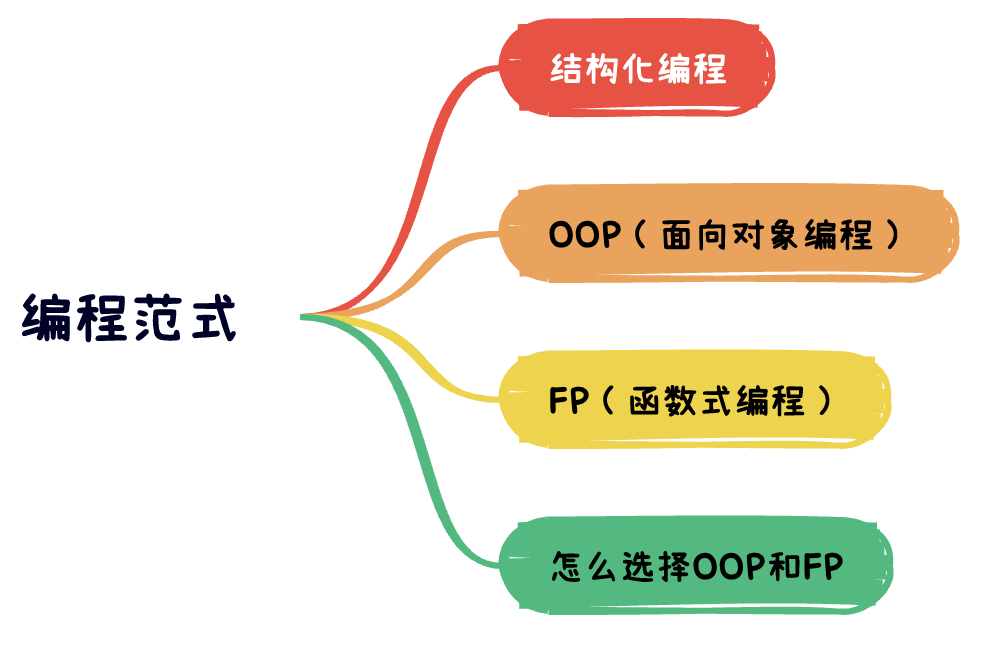

# 编程范式



> 从约束的角度，看典型的编程范式。编程范式（OPP、FP等）是在编程行为上做减法，得出的具有约束性的解决方案。结构化编程，约束了程序控制权的直接转移，使得模块化成为可能。面向对象编程，约束了程序控制权的间接转移，使得程序可以不再直接依赖具体实现，而是依赖抽象。函数式编程，约束了程序中赋值操作，使得无锁支持并发成为可能。

## 结构化编程

举例来说：

``` c
tag: fun1()
fun2()
fun3() {
  if (condition) {
    goto tag
  }
}

```

这是一个无约束的模式，非结构化编程，`goto`可以随意控制逻辑跳转，使得代码之间的联系不再是类似树形的结构，而是形成网状的拓扑结构，彼此之间随意跳转，很难从中形成一些彼此独立的单元。`goto`语句的用法，会导致代码无法被拆分为更小、可证明的单元，而这会导致，无法采用分治的策略，将大型问题，逐步拆分为更小、更易证明的单元。

禁止`goto`，禁止了逻辑的任意跳转。用顺序结构、分支结构和循环结构，三种结构来构造程序，即结构化编程。Dijkstra意识到，代码采用结构化编程，则一定可以把程序分解为更小、可证明的单元。Bohm和Jocopini证明了人们可以用顺序结构、分支结构、循环结构这三种结构构造出任何程序。也就证明了：构建可推导证明模块所需要的控制结构集，与构建所有程序所需的控制结构的最小集是等同的。

``` c
fun1()
fun2()
fun3() {
  if (condition) {
    fun1()
  } else {
    fun2()
  }
}

```


结构化编程范式将代码分解为可推导的单元，这就意味着，代码的可分解性质。我们可以把一个大型问题，拆分为一系列的高级模块组合，这些高级模块又可以继续拆分为一系列低级模块，如此递归，直到分解为一系列可以证明的小函数。至此，我们还可以写单元测试，来验证这些函数是否是错误的。如果单元测试无法证伪这些函数，那么我们就可以认为，这些函数足够正确，进而可以推导，整个代码是正确的。

简而言之，结构化编程限制了程序控制权的直接转移。

注：所谓程序控制权，是指程序中的控制结构，如经典的：顺序结构、分支结构（if语句）、循环语句（for语句），goto语句，这些能控制程序执行流程的原语的能力。

## OOP（面向对象）范式

上述例子中，`fun3`对`fun1`和`fun2`有直接依赖，`fun3`的实现，直接依赖了`fun1`和`fun2`。我们可以通过抽象接口，来处理直接依赖。

``` javascript
interface File {
  read()
}

Fun1 implement File {
  read() {
  
  }
}
Fun2 implement File {
  read() {
  
  }
}

fun3(file: File) {
  file.read()
}

```

`fun3`的实现，依赖的抽象出来的接口`File`，而不是直接依赖具体实现`fun1`或`fun2`。代码的依赖顺序，和运行顺序相反。逻辑的顺序（初始化file，调用`file.read()`），和代码的运行顺序（调用`file.read()`,根据file的类型分发，是相反的。这其实就是控制反转。


封装、继承和多态，是控制反转的不同侧面。利用控制反转，在面向对象的编程范式的系统中，就可以控制代码之间的依赖关系，不再受控制流的限制。无论模块是被调用还是调用，可以根据设计，随意调整代码之间的依赖关系。

各模块直接依赖的是抽象的接口，使得模块各自相对独立。这样我们就可以，把模块编译为独立的组件或者部署单元。各个模块可以独立部署演进，某个模块需要修改的时候，仅仅需要重新部署此模块即可。使得模块可以分给不同的团队并行开发，便于项目分工协作。

### 控制反转(IoC)优点

使用传统的过程化程序设计，所创建出来的依赖关系结构，策略是依赖细节的。这是糟糕的，会使策略受细节改变的影响。“面向对象”的程序设计，倒置了依赖关系结构，使得细节和策略都依赖于抽象。

依赖倒置原则，是一种基本底层机制，面向对象技术所宣称优点的基础。对于创建可重用的框架来说很重要。抽象和细节被彼此隔离，代码也更容易维护

简而言之，面向对象编程，限制了程序控制权的间接转移。

## FP（函数式编程） 范式

程序在执行过程中，如果要做到，给逻辑单元固定的输入，就能得到固定的输出，那就需要要避免副作用，具体来说，要避免变量及其赋值语句。使用函数去实现没有副作用的单元，以函数为维度去构建程序，就是函数式编程范式。

程序设计中，一种典型的切分，就是切分为可变的组件和不可变组件。不可变组件，用纯函数来执行，期间不修改状态。状态的修改，会导致一系列的并发问题，通常需要用事务型内存来保护变量，避免同步更新和竞争状态。要点是：良好的应用程序，应该将状态修改的部分，和不需要修改状态的部分，隔离成组件，然后用合适的机制来保护可变量。同时，应该尽量将逻辑归于不可变组件，可变组件的逻辑越少越好。

比如事件溯源的设计，数据处理不使用删除和更新，只存储事务记录。应用程序处理数据不是CRUD，仅仅只有C和R，没有删除和更新，规避了并发问题。

简而言之，函数式编程，约束了程序中赋值操作。

总之：
1. 函数式编程和面向对象，并不是完全对立。比如，用函数构建程序，也用对象来实现控制反转，可以是面向对象+函数式，是二者约束的并集；
2. 语言的约束，不等于范式的约束。在C中大量使用goto，就不能算结构化编程。反过来，C中也可以做面向对象；
3. 控制反转不一定要用面向对象，比如基于值的分发等，面向对象只是比较有名的方案。

## 怎么选择面向对象（OOP）和函数式编程（FP）？

改编自《计算机程序的解释与构造》（SICP）：

### 处理并发状态的视角

对象模型对世界的近似，在于将其分割为独立的片段。对象之间不共享的状态的数量，远远大于所共享状态的数据量，对象模型就特别好用。但真实的世界未必如此，例如量子力学中的量子纠缠，无法将物体看做独立的粒子。

将对象观点和函数式观点，可以能与程序设计关系不大，而是与基本认识论有关。

我们在处理状态的时候，有两种基本观点：

1. 引入赋值和变动的对象，模块化的构造出程序，去模拟具有状态的系统。对象随着时间，不断变化。并用局部的状态变量去模拟状态，用变量的赋值模拟状态的变化。这样，用计算执行的时间，去模拟我们所处的世界里的时间，也就是把对象弄进了计算机。利用计算对象的时序，去模拟现实世界中的各种对象的时序行为。用对象模型模拟是威力强大的，也很直观。因为这主要根源于，我们对自身身处其中，并与之交流的世界的看法。但这个模型，对事件的顺序，以及同步多个进程，存在棘手的问题。

2. 函数式程序设计，不提供赋值，或者变动对象。所有过程实现，都是他们参数上定义良好的数学函数，其行为不会变化。函数式对处理并发的系统，很有吸引力。用“流”模拟具有内部状态的对象。用“流”模拟变化的量，用“流”表示顺序状态的时间史。本质上说，“流”讲时间显式表示出来了。借此，就松开了被模拟世界的时间，与求值过程中事件发生的顺序直接的紧密联系。但“流”并非银弹，多个“流”需要归并的时候，为了确保事件以正确的顺序发生，就需要引入其他约束，以消除并发问题。

注，流的朴素定义：一种数据结构，从抽象观点看，就是一个序列，甚至无穷的序列。如果用离散的步长度量时间，就可以用一个序列去模拟一个时间函数。用数学函数方式来看，量x随着时间变化的行为，可以描述为一个时间的函数x(t)。如果集中关注的是一个个时刻的x，那就是把x看着一个变化的量。但关注的是x的整个历史，就不需要强调变化，而是函数x(t)自身，函数x并没有随时间改变。

> 苏子曰：“客亦知夫水与月乎？逝者如斯，而未尝往也；盈虚者如彼，而卒莫消长也。盖将自其变者而观之，则天地曾不能以一瞬；自其不变者而观之，则物与我皆无尽也，而又何羡乎！”

综上，构造计算模型去模拟真实世界。有两种办法：

其一，将世界模拟为互相分离，受时间约束的，具有状态的，互相交流的对象；
其二，模拟为单一的，无时间，也无状态的统一体；

二者都强有力，但又有各自的不令人满意的地方。

### 控制复杂度的视角

在控制大型系统的复杂度的问题上，抽象起着至关重要的作用。但仅仅有抽象还不够，需要有效的程序，还需要一些组织原则，指导系统化的整体设计，以构造模块化的大型系统。使得系统能够划分为，具有内聚的模块，可以分别进行开发和维护。

可以用被模拟系统的结构，去设计程序的结果。物理系统中的对象，构造一个对应的计算对象。物理系统每一个活动，在计算对象中定义一种操作。借此，物理系统有新的对象，或者新活动的时候，程序不需要全面修改，只需要加入新对象或者新操作即可。这样修改，就被约束在系统的局部，而不会牵一发而动全身。

这种架构组织，受我们世界观影响。将注意力集中在对象，大型系统就是一大批对象，对象的行为随时间进展不断演化，就倾向于“面向对象”思维。将重点聚焦在流过系统的信息流上，类似于电子工程师观察一个信号处理系统，就倾向于“函数式”思维。

## log

- 2023/08/28 初稿
