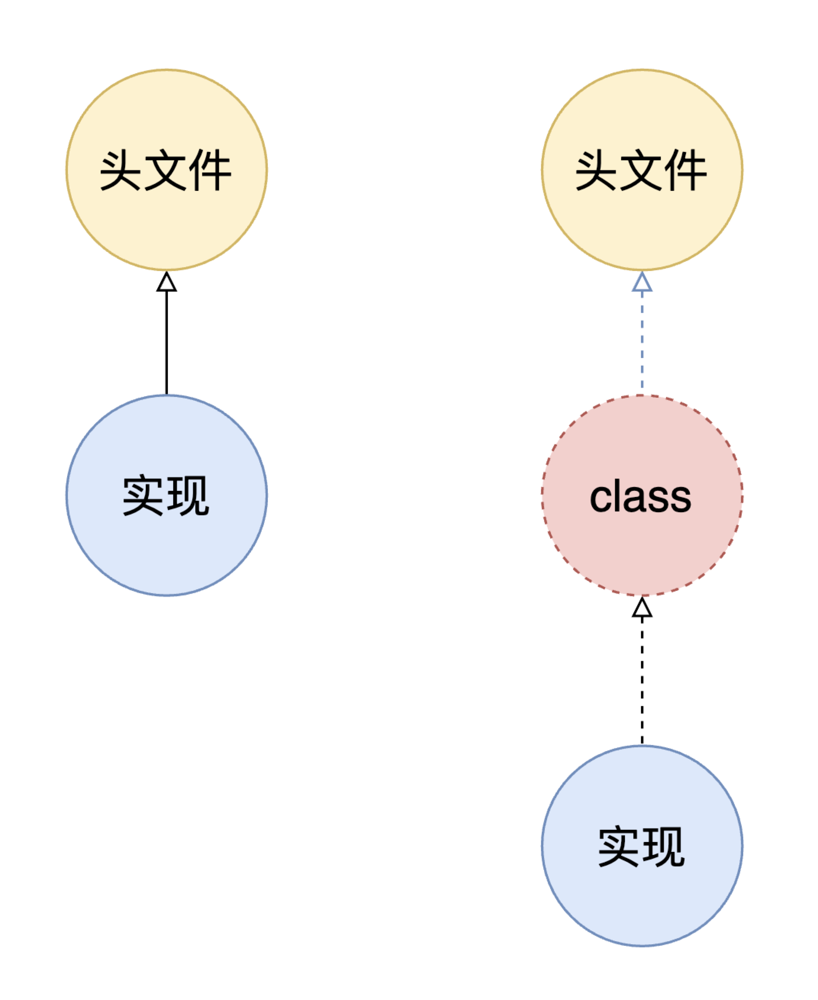
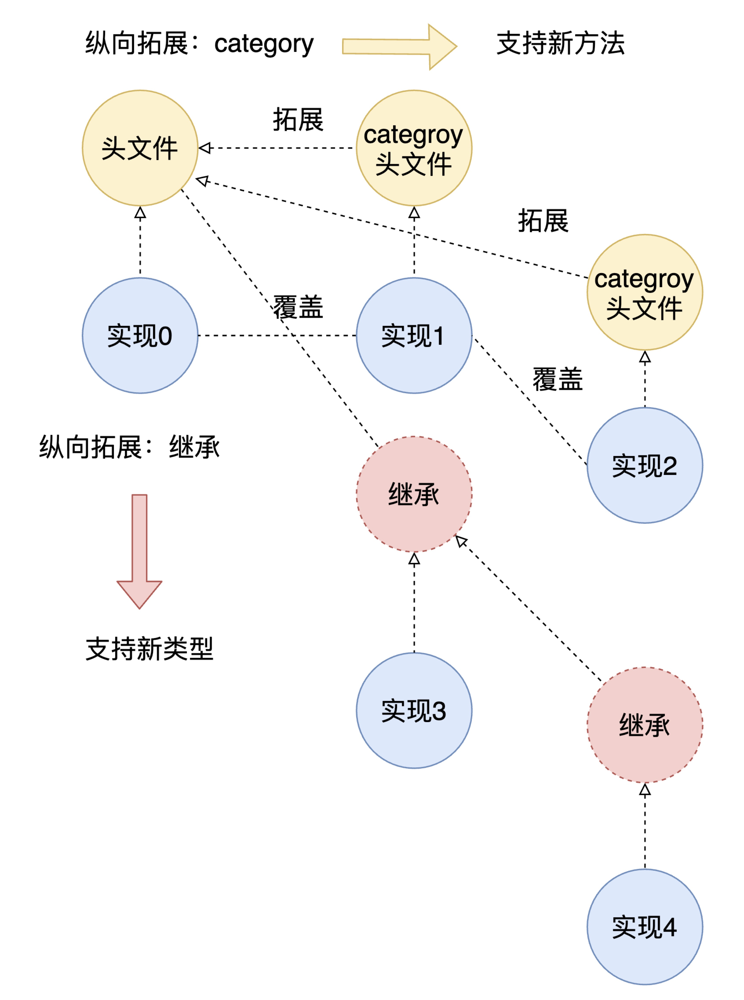
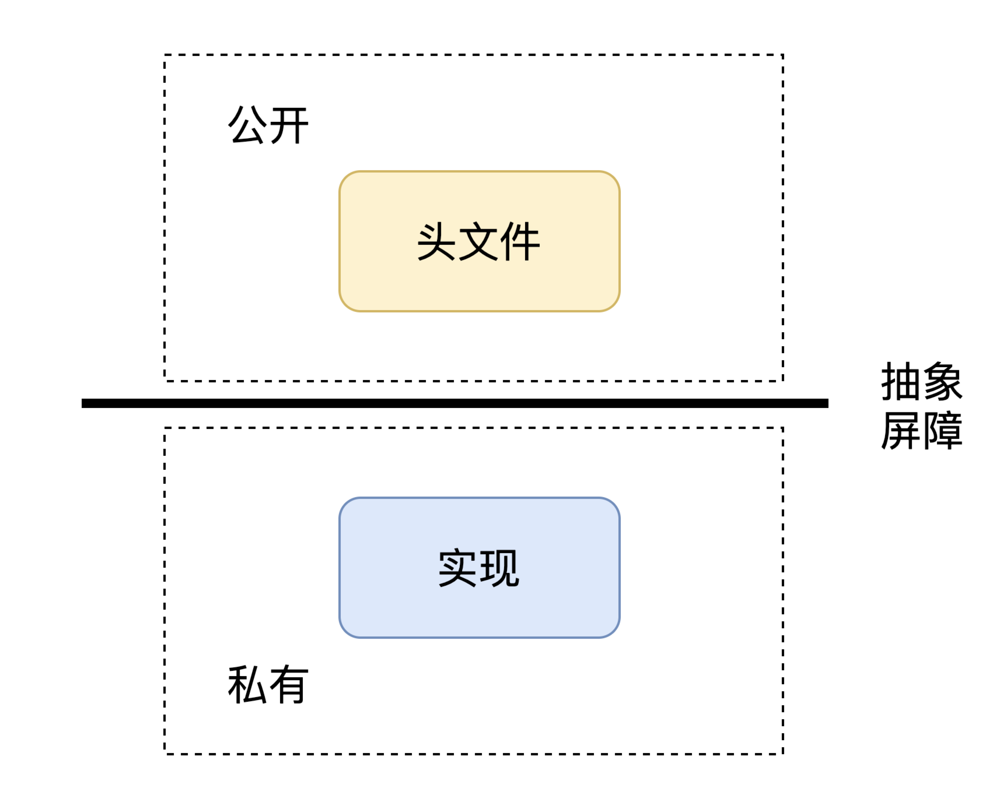

# Objective-C

# 导读

> 从事任何方向的技术研究，不知道该干什么的时候，就问自己四个问题：
>
> 1、这个方向上最新进展是什么？ 都知道吗？
>
> 2、这个方向上最著名的专家有哪些？他们的研究都看过吗？
>
> 3、这个方向上最著名的技术社区有哪些？精华帖都看过一遍吗？
>
> 4、这个方向上最重要的文章、工具有哪些？文章都看过吗？工具都分析过吗？
>
>                                                                   —–tk教主@2016
>
> ————————————————
>
> 补充一个自己的研究方法：用体系化学习的方法来构建知识体系架构，然后再结合兴趣点深入研究。
>
> 最好的实践办法是先了解这个方向的书籍（可以通过作者质量筛选），因为书籍是知识体系化的载体。只有对这个体系有很清晰的认知，才能更深入理解这个方向（原来还有xxx这种细分领域啊？），找到了合适自己的方向，再深入研究。


**从语言设计角度看Objective-C**


# 代码组织

## 符号查找

如果两个类的头文件各自引入对方的头文件，会导致循环引用(chicken-and-egg situation)。使用`#import`而非`#include`指令，虽然不会导致死循环，但也意味着其中一个无法正确编译。我们可以使用向前声明解决这个问题(forward declaring)。向前声明，就意味着，只需要知道当前有一个类名即可，而不需要知道类的细节。

- 类的向前声明`@class SomeClase`

- 协议的向前声明`@protocol SomeProtocol`

**头文件和实现的中间地带**



## 变量作用域

OC没有命名空间(namespace)机制，故我们需要设法避免潜在的命名冲突，避免报错。从命名上，我们可以为变量添加三个字母的前缀，因为Apple宣称其保留使用“两个字母前缀”的权利。

我们还可以使用一些关键字来修饰变量，限制其影响范围。

**static**

static意味着：
1. 限定作用域：仅仅定义在此变量的编译单元，不会导致与其他单元的命名冲突。即其他文件不可见。非静态全局变量的作用域是整个源程序，多个源文件共用
2. 延长生命周期：被修饰的变量，会保存到bbs段（静态区），整个工程执行期间一直存在，系统只分配一次内存地址。用static修饰的数据，不管执行多少次，只初始化一次。

**const**

const表示常量，不可被修改，存储在常量区。

**extern**

声明外部全局变量。只能声明，不能实现。故extern声明的变量，编译会从内部到外部查找。


## 运行时模块加载

**FBI 问题**

[OOP语言中FBC问题对应用框架的影响](https://zhuanlan.zhihu.com/p/110002452)

**热更新**


# 基础类型

## NSInteger vs. int

You usually want to use `NSInteger` when you don't know what kind of processor architecture your code might run on, so you may for some reason want the largest possible integer type, which on 32 bit systems is just an `int`, while on a 64-bit system it's a `long`.

`NSInteger`/`NSUInteger` are defined as *dynamic `typedef`*s to one of these types, and they are defined like this:

```objectivec
#if __LP64__ || TARGET_OS_EMBEDDED || TARGET_OS_IPHONE || TARGET_OS_WIN32 || NS_BUILD_32_LIKE_64
typedef long NSInteger;
typedef unsigned long NSUInteger;
#else
typedef int NSInteger;
typedef unsigned int NSUInteger;
#endif
```


## 浮点数的声明

- 如果是赋给CGFloat类型，则加不加f后缀都是一样的。
- 如果是赋给double或float类型，就要考虑精度的问题。不加f后缀的话类型为double，8字节，加f后缀的话类型为float，4字节。

``` objc

CGFloat a = 5.3f;
CGFloat b = 5.3;
NSLog(@"%lu  %lu", sizeof(a), sizeof(b));
NSLog(@"%lu  %lu", sizeof(double), sizeof(float));
NSLog(@"%lu  %lu", sizeof(typeof(5.3)), sizeof(typeof(5.3f)));

// 以下是打印结果：
// 8  8
// 8  4
// 8  4

```


## `BOOL` 陷阱


- 将常规整数值转换为`BOOL` ，请使用三元运算符返回`YES` 或`NO` 值。
对  `BOOL`  使用逻辑运算符 ( `&&` ,  `||`  和  `!`  ) 是可以的，其返回值可以安全转换为  `BOOL`  ，无需三元运算符。


``` objc
// GOOD:
- (BOOL)isBold {
  return ([self fontTraits] & NSFontBoldTrait) ? YES : NO;  // & 在枚举中用于判断是否包含某个值
}

- (BOOL)isValid {
  return [self stringValue] != nil;
}

- (BOOL)isEnabled {
  return [self isValid] && [self isBold];
}
```

``` objc
// AVOID:
- (BOOL)isBold {
  return [self fontTraits] & NSFontBoldTrait;  // AVOID.
}

- (BOOL)isValid {
  return [self stringValue];  // AVOID.
}
```


- 永远不要直接将`BOOL`变量与`YES`比较，返回值可能不如你所愿。`BOOL`定义为`signed char`，因此它可能具有除`YES` ( `1` ) 和`NO`( `0` ) 之外的值。也没有必要将BOOL值与NO比较，使用`if`以及`!`进行判断会使代码更为直观。


``` objc
// GOOD:
BOOL great = [foo isGreat];
if (great) {         // GOOD.
  // ...be great!
}

if (![someObject boolValue]) {
  //...
}
```

``` objc
// AVOID:
BOOL great = [foo isGreat];
if (great == YES) {  // AVOID. 永远别这么做
  // ...be great!
}

if ([someObject boolValue] == NO) { //AVOID

}
```

## 枚举

**枚举与位掩码**

使用  `const`  定义浮点型或者单个的整数型常量，如果要定义一组相关的整数常量，应该优先使用枚举。
Objective-C 枚举与位掩码常量的命名采用大驼峰式(upper camel case)。
枚举使用  `NS_ENUM` 。

``` objc
typedef NS_ENUM(NSInteger, FeedType) {
    FeedTypeFriends = 0,
    FeedTypeHomepage,
    FeedTypeBlog,
};
```
当用到位掩码时，使用  `NS_OPTIONS`  宏。

``` objc
typedef NS_OPTIONS(NSUInteger, NYTAdCategory) {
    NYTAdCategoryAutos      = 1 << 0,
    NYTAdCategoryJobs       = 1 << 1,
    NYTAdCategoryRealState  = 1 << 2,
    NYTAdCategoryTechnology = 1 << 3
};
//使用位掩码，后面 用位运算&，判断在枚举中用于判断是否包含某个值
```

**数组的下标初始化(C语言特性)**

``` c
const int numbers[] = {
	[1] = 3,
	[2] = 2,
	[3] = 1,
	[5] = 12306
};
// [0, 3, 2, 1, 0, 12306]

```

用于处理枚举与字符串的映射

``` objc

typedef NS_NUM(NSInteger, XXType) {
	XXType1,
	XXType2
};

const NSString *XXTypeNameMappding[] = {
	[XXType1] = @"type1",
	[XXType2] = @"type2",
};

```


# 面向对象

## 可拓展性




**新增类型**

**新增方法**

**类型安全的拓展**

## 封装

隐藏内部实现，对外暴露接口。在SICP中，设置抽象屏障，提供操作界面。对应在OC中，则是通过接口，以及实现私有属性和方法。




**私有属性实现**

OC的动态消息系统的工作方式，决定了OC 不可能实现真正的私有方法或私有实例变量。然而，我们还是只想部分对外公开，部分隐藏，可以使用`class-continuation`。其特点是，这是唯一能声明实例变量的分类，且此分类没有特定文件，而是要定义在类的主实现文件中。

这一文件的拓扑结构的不同，导致`class-continuation`与普通的category不同：

普通categroy可以随意拓展类的方法，但不能定义属性(可以定义但不推荐)；而`class-continuation`可以在当前实现文件中随意添加类的属性和方法，但受这一点的限制，我们不能随意拓展类，原因在于我们并非所有时候都可以修改类的实现`.m`文件。


如果我们声明私有的变量在公共接口中，则信息泄露了，无法到达私有的目的。

``` objc

# import <Foundation/Foundation.h>

@interface EOCSuperSecretClass () {
@private
	EOCSuperSecretClass * _secretInstance;
}
@end

```

可以使用`class-continuation`解决此问题：

``` objc
// EOCClass.h
# import <Foundation/Foundation.h>

@interface EOCClass : NSObject
@end


// EOCClass.m
#import "EOCClass"
#import "EOCSuperSecretClass"


@interface EOCClass () {
@private
	EOCSuperSecretClass * _secretInstance;
}
@end

@implementation EOCClass
// Methods here
@end

```

实例变量也可以定义在实现块中，与添加到`clsss-continuation`中等效。但放在后者中显然更好，私有变量和方法放在一起了，一眼便知是否是私有的。

这个办法的本质就是把私有的属性和方法，从头文件移动到实现的文件了，由于实现并不公开，头文件会公开，这样就可以屏蔽了头文件的公开能力，且有私有实现的声明，一举两得。

这一个技巧，可以用在编写`Objective-C++`的时候，避免把`.mm`文件的影响扩散，导致所有文件都要用`Objective-C++`来编译。

> *其本质和上面实现私有化的技巧一样，就是部分切断了头文件和实现之间的联系，改变了头文件和实现直接的拓扑结构。*


**声明为只读，但内部能修改**

public接口中声明为只读的属性，可以拓展为可读写，以便于在类的内部设置值。通常我们不直接访问实例变量，而是通过设置访问方法来做，这样可以触发KVO通知，其他对象可能监听了此事件。

``` objc

// .h
#import <Foundation/Foundation.h>

@interface EOCPerson : NSObject
@property (nonatomic, copy, readonly) NSString *name
@end

// .m
@interface EOCPerson()
@property (nonatomic, copy, readwrite) NSString *name
@end

```

**readonly属性支持扩展的写法**

假如一个类有一个readonly属性：

``` objc
@interface Sark : NSObject
@property (nonatomic, readonly) NSArray *friends;
@end
```

.m中可以使用_friends来使用自动合成的这个变量，但假如：

- 习惯使用self.来set实例变量时（只合成了getter）
- 希望重写getter进行懒加载时（重写getter时则不会生成下划线的变量，除非手动@synthesize）
- 允许子类重载这个属性来修改它时（编译报错属性修饰符不匹配）
- 这种readonly声明方法就行不通了，所以下面的写法更有通用性：

``` objc
@interface Sark : NSObject
@property (nonatomic, readonly, copy/*加上setter属性修饰符*/) NSArray *friends;
@end
```

如想在.m中像正常属性一样使用：

``` objc
@interface Sark ()
@property (nonatomic, copy) NSArray *friends;
@end
```

> 疑问：copy标识符带来的变化是什么？


## 继承

## 多态

## Category、Extension 和 Protocol

Category、Extension 和 Protocol涉及到类的可拓展性问题，Category从语言设计角度看，完全是可以看做是为了解决 Expression Problem问题的设计，所以Category支持添加方法，不支持添加属性(可以添加，但不方便)。如果再加上Protocol约束，就可以做到类型安全的可拓展性。


### Category和Extension

1. Category 的实现可以依赖主类，但主类一定不依赖 Category，也就是说移除任何一个 Category 的代码不会对主类产生任何影响。
2. Category 可以直接使用主类已有的私有成员变量，但不应该为实现 Category 而往主类中添加成员变量，考虑在 Category 的实现中使用 objc association 来达到相同效果。

从语机制上看：Class Extension 在编译就j将定义的Ivar、属性、方法等合并到主类，而Category 在程序启动以后，在Runtime Loading 才将属性(无Ivar)和方法合并到主类。

[OC 的类别和扩展（Category 和 Extension）](https://xiaovv.me/2017/06/03/Talk-about-Category-and-Extension-in-Objective-C/)

[OC 底层探索 - Category 和 Extension](https://juejin.im/post/6844904067987144711)

[深入理解Objective-C：Category](https://tech.meituan.com/2015/03/03/diveintocategory.html)

### Protocol

**require与optional的选择**

协议的方法一般是可选的(optional)，因为对象未必会关心其中所有的方法。

如果强制，我们需要写空方法，或者设计多个协议拆分。

如果不拆分，每次执行时需要检查是否已经实现该协议`respondsToSelector:`，跟检查方法的成本差不多。故不强制是为了方便。

如果拆分，带来的代理引用就会增加。若功能耦合大，拆分为多个协议，会带来复杂度上升，不如集中在一起。


从Objective-C看，作为动态语言，method lookup是运行时，而非编译时，故不实现`@require`方法对编译没有任何影响，也不一定报compilation error。

**优化多次调用`respondsToSelector:`带来的成本**

如果协议是可选的，每次调用方法，都要检查，可能有一大批类似的代码，代码如下：

``` objc

if ([_delegate respondsToSelector:
					@selector(networkFetcher:didReceiveData:)]) {
	[_delegate networkFetcher:self didReceiveData:data];
}

```

除了第一次以外，后续的检查都是多余的。我们可以把能否响应某个协议方法这一信息缓存起来，检查重复代码，优化程序效率。

**方案1：使用bit field缓存**

来源《Effective Objective-C 2.0》第23条P99

``` objc

@interface EOCNetworkFetcher () {

// 定义
	struct {
		unsigned int didReceiveData: 1;
		unsigned int didFailWithError: 1;
		unsigned int didUpdateProgressTo: 1;
	} _delegateFlags;

}

@end

// 设置值
- (void)  setDelegate: (id<EOCNetworkFetcher>) delegate {

	_delegate = delagate;
	_delegateFlags.didReceiveData = [delegate respondsToSelector:
																						@selector(networkFetcher:didReceiveData:)];
	_delegateFlags.didFailWithError = [delegate respondsToSelector:
																						@selector(networkFetcher:didReceiveData:)];
	_delegateFlags.didUpdataProgressTo = [delegate respondsToSelector:
																						@selector(networkFetcher:didReceiveData:)];
}

// 调用的时候
if (_delegateFlages.didUpdateProgressTo) {
	[_delegate networkFetcher:self
				didUpdateProgressTo];
}

```


**解决方案2：利用宏实现安全的类型转换**

``` objc

/**
* Category声明
*/
@interface NSObject (QNUtils)
+ (instancetype)qn_cast:(id)any warnOnFailure:(BOOL)warnOnFailure;
@end
/**
* Category实现
*/
@implementation NSObject (QNUtils)
+ (instancetype)qn_cast:(id)any warnOnFailure:(BOOL)warnOnFailure {
    if (any) {
        if ([any isKindOfClass:[self class]]) {
            return any;
				}
        else if (warnOnFailure) {
            NSLog(@"Can't cast %@ to type %@", any, NSStringFromClass([self class]));
				}
    } else {
    	return nil;
		}
}
@end

/**
* 宏定义
*/
 //转换value类型到clz，如果类型不符，会输出错误日志，返回nil；
#define AS(clz, value) ([clz qn_cast:(value) warnOnFailure:YES])
 //强制转换value类型到clz，类型不符，返回nil；有限场合使用
#define CAST(clz, value) ([clz qn_cast:(value) warnOnFailure:NO])

/**
* 示例
*/
  for (UIView * subview in self.subviews) {
    AS(UIImageView, subview).image = image;
  }

/**
* 对比不安全的两种常见写法
*/
  for (UIView * subview in self.subviews) {
    ((UIImageView *)subview).image = image; //不安全类型转换
  }

  for (id subview in self.subviews) {
    [subview setImage:image]; //不安全使用语言动态性
  }

```

**解析**

使用Macro和instancetype的小技巧，实现其它语言里有的AS Pattern，相对安全且便捷。

Objective-C语言的动态性，让集合类操作，参数传递等场合容易无视对象类型，要么强制类型转换，或滥用id类型。
容易降低代码的维护性和稳定性。


### 动态类型检测

- `- (BOOL)isKindOfClass:(Class)aClass` 判断类是否是类或其子类的实例
- `- (BOOL)isMemberOfClass:(Class)aClass` 判断是否类的实例
- `+ (BOOL)instancesRespondToSelector:(SEL)aSelector` 判断实例是否有以某名字命名的方法，只能用在类上
- `- (BOOL)respondsToSelector:(SEL)aSelector` 判断是否有以某名字命名的方法


# 泛型(Lightweight Generics )

**类型通配符**

``` objc

// 声明
// 通配符Type
@interface MyArray<Type>: NSObject
@property(nonatomic, strong, nonnull)NSMutableArray<Type> *array;
-(void)addObject:(nonnull Type)obj;
@end

// 定义

-(instancetype) init {
	self = [super init];
	if (self) {
		_array = [[NSMutableArray alloc] init];
	}
	return self;
}

-(void) addObject:(id)obj {
	[_array addObject:obj];
}


```

**协变与逆变**

协变指能够使用比原始指定的派生类型的派生程度更大（更具体的）的类型，逆变指能够使用比原始指定的派生类型的派生程度更小（不太具体的）的类型。 泛型类型参数支持协变和逆变，可在分配和使用泛型类型方面提供更大的灵活性。 在引用类型系统时，协变、逆变和不变性具有如下定义。 这些示例假定一个名为 Base 的基类和一个名为 Derived的派生类。

- Covariance

使你能够使用比原始指定的类型派生程度更大的类型。
你可以将 `IEnumerable<Derived>`的实例分配给`IEnumerable<Base>` 类型的变量。

- Contravariance

使你能够使用比原始指定的类型更泛型（派生程度更小）的类型。
你可以将 `Action<Base>`的实例分配给`Action<Derived>`类型的变量。

- Invariance

这意味着，你只能使用原始指定的类型；固定泛型类型参数既不是协变类型，也不是逆变类型。
你无法将 `ListList<Base>`的实例分配给`ListList<Derived>` 类型的变量，反之亦然。

`__covariant` : 子类型指针可以向父类型指针转换

`__contravariant`: 父类型指针可以向子类型转换

``` objc

MyArray<NSString *> *array;
MyArray<NSMutableString *> *mutArray;

// 直接强制转换，会有警告
mutArray = array; // NSMutableString是NSString的子类

// 添加covariant，不会出现警告
@interface MyArray<__covariant Type> : NSObject
@property(nonatomic,strong,nonnull)NSMutableArray<Type> *array;
-(void)addObject:(nonnull Type)obj;
@end

```

**`__kindof`**

``` objc

- (void)viewDidLoad {
	UIButton * btn;
	MyArray * array = [[MyArray alloc] init];
	[array.viewArray addObject:btn];
	UIButton * button = [array.viewArray firstObject]; // 会有告警
}

// 为了避免强转，以及警告
// __kindof 与 __contravariant的区别？
@property(nonnull, strong, nonatomic)NSMutableArray<__kindof UIView> * viewArray;

```

[Objective—C语言的新魅力——Nullability、泛型集合与类型延拓](https://my.oschina.net/u/2340880/blog/514804)

[oc 中的泛型与nullability](https://zhang759740844.github.io/2016/09/28/oc%E6%96%B0%E7%89%B9%E6%80%A7/)

# 函数式

## block特性

# 元编程

## Macro

### Macro 基础

**`__cplusplus`**

``` objc

#ifdef __cplusplus // cpp 自定义宏，表示这是cpp代码
extern "C" { // exern "C"的原因是，cpp支持函数重载，需要对函数名做一些处理，也就是C++和C的函数名会不一样。这里表示用C的方式连接对应的函数，避免链接错误
#endif
	// 代码
#ifdef __cplusplus
}
#endif

```

**`可变参数宏 …和__VA_ARGS__`**

``` cpp

#define Log(fmt, ...) LogMessage(LogLevelDebug, __FILE__, __LINE__, fmt, ##__VA_ARGS__);

// ##__VA_ARGS__对应参数'...'加##的原因，没有传递可变参数的时候，可以去掉前面多余的','，避免编译报错
// __FILE__ 显示了文件绝对路径
// __LINE__ 当前源代码行号

```

**在宏中展开宏**

``` objc

#define metamacro_stringify(VALUE) \
				metamacro_stringify_(VALUE)


#define metamacro_stringify_(VALUE) # VALUE

```

利用`#`把参数变为字符串。metamacro_stringify的目的就是把入参变为一个字符串返回。但为什么要包装一层呢？不直接定义为

` #define metamacro_stringify_(VALUE) # VALUE`


虽然语义没有变化，但在宏中使用这个宏，可能会有问题。举例：


``` objc

#define NUMBER 10
#define ADD(a,b) (a+b)
NSLog(@"%d+%d=%d", NUMBER, NUMBER, ADD(NUMBER,NUMBER));

// 输出
10+10=20

```

但如果在宏里面调用：

``` objc
#define STRINGIFY(S) #S
#define CALCULATE(A,B) (A##10##B)

NSLog(@"int max: %s", STRINGIFY(INT_MAX));
NSLog(@"%d", CALCULATE(NUMBER,NUMBER))

//展开以后

NSLog(@"int max: %s", NUMBER);
NSLog(@"%d", (NUMBER10NUMBER))

```

可见宏没有被再次展开。

把宏再包装一层，写一个转接宏，就可以解决这个问题。

``` objc
#define CALCULATE(A,B) _CALCULATE(A,B)
#define _CALCULATE(A,B) (A##10##B)
```

当然这里只支持一层，如果再多一层，还是会报错，需要对应的多层宏。


**参考资料**

[ReactiveCocoa 中 奇妙无比的“宏”魔法](https://halfrost.com/reactivecocoa_macro/)


### Macro 高级用法

**预处理断言**

``` objc

#define C_ASSERT(test) \
	switch(test) { \
		case 0: \
		case test:; \
	}

C_ASSERT(3 == 2); // 编译会报错，相当于switch中出现了两个case:0

```


# 内存模型

## 对象的持有

[深入研究 Block 用 weakSelf、strongSelf、@weakify、@strongify 解决循环引用](https://halfrost.com/ios_block_retain_circle/)


# Collention 类

### `NSMutableArray`与`NSArray`剖析

可变数组`NSMutableArray` 不是线程安全的，不可变数组`NSArray`是线程安全的。为了满足多线程数组操作要求，需要对可变数字进行封装。

[线程安全的可变数组、可变字典](https://www.jianshu.com/p/9082d66fff3c)

[知识点：可变数组的属性使用copy修饰的后果](https://juejin.im/post/6844903714793193485)

# 多线程

> 不同的方案，实际上是不同的适用范围。
> 1. `spinlock`适用于开发硬件驱动，比如USB外接设备的软件，因为需要低级（内核级）的锁来控制设备的传输状态同步等。
> 2. `dispatch_semaphore`和`mutex`适合服务器软件需要高并发模型的网络应用开发，但是据我了解，Mac OS信号量做得不是很好，signal很容易crash，要set sigpipe。
> 3. 所有的general target（一般目标）应用软件，用`NSQueue`是最理想的，也是它设计的初衷，为绝大多数Cocoa应用布置多线程。
> 4. `synchronized`：当需要自行控制锁的时候，而NSQueue不够自己的需求，然后需要手动控制的情况。
> 不要觉得什么都要用低级的才觉得bigger很高，要根据业务需求，如果本身对lock需求不高，只是做UI应用层业务开发的去使用spin，本身操作系统、硬件层面知识不足的人（这些人一般是软件工程师而不是硬件工程师）很容易犯错，导致死锁，实际上所有的锁都是安全的。
> spin出问题也是出在开发者错误的逻辑，也是建立在不符自身领域范围的控制欲。区分优先级也是为了避免越权，有些开发者为了满足自己特殊的癖好或者虚荣心才用无法master的工具，甚至跨越上一层runtime级别的操作，很容易会开发出buggy的应用。
> 这也是编译器出现的目的，不至于你使用指令集级别去写应用程序，而是一层一层的编译，你要是为了bigger用Assembly Language（汇编）去写iOS应用也是很无聊的。

## Grand Central Dispatch (GCD) 

## `@synchronized`

## NSQueue

## spinlock

自旋锁，性能最高的锁。原理是一直 do while 忙等。缺点是等待会消耗大量的CPU资源，不适合用于做长时间任务。适合内存缓存的存取。

**Priority Inversion 问题**

优先级的线程始终在低优先级线程前执行。但有些情况下，会出现优先级反转的问题，从而破坏 spin lock。

具体来说，一个低优先级的线程获得锁，并访问资源，一个高优先级的线程也尝试获得锁，高优先级的线程会处于spin lock等待状态，从而占用大量的CPU。此时低优先级的线程尝试争取CPU时间，导致任务迟迟不能完成，无法释放lock。


## dispatch_semaphore_signal

信号量，当信号总量设置为1的时候，可以用来作为锁。没有延迟等待的情况下，其性能比pthead_mutex还搞，一旦有等待，性能会下降许多。优势在于等待不会消耗CPU资源。适合磁盘缓存。


# 字符串

## 拼接

``` objc

NSString* str_C; // 结果字符串
NSString* str_A, str_B; //已存在的字符串，需要将str_A和str_B连接起来

//方法1
str_C = [NSString initWithFormat:@"%@,%@", str_A, str_B ];

//方法2
str_C = [str_A stringByAppendingString: str_B];

//方法3
str_C = [string stringByAppendingFormat:@"%@,%@", str_A, str_B];

```

## 转换

``` objc

NSString *str = @"123";

// 1.字符串转int
int intString = [str intValue];

// 2.float转字符串
NSString *stringFloat = [NSString stringWithFormat:@"%f",floatString];

// 3.int转字符串NSString *stringInt = [NSString stringWithFormat:@"%d",intString];

// 4.字符串转float
float floatString = [str floatValue];

```

## NSLog的常用格式化输出


1. `%c%`：对应参数是一个 `int` 类型，但实际运行时会将该 `int`类型对象转换为 `unsigned char` 类型.

2. `%d` 或者 `%i`：对应参数是一个 `int` 类型. 只不过, `%d` 一般用于十进制, `%i` 可以对应各种进制的数据.

3. `%f`：对应参数是一个 `double` 类型.

4. `%ld`：对应参数是一个 `long int` 类型.

5. `%s`：对应参数是一个 `const char*` 类型，表示输出一个字符串.

6. `%u`：对应参数是一个 `unsigned int` 类型.

7. `%zu`：对应参数是一个 `size_t` 类型.

8. `%td`：对应参数是一个 `ptrdiff_t` 类型.

9. `%x（或 %X）`：对应参数是一个 `int` 类型，不过会以十六进制形式输出，其中大于 9 的数字根据字母 x 大小写进行转换，如果是 %x，则大于 9 的数用 a～f 表示；如果是 %X，则用 A～F 表示.

10. `%%`：输出一个 `%` 符号.

### 遇到的waring

1. `Format string is not a string literal(potentially insecure)`

The compiler is concerned that the input string may contain a percent character `%`,By adding an argument (which could be anything including a number, a string, or nil) you convince the compiler that you know what you're doing.

``` objc
// warning
NSMutableString  *MarqueeMessage = [[NSMutableString alloc]init];
[MarqueeMessage appendString:@"Abc"];
NSString *immutableString = MarqueeMessage;
NSLog(immutableString);

// 解决方案1
NSLog( @"%@", immutableString );

// 解决方案2
NSLog(immutableString, nil);

```

## 序列化与反序列化

## 编码

## 截取

## 异常

### 异常捕获

可以使用  `@try/@catch/@finally/@throw`  来进行异常处理。此外，也可以通过返回值（ `nil` ,  `NULL` ,  `NO`  或者  `错误码` ）或者传递一个  `NSError`  对象来返回错误。
鉴于使用异常的代价较高（安装包、退堆栈带来的性能开销，此外还可能引发内存泄露），条件允许时，应该优先使用  `NSError`  对象或者返回错误码形式，但对于第三方组件的代码，在使用时，应使用  `@try/@catch`  进行异常保护。
对于后台返回的数据以及文件中读取的数据，应进行足够的校验与异常保护。包括但不限于对数据类型、长度进行校验，使用  `@try/@catch`  进行序列化，反序列化过程的保护等。

### 日志

### 断言

# C语言

## A compound statement enclosed in parentheses

``` c
RETURN_VALUE_RECEIVER = ({
	// Do whatever you want
	RETURN_VALUE; // 返回值
});
```

应用举例：

``` objc
self.backgroundView = ({
	UIView *view = [[UIView alloc] initWithFrame:self.view.bounds];
	view.backgroundColor = [UIColor redColor];
	view.alpha = 0.8f;
	view;
});
```

最大的意义在于将代码分块，在同一个逻辑的代码放在一起。是的代码行增大的时候，层次依然比较清晰明确。


注意：返回值和代码结束点，必须放在结尾。


# change log

- 2020/10/28 created document.
