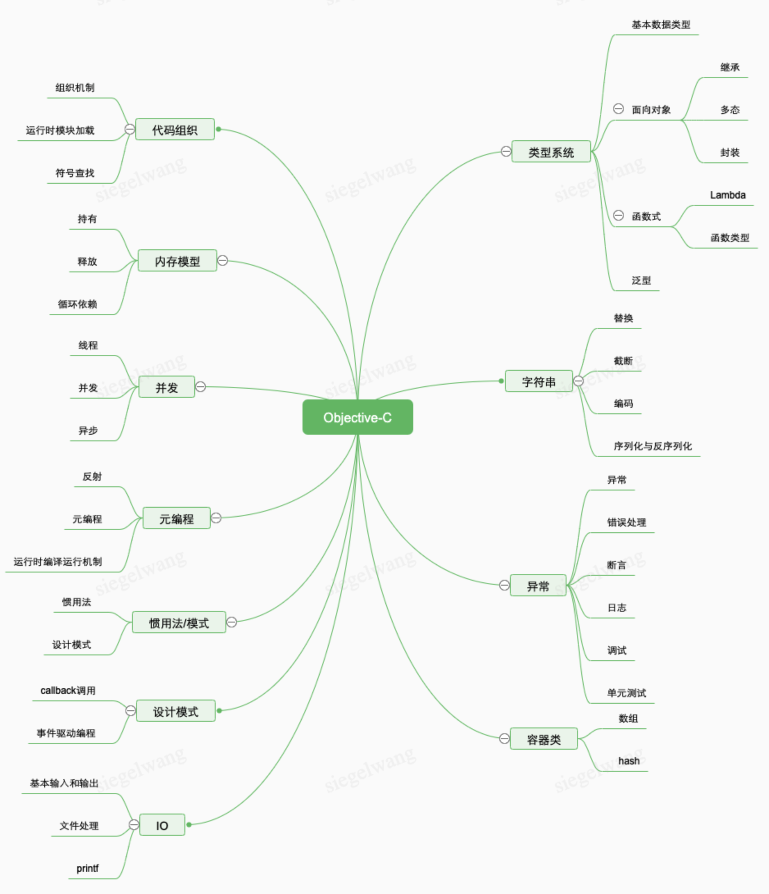

# Objective-C

# 导读

> 从事任何方向的技术研究，不知道该干什么的时候，就问自己四个问题：
>
> 1、这个方向上最新进展是什么？ 都知道吗？
> 2、这个方向上最著名的专家有哪些？他们的研究都看过吗？
>
> 3、这个方向上最著名的技术社区有哪些？精华帖都看过一遍吗？
>
> 4、这个方向上最重要的文章、工具有哪些？文章都看过吗？工具都分析过吗？
>
>                                                                   —–tk教主@2016
>
> ————————————————
>
> 补充一个自己的研究方法：用体系化学习的方法来构建知识体系架构，然后再结合兴趣点深入研究。
>
> 最好的实践办法是先了解这个方向的书籍（可以通过作者质量筛选），因为书籍是知识体系化的载体。只有对这个体系有很清晰的认知，才能更深入理解这个方向（原来还有xxx这种细分领域啊？），找到了合适自己的方向，再深入研究。


**从语言设计角度看Objective-C**




# 类型系统

# 面向对象

## 封装

**私有属性实现**

## 继承

## 多态

## Category、Extension 和 Protocol

Category、Extension 和 Protocol涉及到类的可拓展性问题，Category从语言设计角度看，完全是可以看做是为了解决 Expression Problem问题的设计，所以Category支持添加方法，不支持添加属性(可以添加，但不方便)。如果再加上Protocol约束，就可以做到类型安全的可拓展性。


### Category

[OC 的类别和扩展（Category 和 Extension）](https://xiaovv.me/2017/06/03/Talk-about-Category-and-Extension-in-Objective-C/)

[OC 底层探索 - Category 和 Extension](https://juejin.im/post/6844904067987144711)

[深入理解Objective-C：Category](https://tech.meituan.com/2015/03/03/diveintocategory.html)

### Protocol

**require与optional的选择**

协议的方法一般是可选的(optional)，因为对象未必会关心其中所有的方法。

如果强制，我们需要写空方法，或者设计多个协议拆分。

如果不拆分，每次执行时需要检查是否已经实现该协议`respondsToSelector:`，跟检查方法的成本差不多。故不强制是为了方便。

如果拆分，带来的代理引用就会增加。若功能耦合大，拆分为多个协议，会带来复杂度上升，不如集中在一起。


从Objective-C看，作为动态语言，method lookup是运行时，而非编译时，故不实现`@require`方法对编译没有任何影响，也不一定报compilation error。

**优化多次调用`respondsToSelector:`带来的成本**

如果协议是可选的，每次调用方法，都要检查，可能有一大批类似的代码，代码如下：

``` objc

if ([_delegate respondsToSelector:
					@selector(networkFetcher:didReceiveData:)]) {
	[_delegate networkFetcher:self didReceiveData:data];
}

```

除了第一次以外，后续的检查都是多余的。我们可以把能否响应某个协议方法这一信息缓存起来，检查重复代码，优化程序效率。

**方案1：使用bit field缓存**

来源《Effective Objective-C 2.0》第23条P99

``` objc

@interface EOCNetworkFetcher () {

// 定义
	struct {
		unsigned int didReceiveData: 1;
		unsigned int didFailWithError: 1;
		unsigned int didUpdateProgressTo: 1;
	} _delegateFlags;

}

@end

// 设置值
- (void)  setDelegate: (id<EOCNetworkFetcher>) delegate {

	_delegate = delagate;
	_delegateFlags.didReceiveData = [delegate respondsToSelector:
																						@selector(networkFetcher:didReceiveData:)];
	_delegateFlags.didFailWithError = [delegate respondsToSelector:
																						@selector(networkFetcher:didReceiveData:)];
	_delegateFlags.didUpdataProgressTo = [delegate respondsToSelector:
																						@selector(networkFetcher:didReceiveData:)];
}

// 调用的时候
if (_delegateFlages.didUpdateProgressTo) {
	[_delegate networkFetcher:self
				didUpdateProgressTo];
}

```


**解决方案2：利用宏实现安全的类型转换**

``` objc

/**
* Category声明
*/
@interface NSObject (QNUtils)
+ (instancetype)qn_cast:(id)any warnOnFailure:(BOOL)warnOnFailure;
@end
/**
* Category实现
*/
@implementation NSObject (QNUtils)
+ (instancetype)qn_cast:(id)any warnOnFailure:(BOOL)warnOnFailure {
    if (any) {
        if ([any isKindOfClass:[self class]]) {
            return any;
				}
        else if (warnOnFailure) {
            NSLog(@"Can't cast %@ to type %@", any, NSStringFromClass([self class]));
				}
    } else {
    	return nil;
		}
}
@end

/**
* 宏定义
*/
 //转换value类型到clz，如果类型不符，会输出错误日志，返回nil；
#define AS(clz, value) ([clz qn_cast:(value) warnOnFailure:YES])
 //强制转换value类型到clz，类型不符，返回nil；有限场合使用
#define CAST(clz, value) ([clz qn_cast:(value) warnOnFailure:NO])

/**
* 示例
*/
  for (UIView * subview in self.subviews) {
    AS(UIImageView, subview).image = image;
  }

/**
* 对比不安全的两种常见写法
*/
  for (UIView * subview in self.subviews) {
    ((UIImageView *)subview).image = image; //不安全类型转换
  }

  for (id subview in self.subviews) {
    [subview setImage:image]; //不安全使用语言动态性
  }

```

**解析**

使用Macro和instancetype的小技巧，实现其它语言里有的AS Pattern，相对安全且便捷。

Objective-C语言的动态性，让集合类操作，参数传递等场合容易无视对象类型，要么强制类型转换，或滥用id类型。
容易降低代码的维护性和稳定性。


### 动态类型检测

- `- (BOOL)isKindOfClass:(Class)aClass` 判断类是否是类或其子类的实例
- `- (BOOL)isMemberOfClass:(Class)aClass` 判断是否类的实例
- `+ (BOOL)instancesRespondToSelector:(SEL)aSelector` 判断实例是否有以某名字命名的方法，只能用在类上
- `- (BOOL)respondsToSelector:(SEL)aSelector` 判断是否有以某名字命名的方法


# 泛型(Lightweight Generics )

**类型通配符**

``` objc

// 声明
// 通配符Type
@interface MyArray<Type>: NSObject
@property(nonatomic, strong, nonnull)NSMutableArray<Type> *array;
-(void)addObject:(nonnull Type)obj;
@end

// 定义

-(instancetype) init {
	self = [super init];
	if (self) {
		_array = [[NSMutableArray alloc] init];
	}
	return self;
}

-(void) addObject:(id)obj {
	[_array addObject:obj];
}


```

**协变与逆变**

`__covariant` : 子类型指针可以向父类型指针转换

`__contravariant`: 父类型指针可以向子类型转换

``` objc

MyArray<NSString *> *array;
MyArray<NSMutableString *> *mutArray;

// 直接强制转换，会有警告
mutArray = array; // NSMutableString是NSString的子类

// 添加covariant，不会出现警告
@interface MyArray<__covariant Type> : NSObject
@property(nonatomic,strong,nonnull)NSMutableArray<Type> *array;
-(void)addObject:(nonnull Type)obj;
@end

```

**`__kindof`**

``` objc

- (void)viewDidLoad {
	UIButton * btn;
	MyArray * array = [[MyArray alloc] init];
	[array.viewArray addObject:btn];
	UIButton * button = [array.viewArray firstObject]; // 会有告警
}

// 为了避免强转，以及警告
// __kindof 与 __contravariant的区别？
@property(nonnull, strong, nonatomic)NSMutableArray<__kindof UIView> * viewArray;

```

[Objective—C语言的新魅力——Nullability、泛型集合与类型延拓](https://my.oschina.net/u/2340880/blog/514804)

[oc 中的泛型与nullability](https://zhang759740844.github.io/2016/09/28/oc%E6%96%B0%E7%89%B9%E6%80%A7/)

# 函数式

## block特性

# 元编程

## Macro

[ReactiveCocoa 中 奇妙无比的“宏”魔法](https://halfrost.com/reactivecocoa_macro/)


# 内存模型

## 对象的持有

[深入研究 Block 用 weakSelf、strongSelf、@weakify、@strongify 解决循环引用](https://halfrost.com/ios_block_retain_circle/)


# Collention 类

### `NSMutableArray`与`NSArray`剖析

可变数组`NSMutableArray` 不是线程安全的，不可变数组`NSArray`是线程安全的。为了满足多线程数组操作要求，需要对可变数字进行封装。

[线程安全的可变数组、可变字典](https://www.jianshu.com/p/9082d66fff3c)

[知识点：可变数组的属性使用copy修饰的后果](https://juejin.im/post/6844903714793193485)

# 字符串

## 拼接

``` objc

NSString* str_C; // 结果字符串
NSString* str_A, str_B; //已存在的字符串，需要将str_A和str_B连接起来

//方法1
str_C = [NSString initWithFormat:@"%@,%@", str_A, str_B ];

//方法2
str_C = [str_A stringByAppendingString: str_B];

//方法3
str_C = [string stringByAppendingFormat:@"%@,%@", str_A, str_B];

```

## 转换

``` objc

NSString *str = @"123";

// 1.字符串转int
int intString = [str intValue];

// 2.float转字符串
NSString *stringFloat = [NSString stringWithFormat:@"%f",floatString];

// 3.int转字符串
NSString *stringInt = [NSString stringWithFormat:@"%d",intString];

// 4.字符串转float
float floatString = [str floatValue];

```

## NSLog的常用格式化输出


1. `%c%`：对应参数是一个 `int` 类型，但实际运行时会将该 `int`类型对象转换为 `unsigned char` 类型.

2. `%d` 或者 `%i`：对应参数是一个 `int` 类型. 只不过, `%d` 一般用于十进制, `%i` 可以对应各种进制的数据.

3. `%f`：对应参数是一个 `double` 类型.

4. `%ld`：对应参数是一个 `long int` 类型.

5. `%s`：对应参数是一个 `const char*` 类型，表示输出一个字符串.

6. `%u`：对应参数是一个 `unsigned int` 类型.

7. `%zu`：对应参数是一个 `size_t` 类型.

8. `%td`：对应参数是一个 `ptrdiff_t` 类型.

9. `%x（或 %X）`：对应参数是一个 `int` 类型，不过会以十六进制形式输出，其中大于 9 的数字根据字母 x 大小写进行转换，如果是 %x，则大于 9 的数用 a～f 表示；如果是 %X，则用 A～F 表示.

10. `%%`：输出一个 `%` 符号.

### 遇到的waring

1. `Format string is not a string literal(potentially insecure)`

The compiler is concerned that the input string may contain a percent character `%`,By adding an argument (which could be anything including a number, a string, or nil) you convince the compiler that you know what you're doing.

``` objc
// warning
NSMutableString  *MarqueeMessage = [[NSMutableString alloc]init];
[MarqueeMessage appendString:@"Abc"];
NSString *immutableString = MarqueeMessage;
NSLog(immutableString);

// 解决方案1
NSLog( @"%@", immutableString );

// 解决方案2
NSLog(immutableString, nil);

```

## 序列化与反序列化

## 编码

## 截取


# change log

- 2020/10/28 created document.
