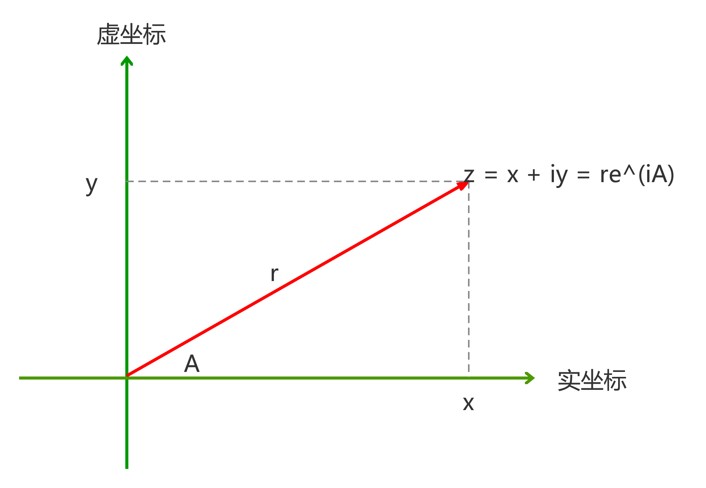
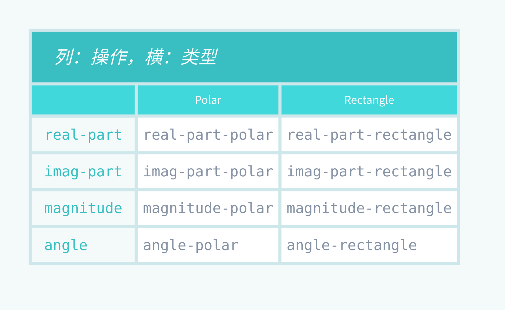

# SICP and Expression Problem 0

#### SICP的数据抽象

> 密涅瓦的猫头鹰，只有在黄昏的时候才起飞
--黑格尔

## 导读

《Structure and Interpretation of Computer Programs》简称SICP。

本文是我个人的读书笔记，很多地方引用原文，特别是有些书籍原文的表述非常好，例如SICP的表述就非常精炼，以至于我自己找不到更好的表述。开始的时候都加上了引用标识，但发现文章中引用太多了，这样排版难看，改成在文字后面写上出处。由于本来就是笔记，略加个人思考，整合所知的知识，本是拾人牙慧。

在SICP第二章中，介绍了复数的两种表示，并介绍了基于类型分派(Tagged Data) ，消息传递(message passing)，数据导向(data directed)。其中消息传递是面向对象的一个雏形，基于类型分派带有函数式编程的痕迹。二者有各自的优缺点。数据导向是解决这个问题非常好的方案。

完整可运行代码见[code of SICP and Expression Problem](./SICP_and_expression_problem_code.md)。所有的代码均保证可以运行。

## 复数的两种表示



复数有两种表示方式：直角坐标形式（实部和虚部），极坐标形式（模和幅角）。如何使得两者共存于同一个系统中呢？

实部、虚部，与模和幅角的关系：

- x = r*cos(A)

- y = r*sin(A)

- r = (x^2 + y^2)^(1/2)

- A = arctan(y/x)

### 复数的运算

复数的加、减、乘、除:

``` scheme
#lang racket

(define (add-complex z1 z2)
  (make-from-real-imag (+ (real-part z1) (real-part z2))
                       (+ (imag-part z1) (imag-part z2))))
(define (sub-complex z1 z2)
  (make-from-real-imag (- (real-part z1) (real-part z2))
                       (- (imag-part z1) (imag-part z2))))
(define (mul-complex z1 z2)
  (make-from-mag-ang (* (magnitude z1) (magnitude z2))
                     (+ (angle z1) (angle z2))))
(define (div-complex z1 z2)
  (make-from-mag-ang (/ (magnitude z1) (magnitude z2))
                     (- (angle z1) (angle z2))))
```

### 直角坐标复数的表示

复数的直角坐标实现。

``` scheme

(define (real-part z) (car z))
(define (imag-part z) (cdr z))
(define (magnitude z)
  (sqrt (+ (square (real-part z)) (square (imag-part z)))))
(define (angle z)
  (atan (imag-part z) (real-part z)))
(define (make-from-real-imag x y) (cons x y))
(define (make-from-mag-ang r a)
  (cons (* r (cos a)) (* r (sin a))))
```

平方和平方根（牛顿法）的实现。以下依赖这两个函数不再复述。

``` scheme
#lang racket

(define (square x) (* x x))

(define (average x y)
  (/ (+ x y) 2))

(define (sqrt x)
  (define (good-enough? guess)
    (< (abs (- (square guess) x)) 0.001))
  (define (improve guess)
    (average guess (/ x guess)))
  (define (sqrt-iter guess)
    (if (good-enough? guess)
        guess
        (sqrt-iter (improve guess))))
  (sqrt-iter 1.0))
```


### 极坐标复数的表示

``` scheme
#lang racket

(define (real-part z)
  (* (magnitude z) (cos (angle z))))
(define (imag-part z)
  (* (magnitude z) (sin (angle z))))
(define (magnitude z) (car z))
(define (angle z) (cdr z))
(define (make-from-real-imag x y)
  (cons (sqrt (+ (square x) (square y)))
        (atan y x)))
(define (make-from-mag-ang r a) (cons r a))
```

## 操作和类型



我们有两种表示复数的类型，一种是直角坐标，一种是极坐标。二者都需要支持四种方法：

- 取实部

- 取虚部

- 取模

- 取幅角

二者也支持两种构造的数据的办法：一种是以直角坐标的形式，一种是以极坐标的形式。

### 数据抽象

数据抽象：将一个复合数据的使用，与数据对象怎样由更基本的数据对象构造起来的细节，隔离开一种方法。即数据的定义，与程序中使用数据的方式无关。这两个部分之间的界面是一组过程，称之为构造函和选择函数。

选择函数，用于访问复合数据对象中的各个部分。复数中取实部、虚部等，就是选择函数。

构造函数，用于创建数据对象。构造复数的两种办法，就是构造函数。

数据抽象的基本思想是为每一类数据对象标识出一组操作，使得对这类数据对象的所有操作都可以基于他们表述，而且在操作这些数据对象的时候，只使用这一组操作。

## 基于类型分派(Tagged Data)

数据究竟意味着什么？“由给定的构造函数和选择函数所实现的东西”是不够的。并非任意过程都适合某一数据的实现基础。一般而言，我们总可以将数据定义为一组适当的选择函数和构造函数。但为使这些过程成为一套合法的表示，必须满足一组特定的条件。

在同一个系统中，如果同一个数据包含两种不同的表示，就需要一种方式，把两者区分开，否则数据就会有歧义。具体到复数的表示，需要区分直角坐标和极坐标。例如，`(3, 4)`的模，没有类型区分，我们无法知道是5（直角坐标解释），还是3（极坐标解释）。

为了完成这种区分，我们需要在复数里包含一个类型标志——如符号rectangular和polar。我们可以用这个标志，区分这两种表示，这样以后，我们就可以正确的选择函数。

### 基于类型分派(Tagged Data)定义

> 检查一个数据的类型，并据此去调用某个适当的过程，称之为**基于类型的分派**

### 从表格的角度看

基于类型分派的组织方式，让每一个操作管理的分派(即一个函数对应多种类型)。从效果上看，相当于将`操作-类型表格`分解危一行一行，每一个通用型过程表示表格中的一行。

``` scheme
#lang racket

(define (attach-tag type-tag contents)
 (cons type-tag contents))
(define (type-tag datum)
  (if (pair? datum)
      (car datum)
      (error "Bad tagged datum -- TYPE-TAG" datum)))
(define (contents datum)
  (if (pair? datum)
      (cdr datum)
      (error "Bad tagged datum -- CONTENTS" datum)))

(define (rectangular? z)
  (eq? (type-tag z) 'rectangular))
(define (polar? z)
  (eq? (type-tag z) 'polar))
```

### 添加类型tag之后的直角坐标实现

``` scheme
#lang racket

(define (real-part-rectangular z) (car z))
(define (imag-part-rectangular z) (cdr z))
(define (magnitude-rectangular z)
  (sqrt (+ (square (real-part-rectangular z))
           (square (imag-part-rectangular z)))))
(define (angle-rectangular z)
  (atan (imag-part-rectangular z)
        (real-part-rectangular z)))
(define (make-from-real-imag-rectangular x y)
  (attach-tag 'rectangular (cons x y)))
(define (make-from-mag-ang-rectangular r a)
  (attach-tag 'rectangular
              (cons (* r (cos a)) (* r (sin a)))))
```

### 添加类型tag之后的极坐标实现

``` scheme
(define (real-part-polar z)
  (* (magnitude-polar z) (cos (angle-polar z))))
(define (imag-part-polar z)
  (* (magnitude-polar z) (sin (angle-polar z))))
(define (magnitude-polar z) (car z))
(define (angle-polar z) (cdr z))
(define (make-from-real-imag-polar x y)
  (attach-tag 'polar
               (cons (sqrt (+ (square x) (square y)))
                     (atan y x))))
(define (make-from-mag-ang-polar r a)
  (attach-tag 'polar (cons r a)))
```

### 通用选择函数的实现

``` scheme
(define (real-part z)
  (cond ((rectangular? z)
         (real-part-rectangular (contents z)))
        ((polar? z)
         (real-part-polar (contents z)))
        (else (error "Unknown type -- REAL-PART" z))))
(define (imag-part z)
  (cond ((rectangular? z)
         (imag-part-rectangular (contents z)))
        ((polar? z)
         (imag-part-polar (contents z)))
        (else (error "Unknown type -- IMAG-PART" z))))
(define (magnitude z)
  (cond ((rectangular? z)
         (magnitude-rectangular (contents z)))
        ((polar? z)
         (magnitude-polar (contents z)))
        (else (error "Unknown type -- MAGNITUDE" z))))
(define (angle z)
  (cond ((rectangular? z)
         (angle-rectangular (contents z)))
        ((polar? z)
         (angle-polar (contents z)))
        (else (error "Unknown type -- ANGLE" z))))
```

实现算术运算过程`add-complex`等保持不变，调用相同的选择函数(函数命名被添加了后缀，举例子的是极坐标polar)。

``` scheme
(define (add-complex z1 z2)
  (make-from-real-imag-polar (+ (real-part z1) (real-part z2))
                       (+ (imag-part z1) (imag-part z2))))
```

### 基于类型分派的缺点

在系统设计中，这是一种构造模块的策略。

但有显著的弱点，所设计的模块，不具有可加性（个人理解是可以随意添加新的实现，而不需要修改原来的代码）。

添加新数据类型的时候，必须小心的避免命名冲突。同时，还需要去修改处理不同数据类型的函数，这些函数必须支持所有不同数据类型。即：

- 需要小心避免命名冲突

- 处理不同类型数据的函数，必须知道所有不同的数据类型。即函数依赖具体的类型。


### 基于类型分派的思考

基于类型分派，看起来应该是与下文的消息传递是对称的。为什么基于类型分派显著不能作为构建系统的设计呢？而消息传递（面向对象）可以呢？

本文下篇讲解expression problem中函数式编程的实现，其实也是对应表格的横向，而函数式编程能支持好的设计呢？

从代码角度看，这里实现的基于类型分派，是简单的类似于if的语句的来识别类型的标签，是很粗糙的实现，不具有可加性，可组合性也很弱。这一点与消息传递显著不同，消息传递一看就有模块化的功能，且显而易见容易添加方法。

函数式编程的怎么处理这个问题？我觉得是类型系统，以及其模式匹配。有了类型约束和模式匹配，实现基于类型分派，就不需要用简单if语句实现，而是模式匹配，类型系统自动匹配，同时类型系统还能检查是否完整匹配，这是很强大的功能。类似于if语句缺少某些必要的分支，就无法编译通过。

模式匹配类似于：

```
function
  | 类型1 -> 处理类型1的代码
  | 类型2 -> 处理类型2的代码
  | 类型3 -> 处理类型3的代码

```


但是，我们知道类型系统虽然很强，实际上是也有缺点的，有些很特殊的场景，类型系统也很难处理。类型系统来约束代码的能力，自然也同样约束了有些方便之门。常见的类型系统又有各自的缺点，如HM类型系统。

### 基于类型分派与实际问题的思考

#### `jQuery.noConflict()`


背景：在ES3时代，JavaScript没有块作用域，一般会使用函数构造一个作用域。

虽然jQuery用函数作用域，巧妙的构造了一个块作用域，但该块作用域必须暴露出一个接口或变量，以便外界使用。jQuery的做法很简单，挂在全局变量上，且为了方便，使用单个字符`$`，这样就很容与其他代码冲突。jQuery为了解决命名冲突问题，专门提供了一个函数：`noConflict`，以便调用方能方便的重命名jQuery挂载的全局变量。

``` javascript
(function(window, undefined){
    var
    // Map over jQuery in case of overwrite
    _jQuery = window.jQuery,
    // Map over the $ in case of overwrite
    _$ = window.$,

    // 其他代码

    jQuery.extend({
        noConflict: function(deep){
            if (window.$ === jQuery) {
                window.$ = _$;
            }
            if (deep && window.jQuery === jQuery) {
                window.jQuery = _jQuery;
            }
            return jQuery;
        }
    })
}(window);

```

多个jQuery版本共存的方案。其实就是取多个别名。

``` html
<!-- load jQuery 1.1.3 -->
<script type="text/javascript" src="http://example.com/jquery-1.1.3.js"></script>
<script type="text/javascript">
var jQuery_1_1_3 = $.noConflict(true);
</script>

<!-- load jQuery 1.3.2 -->
<script type="text/javascript" src="http://example.com/jquery-1.3.2.js"></script>
<script type="text/javascript">
var jQuery_1_3_2 = $.noConflict(true);
</script>
```

#### React早期的 Mixins

使用Mixins的例子：

``` jsx
import React from 'react';

var MyMixin = {
  doSomething() {

  }
};
const MyComponent = React.createClass({
  mixins: [MyMixin],
  handleClick() {
    this.doSomething(); // invoke mixin's method
  },
  render() {
    return (
      <button onClick={this.handleClick}>Do Something</button>
    );
  }
});

export default MyComponent;

```

简单的 Mixins 实现。

``` javascript
const mixin = function(obj, mixins) {
  const newObj = obj;
  newObj.prototype = Object.create(obj.prototype);

  for (let prop in mixins) {
    if (mixins.hasOwnProperty(prop)) {
      newObj.prototype[prop] = mixins[prop];
    }
  }

  return newObj;
}
```

Mixins 缺点（来自《Mixins Considered Harmful》）

- Mixins 引起名称冲突（Mixins cause name clashes）
- Mixins 引入了隐式的依赖关系（Mixins introduce implicit dependencies）

原文还有一条：Mixins 导致滚雪球式的复杂性（Mixins cause snowballing complexity）。这其实是隐式依赖关系的结果。

命名冲突显而易见，Mixins 当前组件的属性，不能于组件本身的属性名字相同，否则会被覆盖。与组件不同，mixins 不能构成层次结构，它们被平坦化并在相同的命名空间中运行。

React的隐式依赖关系的理解。组件依赖mixins，或mixins 依赖于其他 mixin，删除其中的一个会破坏另一个 mixins。JavaScript 是一种动态语言，因此很难强制记录这些依赖关系。有mixins的情况下，告诉数据如何流入和流出 mixin ，以及它们的依赖图怎样是非常棘手的。即，修改mixins或者修改组件，需要清楚的知道所有的依赖关系。这与基于类型分派的第二条，函数依赖具体的类型有类似之处。组件与Mixins混合在一起，缺少中间的抽象层，必然导致需要直接处理这些依赖关系。基于类型分派，也没有函数与类型之间的抽象屏障，本质原因是一样的。

从设计上来看，Mixins 不区分类型，抽象能力还不如基于类型分派。

## 消息传递(Message-Passing)

### 消息传递(Message-Passing)定义

> 数据的过程性表示的程序设计风格，称之为**消息传递**
> 这个名字源自于，将数据对象设想为一个实体，他以“消息”的方式接收所需操作的名字。

### 数据的过程性表示举例

#### 用过程来实现序对

序对有三个操作，用cons将两个对象连接在一起，用car和cdr取出其中一个对象。即序对满足条件：对任何对象x和y，如果z是`(cons x y)`，那么`(car z)`是x，而`(cdr z)`是y。任何满足上述三个过程都可以称为实现序对的基础。

我们可以不同任何数据结构，只使用过程，就可以实现序对。

``` scheme
; cons返回的是一个过程，即内部定义的dispatch
(define (cons x y)
  (define (dispatch m)
    (cond ((= m 0) x)
          ((= m 1) y)
          (else (error "Argumant not 0 or 1 -- CONS " m))))
  dispatch)

(define (car z) (z 0))
(define (cdr z ) (z 1))

(define one-half (cons 1 2))
(car one-half)
(cdr one-half)
```

#### Church计数

SICP练习2.6，提及Church计数，考虑将0和加一的操作实现为：

``` scheme
(define zero (lambda (f) (lambda (x) x)))

(define (add-1 n)
    (lambda (f) (lambda (x) (f ((n f) x)))))
```

one的定义。

``` scheme

(define one (add-1 zero))

; 展开化简

(add-1 zero)

(add-1 (lambda (f)
           (lambda (x)
               x)))

((lambda (n)                    ; add-1
     (lambda (f)
         (lambda (x)
             (f ((n f) x)))))
 (lambda (f)                    ; zero
     (lambda (x)
         x)))

(lambda (f)
    (lambda (x)
        (f (
            ((lambda (f)        ; zero
                 (lambda (x)
                     x))
             f)
            x))))

(lambda (f)
    (lambda (x)
        (f ((lambda (x) x)
            x))))

(lambda (f)
    (lambda (x)
        (f x)))

; one定义
(define one
    (lambda (f) (lambda (x) (f x))))

```


### 从表格的角度看

基于消息传递的组织方式，是将`操作-类型表格`按列分解，不是采用一批“智能操作”去基于数据类型进行分派，而是采用“智能数据对象”，基于操作名完成分派。这样，我们需要把数据对象表示一个过程，以操作名作为输入，去执行指定操作。

### 复数的消息传递实现

``` scheme
#lang racket

(define (make-from-real-imag x y)
  (define (dispatch op)
    (cond ((eq? op 'real-part) x)
          ((eq? op 'imag-part) y)
          ((eq? op 'imagnitude)
           (sqrt (+ (square x) (square y))))
          ((eq? op 'angle) (atan x y))
          (else
           (error "Unkown op -- MAKE-FORM-REAL-IMAG" op))))
  dispatch)

(define test (make-from-real-imag 3 4))
(test 'real-part)
```

`make-from-real-imag`返回值是一个过程——其内部的dispatch过程。

消息传递并不是一种数学技巧，而是一种有价值的技术，可以用于组织带有通用型操作的系统。

### 调用消息传递实现的中间层

``` scheme

(define (apply-generic op arg) (arg op))
(define (real-part z) (apply-generic 'real-part z))
(define (imag-part z) (apply-generic 'imag-part z))
(define (magnitude z) (apply-generic 'magnitude z))
(define (angle z) (apply-generic 'angle z))

```

### 思考消息传递

向对象发送消息（方法调用），调用开始后，会一直等到返回结果，是一种同步的方式。

而Curl Hewitt提倡的“Actor Model”（参与者模式），向Actor发送消息，仅仅发送消息，而不用等待结构，是异步的。

Actor只能通过消息进行信息交换，不能直接共有同一个值，信息传递要花代价。但这样，避免了资源竞争，避免了锁或队列。理论上，于性能而言，线程更优秀，但会出现与时机相关的问题。

多个消息同事到达怎么办？Erlang内嵌到系统中的排除机制来处理了。

这与现实中的人和人之间的相处类似，别人想什么你不知道，想要求什么是，需要通过传递“消息”。

Actor原意是“演员”，Actor和其他Actor，通过台词（消息）对白，将剧情（程序）进行下去。

来自《松本行弘的程序世界》，略有总结和修改。

## 数据导向的程序设计(Data-Directed)

### 数据导向的程序设计(Data-Directed)

将程序划分为两个维度：操作和类型，组合成一个二位表格，直接利用这个二维表格的程序设计技术，称之为**数据导向**

### 从表单角度看

我们把数据类型作为一个维度，操作作为一个维度，处理针对不同类型的操作时，我们可以看作在处理一个二位表格，一个维度是包括所有操作，一个维度包含所有类型。数据导向就是利用这种表格的程序设计技术。实现一个过程，用操作名和类型参数的组合，到表中查找，找到对应的过程。

这种设计，可以使得我们加新的类型到系统里，不需要修改任何现存的过程，只需要在表格中新增一项即可。

允许我们孤立地设计每一种数据表示，而后用添加的方式将他们组合进去。

### 数据导向设计具有的性质

处理这种`操作-类型`的表格，需要两个方法：

- 将function加入到表格中，以operation和type作为索引，`(put <operation><type><function>))`
- 从表格中获取function，以operation和type作为索引，`(get <operation><type>))`


### 直角坐标实现

二维表格的实现(代码中的`put`和`get`方法)，见[code of SICP and Expression Problem](./SICP_and_expression_problem_code.md)，创建二维表格。

``` scheme
(define (install-rectangular-package)
  ;; internal procedures
  (define (real-part z) (car z))
  (define (imag-part z) (cdr z))
  (define (make-from-real-imag x y) (cons x y))
  (define (magnitude z)
    (sqrt (+ (square (real-part z))
             (square (imag-part z)))))
  (define (angle z)
    (atan (imag-part z) (real-part z)))
  (define (make-from-mag-ang r a)
    (cons (* r (cos a)) (* r (sin a))))
  ;; interface to the rest of the system
  (define (tag x) (attach-tag 'rectangular x))
  (put 'real-part '(rectangular) real-part)
  (put 'imag-part '(rectangular) imag-part)
  (put 'magnitude '(rectangular) magnitude)
  (put 'angle '(rectangular) angle)
  (put 'make-from-real-imag 'rectangular
       (lambda (x y) (tag (make-from-real-imag x y))))
  (put 'make-from-mag-ang 'rectangular
       (lambda (r a) (tag (make-from-mag-ang r a))))
  'done)
```

###  极坐标实现

``` scheme
(define (install-polar-package)
  ;; internal procedures
  (define (magnitude z) (car z))
  (define (angle z) (cdr z))
  (define (make-from-mag-ang r a) (cons r a))
  (define (real-part z)
    (* (magnitude z) (cos (angle z))))
  (define (imag-part z)
    (* (magnitude z) (sin (angle z))))
  (define (make-from-real-imag x y)
    (cons (sqrt (+ (square x) (square y)))
          (atan y x)))
  ;; interface to the rest of the system
  (define (tag x) (attach-tag 'polar x))
  (put 'real-part '(polar) real-part)
  (put 'imag-part '(polar) imag-part)
  (put 'magnitude '(polar) magnitude)
  (put 'angle '(polar) angle)
  (put 'make-from-real-imag 'polar
       (lambda (x y) (tag (make-from-real-imag x y))))
  (put 'make-from-mag-ang 'polar
       (lambda (r a) (tag (make-from-mag-ang r a))))
  'done)

```

### 复数运算

可以看到，虽然极坐标和直角坐标有些过程有相同的名字（如`real-part`），但对其他部分而言，这是内部的，不会有名字冲突问题。

和消息传递一样，中间多了一个抽象层，故需要一个中间的函数，这里也用`apply-generic`，用于访问表格。

``` scheme
(define (apply-generic op . args)
  (let ((type-tags (map type-tag args)))
    (let ((proc (get op type-tags)))
      (if proc
          (apply proc (map contents args))
          (error
            "No method for these types -- APPLY-GENERIC"
            (list op type-tags))))))
```

定义通用选择函数

``` scheme
(define (real-part z) (apply-generic 'real-part z))
(define (imag-part z) (apply-generic 'imag-part z))
(define (magnitude z) (apply-generic 'magnitude z))
(define (angle z) (apply-generic 'angle z))
```

实现算术运算是，过程`add-complex`等保持不变，调用相同的选择函数。

``` scheme
(define (add-complex z1 z2)
  (make-from-real-imag (+ (real-part z1) (real-part z2))
                       (+ (imag-part z1) (imag-part z2))))
```

### 数据导向与实际问题的思考

#### 表驱动法（Table-Driven Methods）

表驱动法是一种编程模式(Scheme)——从表里查找信息，而不使用逻辑语句。事实上，凡是能用逻辑语句来选择的事物，都可以通过查表来选择。表里既可以是数据，还可以是函数或函数指针。

适当的环境下，采用表驱动法，所生成的代码会比复杂的逻辑代码更简单、更容易修改。同时，表驱动法还有一个优势：可以把表中的数据存在文件中，在程序运行再读取这些数据。这样就可以在不改动程序本身的情况下，调整参数。

表提供了一种复杂的逻辑和继承结构的替代方案。如过我们对某个程序的逻辑或者继承书关系感到困惑，就可以试着通过一个查询表来加以简化。

确定各个月天数的笨拙做法

``` javascript

let days = 0;

if (month === 1) {
    days = 31;
} else if (month === 2) {
    days = 28;
} else if (month === 3) {
    days = 31;
}else if (month === 4) {
    days = 30;
} else if (month === 5) {
    days = 31;
} else if (month === 6) {
    days = 30;
} else if (month === 7) {
    days = 31;
} else if (month === 8) {
    days = 31;
} else if (month === 9) {
    days = 30;
} else if (month === 10) {
    days = 31;
} else if (month === 11) {
    days = 30;
} else if (month === 12) {
    days = 31;
}

```

实现同样的功能，可以把数据存到一张表里。

``` javascript
const days = [31, 28, 31, 30, 31, 30, 31, 31, 30, 31, 30 , 31];
```

来自《代码大全》18章表驱动法。代码用JavaScript重写。

表中的数据如果是函数，那么表单驱动法就换了另一个名字：策略模式。

#### 策略模式

> 在函数作为一等对象的语言中，策略模式是隐形的。strategy就是值为函数的变量。
> —— Peter Norving

Web项目中表单校验的普通实现。

``` javascript

function validateForm(formData) {
    if (formData.userName === '') {
        console.log('用户名不能为空');
        return false;
    }
    if (formData.password.length < 6) {
        console.log('密码长度不能少于6位');
        return false;
    }
    if (!/(^1[3|5|8][0-9]{9}$)/.test(formData.phone) ) {
        console.log('手机号码格式不正确');
        return false;
    }
    return true;
}

```

策略模式实现。

``` javascript
// 可以进一步抽象，这里只作为优化以上普通实现的优化
const strategies = {
    userName: function(value) {
        if (value === '') {
            console.log('用户名不能为空');
            return false;
        }
    },
    password: function(value ) {
        if (value.length < 6) {
            console.log('密码长度不能少于6位');
            return false;
        }
    },
    phone: function(value) {
        if (!/(^1[3|5|8][0-9]{9}$)/.test(value)) {
            console.log('手机号码格式不正确');
            return false;
        }
    }
};

function validateForm(formData) {
    for (type in formData) {
        strategies[type](formData[type]);
    }
}

```


策略模式的实现，消除了原程序中大片的条件分支语句。validateForm本身没有校验表单的能力，而是把这个功能委托给策略对象。策略对象的算法已封装在对象内部。当向策略对象发出校验（调用函数）消息的时候，会返回对应的计算结果。这其实也是对象多态性的体现。

部分参考《JavaScript设计模式》，曾探著。

### 显式分派、数据导向和消息传递的可拓展性

#### 练习2.76

> Multiple Representation(2.4)
> when multiple representations of a data type needs to coexist in a system. there are three ways to do this.

> - Tagged Data : Every representation use a unique tag
> - Data-Directed: Use a two dimensions(operations X type) table to dispatch the operation
> - Message-Passing: Use the high order procedure to represent the data type.

译文：一个带有通用操作的大型系统可能不断演化，在演化中常需要加入新的数据类型或新的操作。有三种策略——显示分派、数据导向和消息传递，有新类型或操作加入时，请描述系统所必须的修改。那种组织方式最适合那些经常需要经常加入新类型的系统？那种组织方式最适合那些经常需要加入新操作的系统？

上文中有解答。此次省略。


## 相关的思考

### 编程与数学

一般而言，我们总可以将数据定义为一组适当的选择函数和构造函数，以及为使这些过程成为一套合法表示，它们就必选满足的一组特定条件。

这一思想严格地形式化却非常困难。目前存在着两种完成这一形式化的途径：抽象模型方法和代数规范。

由MIT的Zilles、Goguen和IBM的Thatcher、Wagner和Wright，以及Toronto的Guttag提出，称为代数规范。这一方式将“过程”看作是一个抽象代数系统的元素，系统的行为由一些对应于我们的“条件”的公理刻画，并通过抽象代数的技术去检查有关数据对象的短语。

### 数据抽象屏障的优点

- 程序容易维护和修改

- 有助于程序的设计。因为抽象屏障的存在，我们可以保留不同实现的灵活性，推迟考虑选择不同实现的时机，同时又不会阻碍系统其它部分的进展

#### 以有理数作为数据抽象的例子

有理数的表示：

``` scheme

; 构造函数
(define (make-rat n d) (cons n d))
; 选择函数
(define (numer x) (car x))
; 选择函数
(define (denom x) (cdr x))

(define (print-rat x)
  (newline)
  (display (numer x))
  (display "/")
  (display (denom x)))

(define one-half (make-rat 1 2))

(print-rat one-half)

```

### 函数式程序设计

> 不用任何赋值的程序设计称之为函数式程序设计。

### 命令式程序设计

> 采用赋值的程序设计被称之为命令式程序设计。

赋值的存在，变量已经不能再看做仅仅是某个值的名字。此时的一个变量必须以某种方式制定一个“位置”，相应的值可以存储在那里。在我们的新求值模型里，这种位置将维持在称为环境的结构中。

一个环境就是框架（frame）的一个序列，每一个框架包含着一些约束的一个表格（可能为空），这些约束将一些变量名字关联于对应的值（在一个框架里，任何变量至多只能有一个约束）。每个框架还包含一个指针，指向这一框架的外网环境。

环境对于求值过程是至关重要的，因为他确定了表达式求值的上下文。

### 高阶过程与类型

如果创建了不同种类的过程，就将迫使我们同时去创建不同种类的高阶过程。这是常规类型语言（如Pascal）在处理高阶过程时所遇到的困难情况在Lisp里的一种小小反应。在那些语言里，程序员必须刻画每一个过程的参数和结果的数据类型：数、逻辑值、序列等。因此，我们就无法表述某些抽象，例如用一个如stream-map那样的高阶过程“将给定过程proc映射到一个序列里的每个元素”。相反，我们将需要对每种参数和结果数据类型的不同组合定义不同的映射过程，各自应用于特定的proc。在出现了高阶函数的情况下，维持一种实际的“数据类型”概念就变成了一个很困难的问题。语言ML阐明了处理这一问题的一种方法（Gordon，Milner，and Wadsworth 1979），其中的“多态数据类型”包含着数据类型间高阶变换的模式。这就使程序员不必显示声明ML里的大部分过程的数据类型。ML包含一种“类型推导”机制，用于从环境中归结出新定义的过程的数据类型。

### 闭包

术语“闭包”来自抽象代数，一个集合的元素在某个运算之下封闭，如果将该运算应用于这一集合中的元素，得到的仍然是该集合的元素。具体到抽象数据结构，某种组合数据对象的操作满足闭包性质，即通过组合起来的数据对象得到的结果本身还是可以通过同样的操作再进行组合。

闭包性质是任何一种组合功能的威力的关键要素，可以使得我们能过建立起层次性的结构。这种结构可以一些结构构成，而各个部分又是他们的部分构成，且可以继续如此下去。

思考：这与递归，以及数学里面的分形非常相似。


## 完整可运行代码

[code of SICP and Expression Problem](./SICP_and_expression_problem_code.md)

### 下篇

[SICP and Expression Problem 下](./SICP_and_expression_problem_1.md)

## change log

- 2019/9/20 created document

- 2019/9/22 补充参考资料

- 2019/9/30 完成OCaml版本的Finally Tagless的版本理解，可以开始写OCaml部分了

- 2019/10/11 完成OCaml的expression problem例子，补充参考资料

- 2019/10/12 完成正确的OCaml的expression problem的实现，直接参考别人的博客写代码，被坑了半个月。也是由于我对OCaml不熟悉，加上心急，被这个博客的作者气死了，瞎写代码。

- 2019/10/20 合并visitor模式文档

- 2019/10/28 凌晨1点，完成代数和循环不变式

- 2019/10/29 凌晨1点，完成OCaml多态类型部分，并学习subtyping概念

- 2019/10/29 晚上10点，完成文章的初稿。研究这个课题，一个月有余

- 2019/11/10 上午，用Racket完成interpreter

- 2019/11/11 晚上，写分享的PPT的时候，有新的理解，初步补充

- 2019/11/17 晚上12点，补全SICP的内容，后续需要精简或加上自己的思考

- 2019/11/17 晚上下午5点，补充Java的 Checked Exception和sum类型的关系。基本完成这篇笔记，一路过来，日日夜夜读书，写OCaml，Scheme，Racket和Java代码，摘抄，一日也不得轻松，可谓生无所息。后续再深入思考，补充自己的见解。

- 2019/11/18 参考子建的建议，修改Java的checked exception部分表述

- 2019/11/21 修改文章结构，分为上下两篇文章，把代码分离到单独文件
