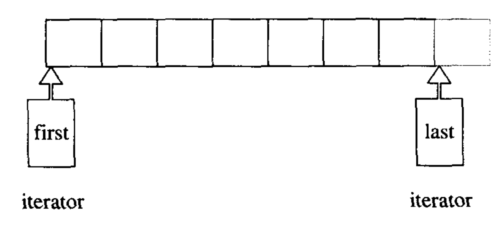
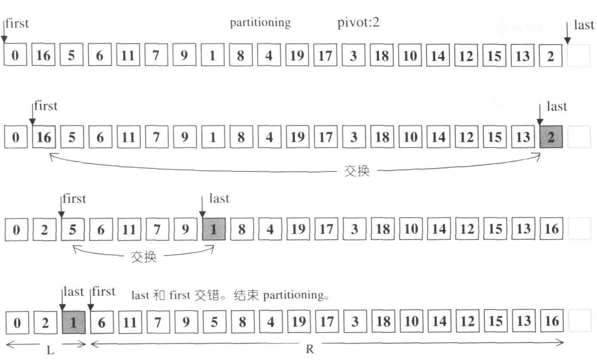

# C++泛型獭祭

獭祭读音：tǎ jì

东风解冻，蛰虫始振，鱼上冰，獭祭鱼。──礼记·月令

雨水之日，獭祭鱼；後五日，鸿雁来；後五日，草木萌动。──周书·时训篇


# 左闭右开不对称区间

## “差一错误”（off-by-one error）

怎么描述 x、x+1、x+2、x+3、x+4、x+5...x+N 这样一个系列呢？我们有以下4种选择：

1. x <= i < x+N+1
2. x-1 < i <= x+N
3. x <= i <= x+N
4. x-1 < i < x+N+1

以上4种方案，都可以描述N+1个元素的范围(range)，如何从其中选择呢？

我们不仅仅需要考虑直接表示范围，还需要考虑元素个数。计算元素个数虽然简单，但容易犯错。例如：做一个10米篱笆，每隔1米用一根竹竿，一共需要多少根？正确答案是11根，而不是10根。因为两端各需要一根。思考问题的时候，试着使用简化以后的特例，然后外推，能减少犯错。简化一下这个问题，如果1米篱笆，每隔1米用一根竹竿，需要多少根呢？答案就很明显了，只需要2根即可。在C系列语言里面，大量用到for循环，常常会遇到计数问题，类似于计算需要多少根竹竿，恰好少计算了一根。被称为“差一错误”（off-by-one error），名称来自《C陷阱与缺陷》。

例如错误计算数组元素个数：

```c
int i, a[10];
for (i = 0; i <= 10; i++)
    a[i] = 0;

```

代码的本意是设置数组中所有元素为0。但由于for语句的比较部分，本应写成`i < 10`，被写成了`i <= 10`，因此会把实际上不存在的`a[10]`设置为0，即数组a之后的一个字被设置为0。
造成这个错误的原因是，从0到10，实际上有11个元素，而不是10个。同样考虑一下最简特例，假设只有一个元素。假定左界为0，右界为h。如果使用方案3，左右界重合，即h也为0，计算元素个数：h-0=0。显然是错误的。正确的应该是：`h-0+1 = 1`。通过这个特例，我们外推一下。在闭区间方案中，计算元素个数应该是：

`元素个数 = 右界 - 左界 + 1`

如果我们调整一下这个公式：

`元素个数 = (右界 + 1) - 左界`


`右界+1`作为新的右界，那么计算的时候，就不需要额外加1了。这恰好是方案1和方案4的右界。用第一个入界点作为左界，和用第一个出界点作为右界。




因此，为了降低在工程中出错。选择range的时候，需要考虑，能直接相减得到元素个数的方案。以上只有1和4满足。2和3，都需要做额外的处理。

用这种不对称的边界，重写上面错误的代码：

```c
int i, a[10];
for (i = 0; i < 10; i++)
    a[i] = 0;

```

而不是使用：

```c
int i, a[10];
for (i = 0; i <= 9; i++)
    a[i] = 0;

```

## 左右界与子序列

同时，左右界之差是这个系列的长度，还有一个特性：如果我们需要处理一个系列的多个子序列，在1和4方案里，子序列将会是相邻的，上一个子序列的右界，是下一个子序列的左界。


很多算法需要将一个大的序列的分割为子序列，然后处理子序列，处理好子序列以后，将子序列连起来，完成算法的计算。典型的如快排（Quick，Sort）

快排的平均复杂度为`Ο(NlogN)`，最坏为`Ο(N^2)`。早期STL sort算法采用的是Quick Sort。算法叙述如下。设S代表要处理的序列：

1. 如果S的元素个数为0或1，结束；
2. 取S中任一元素，当做枢轴（pivot）v。用于分割S为两个子序列
3. 将S分割为L、R两个子序列，L内元素都小于或等于v，R内元素大于或等于v
4. 对L和R子序列，递归执行Quick Sort


```c++
template <class RandomAccessIterator, class T>
RandomAccessIterator __unguarded_partition (RandomAccessIterator first, RandomAccessIterator last, T pivot) {
    while (true) {
        while (*first < pivot) ++first; // first 找到 >= pivot的元素则停下来
        --last; // 调整。第一次调整，是从下边界指向最后一个元素（否则执行swap有问题）。后续调整是从当前元素（已执行此算法）指向前一个元素
        while (pivot < *last) --last; // last 找到 <= pivot 元素则停下来
        if (!(first < lase)) return first;  // 交错了，结束循环
        std::iter_swap(first, last);  // 大小值交换
        ++first;  // 调整
    }
}

```

first和last是左闭右开不对称区间。first指向序列的第一个元素，而last则是出了序列的第一个元素。因此，第一次first调整以后，last也可以调整，调整以后，恰好是序列的最后一个元素。后续如果first调整，即找到大于或等于枢轴元素值的元素，last指向的是上一次调整过的元素，此次不需要再调整此元素了，需要让last自减，指向左边的元素。可以看出，此过程是对称的，第一次调整和后续调整一样。即起初的区间有效，那么每一轮迭代的区间，都有效。这样能直观保证算法的正确性，就像数学中的归纳法证明一样。

分割过程：



1. 分割（partitioning）方法不只一种，上面使用简单有效的做法。令头端迭代器first向尾部移动，尾端迭代器last向头部移动。当`*first`大于或等于枢轴（pivot）v的时候，停下来；当`*last`小于或等于枢轴（pivot）v的时候也停下来，并检查两个迭代器是否交错。
2. 如果first依然左在last在右，则交换两个元素，然后各自调整一次位置，继续想中央靠拢；并继续步骤1
3. 如果迭代器交错了，则表示序列调整完毕。此时，first为枢轴，将整个序列分割为左右两个子序列，左边的元素的值，小于或等于枢轴，右边反之。

## 索引开始值选择0还是1？

1和4如何选择呢？我们考虑自然数（皮亚诺公理0是自然数）：`0、1、2、3、4...N`。如果选择4，这个左边区间为`-1`，是一个负数，需要用到非自然数，不优雅。因此左边有闭区间，选择方案1。 

然而，当我们处理长度为l的序列的时候，例如长度为l的数组，即使选择方案1，也还有一个问题：下标索引是从1开始，还是从0开始？

当我们从1开始的时候，区间表示为`1 <= i < l+1`，若从0开始，区间表示为`0 <= i < l`。从0开始有一个好处，右边的区间恰好是元素的个数。

但这种不对称的边界还有一个问题：长度为N的数组a，并不存在元素a[N]，最后一个元素是a[N-1]。

`a[N]`引用了一个不存在的元素。实际上，我们不需要使用该元素，只需要引用元素的地址或者比较索引即可。 

### OC中迭代的是否终止

OC的迭代器：

```oc
    NSArray *array = [NSArray arrayWithObjects:@"bei", @"jing", @"huan", @"ying", @"nin", nil];
        
    // 获取数组的正序迭代器
    NSEnumerator *enu1 = [array objectEnumerator];
        
    // 遍历数组
    id obj = nil;
        
    // 正序，获取下一个需要遍历的元素
    while (obj = [enu1 nextObject]) {
        NSLog(@"%@", obj);
    }
```

`while (obj = [enu1 nextObject])`判断是否结束，也是判断最后引用是否为`nil`，与`a[N]`一样，是一个不存在的元素。


## 左闭右开不对称区间

我们考察一下大名鼎鼎的 Robert Sedgewick 的《Algorithms》第四版：

```java
public class Quick extends Example {
    public static void sort(Comparable[] aComparables) {
    StdRandom.shuffle(a);  // 消除对输入的依赖
    sort(a, 0, a.length - 1);
  }
    public static void sort(Comparable[] aComparables ,int lo,int hi) {
        if(lo < hi) {
            int j = partition(aComparables,lo,hi);  // 切分
            sort(aComparables, lo, j-1);  // 左半部分排序
            sort(aComparables, j+1, hi);  // 右半部分排序
        }
    }
    
    private static int partition(Comparable[] aComparables,int lo ,int hi) {
    // 将数组分割为a[lo..i-1]，a[i]，a[i+1..hi]
        int i = lo;  // 左指针
        int j = hi + 1; // 右指针，注意，这里人为的加1了。为什么呢？
        Comparable vComparable = aComparables[lo];
        while(true)
        {
            while(less(aComparables[++i],vComparable))if(i == hi)break;
            while(less(vComparable,aComparables[--j]))if(j == lo)break;
            if(i >= j)break;
            exch(aComparables,i,j);
        }
        exch(aComparables,lo,j);  // 交换位置，将v=a[j]放入正确的位置
        return j;  // 完成a[lo..j-1] <= a[j] <= a[j+1..hi]
    }
}


```

很显然，Sedgewick 的快排版本的区间是左闭右闭的区间。`sort(a, 0, a.length -
1)`，上界是最后一个元素，而不是STL中左闭右开区间的上界是出界以后的第一个元素。为了不出现特殊逻辑，保持lo和hi调整的对称，就需要人为的强行在初始化的时候，把`j`初始化为`hi+1`，而不是直接初始化为`hi`。sort的入参的右区间要加减1，在sort内部，又人为的加1。显然STL的实现更优雅。

这个问题STL之父Alexander Stepanov 是怎么考虑的呢？为什么能设计出比Sedgewick更好的代码？

## STL的range（区间）

区间（range）是一种表示连续元素的办法。

从区间的开闭分类，可以是半开（semi-open），也可以是封闭的（closed range），还可以是开区间（open range）。

从区间的形式分类，可以是双界区间（bounded range），用两个迭代器，分别指向区间的开头和刚刚越过结尾的位置；还可以是计数区间（counted range），用迭代器指向区间开始位置，用n表示区间包含元素的个数。

我们考虑一个简单的算法，在n个元素的系列中插入新元素。新元素可能在原有的序列之中，也可以在首个元素之前，或者最后一个元素之后。插入到最后一个元素之后，就需要用到n+1一个位置。所以半开区间更适合用在通用的算法中，定义接口。

同时，半开区间可以自然的描述空的范围，而闭区间不能。另外，半开区间不仅仅能描述空的范围，还指明了范围的位置，比用空值nil或空列表更好。

从0开始编定下标索引，最初是表示内存偏移量的做法。这个约定能直观的表示序列的前n个元素，使得元素的下标都位于[0, n)区间。同时，我们还可以根据区间的长度n来遍历序列中的元素。我们可以看到，这个约定里面，在自然数作为索引的情况下，双界区间和计数区间的表示是一致的。即双界区间的右值等于计数区间的个数n。

在STL之父Alexander Stepanov考虑中，区间不仅仅是实现某一个算法，而是需要考虑通用算法。

因此STL风格的容器和算法使用左闭右开区间。同时满足以下两条公理：

1. container(c) ⇒ valid(begin(c), end(c))

2. valid(x, y) ∧ x ≠ y  ⇒  valid(successor(x), y)

第一条公理保证：容器c，在 begin() 和 end() 区间有效；第二条公理保证，如果[x, y)是有效区间，那么[successor(x), y)同样有效。即在区间的子区间也是有效的。successor表示获取后继元素。

从工程角度看，起初有效，后续的每一轮迭代，依然有效。这个特性，为验证算法是否正确提供了方便，类似于数学证明中的归纳法。

例如在STL的快排的分割算法中，第一次调整，算法对最初的first和last有效，后续调整依然有效，最后的结果就自然是正确的。相比之下，Sedgewick的快排版本，第一次需要对`j`做特殊的调整，而后续又不需要这种调整，就不如STL优雅。

# 浅析STL的迭代器和concept

约定了迭代器区间的通用写法，就定义了算法和容器之间的桥梁，就能实现通用的标准容器库，就能将特定类型的算法中，与类型无关的共性抽象出来。例如，在STL中，不管是数组还是链表，都是区间。泛型编程过程，就是一个抽象提升的过程，最终实现通用的算法或容器。

区间是一个好的抽象，但需要传递区间开头和区间结尾，两个参数也有不够好的时候。例如，要一组数据，这组数据由sequence方法返回，我们需要这样写：

```c++
sequence *seq = sequence();
std::for_each(seq.begin(), seq.end(), std::remove);

```
如果我们只需要遍历一次区间，就多了一个中间变量`seq`。如果允许这么写：`std::for_each(seq); `，会更简洁。即区间定义为一个抽象的整体。

区间和迭代器的抽象，不仅仅是一种约定，会带来更一致的代码。

在C++20中新增了特性范围（Ranges）：引用了一系列元素的对象。

> A range is an object that refers to a sequence of elements, conceptually similar to a pair of iterators.

> A range is a concept. ──C++之父Bjarne Stroustrup

在标准库中用`concept`定义范围：

```c++
template<class T >
concept range = requires(T& t) {
  ranges::begin(t); // equality-preserving for forward iterators
  ranges::end  (t);
};

```

像SLT容器一样，具备`begin()`和`end()`就能满足`range`约束。

使用举例：

```c++
vector<int> vec{3,5,2,8,10};
std::ranges::sort(vec); 
for(auto i:vec) {
    cout<< i<<" ";
}

```

简化了sort的调用，无需传入两个参数。

## concept

泛型编程的核心理念是concept。concept用来描述一群彼此相关的对象类型。concept是比type（类型）更高阶的抽象。

> 对象类型（object type）：一组能根据对象地址，在给定值类型的特定对象上面，具有进行数值存储或获取操作的统一方法的对象

> 对象（object）：内存中特定值类型且包含值的一组二进制位

> 值类型（value type）：按照同一方式来解读的一组值

| 自然科学 | 编程 | 编程范例|
| :-----: | :----: | :----: |
| 属 | concept | Integer，Character |
| 种 | type（类型）或class（类） | uint8_t，char |
| 个体 | instance（实例） | 0100001，'A' |

> 自然科学一列具体指，亚里士多德的《工具论》中的范畴篇（Categories）论述了个体、物种和属之间的关系。这些术语在今天被用于生物学，亚里士多德却用所有事物上。“种”概括了一类事物的本质特征，而“属”则包含一系列“种”，“种”以种差区分，种差是指“种”与同属内的“种”的区别。泛型编程是把注意力放在“属”层面，而非“种”层面的编程。

concept对类型有约束，主要有：

- 类型必须支持那些操作
- 操作的语义
- 操作的时间/空间复杂度

满足这些要求，就满足concept。这里特别要注意，concept对复杂度有要求。复杂度不当仅仅作为实现细节。例如如果用数组实现栈（stack），如果每次加入新元素，要把现有元素向后移动，则向栈加入新元素具有线性时间的复杂度，而这个应该是常数时间才对。无法迅速推入或弹出的栈（stack），不是真正的栈（stack）。

concept并不等同于一些编程语言中的接口（指定某个类型的接口，并稍后给出接口实现）。例如C++的抽象类和Java的接口。因接口必须完整实现，如：严格按照规定的参数和返回值类型。而concept允许通过一系列相关的类型来指定接口，如在Java或C++中，必须把size()返回int32，而concept则不要具体指定，返回类型是整数即可，无须指明是uint8，int16，还是int64等等。

### STL 基本 concept

1. Assignable：type X 如果是一个 concept Assignable 的一个 model，那么可以将 type X 的 object 内容复制并赋值给 type X 的另一个 object。
2. Default Constructible：有 default constructor的 type。如：`T()`可以产生一个 type T object。
3. Equality Comparable：可以比较两个 type T object 是否相等。如：`x == y`或`x != y`
4. LessThen Comparable：可以用来测试一个 T object是否小于另一个 T object。如：`x < y`

所谓的regular type，指的是同时满足Assignable，Default Constructible，Equality Comparable，LessThen Comparable的concept。

大部分 basic C++ type都是regular type，如：`int`。而几乎所有在STL中的type都是 regular type。

## 正则 Regular concept

可复制的、默认可构造的，并支持等价测试的 regular。

### Regular concept 定义

```c++
template <class T>
concept regular = std::semiregular<T> && std::equality_comparable<T>;
```

支持的操作：

- 拷贝构造
- 赋值
- 判断是否相等，等价测试
- 析构

定义的语义：

1. ∀a∀b∀c：T a(b) ⇒ (b = c ⇒ a =c)
2. ∀a∀b∀c：b → a ⇒ (b = c ⇒ a = c)
3. ∀f ∈ RegularFunction： a = b ⇒ f(a) = f(b)

解释：
1. 如果用b构造出a，那么与b相等的，必与a相等
2. 如果把b赋值给a，那么与b相等的，必与a相等
3. 正则函数中，相等的输入会有相等的输出

复杂度：

每一项操作的复杂度不能比该对象所在的区域内的线性操作更高。

### 等价测试

### C++ 空类的大小为什么是1？

`class A{}; sizeof(A)`大小为1，而不是0，为什么？

我们假设一下，如果空类的size是0，会有什么问题？

**等价测试**

```c++
template < typename T >
bool isEqual( T const & t1, T const & t2 )
{
    return &t1 == &t2;
}

EmptyClass o1; // one object and...
EmptyClass o2; // ...a distinct object...

assert( !isEqual( o1, o2 ) ); // ...should not be one and same object!

```

所以如果空类size是0，会无法执行等价测试，导致对应的type，不再满足 Regular concept。这样不能支持STL的操作，也不支持`for`、`while`语句等中的等价操作。

同时还会导致其他问题，如：

```c++

EmptyClass o1;
EmptyClass o2;

EmptyClass * po = &o;
po->foo();

```
`po->foo()`调用的是`o1`还是`o2`？

```c++
Person you;
Person me;

// You and I are two different persons
// (unless I have some dissociative identity disorder!)
// Person is a class with entity semantics (there is only one 'me', I can't make
// a copy of myself like I would do with integers or strings)

std::map< Person *, std::string > personToName;

personToName[&you] = "Andrew_Lvov";
personToName[&me]  = "Luc Touraille";
// Oh, bother! The program confused us to be the same person, so now you and I
// have the same name!

```

**数组遍历**

```c++
class A{}; 
A* p = &a;
A* p1= p+1;  // ?

```
空类A的size是0，会无法执行`p+1`操作，也就无法通过这种方式遍历数组。


### 异类字典

异类字典：一个按照键值对来保存与索引数据的容器。“异类”是指容器中存储的值类型可以不同。如：可以在容器中保存double类型对象，还可以保存`std::string`类型对象。容器的索引对象的键，在编译器指定，基于键的索引工作，也在编译期完成。

#### 定义和使用

```c++

struct FParams : public VarTypeDict<A, B, C> {};

template <typename TIn>
float fun(const TIn& in) {
    auto a = in.template Get<A>();
    auto b = in.template Get<B>();
    auto c = in.template Get<C>();
    return a ? b : c;
}

int main() {
    std::cerr << fun(FParams::Create()
                        .Set<A>(true)
                        .Set<B>(2.4f)
                        .Set<C>(0.1f))
}

```

#### key类型的选择

**整型常量缺点**
1. 整型常量，如`constexpr int A = 0;`，有数值冲突问题；定义了`A=0`，再定义`B=0`，就冲突了。就需要注意避免定义相同的键，随着开发，维护成本会越来越大；
2. 整数不能描述问题，无法从字面值了解到对应的键的含义。

**字符串优缺点**
1. 优点：字符串有很好的描述性；也比整数容易避免冲突
2. 字符串字面量可以作为非类型模板参数。有两种使用方式：其一，引用；其二，值。引用的方式声明字符串，长度信息会被视为类型的一部分，`a`和`aa`的类型不同，因长度不同；值的方式声明，字符串字面量会变为指针，两个内容相同的字符串，被不同的指针指向，构造出的实例可能不同；如：

```c++
template <const char* info>
struct Temp;

constexpr char a[] = "Hello";
constexpr char a2[] = "Hello";
using Res = Temp<a>;
using Res2 = Temp<a2>;

```

`Res`与`Res2`类型是否相同呢？不一定。需要看编译器能否让`a`和`a2`指向相同地址。如果编译器发现二者内容相同，可能引入优化，指向相同地址类型相同，。反之，则不同。

**等价判断**

综上，整型常量和字符串常量都不适合作为异类字典的key。实际上，key只需要支持等价判断即可。类天然支持等价判断。

```c++
struct A; struct B; struct C;

struct FParams : public VarTypeDict<A, B, C> {};

```

`A`、`B`、`C`只作为键使用，不需要定义，只给出声明即可。如果C++中空类的size不是1，则这几个空就无法区分，无法支持良好的等价判断，也就无法用于实现异类字典。

#### 实现

```c++
namespace NSVarTypeDict
{
    // 实现循环逻辑，N：还需要构造的元素数量；TCont：容器类型，用于存储最终结果（值是类型的数组）；T是已生成的类型序列
    template <size_t N, template<typename...> class TCont, typename...T>
    struct Create_ {
        using type = typename Create_<N - 1, TCont, NullParameter, T...>::type; // 将N-1，进行下一个迭代
    };
    template <template<typename...> class TCont, typename...T>
    struct Create_<0, TCont, T...> { // 特化：N为0，循环终止，返回TCont<T...>类型数组
        using type = TCont<T...>;
    };
}

// TParameters表示键
template <typename...TParameters>
struct VarTypeDict
{
    // TTypes表示值类型
    template <typename...TTypes>
    struct Values {
        Values() = default;
        Values(std::shared<void>(&&input)[sizeof...(TTypes)])
        {
            for (size_t i = 0; i < sizeof...(TTypes); ++i) {
                m_tuple[i] = std::move(input[i]);  // 复制给 m_tuple，供Set使用
            }
        }
    public:
        template <typename TTag, typename TVal>
        auto Set(TVal&& val) &&  // 函数结尾加&&，表明此函数只能用于右值
        {
            using namespace NSMultiTypeDict;
            constexpr static size_t TagPos = Tag2ID<TTag, TParameters...>;  // 获取TTag在TParameters的位置

            using rewVal = std::decay_t<TVal>;
            rawVal* tmp = new rawVal(std::forward<TVal>(val));
            m_tuple[TagPos] = std::shared_ptr<void>(tmp, [](void* ptr) {
                rawVal* nptr = static_cast<rawVal*>(ptr);
                delete nptr;
            });

            using new_type = NewTupleType<rawVal, TagPos, Values<>, TTypes...>;
            return new_type(std::move(m_tuple));
        }

        template <typename TTag>
        const auto& Get() const;
    };
private:
    std::shared_ptr<void> m_tuple[sizeof...<TTypes>];  // 智能指针数组，每一个元素都是void的智能指针
public:
    static auto Create() {
        using namespace NSVarTypeDict;
        using type = typename Create_<sizeof...(TParameters), Values>::type; // Values保存类型计算结果；只提供两个模板参数，T...对应的是一个空的类型系列
        return type{};
    }
};

```

## 迭代器

迭代器是一种concept，用来指示序列中的位置，可视为广义的指针，支持能够在线性时间内搜索的操作。

某个类型要成为迭代器，需要满足三种操作：

- 常规类型（Regular）所应支持的操作
- 移动到后继位置的操作
- 解引用操作

迭代器能在线性时间内搜索，还能解引用（dereferencing）操作，获取元素的值。

迭代器的解引用操作和移动到后继位置的操作，密切相关：
- 当且仅当移动到后继位置，具备定义的时候，才可以执行解引用操作
- 只要未达到数据范围的末端，都可以执行解引用操作

## 单向列表

SGI STL单向链表（single linked list，名为slist）的主要实现：

```c++

// 单向链表节点的基本结构（拓扑结构）
struct __slist_node_base {
    __slist_node_base* next;
};

// 单向链表的节点结构
template<class T>
struct __slist_node : __slist_node_base {
    T data;
};

// 单向链表迭代器基本结构
struct __slist_iterator_base {  // Regular的规定：需要提供等价操作。因迭代器时常需要作比较，判断一个迭代器是否赶上另一个迭代器
public:
    __slist_node_base* node; // 当前迭代器所指的点
    __slist_iterator_base(__slist_iterator_base* x) : node(x) { }

    void incr() { node = node->next; } // 前进一个节点。对应successor操作，移动到后继元素
    bool operator==(const __slist_iterator_base& x) const {  // 等价操作
        return node == x.node;
    }
    bool operator!=(const __slist_iterator_base& x) const {
        return node != x.node;
    }
};


// 单向链表迭代器结构
template<class T, class Ref = T&, class Ptr = T*>
struct __slist_iterator : __slist_iterator_base {
    // ...
    reference operator*() const {  // 解引用操作
        return ((slist_node*)node)->data;
    }
    pointer operator->() const {
        return &(operator*());
    }
    self& operator++() {    //前置++
        incr();
        return *this;
    }
    self operator++(int) {  //后置++
        self tmp = *this;
        incr();
        return tmp;
    }
};


template<class T, class Alloc = alloc>
struct slist {
private:
// ...
    slist_node_base head;  //头部。注意这是实体，而不是指针（dummyHead）
    void clear() {
        slist_node* node = (slist_node*)dummyHead.next;
        while (node != nullptr) {
            slist_node* tmp = node;
            node = (slist_node*)node->next;
            destroy_node(tmp);
        }
    }
// ...
public:
    iterator erase_after(iterator pos) {
        slist_node* node = (slist_node*)pos.node->next;
        pos.node->next = node->next;
        destroy_node(node);

        return iterator((slist_node*)pos.node->next);
    }
};

```
我们稍分析一下单向链表的实现。

### Regular concept

迭代器使用继承，基类是`__slist_iterator_base`，恰好实现的是Regular concept，这是STL所有迭代需要遵循的concept，其中要注意一点：需要提供等价操作。因迭代器时常需要作比较，判断一个迭代器是否赶上另一个迭代器。

### Iterator concept

`__slist_iterator`实现了Iterator concept。`operator*`实现解引用操作，`operator++()`和`operator++(int)`实现了前置`++`和后置`++`操作，二者一起构成了后继操作 successor。

综上，单向链表的迭代器遵循STL的Iterator concept。

### 代码浅析

我们看到STL单向链表的实现，使用了一个常用技巧，额外增加了在头部之前节点dummy head：

`slist_node_base head;  //头部。注意这是实体，而不是指针（dummyHead）`

这样做的好处显而易见，删除节点的时候，不需针对头部节点做特殊处理。

### 普通实现

如果我们不这么处理，删除节点的时候，就需要加判断，典型实现：

```c
struct node
{
    struct node *next;
    int data;
};

typedef bool(*remove_fun)(const struct node *node, int value);

bool rm(const struct node *node, int value) 
{
    return (node->data == value) ? true : false;
}

struct node * remove_if(node *head, int value, remove_fn rm) {
    for(struct node *prev = NULL, *cur = head; curr != NULL;) {
        struct node const *next = curr->next;
        if (rm(curr, value)) {
            if (prev) {  // 不是第一个节点的时候
                prev->next = next;  // 改变next指针的指向
            } else {  // 当是第一个节点的时候，prev此时还是NULL，会进入此逻辑
                head = next;  // 改变head指针的指向
            }
            free(curr);
        } else {
            prev = curr;  // 因删除节点的操作是删除此节点，并让此节点的前一个节点指向被删除节点后一个节点，故需要prev保留上一个节点
        }
        curr = next;
    }
    return head;
}

```

### 二级指针实现

我们考察一下里面的关键实现：

```c
if (prev) {  // 不是第一个节点的时候
    prev->next = next;  // 改变next指针的指向
} else {  // 当是第一个节点的时候，prev此时还是NULL，会进入此逻辑
    head = next;  // 改变head指针的指向
}

```

无论是针对第一个节点，还是其他节点，都是操作指针，改变指针的指向。普通节点用`prev`，而第一个节点用`head`。二者都是指针，既然都是指针，那么我们可以使用指向指针的指针，二重指针来操作指针，直接通过二重指针修改指针。

具体分析一下，第一个节点用head访问，其他节点通过next访问。head是地址，next也是地址。这样链表中的每一个节点，都有对应的指针指向。当我们删除一个节点的时候，把这个指针指向下一个即可。注意，这样分析以后，就不需要“上一个节点”这个概念了。无论是第一个节点，还是其他节点，都有指针指向。

```c
void remove(struct node **head, int value, remove_fn rm) {
    for(struct node **cur = head; *cur != NULL;) {
        struct node *entry = *cur;
        if (rm(entry, value)) {
            *cur = entry->next;
            free(entry);
        } else {
            cur = &entry->next;  // 指向下一个节点
        }
    }
}

```

二重指针删除节点的代码，与STL中`erase_after`一样简洁，后者是通过dummy head技巧达到的。无论是dummy head技巧，还是二重指针，都是在原有的问题上，考虑问题的本质。dummy head使得所有节点可以一视同仁的处理，而二重指针可以对多有指向list的指针一视同仁的处理。二者都不仅仅着眼于删除本身，而是看到指针操作的共性，一旦看到这种共性，就有非常优雅简洁的代码。所以简洁优雅不仅仅是一种风格，还是深刻的思考，抓住问题的本质。STL的concept，就是一种抓住类型本质属性的概念。

代码不依赖具体的实现，即不依赖数据结构，也不依赖算法，只依赖几个最基本的属性。迭代器不依赖数据结构，也不依赖算法，只要满足迭代器concept，就是迭代器，就可以使用迭代器。同时，STL通过泛型实现，效率与专用的代码一样高效，消除了abstraction penalty。

# C++泛型编程

## 模式匹配

OCaml中的模式匹配：

```
match
  | <模式1> -> <表达式1>
  | <模式2> -> <表达式2>
   ...   ...
)
```

模式匹配举例：

```ocaml
let neg x = 
match x with
    | true -> false
    | false -> true ;;
```

模式匹配必须覆盖所有情况，如果不完整，会警告：

```ocaml
let incomplete_neg x = 
match x with
    | false -> true;;
    
    Warning 8: this pattren-matching is not exhaustive.
    Here is an example of a value that is not matched:
    true
```

二叉树定义：

```ocaml

type 'a tree = 
| Leaf 
| Node of 'a * 'a tree * 'a tree

```

简析：

- OCaml中类型变量用`'`开头的变量标识，`'a`是类型变量，类似C++的泛型T
- 符号`*`表示构造乘积类型，乘积即笛卡尔积，类型A和类型B的乘积类型记为`A*B`。如元组

```ocaml
# "String", 1;;
- : string * int = ("String", 1)

```

这是泛型版的二叉树，看起来有些抽象，我们用int版本的对照看一下：

```ocaml
type intTree = 
| Leaf of int
| Node of int * intTree * intTree

```

二叉树构造举例：

```ocaml
(* the code below constructs this tree:
         4
       /   \
      2     5
     / \   / \
    1   3 6   7 
*)
let t = 
  Node(4,
    Node(2,
      Node(1,Leaf,Leaf),
      Node(3,Leaf,Leaf)
    ),
    Node(5,
      Node(6,Leaf,Leaf),
      Node(7,Leaf,Leaf)
    )
  )
```

计算二叉树的节点数（非叶子节点），上面例子的树的大小是7。

函数类型：`size : 'a tree -> int`

```ocaml
let rec size = function
  | Leaf -> 0
  | Node (_,l,r) -> 1 + size l + size r

```

### C++泛型与模式匹配

在编译期计算3的N次幂：

```c++

// 模板1
// 计算3的N次方模板，实现一般的递归计算
template<int N>
class Pow3 {
    public:
        enum { result = 3 * Pow3<N-1>::result; };
}

// 模板2
// 特化：用于结束递归
template<>
class Pow3<0> {
    public:
        enum { result = 1 };
}
```

计算规则：

1. `3 ^ N = 3 * 3 ^(N - 1)`，对应模板1
2. `3 ^ 0 = 1`，对应模板2

我们看到C++的编译期的计算，与模式匹配类似。N不为0的时候，匹配到的是模板1，N为0的时候匹配到的是模板2.

## Trait

从`Pow3`的代码，我们可以看到，模板实现在编译时，根据不同的情况，执行不同的代码。就像运行时if语句的值来决断一样。

简要的说，Trait：类型的if-else语句

### if-else 实现

```c++
// 基本模板：根据第一个实参的值，来确定使用第二个实参还是第三个实参
template<bool C, typename Ta, typename Tb>
class IfThenElse;

// 局部特化：true的时候，使用第2个实参
template<typename Ta, typename Tb>
class IfThenElse<true, Ta, Tb> {
    public:
        typedef Ta ResultT;
}

// 局部特化：false的时候，使用第3个实参
template<typename Ta, typename Tb>
class IfThenElse<false, Ta, Tb> {
    public:
        typedef Tb ResultT;
}

```

我们对比一下模式匹配neg实现（注：二者功能不同，这里只是用来对比，就不写模式匹配的IfThenElse版本了）：

```ocaml
let neg x = 
match x with
    | true -> false   (* 对应模板class IfThenElse<true, Ta, Tb> *)
    | false -> true ;; (* 对应模板class IfThenElse<false, Ta, Tb> *)
```

### 正则序和应用序

计算平方根：

```c++
// 计算平方根
// 基本模板
template<int N, int LO=0, int HI=N>
class Sqrt {
    public:
        enum { mid = (LO + HI + 1/2)};
        enum {
            result = (N < mid * mid) ? Sqrt<N, LO, mid-1>::result : Sqrt<N, mid, HI>::result;
        }
}

// 局部特化，当LO等于HI
// 不够严谨，有可能资源耗尽了也没到达LO=HI。最好是在一定范围就结束了
template<int N, int M>
class Sqrt<N, M, M> {
    public:
        enum { result = M };
}
```

以上虽然基本实现了算法，但有一个严重的问题。产生了大约是N的两倍的实例化。原因是

`result = (N < mid * mid) ? Sqrt<N, LO, mid-1>::result : Sqrt<N, mid, HI>::result;`

在每一次求值的时候，`:`两边的分支都求值了。使用`::`访问结果类的成员`result`，类中的所有成员都被实例化了。

有什么办法来减少实例化呢？放弃`?:`运算符，使用traits特化来选择计算结果：

```c++
// 计算平方根
// 基本模板
template<int N, int LO=0, int HI=N>
class Sqrt {
    public:
        enum { mid = (LO + HI + 1/2)};
        typedef typename IfThenElse<(N < mid * mid), Sqrt<N, LO, mid-1>, Sqrt<N, mid, HI> >::ResultT subT;
        enum { result = SubT::result; };
}

// 局部特化，当LO等于HI
// 不够严谨，有可能资源耗尽了也没到达LO=HI。最好是在一定范围就结束了
template<int N, int M>
class Sqrt<N, M, M> {
    public:
        enum { result = M };
}
```

为一个类模板实例定义typedef不会导致C++编译器实例化该实例的实体。

`typedef typename IfThenElse<(N < mid * mid), Sqrt<N, LO, mid-1>, Sqrt<N, mid, HI> >::ResultT subT;`定义的时候，` Sqrt<N, LO, mid-1>`和`Sqrt<N, mid, HI>`不会被完全实例化。SubT最后只是其中一个类型，只有在`Sub::result`的时候，才会完全实例化SubT所代表的类型。实例化的数量减少到`log2N`。

我们看到求值的差异，导致显著的复杂度差别。这两个版本分别对应的是正则序求值和应用序求值(来自SICP)。

- 正则序求值：完全展开而后归约
- 应用序求值：先求值然后应用

测试解释器使用的是那种序的求值：

```lisp

(define (p) (p))

(define (test x y)
    (if (= x 0)
        0
    y))

```
如果是应用序，结果将是0。如果是正则序，将无限递归，无结果。

# 区间和迭代器背后的数学

## 皮亚诺公理

皮亚诺公理的非形式化的方法叙述如下：

1. 0是自然数；
2. 每一个确定的自然数a，都有一个确定的后继数a' ，a' 也是自然数；
3. 对于每个自然数b、c，b=c当且仅当b的后继数=c的后继数；
4. 0不是任何自然数的后继数；
5. 任意关于自然数的命题，如果证明：它对自然数0是真的，且假定它对自然数a为真时，可以证明对a' 也真。那么，命题对所有自然数都真。

其中，一个数的后继数指紧接在这个数后面的数，例如，0的后继数是1，1的后继数是2等等；
公理5保证了数学归纳法的正确性，从而被称为归纳法原理。

## Inerator concept （迭代器concept）和左闭右开区间

我们回归一下迭代器concept，需要满足三种操作：

- 常规类型（Regular）所应支持的操作
- 移动到后继位置的操作
- 解引用操作

STL风格的左闭右开区间。同时满足以下两条公理：

1. container(c) ⇒ valid(begin(c), end(c))

2. valid(x, y) ∧ x ≠ y  ⇒  valid(successor(x), y)

第一条公理保证：容器c，在beign()和end()区间有效；第二条公理保证，如果[x, y)是有效区间，那么[successor(x), y)同样有效。即在区间的子区间也是有效的。successor表示获取后继元素。

其中最关键的是后继（successor）操作，直接得自于皮亚诺公理“具备后继数”。当然编程中的迭代器不如数学严格，不能满足每一条皮亚诺公理。例如：所有数都有后继数，如果已经是整数的末端，就不成立了。


## 参考书籍

- 《C陷阱与缺陷》Andrew Koenig

- 《C++ Templates》 David Vandevoorde / Nicolai M.Josuttis

- 《计算机程序的构造和解释》（Structure and Interpretation of Computer Programs，SICP）

- 《数学与泛型编程》Alexander A. Stepanov /  Daniel E. Rose

- 《STL源码剖析》侯捷

- 《算法（第4版）》Robert Sedgewick /  Kevin Wayne

- 《OCaml语言编程基础教程》陈钢 张静

## 参考博客

- [Traits技术：类型的if-else-then(STL核心技术之一)](https://blog.csdn.net/myan/article/details/1905)

## log

- 2021年10月18日深夜，完成第一版
- 2021年10月23日，高铁上，完成最终版本
