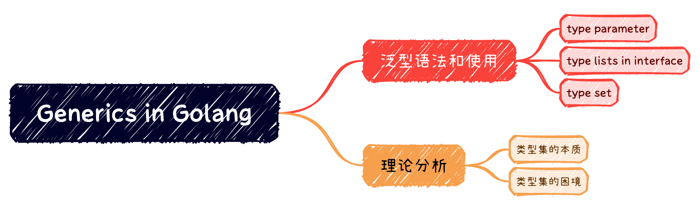

# 浅析1.18 Go的泛型



## 泛型语法和使用

### type parameter

### type set

### type list in interface

## 理论分析

- 类型参数支持基于接口的参数化多态
- 类型集使用集合论的方法拓展接口的定义，实现类型约束
- 类型推导和类型合一，简化了泛型的使用

### 类型集的本质

类型集的基本想法是设计一种能够表达某一类类型的机制，即类型的类型。用集合论来处理。因此，集合具有的问题，在类型集也存在，比如，需要保证不能出现罗素悖论。

类型集可以从ZF集合论来考虑：

- 外延公理：两个类型相等，当且仅当他们包含的类型相同
- 分类公理：给出一个类型和一个普通接口，存在同时满足他们的子集
- 并集公理：两个类型集，可以求并集
- 空集公理：存在一个不满足任何类型的类型集
- 无穷公理：存在一个包含无穷多个类型的类型集

```go

type TypeSet[T any] interface {
	*T
}

type Iface interface {
	Foo()
}

type Subset[T any] interface {
	TypeSet[T]
	Iface
}

```

### 类型集的困境

检查类型是否满足，接口所描述的类型集，是一个典型的可满足性问题。这是一个NP完全问题（Cook-Levin 定理）。

> 可满足性（英语：Satisfiability）是用来解决给定的真值方程式，是否存在一组变量赋值，使问题为可满足。布尔可满足性问题（Boolean satisfiability problem；SAT ）属于决定性问题，也是第一个被证明属于NP完全的问题。

> Cook–Levin理论或者Cook理论是有关计算复杂度理论的一个定理。它证明了布尔可满足性问题（SAT 问题）是NP完全问题。即：
> 一个布尔方程式是否存在解，这个问题本身是一个NP问题；
> 任何其他NP问题都可以在多项式时间内被一决定型图灵机归约成这个问题。

因此，在编译期间，执行类型检查，如果不对规则加以限制，将在某些情况下，极大的增加编译时间。

```go

type Constraint interface {
	ConstraintA | ConstraintB // 并集
	ConstraintMethodC() // 交集
}

```

### 并集元素中不支持包含具有方法集的参数

而Go 1.18的类型集设计，并不是完备的，有些类型集无法表示。例如：

- 不支持类型参数
- 并集元素中，不能包含具有方法集的参数。举例来说，不能支持写出一个类型，涵盖了字符串，或者可以字符串化的类型的总和：

```go
type Stringish interface {
	~string | fmt.Stringer // ERROR: cannot use fmt.Stringer in union
}
```

### 不支持方法的类型参数

```go

type X[U any] struct {
	u U
}

func (x X[U]) Foo(v any){} // OK
func (x X[U]) Bar[V any](v V){} // ERROR: methods cannot have type parameters

```

主要是运行时的类型断言，导致语言设计问题。编译无法提前感知，是否要生成对应的类型方法

```go

func f(x any) {
	if _, ok := x.(interface{ Bar(int) }); ok {
		// ...
	}
}
```

编译器无法知道是否给X生成Bar(int)方法。

### comparable不支持空接口

type parameter对comparable的定义：所有可比较类型的结合（The type set of the comparable constrain is the set of all comparable types.）因此空接口应该属于comparable，但实际不是。

这样就导致在容器类的不能使用any


```go
type P map[any]struct{} // OK
type R[T comparable] may[T]struct{} // OK
type Q[T any] map[T]struct{} // ERROR: incomparable map key type T
```

### 不支持高层的泛型机制

- 特化
- 元编程
- 柯里化
- 非类型类型参数
- 运算符方法

## 阅读资料

- [Go 1.18 中的泛型【PPT】](https://changkun.de/research/talks/generics118.pdf)

- [Featherweight Go【论文】](https://arxiv.org/abs/2005.11710)

- [面试官提问三个Go接口的概念，10年gopher竟无言以对](https://blog.csdn.net/RA681t58CJxsgCkJ31/article/details/124957863)

- [一文读懂Go泛型设计和使用场景](https://jincheng9.github.io/post/go-generics-best-practice/)

- [Go泛型语法又出“幺蛾子”：引入type set概念和移除type list中的type关键字](https://tonybai.com/2021/04/07/go-generics-use-type-sets-to-remove-type-keyword/)

- [对 Go 语言的综合评价](https://www.yinwang.org/blog-cn/2014/04/18/golang)

- [为什么 Go 语言没有泛型(版本1)](https://draveness.me/whys-the-design-go-generics/)

- [GO编程模式 ： 泛型编程](https://coolshell.cn/articles/21615.html)

- [Go 1.18 泛型全面讲解：一篇讲清泛型的全部](https://segmentfault.com/a/1190000041634906)
