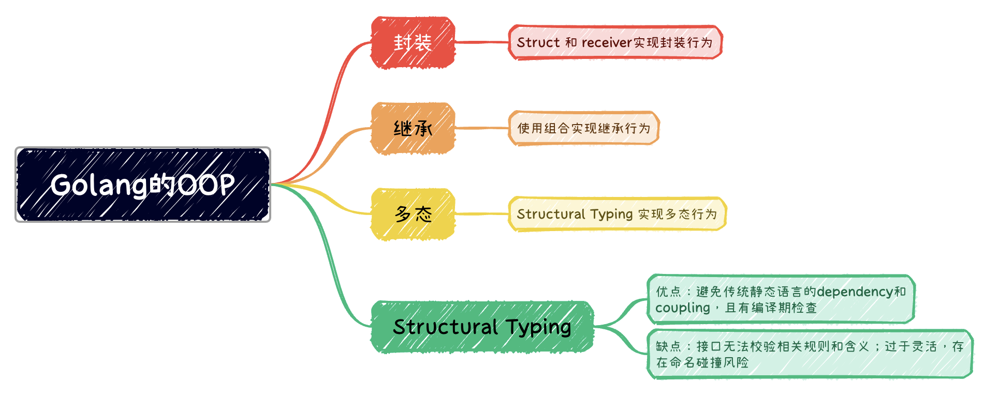

# OOP



## 用 Struct 实现封装行为

简单来说，用类型隐藏实现细节，数据仅能通过导出的方法来访问和操作，即所谓的封装。Go中的Struct类型，有类似的抽象能力。

``` go
type Point struct {
	Name string
	x, y float64
}

func (p Point) Distance() float64 {
	return math.Sqrt(p.x * p.x + p.y * p.y)
}

```

所谓的方法，并没有放在struct内部，而是通过 receiver 参数和 struct 联系在一起。

## 用组合实现继承的行为

``` go
type Animal struct {
	Name string
	mean bool
}

type Cat struct {
	Basics Animal
	MeowStrength int
}

type Dog struct {
	Animal
	BarkStrength int
}

```

结构体Animal具有其他结构体的共同属性。结构体Cat和Dog的声明基于Animal。变量、结构体、成员和函数的第一个字母大小写决定了访问权限。大写则公共，外部可以使用；小写则私有，外部不可用。故除了mean，其他成员都是公共的。

组合可匿名，如Dog结构体，也可以具名，如Cat中的Basics。

结构体对应的方法：

``` go
 func (dog *Dog) MakeNoise() {
	barkStrength := dog.BarkStrength
	if dog.mean == true {
		barkStrength = barkStrength * 5
	}
	for bark := 0; bark < barkStrength; bark++ {
		fmt.Printf("BARK")
	}

	fmt.Println("")
}

func (cat *Cat) MakeNoise() {
	meowStrength := cat.MeowStrength
	if cat.Basics.mean == true {
		meowStrength = meowStrength * 5
	}
	for meow := 0; meow < meowStrength; meow++ {
		fmt.Printf("MEOW")
	}

	fmt.Println("")
}
```

## 用Structural Typing 接口实现多态行为

任何实现接口类型的类型，都可以看做该接口的类型。

```go
type AnimalSounder interface {
	MakeNoise()
}

func MakeSomeNoise(animalSounder AnimalSounder) {
	animalSounder.MakeNoise()
}

func main() {

	myDog := &Dog{
		Animal{
			"Rover",
			true,
		},
		2,
	}

	MakeSomeNoise(myDog)

	myCat := &Cat{
		Basics: Animal{
			Name: "Julius",
			mean: true,
		},
		MeowStrength: 3,
	}

	MakeSomeNoise(myCat)
}

```

Structural Typing 意味着具有接口声明的结构的类型，都符合此类型，也就是通过接口实现多态行为。

## Go的 Structural Typing 或 Duck Typing的问题

### 接口要求

所谓Go语言接口，就是不用显示声明类型T，实现了接口I，只要类型T的公共方法满足接口I的要求，就可以把类型T用到接口I的地方，学名叫 Structural Typing，可以看做静态的Duck Typing。主流工业语言中，TypeScript的类型也是 Structural Typing，主要原因是受JavaScript的影响，不得不如此。其他语言，如C++，Java中类型与此有本质区别。

所谓接口，通俗的说，就是一个协议，规定了一组成员或者行为。实际上，接口很有隐含的要求，不只是行为或者方法，还隐含规定了方法的复杂度要求，例如返回元素个数的接口，可能隐含了O(1)时间返回的要求，这样调用就不用担心性能问题。更进一步，接口可能需要保证行为特征。

发散一下，C++的STL的concept对类型的约束，有明确的要求：
- 类型所必须支持的操作
- 操作的语义
- 操作的时间或空间复杂度
也就是concept对复杂度有明确要求，而不是当做实现细节。比如，用数组实现栈（stack），每次加入元素就需要把现有元素后移，向栈加入新元素具有线性时间的复杂度，而栈要求，这个应该是常数。无法迅速的进栈和入栈的栈，不是真正的栈。

这是STL高效之源，在设计上就保证了效率。通过模版等技巧，在支持泛型，对运行性能影响很小。而在其他语言，可能不能高效实现，不如Java的泛型，实现通用的容器，就有性能损耗。也许不大，但在高性能场景，就不满足要求。

对于接口，我们有类似concept的要求。

### Go的接口问题

Go的Duck Typing有一个问题，接口是人设计出来的，而不是自然发生的。Duck Typing只从表面（成员名，参数数量和类型等等）去理解接口，并不关心接口的规则和含义，也就是无法检查。例如：

```go
interface IPainter {
	void Draw() // 画画
}

interface ICowBoy {
	void Draw() // 掏枪
}

```

英语中Draw具有画画和掏枪两种含义，所以画家Painter和牛仔CowBoy都可以有Draw的行为。但二者含义不同。如果是一个画家，让他去决斗，就是去送死。Draw的语义，可以推而广之，替换为时间或者空间复杂度等，就意味着，这样设计，可能会遇到问题。

这种跟Java等语言不通的接口设计，不需要显式声明的接口（如Java Implements），存在一种可能，就是碰巧实现了某一个接口。由于不需要显式声明，这种是不确定的，就有可能存在反作用。比如，修改了一个函数以后，发现编译不过，提醒说某一个位置传递的不是某个需要的接口，且出错信息不能告知准确原因。一番debug以后，发现原因是struct不再实现之前定义的一个接口。

### 避免命名碰撞

CowBoy的Draw也行应该改名，避免使用Draw，避免命名碰撞。或者通过加前缀，如“蓝精灵命名法（Smurf Naming Convention）”，改成CowBoyDraw。

在Go中，判断是否实现接口，会用到包名、函数签名，其中函数签名包含：函数名，参数、返回值。一般来说，这种碰撞概率不大。

### 谁的责任？

接口是程序所指定的。区别是实现者显式指定，还是调用者显式指定。这样就可以区分责任：接口调用者的责任，还是实现者的责任。

但是对一个类来说，实现者永远比调用者，更清楚类的细节。对于静态语言，是现在声明该类实现了接口，很合理。
而对应动态语言来说，调用者将类作为某个接口使用，可能合理，也可能不合理，因为调用不清楚类的细节。这也正常，类本身就是隐藏细节的设计。仅仅从名字猜测接口的使用，主要是因为语言本身，无法提供类似 身份标签 这样的强制限制。显式标注的接口，可以让设计者，通过良好的设计来避免使用者误用。

当然，鸭子类型舍弃严谨类获取灵活，在易变的逻辑中，很有用。

### dependency和coupling

Go是静态语言，避免了传统静态语言的dependency和coupling，同时也在编译期做类型检查。结合了二者优点。

举例来说，有个library中有 class A，B，C，而library的用户意识到ABC有common usage pattern，在Go里面，用户可以直接定一个interface，用户项目中就可以用interface变成。libaray不需要去定义这个interface。

而在其他语言中，可能处理common usage pattern，就需要在library中定义interface，然后让A，B，C显式继承。

## Java接口设计的失误

接口不仅仅规范了协议和成员，还规范了行为特征，具体来说是算法复杂度等要求。Java类库的LinkedList的设计就有问题。

在Java类库中，ArrayList和LinkedList都实现了List接口，都有get方法，传入一个下标，就能返回对应位置的元素，但二者的复杂度不一样。前者耗时O(1)，而后者O(N)，大相径庭。

当需要实现一个方法，获取从第一个元素开始，每隔P个位置的元素，是否可以面向List接口编程呢？

如果我们依赖下标访问，外部传入LinkedList的时候，算法的时间复杂度从期望的O(N/P)，变成了O(N^2/P)。退一步讲，ArrayList中，即使选择遍历，也可以得到O(N)的效率。

Java类库的List接口就是个笑话，连Stack类都实现了List。

因此，接口不能保证行为特性，具体来说，是复杂度等特征，面向接口编程就无意义。

也就是ArrayList和LinkList虽然都可以get，从List继承，但由于二者一些算法复杂度不同，不应该这样设计。虽然可以理解为，ArrayList和LinkList是因为特性不同，对get接口实现不一样。看起来似乎是子类型之间的差异。


## 阅读资料

- [C++泛型獭祭](https://siegelwang.cn/computer_programs/PL/language_features/generic_programming/)

- [为什么我不喜欢Go语言式的接口（即Structural Typing）](http://blog.zhaojie.me/2013/04/why-i-dont-like-go-style-interface-or-structural-typing.html)


