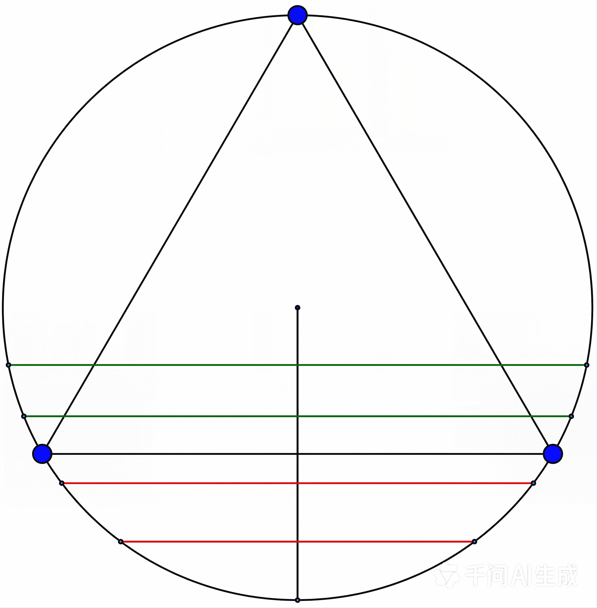

# 浅说自然语言、计算机语言和数学语言中的能指与所指

### 《给阿嬷的情书》为什么不能叫《给奶奶的情书》

我看到电影名《给阿嬷的情书》，不认识“嬷”字：“嬷”是什么意思？查了才知道，“嬷”是潮汕方言，称呼奶奶或姥姥为阿嬷。为什么不能用更通用的电影名《给奶奶的情书》呢？

故事的背景在潮汕。阿嬷是淑柔，阿公是木生，家中有三个孩子。木生为躲抓壮丁下南洋，住在南枝家的旅舍。木生在旅舍火灾中救了南枝父亲，因见义勇为入狱。失去旅舍后，南枝父女相依为命。后来木生因见义勇为去世，念及木生家中淑柔一人带着三个孩子，南枝代木生寄侨批。侨批是华侨寄回家中、附带汇款的家书。现存约 17 万份侨批档案中，广东约占 16 万件，其中潮汕地区约 10 万余件。侨批在潮汕尤其多。奶奶是全国通用的称呼，此处的情书特指侨批，《给奶奶的情书》中的情书就不一定是侨批。

“阿嬷”和“奶奶”可以表达相同的内容，但“阿嬷”承载了一方水土的历史文化，语言的微妙之处就在于此。故事中的情书写得文雅，平仄和谐。“山河万里，心中念你”，读起来琅琅上口。改成“山河阻隔，心中念你”，音韵不和谐，就差很多。

### 谁是木生？

木生去世以后，淑柔收到的侨批，是南枝以木生的身份所写。淑柔读侨批时，虽阴阳相隔，所想所念仍是木生。那么淑柔此时所想的是现实中的木生，还是她心中的木生？这两个木生不一样。现实中的木生已去世，不复存在，只剩下心中的木生。不仅淑柔心中的木生和现实生活中的木生不一样，南枝心中的木生和淑柔心中的木生也不一样。

> 情书中的木生 -> 心中的木生 -> 现实中的木生

木生去世多年，依然在淑柔和南枝心中。因此，现实中的木生即使不存在了，情书中的木生和心中的木生依旧存在，并不依赖现实中的木生。所以三者的关系可以调整为：

> 情书中的木生 -> 心中的木生    现实中的木生

使用索绪尔的语言学框架来分析：

> 能指（情书中的木生） -> 所指（心中的木生）    指涉物（现实中的木生）

### 语言是一个定义差异的系统

故事中无法找到现实中的木生。这是一个很好的语言学例子。能指无法对应现实中的指涉物时，只能指向下一个能指。就像我们查字典，所查词条的解释依赖其他词，用于解释的词又依赖更多的词，这一解释链没有终点，可以一直持续。能指指向下一个能指，永无止境。这一特性在孩子学说话的时候非常突出。孩子问一个问题，大人解释以后，孩子又能接着问；大人再解释，还有下一个问题，问题可以一直问下去。

这种依赖的存在，也表明能指自身没有独立的意义。

```
所指         所指          所指
———    ->    ———    ->    ———    ->    ...
能指         能指          能指
```


能指自身无意义，那语言有什么意义？语言的意义来自语言系统，来自不同能指之间的差异。语言定义了能指之间的差异。南枝、淑柔很难定义木生是什么，但容易区别木生和水生。鲁迅先生笔下的水生雪地捕鸟，木生一生没见过雪。

上文对比了《给阿嬷的情书》与《给奶奶的情书》。还可以替换成其他词：给阿嬷的信、给阿嬷的尺素，驿寄梅花、鱼传尺素、砌成此恨无重数。这些可替换却没有在语句中出现的词，共同构成了《给阿嬷的情书》的含义。木生之所以为木生，不是因为情书有木生，而是因为木生有情书。

### 名字即命运

重新审视所指与能指的关系。所指木生不存在了，书信的能指木生依然还在，可见能指居所所指之上，能指具有绝对的优越性。法国精神分析学家和心理学家雅克·拉康（Jacques Lacan）的火车站厕所例子：

> 一列火车驶入车站。一个小男孩和一个小女孩，他们是亲兄妹，在车厢里相对而坐，身旁就是窗户，随着火车减速停下，站台上的建筑物从窗外掠过。
> 哥哥说：看啊，我们到“女士站”了！
> 妹妹回答道：白痴！你没看见我们到“男士站”了吗？

火车站的门，如果没有门上的字，二者的物理上是一样的。因为门上有“男士”和“女士”，把一样的物理空间，割裂成了不同的“世界”。哥哥和妹妹不是因为看到了不同所指，而是因为看到不同的能指，产生的对立的认知。我们对性别的认知，是由语言构建的。孩子眼中，没有绝对的男女对立，当有了符号（能指）的世界，孩子被语言强行分流。“女士站”和“男士站”是拉康童趣而荒诞的称呼，讽刺人类：我们以为看清了现实（车站），实际上只是被门上的文字（能指）支配了。

```
能指         能指          能指
———    ->    ———    ->    ———    ->    ...
所指         所指          所指
```


我看到有人认为女主的名字“南枝”，源于王维的“红豆生南国，春来发几枝”。我觉得有些牵强，“南枝”两个字不在一起，且故事主题并非是思念。我认为“南枝”来自《古诗十九首》的第一首《行行重行行》，诗中“南枝”，且故事情节也与古诗契合。

> 行行重行行，与君生别离。
> 
> 相去万余里，各在天一涯。
> 
> 道路阻且长，会面安可知？
> 
> 胡马依北风，越鸟巢南枝。
> 
> 相去日已远，衣带日已缓。
> 
> 浮云蔽白日，游子不顾返。
> 
> 思君令人老，岁月忽已晚。
> 
> 弃捐勿复道，努力加餐饭。

木生走呀走呀走，与淑柔分离了。他去了南洋，相隔万里，天各一方。归路艰难险阻，再难相见。北方的马思念北方，依恋着北风。南方的鸟思念南方，在朝南的树枝上做窝。彼此分离时间越久，人越消瘦，感觉衣服都变大了。浮云遮住太阳，木生怎么还不回来？日夜思念，身心憔悴，一年又一年。丢开这些不说了，阴差阳错收不到信了，我还是好好吃你寄来的腊肉。

女主的名字“南枝”，决定了女主的思君令人老的命运。

---

## 计算机编程语言中的能指和所指

在计算机编程语言中，主流的工业语言通常有“类”这一概念，但能指“类”的所指在不同编程语言中有微妙差异。在编程语言的类型系统中，通常可以分为结构类型 (Structural Typing) 和标称类型 (Nominal Typing)。标称类型的“标”是指“标签/名字（Name）”，“称”是指“名称/称呼”。它的核心含义是：类型的兼容性完全取决于类型的显式名字或声明，而不是它的内部结构。

结构类型 (Structural Typing) 和鸭子类型 (Duck Typing) 在思想上是一致的：前者属于编译期的静态类型系统，后者属于运行期的动态类型系统，类似 TypeScript 和 JavaScript 的区别，TypeScript 需要编译。

在进行类型比较时，结构类型通过类型的结构来判断是否有差异，标称类型通过类型名称来判断是否有差异。C、C++ 和 Java 主要使用标称类型 (Nominal Typing)，TypeScript、Golang、OCaml、Haskell 主要使用结构类型 (Structural Typing)。在同一个编程语言中，也可以同时采用二者，例如对 Class 使用标称类型 (Nominal Typing)，对 Object 使用结构类型 (Structural Typing)。具体实现使用标称类型 (Nominal Typing)，保证安全和清晰；抽象接口使用结构类型 (Structural Typing)，保证灵活性，平衡类型安全和开发效率。

### TypeScript 的标称类型 (Nominal Typing)

在 TypeScript 中，类（Class）带有私有属性时是标称的，接口（interface）是结构的。私有属性是类 A 的内部实现，如果允许另一个类 B 赋值给 A，则意味着类 A 的内部私有属性可以被 B 替代，破坏封装性。因此，有私有属性时，需要采用标称类型的逻辑，只认声明，不认结构。

```TypeScript
class Dog {
  private name: string;
  constructor(name: string) {
    this.name = name;
  }
}

class Cat {
  private name: string; // 结构上与Dog一致
  constructor(name: string) {
    this.name = name;
  }
}

let myDog: Dog = new Dog('dog');
myDog = new Cat('cat'); // 编译报错
// Type 'Cat' is not assignable to type 'Dog'.  Types have separate declarations of a private property 'name'.

```

### TypeScript 的结构类型 (Structural Typing)

接口（interface）是结构类型，只看结构是否一致。

```TypeScript
interface PointInterface {
  x: number;
}

class PublicPoint {
  x = 0;
}

// 完全兼容，因为它们的结构完全一样，都只有一个数字类型的 x
const p: PointInterface = new PublicPoint();

```

### TypeScript 的结构类型 (Structural Typing) 带来的特性

因为 TypeScript 选择了结构类型 (Structural Typing)，所以会出现看似反常的情况：允许子类型变量引用父类实例。通常在 Java、C++ 中，父类型变量可以指向子类型实例，以实现多态；而这里是子类型变量引用父类型实例。


```TypeScript
class Animal {
  feet: number = 2;
}

class Duck extends Animal {}

let myDuck: Duck = new Animal(); // 子类型引用父类型实例，编译通过

```

有时候需要强行让两个结构相同的类型不兼容，可以使用专门的办法：标称化技巧（Nominal Typing Trick）或类型烙印（Type Branding）。

```TypeScript
// 标称的美元类型。& 是交叉类型 (Intersection Type)，表示交集
type USD = number & {__brand: 'USD'};

// 标称的人民币类型
type CNY = number & {__brand: 'CNY'};

let money = 100 as USD;
money = 200 as CNY; // 编译报错
// Type 'CNY' is not assignable to type 'USD'. Type 'CNY' is not assignable to type '{ __brand: "USD"; }'. Types of property '__brand' are incompatible.
```

不同编程语言中，相同的能指“类型”具有不同的所指，有结构类型 (Structural Typing)，也有标称类型 (Nominal Typing)，或者二者都有。编程语言直接参与构成工程本身。我觉得编程语言不是工具，而是工程的材料。所指的微妙差异，在工程设计上具有深远的影响。

维特根斯坦说“语言的边界就是思想的边界”。在不同技术领域的工程师之间，如前端和后端，思维方式具有很大差异。须知：你说的类，是我说的类吗？

---

## 数学中的能指和所指

AI 有 3 大数学基础：线性代数、微积分和概率论。AI 中有些思想很值得学习。例如 AI 训练常用的最大熵原则，通俗来说，就是不带偏见地开始训练，尝试各种可能性，初始阶段不贴标签。然而概率论中某些概念的定义，在历史上说不清、道不明。常用术语“随机”，这一能指的所指就不明确。考察以下问题：

> 在单位圆中，随机画一根弦，弦长大于根号 3 的概率是多少？

考虑圆的对称性，有 3 种解法：

### 解法一：端点随机

固定一个端点，另一个端点在圆周上随机移动，概率是 `1/3`。


### 解法二：距离随机

固定一个方向，在与其垂直的直径上，随机选一个点作为弦的中点，概率是 `1/2`。




### 解法三：中点随机

在圆内随机选一个点作为弦的中点，通过计算面积，概率是 `1/4`。


### 无穷多个概率

既然不同解法能得到不同的值，能否构造一种通用的取弦方式，通过调节参数，使概率成为 0 到 1 之间的任一实数？可以通过同心圆控制法构造。


```
P = arcsin(1/2R) / arcsin(1/R)

R = 1 时，得到端点随机的概率
P1 = arcsin(1/2) / arcsin(1/1) = 1/3

R 趋近 ∞ 时，得到距离随机的概率
P2 = arcsin(1/2R) / arcsin(1/R) = 1/2

```

### 概率论公理化


同一个数学问题，具有 `1/3`、`1/2`、`1/4` 这三个不同的答案。端点随机、距离随机和中点随机，对应的随机概率不一样。“随机”这一能指，所指不一样。既然任一概率都成立，哪一个概率才是正确的概率呢？问题中只要求随机，没有说明“随机”这一能指的所指，也没有说明取弦的操作。因此，所有的概率都正确；或者说，正确与否并无意义。只有规定了随机的方式，概率才有意义。

法国数学家约瑟夫·贝特朗（Joseph Bertrand）在 1889 年提出的几何概率问题，在数学史上称为贝特朗悖论（Bertrand's Paradox）。

直到柯尔莫哥洛夫（Andrey Kolmogorov）在 1933 年提出概率论公理化体系，使用西格玛代数（σ-algebra）和测度论，才解决了贝特朗悖论（Bertrand's Paradox）。贝特朗悖论（Bertrand's Paradox）的 3 个答案都是对的，也都是错的。说它们都是对的，是因为不同的“随机”在不同的 σ-代数和测度下逻辑自洽。说它们都是错的，是因为这 3 种解法误以为 3 个不同的概率空间是同一个问题。

计算贝特朗悖论的概率之前，需要人为地规定西格玛代数（σ-algebra）。也就是需要人为地选择一个概率模型，然后利用数学工具计算概率。概率如何得来取决于人的建模选择；弄清概率分布以后，才能计算概率。

能指的所指，由人决定。

---

## 生活中能指和所指

在电影语言、计算机编程语言以及数学语言中，同样的能指，所指不尽相同。可见能指与所指并非紧密相连，而是割裂的。能指永不停歇地指向下一个能指，而所指不停地在能指下滑动。既然意义不确定，语言怎么用来沟通呢？语言有锚定点，锚定以后，具有相对稳定的意义。

在物理学中，如何定义能量？能量是物体做功的能力。比如，能把一个箱子向上移动十米，说明它具有做功的能力。通过对物体做功来定义能量，这是典型的操作性定义。这样定义以后，还可以追问：能量的本质是什么？这就是在追问能量的本质性定义。实际上，我们即使不清楚能量的本质定义，也不妨碍科学家使用能量这一能指；而对能量这一能指的所指的诠释，促使了科学的进步，比如爱因斯坦著名的质能方程。因为大家都可以去操作、去测量、去验证，从而可以证伪科学结论，通过这一方式锚定能量这一能指的意义。

不仅在物理学中，在其他学科中，操作性定义也非常重要。比如大家常用的词“焦虑”，来自弗洛伊德的精神分析。在心理学中，焦虑需要人填写专门的表格来衡量，也就是用这一测量操作来衡量是否焦虑。在日常生活中，要把话说清楚，操作性定义也非常有用：先做什么，再做什么。清晰的操作流程比抽象的概念更能让听者理解。

说操作流程，会让语言有更准确的意义。我有一次在家和孩子玩数独游戏，做完以后，和孩子一起检查：横着数数，1、2、3、4；然后竖着数数，1、2、3、4。数到重复的数字，就用橡皮擦去，再试着填写其他数字。孩子玩得很开心。后来孩子妈妈和孩子玩，检查的时候说“这里错了”，说了一两次，孩子就有情绪了。数独中有重复数字，当然是错误的。但错误的内涵很广泛，空着不填是不是错误？不仅如此，孩子心中的“错误”，可能关联着课堂上老师的批评。这个词在孩子心中天然带有贬义，自然就容易引发情绪。说者无意，听者有心。也就是说，你说的错误，是我心中的错误吗？我觉得这是一个很难的问题：同一个能指，在不同的人心中的所指，是一样的吗？如果一样，那为什么一样？如果不一样，那又是什么呢？我说我家丫头很白，可能是相对她哥哥而言很白。听者心中的白，可能是某一个明星的白。我说的白和你说的白，是同一个白吗？AI 理解的白，是人类的白吗？

我们复盘一个问题的时候，常说对事不对人。先不说这能否做到，实际上也未必合理。我们既要对事，还要对人。和孩子玩游戏，就要考虑孩子。大人犯过很多错误，也无法避免被人指出错误；大人知道金无足赤、人无完人，孩子却不一定知道。心中的孩子就是孩子，就需要蹲下来和孩子说话。

不是因为有了孩子而成为父母，而是因为成为了父母，才有了孩子。

## 六经责我开生面

Claude Code 源于信息论之父克劳德·香农（Claude Shannon），Anthropic 的创始人团队致敬香农。而 Anthropic 具有哲学和物理学内涵：Anthropic Principle，也称人择原理。人择原理的核心观点：宇宙之所以是现在的样子，是因为如果他不是现在的样子，不会有人类站在这里来观察他。

宇宙的物理定律和常数，似乎没精确调整过，刚好允许智慧生命人类的存在。Anthropic 这一名字是一种宣言：AI应该服务于人。我想AI不应该是做像人的AI，替代人的AI，而是服务于人的AI。


