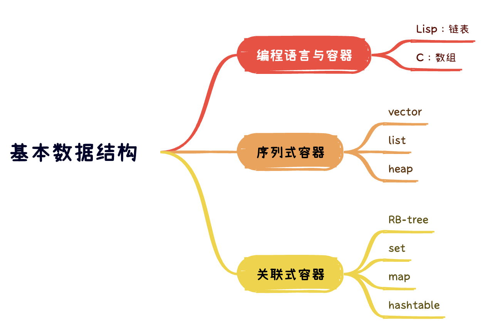

# 浅析基本数据结构

#### 2023/07/28



> 容器，置物之所也。

> 研究特定的排列结构，以利于搜索或排序或其他目的，这一专门学科，称之为数据结构（Data Structure）。因此，几乎特定的数据结构，都是为了实现特定的算法。

> 根据数据在容器的排列特性，把数据结构分为序列式（sequence）和关联式（associate）两种。

> 所谓序列式容器，其中元素都可排序（ordered），但未必有序（sored），如：array，vector，list等等。

> 所谓关联式容器，主要有两大类，set集合和map映射表。每个元素有一个键值（key）和一个实值（value），容器内部（可能是BR-tree或hash-table），按照键值大小，以某种特定规则将这个元素放到适当位置。关联式容器内部结构一般是 balanced binary tree（平衡二叉树），以满足良好的搜索效率。

## C语言和Lisp的两种基本容器：数组和链表

Lisp 诞生的时候，设计者们没有一下子想出一种好的语法，所以干脆用括号，把语法树的结构全部括起来，一个不漏。自己想一下，如果要表达一棵“树”，最简单的编码方式是什么？不就是用括号把每个节点的“数据”和“子节点”都括到一起么。Lisp 的设计者，也如是想。这种表达方式，就是“S表达式”（S即symbolic）。

这样 Lisp 语法就有以下优点：

- 首先，所有结构用括号括起来，避免了其他语言中的歧义，无需关注所谓的运算符优先级；

- 其次，“操作符”如加号等，也放到表达式最前面，使得算术运算和函数调用，语法统一；

与S表达式类似，就有了典型的Lisp基础数据结构列表（list），以及cons、car、cdr等函数。从数据结构来看，Lisp所谓的list就是一个单向列表。必须依赖上一个节点，才能访问下一个，而每一次“间接寻址”都需要消耗时间。在Lisp的list中，形如 length 之类的函数，时间复杂度是O(n)。当然有些办法能绕过这些不足。

但List的拓扑结构，注定不适合用来支持所有的事情。很多的性能问题，也没法解决。数据结构有些问题，是“物理”和“本质”的存在，不是换个风格或者写法，就可以消失。

R. Kent Dybvig的先进的Scheme编译器 Chez Scheme，内部的数据结构就不是list，而是被转化数组。编程实践表明，数组比起链表，在适合的场景，性能会有大幅度的提升。因此，什么时候用数组，什么时候用链表，是一门艺术。在数据结构中，也有跨越二者的存在，例如用数组实现的完全二叉树（complete binary tree）。以array来表述tree的方式，称之为隐式表示（implicit representation）

《Unix编程艺术》中说：“Unix程序员较之其他人对于OO抱有更大的怀疑态度。原因之一是多样性法则。OO被说成是软件复杂性问题唯一正确的解决之道，这未免令人生疑。”

我觉得对于数组和链表，也是如此。只用数组，或者只用链表，违背了多样性法则。话说有二元对立就有意识形态，盲目排外，有利于宣传意识形态，却不利于编程。

就像算法的复杂度分析，可以不依赖具体计算机实现。一些算法问题，早在计算机诞生之前就有存在，比如大名鼎鼎的快速傅立叶变换，高斯就已经在使用。相应的数据结构，有其本质困难和意义，不依附于具体语言。无论是C语言，还是Lisp，其中的数据结构，也是超越语言的存在。

因此，C语言这样务实的语言，有数组，也能通过已有语言元素去构造List，还能构造其他数据结构。方能处理尘世中万千问题，并在编程语言的领域，开枝散叶，不断的进化。甚至吸收Lisp的优秀特性。

## list

Linux 内核中，自己实现了双向链表，见[Linux list 源码](https://github.com/torvalds/linux/blob/master/include/linux/list.h)。双向链表在内核使用非常广泛，在2023的 v6.5.1 版本中，`list_head`有“Referenced in 4563 files”。其主结构体如下
见：[linux/types.h](https://github.com/torvalds/linux/blob/master/include/linux/types.h)
``` c
struct list_head {
	struct list_head *next, *prev;
};
```

这是一种侵入式链表（Intrusive list）。侵入式链表并不在节点内保持数据，而是仅仅包含指向前后节点的指针，以及节点数据的指针。这样使得链表不需要考虑节点数据类型。

常见的双向链表结构如下：

``` c

struct GList {
  gpointer data;
  GList *next;
  GList *prev;
};

```

Linux 双向链表的删除：

``` c
/*
 * Delete a list entry by making the prev/next entries
 * point to each other.
 *
 * This is only for internal list manipulation where we know
 * the prev/next entries already!
 */
static inline void __list_del(struct list_head *prev, struct list_head *next)
{
	next->prev = prev;
	prev->next = next;
}

#define LIST_POISON1  ((void *) 0x00100100)
#define LIST_POISON2  ((void *) 0x00200200)
/**
 * list_del - deletes entry from list.
 * @entry: the element to delete from the list.
 * Note: list_empty() on entry does not return true after this, the entry is
 * in an undefined state.
 */
static inline void list_del(struct list_head *entry)
{
	__list_del(entry->prev, entry->next);
	entry->next = (struct list_head*)LIST_POISON1;
	entry->prev = (struct list_head*)LIST_POISON2;
}
```

### Linus的利用二级指针删除单向链表

删除链表节点的时候，需要把前一个节点的next指针指向下一个节点的地址，怎么表示前一个节点的next指针呢？

最直接的写法是利用前一个节点，并获取他的next指针：`prePointer->next`。但这样会遇到一个特殊的情况，当删除的节点是第一个节点的时候，第一个节点没有前一个节点，需要针对这种特殊的情况，做判断，第一个节点的next指针就是`head`。

常见写法：

``` c
typedef struct node
{
    struct node *next;
    // ...
} node;

typedef bool (*remove_fn)(node const *v);

// Remove all nodes from the supplied list for which the
// supplied remove function returns true.
// Returns the new head of the list.
node* remove_if(node *head, remove_fn rm) {
    for (node * prev = NULL, *curr = head; curr != NULL;)
    {
        node * const next = curr->next;
        if (rm(curr))
        {
            if (prev)
                prev->next = next;
            else
                head = next;
            free(curr);
        }
        else
            prev = curr;
        curr = next;
    }
    return head;
}
```


我们反思一下，无论是`head`还是`prePointer-next`，目的都是一样的，就是前一个节点的next指针。有什么办法统一处理呢？

回到他们类型自身，二者类型一致，都是指针，我们用一个变量`pp`来保存他们的地址即可。当`pp`保存的是`prePointer->next`的时候，就是普通节点的上一个节点的next。当`pp`保存的是head的时候，就是head。`pp`是指向指针的指针，二级指针，`*pp`就可以统一表示以上普通情况和头节点的情况。

如果`pp`是头指针的地址，`*pp`就代表了头指针，其值就是第一个节点的地址。而`**pp`代表的是第一个节点，此时类型不在是指针。

还可以从另一个角度来理解：变量名的意义是复制copy一个值。常规做法，`cur = head->next`，仅仅是把指针`head->next`的值copy给了指针cur，使得cur可以访问链表的下一个节点。
而声明为二级指针的cur，`*cur`不再是`head->next`的copy值，而是`head-next`变量的别名，此时他有其对应变量的读写权。

``` c

void remove_if(node **head, remove_fn rm)
{
    for (node** curr = head; *curr;) {
        node *entry = *curr;
        if (rm(entry))
        {
            *curr = entry->next;
            free(entry);
        }
        else
            curr = &entry->next;
    }
}
```

总而言之，链表的删除操作的操作对象都是指针，所以从类型上来看，可以用二级指针来处理指针。就像变量的指针，传递给函数，函数就可以操作变量一样。所谓操作，就是其读写权。所以链表的删除，变量是指针，就需要二级指针来获得其读写权，获得了外部的变量和内部权限，节省了一个内部的临时变量。从本质来看，单向链表的删除操作，只是把之前存储前节点的指针的值，替换为下一个节点的地址。这里其实可以不需要“之前存储的【节点】”，而仅仅需要“之前存储的【节点的指针】”。

单向链表的拓扑结构：


删除普通节点，只需要把指向下一个节点的指针，赋值给当前节点的指针：


删除头部节点的时候，也是一样的，把指向下一个节点的指针，赋值给当前节点的指针。


#### Linus 原文

“At the opposite end of the spectrum, I actually wish more people understood the really core low-level kind of coding. Not big, complex stuff like the lockless name lookup, but simply good use of pointers-to-pointers etc. For example, I’ve seen too many people who delete a singly-linked list entry by keeping track of the “prev” entry, and then to delete the entry, doing something like。（在这段话的最后，我实际上希望更多的人了解什么是真正的核心底层代码。这并不像无锁文件名查询（注：可能是git源码里的设计）那样庞大、复杂，只是仅仅像诸如使用二级指针那样简单的技术。例如，我见过很多人在删除一个单项链表的时候，维护了一个”prev”表项指针，然后删除当前表项，就像这样）”

``` c
if (prev)
    prev->next = entry->next;
else
    list_head = entry->next;
```

and whenever I see code like that, I just go “This person doesn’t understand pointers”. And it’s sadly quite common.（当我看到这样的代码时，我就会想“这个人不了解指针”。令人难过的是这太常见了。）

People who understand pointers just use a “pointer to the entry pointer”, and initialize that with the address of the list_head. And then as they traverse the list, they can remove the entry without using any conditionals, by just doing a “*pp = entry->next”. （了解指针的人会使用链表头的地址来初始化一个“指向节点指针的指针”。当遍历链表的时候，可以不用任何条件判断（注：指prev是否为链表头）就能移除某个节点，只要写)

``` c
*pp = entry->next
```

So there’s lots of pride in doing the small details right. It may not be big and important code, but I do like seeing code where people really thought about the details, and clearly also were thinking about the compiler being able to generate efficient code (rather than hoping that the compiler is so smart that it can make efficient code *despite* the state of the original source code). （纠正细节是令人自豪的事。也许这段代码并非庞大和重要，但我喜欢看那些注重代码细节的人写的代码，也就是清楚地了解如何才能编译出有效代码（而不是寄望于聪明的编译器来产生有效代码，即使是那些原始的汇编代码））。

### SGI STL list

list和数组不同，不能用普通的指针作为迭代器，list的节点不保证在空间上连续存在。因此，list迭代器必须有能力指向下一个节点。SGI list是一个双向链表（double linked-list），迭代器支持前移、后移，提供的是 Bidirectional Iterators。

正因为list节点不保证在空间上连续存在，可以零散分布，因此插入（insert）和接合（splice），不会造成迭代器失效。数组则不成立，数组的插入和接合操作，可能造成内存重新分配，原来的迭代器失效。list因此对空间的运用，很精准，不浪费，对元素插入和移除，永远是常数时间，得益于此，很数组一样，list也很常用。

SGI list 节点（node）的结构。list本身和list节点是不同的结构，需要分开设计。

``` cpp
// 双向链表
template<class T>
struct __list_node {
    typedef void* void_pointer;
    void_pointer prev;
    void_pointer  next;
    T data;
};
```

#### list 的迭代器

``` cpp
template<class T, class Ref, class Ptr>
struct __list_iterator {
    typedef __list_iterator<T, T&, T*> iterator;
    typedef __list_iterator<T, Ref, Ptr> self;

    typedef bidirectional_iterator_tag iterator_category;
    typedef T value_type;
    typedef Ptr pointer;
    typedef Ref reference;
    typedef __list_node<T>* link_type;
    typedef size_t size_type;
    typedef ptrdiff_t difference_type;

    link_type node; // 指向list的节点

    // constructor
    __list_iterator(link_type x) : node(x) {}
    __list_iterator() {}
    __list_iterator(const iterator& x) : node(x.node) {}

    bool operator==(const self& x) const { return node == x.node; }
    bool operator!=(const self& x) const { return node != x.node; }
    // 以下对迭代器取值（dereference），取的是节点的数据值
    reference  operator*() const { return (*node).data; }
    // 以下是迭代器的成员存取运算子（member access）的标准做法
    pointer operator->() const { return &(operator*()); }

    // 对迭代器累加1，就前进一个节点
    self& operator++() {
        node = (link_type)((*node).next);
        return *this;
    }
    self operator++(int) {
        self tmp = *this;
        ++*this;
        return tmp;
    }
    // 对迭代器累减1，就后退一个节点
    self& operator--() {
        node = (link_type)((*node).prev);
        return *this;
    }
    self operator--(int) {
        self tmp = *this;
        --*this;
        return tmp;
    }
};

```

### SGI list 的数据结构

SGI list不仅仅是一个双向链表，而是一个环状双向链表。因此，只需要一个指针，就可以遍历整个链表。

刻意在环状链表尾端加上一个空白节点，node 就符合 STL 规范的前闭后开区间的要求


## vector

## 堆（heap）

### 应用

许多应用程序需要处理有序元素，但不一定要求他们全部有序，或是不一定要一次就将他们排序。很多情况下，收集一些元素，处理当前最大元素，然后再收集更多元素，再处理最大元素。比如，电脑中运行多个程序，为每个应用分配一个优先级，并总是处理优先级最高的事件。例如，手机来电优先级，比手机游戏优先级高。

处理以上情况，一个合理的数据结构，应该支持两种基本操作：删除最大元素，插入元素。

这种有序的操作，能很自然的就可以实现排序，比如，插入一列元素，然后删除其中最小元素，就可以实现排序。堆排序就是基于优先队列实现。

### 概述

如果用list作为优先队列（priority queue）底层机制，元素插入可以常数时间，但如果要找极值，需要对整个list线性扫描。

如果变通一下，让元素插入的时候先排序，找极值就简单很多，但插入只有线性表现。

有没有插入和找极值，效率都不错的数据结构呢？

可以用完全二叉树（complete binary tree），即 binary heap 除了最底层叶子节点之外，都是填满的。且叶子节点从左至右，不得有空隙。


### 实现

由于完全二叉树没有空隙，我们就可以用array来存储所有节点。将array的索引0保留，当完全二叉树的某个节点位于i，其左节点必位于2i，右节点位于2i+1。反过来推断，i的父节点，必位于`floor(i/2)`。

通过这个简单的规则，就可以用array实现出 complete binary tree。以array来表述tree的方式，称之为隐式表示（implicit representation）


一个 array 和一组 heap 算法（插入、删除、取极值，将数据排列为 heap），就可以实现完全二叉树。然后通过完全二叉树实现 heap。

heap 可以分为 `max-heap` 和 `min-heap`，`max-heap`的最大值在根节点，每个节点的值大于或等于子节点。`min-heap`反之。

### push head 算法

新加入的元素，放到最下一层作为叶子节点，填补 array 从左至右的第一个空格，即在 array 的末尾。

为了满足 `max-heap` 条件，每个节点的值，大于或等于子节点的值。需要执行上溯程序：新节点的值大于父节点，就父子交换位置。一直上溯，直到不需要交换，或者到了根节点。

``` cpp
// heap
// heap push 函数
template <class RandomAccessIterator, class Distance, class T>
inline void __push_heap(RandomAccessIterator first, Distance holdIndex,
                        Distance topIndex, T value) {
    Distance parent = (holdIndex - 1) / 2; // 找到父节点
    while (holdIndex > topIndex && *(first + parent) < value) {
        // 未到达顶端，且父节点小于新值（不符合heap次序）
        // 此处实现的为 max-heap，大者为父
        *(first + holdIndex) = *(first + parent); // 令洞值为父值
        holdIndex = parent; // percolate up，调整洞号，向上提升至父节点
        parent = (holdIndex - 1) / 2; // 新洞的父节点
    } // 持续至顶端，到满足 heap 次序为止
    *(first + holdIndex) = value; // 令洞为新值，完成插入操作
}

template <class RandomAccessIterator, class Distance, class T>
inline void __push_heap_aux(RandomAccessIterator first,
                            RandomAccessIterator last, Distance*, T*) {
    // 根据 implicit representation heap 的结构特性：新值必置于底部
    // 容器的最尾端，此即第一个洞号：(last - first) -1
    __push_heap(first, Distance((last - first) - 1),Distance(0),
                T(*(last - 1)));
}

template <class RandomAccessIterator>
inline void push_heap(RandomAccessIterator first,
                      RandomAccessIterator last) {
    // 注意，此函数调用时，新元素应已置于底部容器的最尾端
    __push_heap_aux(first, last, distance_type(first), value_type(first));
}
```

### pop heap 算法

`max-heap`最大值，必然在根节点。pop取走根节点。为了满足 complete binary tree 条件【满树，且父节点必大于或等于子节点。此时不是满树】，必须将最下一层【叶子节点】的最右边的叶子节点拿掉【为什么是最右边的叶子节点呢？直接把根节点的子节点上移可以不？不行，因为这样不满足满树的要求。最容易满足满树要求，就是去最右边的叶子节点，填到根节点，但这样不满足顺序要求，就需要调整顺序】。接下来，把这个节点调整到适当位置即可。

调整顺序的算法：执行下溯（percolate down）程序，将根节点填入最右边的叶子节点，在将其和两个子节点比较，与较大子节点调整位置。依此类推，直到此叶子节点值大于左右两个子节点，或到达叶子节点为止。

注意：`pop_heap`之后，最大元素只是被置于容器最尾端，并未取走。如果要取值，需要执行容器（vector）的 `back()`操作函数，如果是移除，则需要执行 `pop_back()`操作函数。

``` cpp
// pop heap
template <class RandomAccessIterator, class Distance, class T>
inline void __adjust_heap(RandomAccessIterator first, Distance holdIndex,
                          Distance len, T value) {
    Distance topIndex = holdIndex;
    Distance secondChild = 2 * holdIndex + 2; // 洞节点之右子节点
    while (secondChild < len) {
        if (*(first + secondChild) < *(first + (secondChild - 1))) {
            // 比较洞节点之左右两个子值，然后以 secondChild 代表较大子节点
            secondChild--;
        }
        // Percolate down：令较大子值为洞值，再令洞号下移至较大子节点处
        *(first + holdIndex) = *(first + secondChild);
        holdIndex = secondChild;
        // 找出新洞节点的右子节点
        secondChild = 2 * (secondChild + 1);
    }
    if (secondChild == len) { // 没有右子节点，只有左子节点
        // Percolate down：令左子值为洞值，再令洞号下移至左子节点处
        *(first + holdIndex) = *(first + (secondChild - 1));
        holdIndex = secondChild - 1;
    }
    // 将欲调整值填入目前洞号里。注意，此时肯定满足次序特性
    // 侯捷说：下面这一句，可以改成： *(first + holdIndex) = value;
    __push_heap(first, holdIndex, topIndex, value);
}

template <class RandomAccessIterator, class T, class Distance>
inline void __pop_heap(RandomAccessIterator first,
                       RandomAccessIterator last,
                       RandomAccessIterator result,
                       T value, Distance*) {
    *result = *first; // 设定尾值为首值，于是尾值为欲求之结果
    // 稍后可以再以底层容器之 pop_back() 取出尾值
    // 以上欲重新调整 heap，洞号为0（即树根处），欲调整值为 value（原尾值）
    __adjust_heap(first, Distance(0), Distance(last - first), value);
}

template <class RandomAccessIterator, class T>
inline void __pop_heap_aux(RandomAccessIterator first,
                           RandomAccessIterator last, T*) {
    // 跟进 implicit representation heap 的次序，pop操作的结果
    // 应为容器底部的第一个元素。因此，首先设定欲调整值为尾值，然后将首值调至尾节点（所以以上迭代器result设为 last - 1）【更详细理解，见文章】
    // 然后重整 [first, last -1)，使之重新成为一个合格的 heap
    __pop_heap(first, last - 1, last - 1, T(*(last - 1)), distance_type(first));
}

template <class RandomAccessIterator>
inline void my_pop_heap(RandomAccessIterator first,
                     RandomAccessIterator last) {
    __pop_heap_aux(first, last, value_type(first));
}
```

### sort heap 堆排序

每次 `pop_heap` 可获得heap中最大元素，持续如此，每次操作，将范围向前缩减一个元素【注意，`pop_heap`会把最大值放到容器的最尾端，并没有移走，所以这里复用的同一个容器，不需要新增容器缓存值】，执行完毕，则就有一个递增序列【注意，这算法是倒着排序的，从尾部调整到头部，执行完毕，从头部看，就是一个递增的顺序】。

``` cpp
// sort heap 堆排序
template <class RandomAccessIterator>
void my_sort_heap(RandomAccessIterator first,
               RandomAccessIterator last) {
    // 每次执行 pop_heap，极值就被放在尾端。扣除尾端，再执行pop_heap，次极值又被放到尾端。依此，可得排序结果
    while (last - first > 1) {
        pop_heap(first, last--); // 每操作一次，pop_heap()一次，操作范围退缩一格【直接修改的原来的 array，不需要新增一个array】
    }
}
```

### make heap

将数据转换为heap。heap用的是隐式表达（implicit representation）的完全二叉树（complete binary tree）。

``` cpp

// make heap
template <class RandomAccessIterator, class T, class Distance>
void __make_heap(RandomAccessIterator first,
                 RandomAccessIterator last, T*, Distance*) {
    if (last - first < 2) return; // 长度为 0 或 1， 不必重新排列
    Distance len = last - first;
    // 找出第一个需要重排的子树头部，以 parent 标示出，由于任何叶子节点都不需执行 Percolate down，所以有以下计算
    Distance holeIndex = (len - 2) / 2;
    while (true) {
        // 重排以 holdIndex 为首的子树。len 是为了让__adjust_heap 判断操作范围
        __adjust_heap(first, holeIndex, len, T(*(first + holeIndex)));
        if (holeIndex == 0) return; // 走完根节点，就结束
        holeIndex--; // 即将重排之子树，头部向前一个节点
    }
}

template <class RandomAccessIterator>
inline void my_make_heap(RandomAccessIterator first,
                      RandomAccessIterator last) {
    __make_heap(first, last, value_type(first), distance_type(first));
}
```

### 测试 heap

``` cpp
#include <iostream>
#include "stl_algo.h"

int main() {
    int arr[9] = {0, 1, 2, 3, 4, 8, 9, 3, 5};
    std::vector<int> ivec(arr, arr + 9);

    my_make_heap(ivec.begin(), ivec.end());
    for (int i = 0; i < ivec.size(); ++i) {
        std::cout << ivec[i] << ' ';
    }
    std::cout << std::endl; // 9 5 8 3 4 0 2 3 1

    ivec.push_back(7);
    my_push_heap(ivec.begin(), ivec.end());
    for (int i = 0; i < ivec.size(); ++i) {
        std::cout << ivec[i] << ' ';
    }
    std::cout << std::endl; // 9 7 8 3 5 0 2 3 1 4

    my_pop_heap(ivec.begin(), ivec.end());
    std::cout << ivec.back() << std::endl; // 9
    ivec.pop_back();

    for(int i = 0; i < ivec.size(); ++i) {
        std::cout << ivec[i] << ' ';
    }
    std::cout << std::endl; // 8 7 4 3 5 0 2 3 1

    my_sort_heap(ivec.begin(), ivec.end());
    for (int i = 0; i < ivec.size(); ++i) {
        std::cout << ivec[i] << ' ';
    }
    std::cout << std::endl; // 0 1 2 3 3 4 5 7 8

    return 0;
}
```


## RB-tree 红黑树

## set

## map

## hashtable

## 阅读资料

- [coolshell上二级指针删除单链表节点的理解](http://leofen.github.io/%E9%9B%95%E8%99%AB%E5%B0%8F%E6%8A%80/2013/06/01/coolshell/)

- [Linus：利用二级指针删除单向链表](https://coolshell.cn/articles/8990.html)

- [Linux内核中的双向链表 ](http://cration.rcstech.org/program/2014/01/17/linux-list/)

- [Linux list 源码](https://github.com/torvalds/linux/blob/master/include/linux/list.h)

- [探讨：二级指针删除链表节点](http://cration.rcstech.org/program/2014/01/18/delete-node-in-list/)

- [Alan Cox：单向链表中prev指针的妙用](https://coolshell.cn/articles/9859.html)

- [编程的宗派](https://www.yinwang.org/blog-cn/2015/04/03/paradigms)

## log

- 2023/08/28 初稿
- 2023/08/29 heap 初稿
- 2023/08/30 完成 heap 初稿。并列提纲
- 2023/08/30 晚上补充Lisp的链表评论
- 2023/09/02 收集链表操作资料
- 2023/09/04 浅析 Linux 链表
