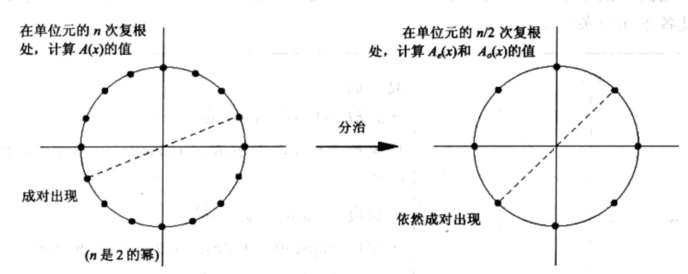
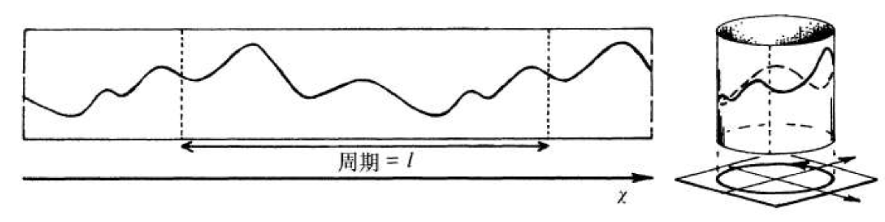

# 卮言快速傅立叶变换

来自 John Lipson 书籍的对快速傅立叶变换的评价：

> 一个有着许多理由值得鉴赏的算法：在技术上，他高效地解决了一个至关重要的实际问题；从美学上，他十分优雅；并且开创了若干崭新且意料之外的应用领域。很有可能是因为快速傅立叶变换（fast Fourier transform， 下文均简称FFT）在上述方面都很出色，自从 20 世纪 60 年代中叶发现他以来，他就一直被视为计算机科学中的“超级”算法之一。
引文来自 Udi Manber《算法引论》（Introduction to Algorithms -A Creative Approach）

## 快速傅立叶变换的慢传播

在 19 世纪早期，高斯（Gauss）发表的一篇关于插值的论文中，也蕴含了与 FFT 算法相同的思想。只是高斯的论文长期以来，一直不为外人所知，而这主要得益于一种老式的加密技术：与当时大多数的科学论文一样，它是用拉丁文撰写的。

在 20 世纪 30 年代后期，英国工程师使用 FFT 算法进行手工计算。

在 1965 年普林斯顿大学的数学家图基（John Tukey）和 IBM的库利（James Cooley）发表 FFT 算法论文。库利是算法的提出者，但对发表论文不热心，论文有库利执笔。图基不热心的原因，并非因为利益，而是因为他认为 FFT 算法不过是一个简单的观察结论。

## 观察多项式乘法

问题：给定 2 个多项式 p(x) 和 q(x)，计算他们的乘积 p(x) * q(x)。

考察一个 1 次多项式 $a_1x+a_0$，该多项式（线性函数）可以由 2 个系数 $a_1$ 和 $a_0$ 确定。同时，该函数对应平面的一条直线，他也可以由直线上的任意 2 个点确定。计算他们的乘积 p(x) * q(x)，将这些点的取值，对应相乘，很容易完成。这种表示法，对多项式乘法很方便。

例如，多项式 $q(x)=2x^2-x+3$ ，可以由点 (1,4)、(2,9)、(3,18)表示。多项式 $p(x)=x^2+3x+1$ 可以由点 (1,5)、(2,11)、(3,19)表示。二者的乘积 $p(x)q(x)$ 包含值 (1,20)、(2,99)、(3,342)。由于 $p(x)q(x)$ 的次数是 4， 3 个点不足以表示其乘积以后的多项式。再添加 2 个点即可。我们只需要经过 $O(n)$ 运算，就能计算 2 个 n 次多项式的乘积。

**多项式运算的表示形式对比**  

| **多项式表示形式** | **系数表示** | **点表示** |  
|-------------------|-------------|------------|  
| **加法**          | 便捷         | 困难        |  
| **乘法**          | 困难         | 便捷        |  

不同的表示方式，各有千秋。如果能高效地从一个种表示方式，转换为另一种方式，就可以得到一个高效的多项式乘法。FFT 就是这样的算法。

## 正向傅立叶变换

从系数表示转为点的表示，用霍纳（Horner）规则​​，可以使用 n 次乘法，计算多项式在任意一点的值。需要处理任意 n 个点，所以共需 $n^2$ 次乘法运算。

从点的表示，转变为系数表示的过程，称之为插值，通常需要 $O(n^2)$ 次运算。

由于可以自由选取 n 个点，，FFT 就选取了一组特别的点集合，使得求值和插值，都能很快的完成。

对任意的一个 $n-1$ 次多项式，$P=\sum_{i=0}^{n-1}a_ix^i$ 在 n 个不同点进行求值，需找到 n 个点，使得多项式更容易求值。为了简单，假定 n 是 2 的幂。

使用矩阵，表示多项式在 n 个点 $x_0,x_1,...,x_{n-1}$ 的取值：

$$
V \mathbf{a} = \mathbf{P}
$$

其中：

$$
V = \begin{bmatrix}
1 & x_0 & x_0^2 & \cdots & x_0^{n-1} \\
1 & x_1 & x_1^2 & \cdots & x_1^{n-1} \\
\vdots & \vdots & \vdots & \ddots & \vdots \\
1 & x_{n-1} & x_{n-1}^2 & \cdots & x_{n-1}^{n-1}
\end{bmatrix}, \quad
\mathbf{a} = \begin{bmatrix}
a_0 \\
a_1 \\
\vdots \\
a_{n-1}
\end{bmatrix}, \quad

\mathbf{P} = \begin{bmatrix}
P(x_0) \\
P(x_1) \\
\vdots \\
P(x_{n-1})
\end{bmatrix}.
$$

# 快速傅立叶变换中的对称

> Galois（伽罗华）一生中两次报考巴黎综合理工大学（École Polytechnique），却都因性格问题铩羽而归。第一次考试时，这位十七八岁的天才少年在口试中拒绝详细解释自己的论证过程，显得傲慢无理，论证也写得马马虎虎，甚至懒得把步骤写清楚，更不愿采纳考官的建议，最终被拒之门外。第二次考试时，他在口试中逻辑跳跃过大，让考官Dinet难以理解，Galois感到被冒犯后竟一怒之下抄起黑板擦砸向Dinet，还精准命中，这场闹剧自然让他再次落选。

