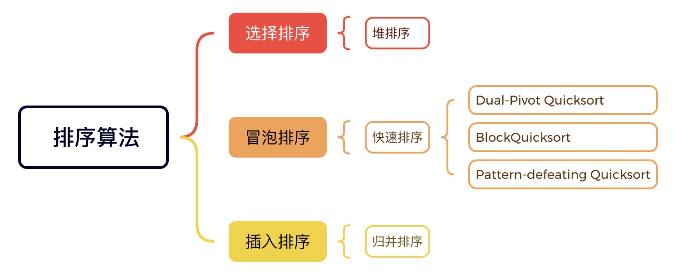
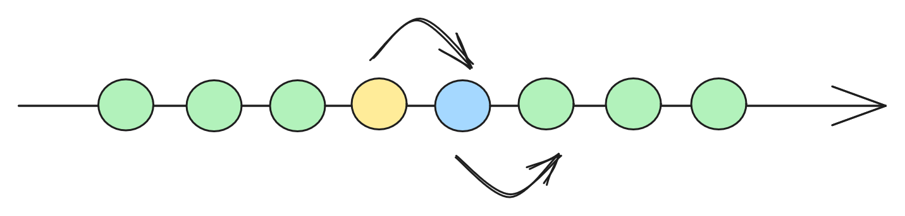
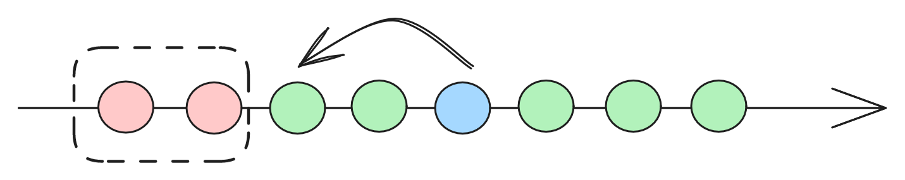
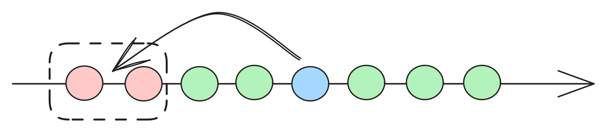
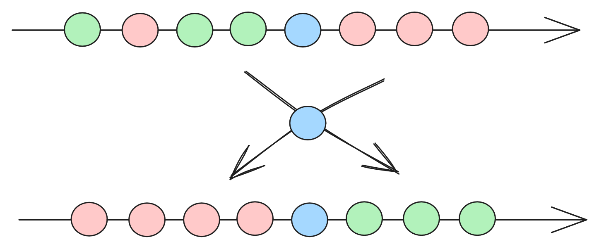

# 浅析排序算法

##  排序算法谱系



## 朴素排序算法

### 冒泡排序



冒泡排序比较原始，不断调整相邻元素的顺序来排序。算法得名于，大的元素会经过交换，慢慢像泡泡一样“浮”到数列的顶端。
冒泡排序的比较和移动操作，都很多，是很慢的排序算法。


C++ 冒泡排序：
``` cpp
#include <iostream>
using namespace std;
template<typename T>
void bubble_sort(T arr[], int len) {
    int i, j;
    for (i = 0; i < len - 1; i++) {
        for (j = 0; j < len - 1; j++) {
            if (arr[j] > arr[j + 1]) {
                swap(arr[j], arr[j + 1]);
            }
        }
    }
}

int main(int argc, const char * argv[]) {
    int arr[] = {19, 93, 3, 25};
    int len = (int) sizeof(arr) / sizeof(*arr);
    bubble_sort(arr, len);
    for (int i = 0; i < len; i++) {
        cout << arr[i] << ' ';
    }
    cout << endl;
    return 0;
}

```

### 选择排序



选择排序就是不断选出，剩下元素中的最值，来实现排序。选择排序的数据移动是精准操作，比冒泡排序好。

C++ 选择排序：

``` cpp
#include <iostream>
using namespace std;

template<typename T>
void selection_sort(T arr[], int len) {
    int i, j;
    for (i = 0; i < len - 1; i++) {
        int min = i;
        for (j = i; j < len - 1; j++) {
            if (arr[j] < arr[min]) {
                min = j;
            }
        }
        if (min != i) {
            swap(arr[min], arr[i]);
        }
    }
}

int main(int argc, const char * argv[]) {
    int arr[] = {19, 93, 3, 25};
    int len = (int) sizeof(arr) / sizeof(*arr);
    selection_sort(arr, len);
    for (int i = 0; i < len; i++) {
        cout << arr[i] << ' ';
    }
    cout << endl;
    return 0;
}


```

### 插入排序



新元素在已排序的列里，找到合适的位置插入。插入的位置，可以通过二分查找优化，插入排序的比较次数，远小于冒泡排序和选择排序。数据移动次数，也占优。不过顺序数据移动的开销，远不及比较操作。朴素排序算法中，插入排序，一般最快。

C++ 插入排序：

``` cpp
#include <iostream>
using namespace std;

template<typename T>
void insertion_sort(T arr[], int len) {
    int i, j;
    T key;
    // 从1开始，因为下标0默认是有序列的开始
    for (i = 1; i < len; i++) {
        // 记录要插入的元素
        key = arr[i];
        // 从已经排序的最右边开始比较，找到比其小的元素
        j = i;
        while (j > 0 && key < arr[j - 1]) {
            arr[j] = arr[j - 1];
            j--;
        }
        // 存在比其小的元素，插入
        if (j != i) {
            arr[j] = key;
        }
    }
}

int main(int argc, const char * argv[]) {
    int arr[] = {19, 93, 3, 25};
    int len = (int) sizeof(arr) / sizeof(*arr);
    insertion_sort(arr, len);
    for (int i = 0; i < len; i++) {
        cout << arr[i] << ' ';
    }
    cout << endl;
    return 0;
}

```

#### 折半插入排序

插入排序还可以通过二分查找算法优化性能。但基本思想和插入排序一样，仅对时间复杂度中的常数优化。

``` cpp
void insertion_sort(int arr[], int len) {
    if (len < 2) return;
    for (int i = 1; i != len; i++) {
        int key = arr[i];
        // 指定范围内查找大于目标值的第一个元素
        auto index = upper_bound(arr, arr + i, key) - arr;
        // 使用 memmove 移动元素，比使用 for 循环速度更快，时间复杂度仍为 O(n)
        memmove(arr + index + 1, arr + index, (i - index) * sizeof(int));
        arr[index] = key;
    }
}

```

#### 《STL源码剖析》中插入排序实现

``` cpp
template <class RandomAccessIterator>
void __insertion_sort(RandomAccessIterator first,
                      RandomAccessIterator last) {
    if (first == last) return;
    for (RandomAccessIterator i = first + 1; i != last; ++i)  // 外循环
        // TODO value_type 的实现，待补充
        __linear_insert(first, i, value_type(first)); // 以上，[first, i) 形成一个子区间
}

template <class RandomAccessIterator, class T>
inline void __linear_insert(RandomAccessIterator first,
                     RandomAccessIterator last, T*) {
    T value = *last;  // 记录尾元素
    if (value < *first) { // 尾比头还小（注意，头端必为最小元素）
        // 比最小元素还小，不需要一个个比较，直接一次处理
        std::copy_backward(first, last, last + 1);  // 将整个区间向右移一个位置
        *first = value;  // 令头元素等于原先的尾元素值
    }
    else  // 尾不小于头
        __unguarded_linear_insert(last, value);
}

template <class RandomAccessIterator, class T>
void __unguarded_linear_insert(Randomaccessiterator last, T value) {
    RandomAccessIterator next = last;
    --next;
    // insertion sort 内循环
    // 注意，一旦不再出现逆转对（inversion），循环就可以结束了
    while(value < *next) { // 逆转对（inversion）存在
        *last = *next;  // 调整
        last = next;  // 调整迭代器
        --next;  // 左移一个位置
    }
    *last = value;  // value 的正确落脚处
}
```

之所以用unguarded_前缀命名，是因为，一般的insertion sort在内循环，需要判断是否相邻元素是“逆转对”，同时还要判断循环是否越界，需要两次判断。

但`__unguarded_linear_insert`是在`__linear_insert`中调用，最小值一定在内循环区间中，就可以省略一个判断。虽然可能无足轻重，但大量数据情况下，影响可观。STL中以`__unguraded`前缀命名者，即边界条件的检验可以省略，或说已经融入特定条件。

插入排序的复杂度为O(N^2)，并不理想，但数据量少的时候，有不错的效果，原因是一些实现上的技巧，使得他不想其他排序算法，有诸如递归调用等操作，带来的额外负荷。


## 高级排序算法

### 快速排序



快速排序可以理解为一种批量的冒泡排序。每一个元素的浮沉，不再取决于相邻元素的比较，而是取决于中枢元素的比较，且每次沉浮不再是一个身位，而是直接到达上下半区。快速排序通常很快。

``` cpp
// 快排
const int __stl_threshold = 16;

// 返回a，b，c之居中者
template<class T>
inline const T& __median(const T& a, const T& b, const T& c) {
    if (a < b) {
        if (b < c) { // a < b < c
            return b;
        } else if (a < c) { // a < c < b
            return c;
        } else { // c < a < b
            return a;
        }
    } else if ( a < c) { // b < a < c
        return a;
    } else if ( b < c) { // b < c < a
        return c;
    } else { // c < b < a
        return b;
    }
}

// 分割函数，返回值为分割以后，右段第一个位置
template <class RandomAccessIterator, class T>
RandomAccessIterator __unguarded_partition(RandomAccessIterator first,
                                           RandomAccessIterator last,
                                           T pivot) {
    while (true) {
        while (*first < pivot) ++first; // first 找到 >= pivot 的元素就停下来
        --last;
        while(pivot < *last) --last; // last 找到 <= pivot 的元素就停下来
        if (!(first < last)) {
            return first; // 交错，结束循环
        }
        std::iter_swap(first, last); // 大小值，交换
        ++first;
    }
}

template <class RandomAccessIterator>
inline void sort(RandomAccessIterator first,
                 RandomAccessIterator last) {
    if (!(first == last)) {
        __quick_sort_loop(first, last);
        __final_insertion_sort(first, last);
    }
}

template <class RandomAccessIterator>
inline void __quick_sort_loop(RandomAccessIterator first,
                              RandomAccessIterator last) {
    __quick_sort_loop_aux(first, last, _RWSTD_VALUE_TYYPE(first));
}

template <class RandomAccessIterator>
inline void __quick_sort_loop_aux(RandomAccessIterator first,
                              RandomAccessIterator last,
                              T*) {
    while (last - first > __stl_threshold) {
        // median-of-3 partitioning
        RandomAccessIterator cut = __unguarded_partition(first, last,
                                                         T(__median(*first, *(first + (last - first)/2),
                                                                    *(last - 1))));
        if (cut - first >= last - cut) {
            __quick_sort_loop(cut, last); // 对右段递归处理
            last = cut;
        } else {
            __quick_sort_loop(first, cut); // 对左段递归处理
            first = cut;
        }
    }
}

// 具体实现，见上文的插入排序
template <class RandomAccessIterator>
inline void __final_insertion_sort(RandomAccessIterator first,
                                   RandomAccessIterator last) {
    if (last - first > __stl_threshold) {
        __insertion_sort(first, first + __stl_threshold);
        __unguarded_linear_insert(first + __stl_threshold, last);
    } else {
        __insertion_sort(first, last);
    }
}
```

#### 阈值（threshold）

数据量少的时候，如十来个元素，Quick Sort不一定比 Insertion Sort 快，Qick Sort即使极小的子序列，也有很多函数递归调用。

所以需要适当评估序列的大小，决定使用Quick Sort还是Insertion Sort。多少大小呢？因设备而异，5~20都有可能。

#### 几近排序（final insertion sort）

如果序列是快完成了，但尚未完成的状态，用Insertion Sort处理这些子序列，效率一般也比Quick Sort要好，Quick Sort可能会“将所有子序列彻底排序”。


### 堆排序

### 归并排序


## 常见工业排序算法

### Dual-Pivot Quicksort（双枢三分快排）

### BlockQuicksort

### Pattern-defeating Quicksort

## 阅读资料

- [与程序员相关的CPU缓存知识](https://coolshell.org/articles/20793.html/)

- [打造 Go 语言最快的排序算法](https://blog.csdn.net/ByteDanceTech/article/details/124464192)

## log

- 2023/8/16  初稿
