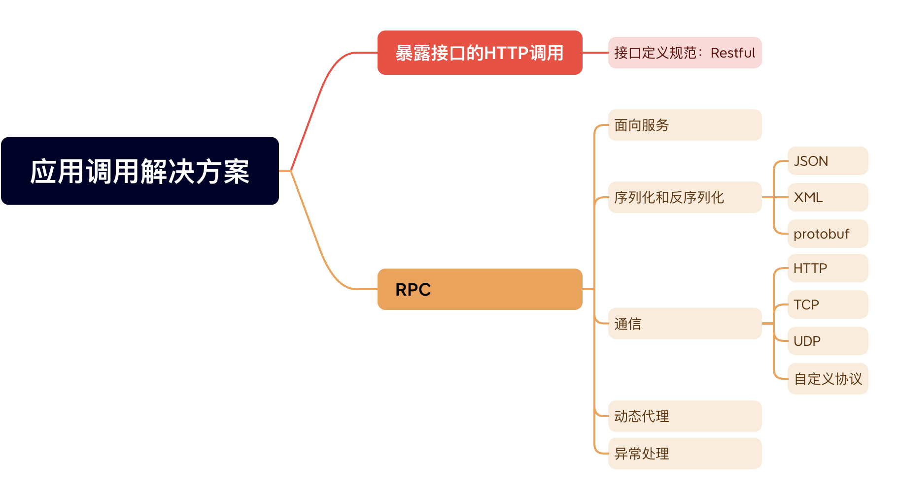

# bRPC 核心设计

## 定义

分布式计算中，远程程序呼叫（Remote Procedure Call，RPC）是一个计算机通信协议。RPC是一种服务器-客户端（Client/Server）模式，经典实现是一个通过发送请求-接受回应，进行信息交互的系统。允许运行与一台计算机程序，调用另一个地址空间（通常为开放网络的一台计算机）的子程序，就像调用本地程序一样，无需额外地为这个交互作用编程。

RCP 是一种进程间通信模式，程序分布在不同的地址空间。在同一台主机，RPC 可以通过不同的虚拟地址空间进行通讯。

## RPC 和 HTTP 的对比

### 同

本质上来看HTTP 和 RPC ，从技术角度来看是同源的：
- 都是网络请求；
- 需要设计应用层协议（请求头，响应头，请求体，meta 数据等），而二者主要差异，主要是应用层协议。HTTP 是一种应用层协议；
- 需要设计编码和解码，序列化，选择通信协议，如：TCP,UDP

### 异

#### 协议
- 可以根据业务，设计的协议和编码解码方式。HTTP 不属于个人公司，不可能对协议改进，加入自己服务治理平台；
- HTTP 为了可读性，请求头部用的文本，占用了空间。RPC 相对 HTTP 接口而言，开销更小；
- HTTP 是一应一答传输协议，不能要求并发N个请求，然后乱序回包。HTTP 2 虽然解决此问题，但实现复杂，高性能后台偏向 RPC；

#### 服务治理

良好的 RPC 调用是面向服务的封装，针对服务的可用性和效率，做了优化，如：服务发现，负载均衡，熔断降级等。单纯调用 HTTP 容器缺少这些特性。如果把 HTTP 封装一层，服务发现和函数代理调用，就升级为一个 RPC 框架了。

- 可以自己做服务治理，如：负载均衡，限流
- RPC 在设计请求的时候，有设计接口和方法名，两端在使用服务治理平台的时候，使用接口和方法，就知道对方的 IP 和端口。而 HTTP 的请求路径，相当于接口和方法名，没有在服务治理体系，没有命名服务

服务间采用 RPC 更方便，而对外暴露采用采用 HTTP 接口更容易。

## 命名服务

命名服务提供名称和设备之间的映射，使得设备可以通过名称访问到其他设备。

分布式系统中，设备直接需要交互，就需要找到另一个设备的位置。命名服务就是通过名称，去命名服务查询到目标设备的真实位置。主要解决：服务发现，路由隔离等。

上游服务通过命名服务发现下游节点，并通过负载均衡方法把流量分配给下游节点。当下游节点出现问题时，隔离问题节点，提高负载均衡效率。被隔离的节点定期被健康检查，成功后重新加入正常节点。

## 阅读资料

- [如何基于protobuf实现一个极简版的RPC ](https://izualzhy.cn/demo-protobuf-rpc)
- [brpc 官网](https://brpc.apache.org/zh/)
- [Understanding RPC Vs REST For HTTP APIs](https://www.smashingmagazine.com/2016/09/understanding-rest-and-rpc-for-http-apis/)
- [ 现代 C++ 教程：高速上手 C++ 11/14/17/20](https://changkun.de/modern-cpp/zh-cn/01-intro/)
