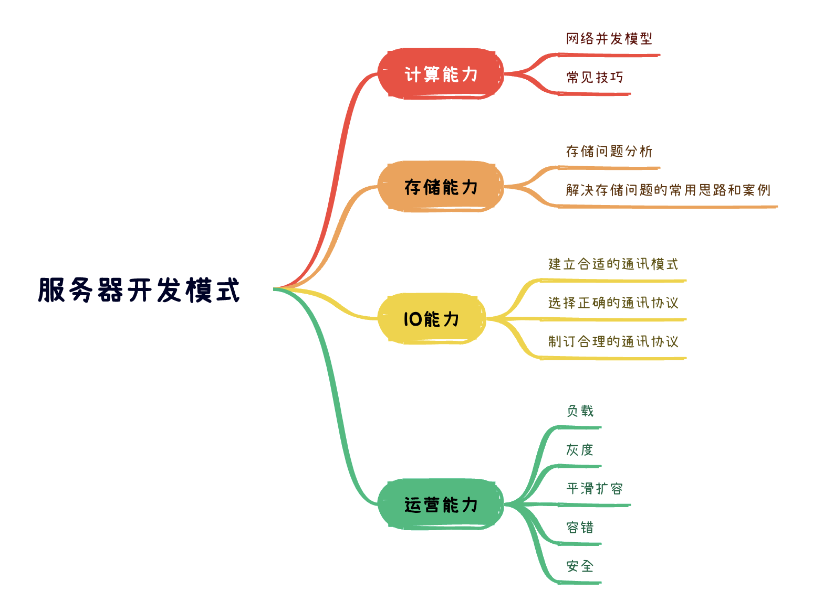

# 服务器开发模式

# 导读

参加“服务器开发模式”的技术讲座，写一篇简单的笔记，后续可以以此为框架，补充对应的知识。重视底层硬件约束，基本的架构（如冯·诺依曼结构），和数学抽象。没有数学，不深刻，无以揭示本质，陷入繁芜丛杂的细节，只见树木，不见森林；没有底层硬件和项目实践，理论的知识会苍白，不鲜活，无法学以致用。

# 图灵和哥德尔不完备定理

# Server模型

## 迭代模型

### 最单纯的服务模型

## 并发模型

- 主进程接受连接
- 创建子进程处理业务
- 子进程处理单个连接

### 子进程accept

- 主进程预先fork一些进程
- 各个子进程竞争accept，然后处理数据传输
- 一个子进程可以处理一个连接，也可以同时处理多个连接

关键词：thundering herd

> n computer science, the thundering herd problem occurs when a large number of processes or threads waiting for an event are awoken when that event occurs, but only one process is able to handle the event. After all the processes wake up, they will start to handle the event, but only one will win. All processes will compete for resources, possibly freezing the computer, until the herd is calmed down again.
> from wiki

### 主进程accept

- 主进程accept，通过流管道转发fd到子进程
- 子进程收到fd后，处理数据传输，处理结束后通知父进程
- 父进程处理的事情比较简单，容易监控子进程

关键词：MSGHDR

### 分发模型

- 通讯进程管理所有连接，实现海量接入
- 通讯进程只负责分发消息，包含上行和下行消费
- 业务进程不关心通讯
- 通讯进程和业务进程之间通过内存管道共享数据

关键词：SPP

### 线程池模型

- 主线程管理通讯进程
- 以任务为单位来分配处理请求
- 每一个线程同时只执行一个任务

关键词：CQRS，Schedule Thread Pool，Session Map，Session Thread Pool，Event Map，Connection Thread Pool

# Server要素

## von Neumann结构

控制器用于调度，运算器才是实际做事情的部分。控制器类似于管理者，无实际产出，运算器类似于员工。技术人员常说想专心做技术，其实是一件成本很高的事情，在这个随机的世界里，需要其他很多部分来配合，才能产生有序的价值。

## 计算问题：提高CPU的利用率

- 并发：多进程或线程，中断分布
- 减少系统调用，减少切换开销
- 减少遍历操作(遍历意味着有上界或下界，即有了认为的约束，就容易导致扩张之后的问题。如：Linux一个进程最多能打开1024个文件，导致tcp连接限制)
- 优化关键路径
- 慎用锁

### 基本的门电路原理（加法器）

## 多进程

- 过多的进程导致上下文切换开销增大
- 为每事务创建一个进程是糟糕的设计
- 要避免单进程阻塞导致系统停止吞吐

## 存储问题

- 没有存储操作的应用是最快的，也是无意义的
- 存储问题的关键在于硬盘的随机读写速度
- 很多互联网公司的系统瓶颈大部分来自磁盘IO

### 磁盘的读写

- 磁盘的顺序读写性能要远远大于随机读写
- 测试数据表明，顺序读写每秒可到50M，完全随机读写最低只有100-200次每秒。前者的约束来自于读写头对磁性的操作，后者的约束来自磁盘转动的惯性。

### 磁盘性能问题的解决办法

#### cache策略：充分利用CPU和内存资源来缓解

#### 分级处理：区分热点数据和非热点数据

#### 利用顺序读写，减少寻道次数

当需要写入数据的时候，可以先写日志，即使此时数据库的数据没有完成写入，也没有关系。写日志的速度大于写数据库的速度。原因在意：写日志是顺序写的，而顺序是由时间保证的，即按照时间顺序写入即可。写入日志了，即使此时断电了，也没有关系，可以根据日志恢复数据。而数据库的写入，有各种各样的关联，不是完全的顺序读写，相比之下，要比写日志慢。

问题：如果写入日志成功了，但数据库数据没有完成，此时访问相关的数据怎么办？Redis之类的内存数据库来解决此问题？

#### SSD

## IO问题

### OSI模型

### 通讯模型

信息传输的三大特性：

1. 完整性-丢点行么
2. 顺序性-乱点行么
3. 时效性-慢点行么

#### 侧重完整性

http协议？

- 信息分割
- 丢包检测
- 可靠重传

#### 侧重顺序性

- 数据排队
- 丢包检测
- 可靠重传

#### 侧重时效性

如音视频的传输协议，就不注重完整性，可以丢帧，但注重时效性。

- 过时检测
- 状态同步
- 应用纠错

### TCP

- 面向连接流模型
- 滑动窗重传机制
- 有流量控制
- 保证传输顺序
- 协议层无边际
- 丢包影响传输速度

内网如果无充分的流量竞争的情况下，可以使用无流量控制的协议，不用慢启动控制（e为底数的算法，如生物的繁衍的种群增长就是以e为底数的曲线）

### UDP

- 点对点数据报文模型
- 协议层不做重传
- 无流量控制
- 不保证传输顺序
- 协议层边界
- 丢包影响传输成功率

### 应用协议

考察角度：可读性，流量，编解码，可拓展性，兼容性

# Server服务

## 集成方式

- 库依赖。尽量少，库代码可能不能修改维护
- 接口定义。可以多做接口定义者，因为接口定义者有解释权，
- 离线文件

## 性能指标

- 并发量、并发量
- 单次延迟

并发量和单次延迟要一起考察，只考察其中一个是没有意义的。如吞吐量最大的方案，莫过于使用飞机运送硬盘，但延迟太大。

## 负载均衡

- 如何知道各个节点的负载
- 如何实现负载均衡

## 过载保护

- 什么是过载
- 保护什么
- 如何保护：1. 轻重分离；2. 及早拒绝；3. 量力而为；4. 动态调节

## 灰度

### 为什么要灰度

- 保护自己
- 保护设备
- 保护用户
- 控制风险

### 如何灰度

- 选择合适的灰度对象和粒度（网络，机型，os，地域，参与热情，业务等级）
- 建立快捷灵活的用户反馈，沟通渠道
- 统计监控
- 节奏把控。不要忽视用户反馈的滞后性（如toB的业务，周五发布了，没有收到问题反馈，到下周一，爆发大量问题。原因：周五下班，企业用户休息了，周一才上班）

### 平滑扩容

- 网络层平滑扩容
- 应用层平滑扩容
- 数据层平滑扩容

数据层很难扩容。数据库数据一般情况下不敢轻易修改。从开始的时候，就要考虑数据库的扩容。如通过路由分发，分片存储。

### 自服务和诊断

- 向后传递统一的错误码
- 提供除RTCODE，ERRMSG之外的Trigger MSG
- 根据业务模型定义BINLOG。统计时耗，返回码，错误激活点，错误消息，关键业务参数

# change log

- 2019/12/5 created document.
- 2023/09/06 补充思维导图
