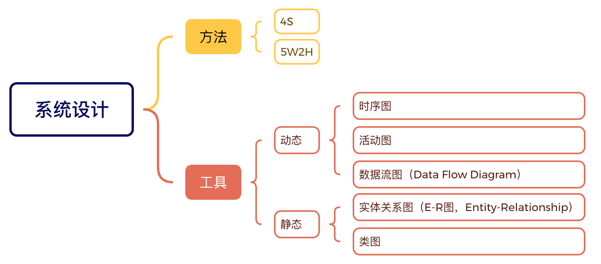

# 后台系统设计

* TOC
{:toc}

> 2024-4-29

> 系统 = 服务 + 数据存储

> 叙述 = 提出论点 + 举出证据 + 阐述逻辑关系

# 4S

## 维度

## 案例

推拉模型

# 5W2H

## 维度

## 案例

分布式延迟队列

# 工具

## 静态

### 实体关系图

### 类图

## 动态

### 数据流图

### 时序图

### 活动图

## 阅读资料

- [【解构系统设计面试】什么是系统设计？以及如何设计一个新鲜事系统？](https://blog.luoyuanhang.com/2020/05/24/system-design-0/)
- [MapReduce 阅读笔记](https://blog.luoyuanhang.com/2017/04/19/mapreduce-notes/)
- [GFS 阅读笔记](https://blog.luoyuanhang.com/2017/05/15/gfs-reading-notes/)
- [容错虚拟机分布式系统的设计](https://blog.luoyuanhang.com/2017/05/20/ftvm-notes/)
- [系统设计入门](https://github.com/donnemartin/system-design-primer/blob/master/README-zh-Hans.md)
- [活动图](https://zh.wikipedia.org/wiki/%E6%B4%BB%E5%8A%A8%E5%9B%BE)
- [什么是实体关系图（ERD）？](https://www.visual-paradigm.com/cn/guide/data-modeling/what-is-entity-relationship-diagram/)
- [什么是数据流图？](https://www.visual-paradigm.com/cn/guide/data-flow-diagram/what-is-data-flow-diagram/)
- [一图胜千言系列——泳道图和数据流图](https://juejin.cn/post/7185376363808260152)
