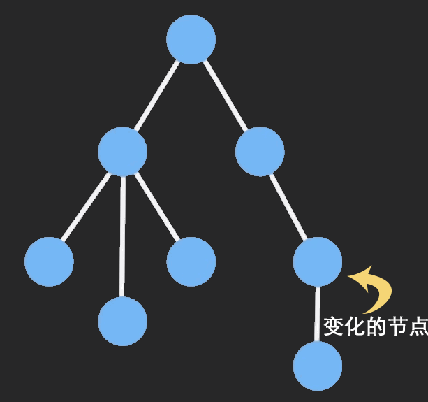

# Expression problem

> 密涅瓦的猫头鹰，只有在黄昏的时候才起飞
-- 黑格尔

## 导读

以expression problem作为引子，用函数式编程语言OCaml和面向对象语言Java，分别解决这个问题。

简要介绍一下OCaml的变体(variant)和多态变体(polymorphic variant)，了解一下sum类型的使用，以及模式匹配的使用。

利用访问者模式(visitor pattern)处理此问题，并进一步用Object Algebras处理此问题。

后续转入介绍一下 Algebraic data types，只能作为朴素的理解，不成系统。

简单介绍了代数类型里面的Product类型和Sum类型，以及其和代数之间的同构。接着介绍Lisp中列表的类型和二叉树的类型，然后是Zipper与求导的关系，二叉树的挖洞。以及与此关系很弱的Git的底层的数据结构设计。为什么要加Git的设计呢？因为这篇文章是我的读书笔记，读了很多资料，后来写了一个汇总。笔记和阅读的资料相关，比一定是成体系的，如果真要找一条线，那就是计算机编程和数学的关联，具体来说，就是与离散数据，或者抽象代数的关联。

所引用的书，文中涉及的部分，都是阅读过，并且自己写代码，OCaml的代码是读了《The Real World OCaml》，自己想出来的，估计不是最佳方案。但很长一段时间，被一篇用OCaml解决expression problem的实现误导了，思考了很久，算是一种别样的阅读体验。好多年没写Java，这是头一次，代码也自己参考技术博客，然后自己修改的，保证可以运行，但代码风格不能保证。搜索访问者模式的资料，发现各个资料的实现，各有不同，加上我对Java不熟悉，这里的实现存疑。请教了几位同事，当前实现应该没有硬伤。

Java代码和OCaml代码，并不是一一对应。本想改成一一对应的，后来想一下，其实不影响主题的诠释，就懒得修改了。


在SICP第二章中，介绍了复数的两种表示，并介绍了基于类型分派(Tagged Data) ，消息传递(message passing)，数据导向(data directed)。其中消息传递是面向对象的一个雏形，基于类型分派带有函数式编程的痕迹。二者有各自的优缺点。数据导向是解决这个问题非常好的方案。

在介绍这三种不同的编程思想的时候，我想结合一下实际工程实践，我本人前端编程偏多，这里就以前端编程中遇到问题，从实践角度展示一下SICP中所讲内容的深刻。其中，基于类型分派，对应的例子为：React早期的Mixins，以及一个不够强的例子，jQuey的匿名函数的使用技巧。消息传递，没有想到非常贴切的例子，但这种数据的过程性表示，与策略模式有类似的地方。而数据导向，与《代码大全》(Code Complete)中的表驱动法，有类似的地方。这些思考有似是而非的地方，暂时对计算的理解只有这个深度，先写下来，以后有新的理解，再补充纠错。

完整可运行代码见附录。所有的代码均保证可以运行。

## 构造数据抽象

这里我想以自己的理解，以简单表述，尽可能少的代码总结一下SICP上的内容。SICP写得非常精炼，内容之间环环相扣，摘录上面的内容，很容易导致叙述有跳跃，估计假以时日，我自己都需要回去重读SICP。所以，我选择以自己归纳的方式表述出来。

### 前置概念

#### 数据抽象屏障的优点

- 程序容易维护和修改。
- 有助于程序的设计。因为抽象屏障的存在，我们可以保留不同实现的灵活性，推迟考虑选择不同实现的时机，同时又不会阻碍系统其它部分的进展

#### 以有理数作为数据抽象的例子

有理数的表示：

``` scheme

; 构造函数
(define (make-rat n d) (cons n d))
; 选择函数
(define (numer x) (car x))
; 选择函数
(define (denom x) (cdr x))

(define (print-rat x)
  (newline)
  (display (numer x))
  (display "/")
  (display (denom x)))

(define one-half (make-rat 1 2))

(print-rat one-half)

```

#### 函数式程序设计

> 不用任何赋值的程序设计称之为函数式程序设计。

#### 命令式程序设计

> 采用赋值的程序设计被称之为命令式程序设计。

赋值的存在，变量已经不能再看做仅仅是某个值的名字。此时的一个变量必须以某种方式制定一个“位置”，相应的值可以存储在那里。在我们的新求值模型里，这种位置将维持在称为环境的结构中。

一个环境就是框架（frame）的一个序列，每一个框架包含着一些约束的一个表格（可能为空），这些约束将一些变量名字关联于对应的值（在一个框架里，任何变量至多只能有一个约束）。每个框架还包含一个指针，指向这一框架的外网环境。

环境对于求值过程是至关重要的，因为他确定了表达式求值的上下文。

#### 高阶过程与类型

如果创建了不同种类的过程，就将迫使我们同时去创建不同种类的高阶过程。这是常规类型语言（如Pascal）在处理高阶过程时所遇到的困难情况在Lisp里的一种小小反应。在那些语言里，程序员必须刻画每一个过程的参数和结果的数据类型：数、逻辑值、序列等。因此，我们就无法表述某些抽象，例如用一个如stream-map那样的高阶过程“将给定过程proc映射到一个序列里的每个元素”。相反，我们将需要对每种参数和结果数据类型的不同组合定义不同的映射过程，各自应用于特定的proc。在出现了高阶函数的情况下，维持一种实际的“数据类型”概念就变成了一个很困难的问题。语言ML阐明了处理这一问题的一种方法（Gordon，Milner，and Wadsworth 1979），其中的“多态数据类型”包含着数据类型间高阶变换的模式。这就使程序员不必显示声明ML里的大部分过程的数据类型。ML包含一种“类型推导”机制，用于从环境中归结出新定义的过程的数据类型。

#### 闭包

术语“闭包”来自抽象代数，一个集合的元素在某个运算之下封闭，如果将该运算应用于这一集合中的元素，得到的仍然是该集合的元素。具体到抽象数据结构，某种组合数据对象的操作满足闭包性质，即通过组合起来的数据对象得到的结果本身还是可以通过同样的操作再进行组合。

闭包性质是任何一种组合功能的威力的关键要素，可以使得我们能过建立起层次性的结构。这种结构可以一些结构构成，而各个部分又是他们的部分构成，且可以继续如此下去。

思考：这与递归，以及数学里面的分形非常相似。


### 复数的两种表示


复数有两种表示方式：直角坐标形式（实部和虚部），极坐标形式（模和幅角）。如何使得两者共存于同一个系统中呢？可以通过类型标志和通用型操作。

实部、虚部，与模和幅角的关系：

x = r*cos(A)  r = (x^2 + y^2)^(1/2)
y = r*sin(A)  A = arctan(y/x)

#### 复数的运算

``` scheme
#lang racket

(define (add-complex z1 z2)
  (make-from-real-imag (+ (real-part z1) (real-part z2))
                       (+ (imag-part z1) (imag-part z2))))
(define (sub-complex z1 z2)
  (make-from-real-imag (- (real-part z1) (real-part z2))
                       (- (imag-part z1) (imag-part z2))))
(define (mul-complex z1 z2)
  (make-from-mag-ang (* (magnitude z1) (magnitude z2))
                     (+ (angle z1) (angle z2))))
(define (div-complex z1 z2)
  (make-from-mag-ang (/ (magnitude z1) (magnitude z2))
                     (- (angle z1) (angle z2))))
```

#### 直角坐标复数的表示

平方和平方根（牛顿法）的实现。以下依赖这两个函数。

``` scheme
#lang racket

(define (square x) (* x x))

(define (average x y)
  (/ (+ x y) 2))

(define (sqrt x)
  (define (good-enough? guess)
    (< (abs (- (square guess) x)) 0.001))
  (define (improve guess)
    (average guess (/ x guess)))
  (define (sqrt-iter guess)
    (if (good-enough? guess)
        guess
        (sqrt-iter (improve guess))))
  (sqrt-iter 1.0))
```

复数的直角坐标实现。

``` scheme

(define (real-part z) (car z))
(define (imag-part z) (cdr z))
(define (magnitude z)
  (sqrt (+ (square (real-part z)) (square (imag-part z)))))
(define (angle z)
  (atan (imag-part z) (real-part z)))
(define (make-from-real-imag x y) (cons x y))
(define (make-from-mag-ang r a)
  (cons (* r (cos a)) (* r (sin a))))
```

#### 极坐标复数的表示

``` scheme
#lang racket

(define (real-part z)
  (* (magnitude z) (cos (angle z))))
(define (imag-part z)
  (* (magnitude z) (sin (angle z))))
(define (magnitude z) (car z))
(define (angle z) (cdr z))
(define (make-from-real-imag x y)
  (cons (sqrt (+ (square x) (square y)))
        (atan y x)))
(define (make-from-mag-ang r a) (cons r a))
```

操作和类型的表格


数据抽象：一种方法，将一个复合数据对方的使用，与数据对象怎样由更基本的数据对象构造起来的细节隔离开。数据的定义，与程序中使用数据的方式无关。这两个部分之间的界面是一组过程，称之为构造函和选择函数。

构造函数，用于创建数据对象。选择函数，用于访问复合数据对象中的各个部分。

数据抽象的基本思想是为每一类数据对象标识出一组操作，使得对这类数据对象的所有操作都可以基于他们表述，而且在操作这些数据对象的时候，只使用他们。

数据究竟意味着什么？“由给定的构造函数和选择函数所实现的东西”是不够的。并非任意过程都适合某一数据的实现基础。一般而言，我们总可以将数据定义为一组适当的选择函数和构造函数，以及为使这些过程成为一套合法的表示，必须满足一组特定的条件。

### 基于类型分派(Tagged Data)

在同一个系统中，同一个数据如果包含两种不同的表示，需要一种方式，把两者区分开。具体到复数的表示，需要区分直角坐标和极坐标。否则数据会有歧义，例如，`(3, 4)`的模，没有类型区分，我们无法知道是5（直角坐标解释），还是3（极坐标解释）。

为了完成这种区分，我们需要在复数里包含一个类型标志——如符号rectangular和polar。我们可以用这个标志，区分这两种表示，确定使用对应的选择函数。

> 检查一个数据的类型，并据此去调用某个适当的过程，称之为**基于类型的分派**

基于类型分派的组织方式，让每一个操作管理的分派。从效果上看，相当于将`操作-类型表格`分解危一行一行，每一个通用型过程表示表格中的一行。

``` scheme
#lang racket

(define (attach-tag type-tag contents)
 (cons type-tag contents))
(define (type-tag datum)
  (if (pair? datum)
      (car datum)
      (error "Bad tagged datum -- TYPE-TAG" datum)))
(define (contents datum)
  (if (pair? datum)
      (cdr datum)
      (error "Bad tagged datum -- CONTENTS" datum)))

(define (rectangular? z)
  (eq? (type-tag z) 'rectangular))
(define (polar? z)
  (eq? (type-tag z) 'polar))
```

添加类型tag之后的直角坐标实现

``` scheme
#lang racket

(define (real-part-rectangular z) (car z))
(define (imag-part-rectangular z) (cdr z))
(define (magnitude-rectangular z)
  (sqrt (+ (square (real-part-rectangular z))
           (square (imag-part-rectangular z)))))
(define (angle-rectangular z)
  (atan (imag-part-rectangular z)
        (real-part-rectangular z)))
(define (make-from-real-imag-rectangular x y)
  (attach-tag 'rectangular (cons x y)))
(define (make-from-mag-ang-rectangular r a)
  (attach-tag 'rectangular
              (cons (* r (cos a)) (* r (sin a)))))
```

添加类型tag之后的极坐标实现

``` scheme
(define (real-part-polar z)
  (* (magnitude-polar z) (cos (angle-polar z))))
(define (imag-part-polar z)
  (* (magnitude-polar z) (sin (angle-polar z))))
(define (magnitude-polar z) (car z))
(define (angle-polar z) (cdr z))
(define (make-from-real-imag-polar x y)
  (attach-tag 'polar
               (cons (sqrt (+ (square x) (square y)))
                     (atan y x))))
(define (make-from-mag-ang-polar r a)
  (attach-tag 'polar (cons r a)))
```

通用选择函数的实现

``` scheme
(define (real-part z)
  (cond ((rectangular? z)
         (real-part-rectangular (contents z)))
        ((polar? z)
         (real-part-polar (contents z)))
        (else (error "Unknown type -- REAL-PART" z))))
(define (imag-part z)
  (cond ((rectangular? z)
         (imag-part-rectangular (contents z)))
        ((polar? z)
         (imag-part-polar (contents z)))
        (else (error "Unknown type -- IMAG-PART" z))))
(define (magnitude z)
  (cond ((rectangular? z)
         (magnitude-rectangular (contents z)))
        ((polar? z)
         (magnitude-polar (contents z)))
        (else (error "Unknown type -- MAGNITUDE" z))))
(define (angle z)
  (cond ((rectangular? z)
         (angle-rectangular (contents z)))
        ((polar? z)
         (angle-polar (contents z)))
        (else (error "Unknown type -- ANGLE" z))))
```

实现算术运算是，过程`add-complex`等保持不变，调用相同的选择函数。

``` scheme
(define (add-complex z1 z2)
  (make-from-real-imag (+ (real-part z1) (real-part z2))
                       (+ (imag-part z1) (imag-part z2))))
```

#### 基于类型分派的缺点

在系统设计中，这是一种构造模块的策略。但有显著的弱点，所设计的模块，不具有可加性（个人理解是可以随意添加新的实现，而不需要修改原来的代码）。添加新数据类型的时候，必须小心的避免命名冲突。同时，还需要去修改处理不同数据类型的函数，这些函数必须支持所有不同数据类型。即：

- 需要小心避免命名冲突

- 处理不同类型数据的函数，必须知道所有不同的数据类型。即函数依赖具体的类型。


#### 基于类型分派的思考

基于类型分派，看起来应该是与下文的消息传递是对称的。为什么基于类型分派显著不能作为构建系统的设计呢？而消息传递（面向对象）可以呢？且于下文引入的expression problem中函数式编程的实现，其实也是对应表格的横向，而函数式编程的设计能构建系统的设计呢？

从代码角度看，这里实现的基于类型分派，是简单的类似于if的语句的来识别类型的标签，是很粗糙的实现，不具有可加性，可组合性也很弱（小抽象可以组合为一个大的抽象）。这一点与消息传递显著不同，消息传递一看就有模块化的功能，且显而易见容易添加方法。

函数式编程的问题呢？我觉得是函数式的静态类型，以及其模式匹配，是非常强大的能力，有了这样的类型约束和模式匹配，实现基于类型分派，就不需要用简单if语句a实现，而是依赖类型系统，很简洁有力的实现了。但是，我们知道类型系统看似很强，实际上是有很多缺点的，有些很特殊的场景，类型系统也很难处理，常见的类型系统又有各自的缺点，如HM类型系统。

### 基于类型分派与实际问题的思考

#### React早期的 Mixins

使用Mixins的例子：

``` jsx
import React from 'react';

var MyMixin = {
  doSomething() {

  }
};
const MyComponent = React.createClass({
  mixins: [MyMixin],
  handleClick() {
    this.doSomething(); // invoke mixin's method
  },
  render() {
    return (
      <button onClick={this.handleClick}>Do Something</button>
    );
  }
});

export default MyComponent;

```

简单的 Mixins 实现。

``` javascript
const mixin = function(obj, mixins) {
  const newObj = obj;
  newObj.prototype = Object.create(obj.prototype);

  for (let prop in mixins) {
    if (mixins.hasOwnProperty(prop)) {
      newObj.prototype[prop] = mixins[prop];
    }
  }

  return newObj;
}
```

Mixins 缺点（来自《Mixins Considered Harmful》）

- Mixins 引起名称冲突（Mixins cause name clashes）
- Mixins 引入了隐式的依赖关系（Mixins introduce implicit dependencies）

原文还有一条：Mixins 导致滚雪球式的复杂性（Mixins cause snowballing complexity）。这其实是隐式依赖关系的结果。

命名冲突显而易见，Mixins 当前组件的属性，不能于组件本身的属性名字相同，否则会被覆盖。与组件不同，mixins 不能构成层次结构，它们被平坦化并在相同的命名空间中运行。

React的隐式依赖关系的理解。组件依赖mixins，或mixins 依赖于其他 mixin，删除其中的一个会破坏另一个 mixins。JavaScript 是一种动态语言，因此很难强制记录这些依赖关系。有mixins的情况下，告诉数据如何流入和流出 mixin ，以及它们的依赖图怎样是非常棘手的。即，修改mixins或者修改组件，需要清楚的知道所有的依赖关系。这与基于类型分派的第二条，函数依赖具体的类型有类似之处。组件与Mixins混合在一起，缺少中间的抽象层，必然导致需要直接处理这些依赖关系。基于类型分派，也没有函数与类型之间的抽象屏障，本质原因是一样的。

从设计上来看，Mixins 不区分类型，抽象能力还不如基于类型分派。

#### `jQuery.noConflict()`


背景：在ES3时代，JavaScript没有块作用域，一般会使用函数构造一个作用域。

``` javascript
(function(window, undefined){
    var
    // Map over jQuery in case of overwrite
    _jQuery = window.jQuery,
    // Map over the $ in case of overwrite
    _$ = window.$,

    // 其他代码

    jQuery.extend({
        noConflict: function(deep){
            if (window.$ === jQuery) {
                window.$ = _$;
            }
            if (deep && window.jQuery === jQuery) {
                window.jQuery = _jQuery;
            }
            return jQuery;
        }
    })
}(window);

```

多个jQuery版本共存的方案。其实就是取多个别名。

``` html
<!-- load jQuery 1.1.3 -->
<script type="text/javascript" src="http://example.com/jquery-1.1.3.js"></script>
<script type="text/javascript">
var jQuery_1_1_3 = $.noConflict(true);
</script>

<!-- load jQuery 1.3.2 -->
<script type="text/javascript" src="http://example.com/jquery-1.3.2.js"></script>
<script type="text/javascript">
var jQuery_1_3_2 = $.noConflict(true);
</script>
```


### 消息传递(Message-Passing)

基于消息传递的组织方式，是将`操作-类型表格`按列分解，不是采用一批“智能操作”去基于数据类型进行分派，而是采用“智能数据对象”，基于操作名完成分派。这样，我们需要把数据对象表示一个过程，以操作名作为输入，去执行指定操作。

复数的消息传递实现：

``` scheme
#lang racket

(define (make-from-real-imag x y)
  (define (dispatch op)
    (cond ((eq? op 'real-part) x)
          ((eq? op 'imag-part) y)
          ((eq? op 'imagnitude)
           (sqrt (+ (square x) (square y))))
          ((eq? op 'angle) (atan x y))
          (else
           (error "Unkown op -- MAKE-FORM-REAL-IMAG" op))))
  dispatch)

(define test (make-from-real-imag 3 4)) ;返回dispatch，隐含闭包，保持了x和y
(test 'real-part)
```

`make-from-real-imag`返回值是一个过程——其内部的dispatch过程。这种风格的程序设计称为消息传递，这一名字源自将数据对象设想为一个实体，他以“消息”的方式接收到所需操作的名字。消息传递并不是一种数学技巧，而是一种有价值的技术，可以用于组织带有通用型操作的系统。

``` scheme

(define (apply-generic op arg) (arg op))
(define (real-part z) (apply-generic 'real-part z))
(define (imag-part z) (apply-generic 'imag-part z))
(define (magnitude z) (apply-generic 'magnitude z))
(define (angle z) (apply-generic 'angle z))

```


本质是数据的过程性表示。

#### 数据的过程性表示

用过程来实现序对。

序对有三个操作，用cons将两个对象连接在一起，用car和cdr取出其中一个对象。即序对满足条件：对任何对象x和y，如果z是`(cons x y)`，那么`(car z)`是x，而`(cdr z)`是y。任何满足上述三个过程都可以称为实现序对的基础。

我们可以不同任何数据结构，只使用过程，就可以实现序对。


``` scheme
; cons返回的是一个过程，即内部定义的dispatch
(define (cons x y)
  (define (dispatch m)
    (cond ((= m 0) x)
          ((= m 1) y)
          (else (error "Argumant not 0 or 1 -- CONS " m))))
  dispatch)

(define (car z) (z 0))
(define (cdr z ) (z 1))

(define one-half (cons 1 2))
(car one-half)
(cdr one-half)
```


### 数据导向的程序设计(Data-Directed)

我们把数据类型作为一个维度，操作作为一个维度，处理针对不同类型的操作时，我们可以看作在处理一个二位表格，一个维度是包括所有操作，一个维度包含所有类型。数据导向就是利用这种表格的程序设计技术。实现一个过程，用操作名和类型参数的组合，到表中查找，找到对应的过程。这中设计，可以使得我们加新的类型到系统里，不需要修改任何现存的过程，只需要在表格中新增一项即可。

允许我们孤立地设计每一种数据表示，而后用添加的方式将他们组合进去。

处理这种`操作-类型`的表格，需要两个方法：

- 将function加入到表格中，以operation和type作为索引，`(put <operation><type><function>))`
- 从表格中获取function，以operation和type作为索引，`(get <operation><type>))`


#### 创建二维表格

``` scheme
#lang racket

(require rnrs/mutable-pairs-6)


(define (assoc key records)
  (cond ((null? records) false)
        ((equal? key (car records)) (car records))
        (else (assoc key (cdr records)))))

(define (make-table)
  (let ((local-table (list '*table*)))
    (define (lookup key-1 key-2)
      (let ((subtable (assoc key-1 (cdr local-table))))
        (if subtable
            (let ((record (assoc key-2 (cdr subtable))))
              (if record
                  (cdr record)
                  false))
            false)))
    (define (insert! key-1 key-2 value)
      (let ((subtable (assoc key-1 (cdr local-table))))
        (if subtable
            (let ((record (assoc key-2 (cdr subtable))))
             (if record
                 (set-cdr! record value)
                 (set-cdr! subtable
                           (cons (cons key-2 value)
                                 (cdr subtable)))))
            (set-cdr! local-table
                      (cons (list key-1
                                  (cons key-2 value))
                            (cdr local-table)))))
      'ok)
    (define (dispatch m)
      (cond ((eq? m 'lookup-proc) lookup)
            ((eq? m 'insert-proc!) insert!)
            (else (error "Unknown operation -- TABLE" m))))
    dispatch))

(define operation-table (make-table))
(define get (operation-table 'lookup-proc))
(define put (operation-table 'insert-proc!))

```

#### 直角坐标实现

``` scheme
(define (install-rectangular-package)
  ;; internal procedures
  (define (real-part z) (car z))
  (define (imag-part z) (cdr z))
  (define (make-from-real-imag x y) (cons x y))
  (define (magnitude z)
    (sqrt (+ (square (real-part z))
             (square (imag-part z)))))
  (define (angle z)
    (atan (imag-part z) (real-part z)))
  (define (make-from-mag-ang r a)
    (cons (* r (cos a)) (* r (sin a))))
  ;; interface to the rest of the system
  (define (tag x) (attach-tag 'rectangular x))
  (put 'real-part '(rectangular) real-part)
  (put 'imag-part '(rectangular) imag-part)
  (put 'magnitude '(rectangular) magnitude)
  (put 'angle '(rectangular) angle)
  (put 'make-from-real-imag 'rectangular
       (lambda (x y) (tag (make-from-real-imag x y))))
  (put 'make-from-mag-ang 'rectangular
       (lambda (r a) (tag (make-from-mag-ang r a))))
  'done)
```

####  极坐标实现

``` scheme
(define (install-polar-package)
  ;; internal procedures
  (define (magnitude z) (car z))
  (define (angle z) (cdr z))
  (define (make-from-mag-ang r a) (cons r a))
  (define (real-part z)
    (* (magnitude z) (cos (angle z))))
  (define (imag-part z)
    (* (magnitude z) (sin (angle z))))
  (define (make-from-real-imag x y)
    (cons (sqrt (+ (square x) (square y)))
          (atan y x)))
  ;; interface to the rest of the system
  (define (tag x) (attach-tag 'polar x))
  (put 'real-part '(polar) real-part)
  (put 'imag-part '(polar) imag-part)
  (put 'magnitude '(polar) magnitude)
  (put 'angle '(polar) angle)
  (put 'make-from-real-imag 'polar
       (lambda (x y) (tag (make-from-real-imag x y))))
  (put 'make-from-mag-ang 'polar
       (lambda (r a) (tag (make-from-mag-ang r a))))
  'done)

```

#### 复数运算

可以看到，虽然极坐标和直角坐标有些过程有相同的名字（如`real-part`），但对其他部分而言，这是内部的，不会有名字冲突问题。

和消息传递一样，中间多了一个抽象层，故需要一个中间的函数，这里也用`apply-generic`，用于访问表格。

``` scheme
(define (apply-generic op . args)
  (let ((type-tags (map type-tag args)))
    (let ((proc (get op type-tags)))
      (if proc
          (apply proc (map contents args))
          (error
            "No method for these types -- APPLY-GENERIC"
            (list op type-tags))))))
```

定义通用选择函数

``` scheme
(define (real-part z) (apply-generic 'real-part z))
(define (imag-part z) (apply-generic 'imag-part z))
(define (magnitude z) (apply-generic 'magnitude z))
(define (angle z) (apply-generic 'angle z))
```

实现算术运算是，过程`add-complex`等保持不变，调用相同的选择函数。

``` scheme
(define (add-complex z1 z2)
  (make-from-real-imag (+ (real-part z1) (real-part z2))
                       (+ (imag-part z1) (imag-part z2))))
```


### 数据导向与实际问题的思考

#### 表驱动法（Table-Driven Methods）

表驱动法是一种编程模式(Scheme)——从表里查找信息，而不使用逻辑语句。事实上，凡是能用逻辑语句来选择的事物，都可以通过查表来选择。表里既可以是数据，还可以是函数或函数指针。

适当的环境下，采用表驱动法，所生成的代码会比复杂的逻辑代码更简单、更容易修改。同时，表驱动法还有一个优势：可以把表中的数据存在文件中，在程序运行再读取这些数据。这样就可以在不改动程序本身的情况下，调整参数。

表提供了一种复杂的逻辑和继承结构的替代方案。如过我们对某个程序的逻辑或者继承书关系感到困惑，就可以试着通过一个查询表来加以简化。

确定各个月天数的笨拙做法

``` javascript

let days = 0;

if (month === 1) {
    days = 31;
} else if (month === 2) {
    days = 28;
} else if (month === 3) {
    days = 31;
}else if (month === 4) {
    days = 30;
} else if (month === 5) {
    days = 31;
} else if (month === 6) {
    days = 30;
} else if (month === 7) {
    days = 31;
} else if (month === 8) {
    days = 31;
} else if (month === 9) {
    days = 30;
} else if (month === 10) {
    days = 31;
} else if (month === 11) {
    days = 30;
} else if (month === 12) {
    days = 31;
}

```

实现同样的功能，可以把数据存到一张表里。

``` javascript
const days = [31, 28, 31, 30, 31, 30, 31, 31, 30, 31, 30 , 31];
```

来自《代码大全》18章表驱动法。代码用JavaScript重写。

表中的数据如果是函数，那么表单驱动法就换了另一个名字：策略模式。

#### 策略模式

> 在函数作为一等对象的语言中，策略模式是隐形的。strategy就是值为函数的变量。
> —— Peter Norving

Web项目中表单校验的普通实现。

``` javascript

function validateForm(formData) {
    if (formData.userName === '') {
        console.log('用户名不能为空');
        return false;
    }
    if (formData.password.length < 6) {
        console.log('密码长度不能少于6位');
        return false;
    }
    if (!/(^1[3|5|8][0-9]{9}$)/.test(formData.phone) ) {
        console.log('手机号码格式不正确');
        return false;
    }
    return true;
}

```

策略模式实现。

``` javascript
// 可以进一步抽象，这里只作为优化以上普通实现的优化
const strategies = {
    userName: function(value) {
        if (value === '') {
            console.log('用户名不能为空');
            return false;
        }
    },
    password: function(value ) {
        if (value.length < 6) {
            console.log('密码长度不能少于6位');
            return false;
        }
    },
    phone: function(value) {
        if (!/(^1[3|5|8][0-9]{9}$)/.test(value)) {
            console.log('手机号码格式不正确');
            return false;
        }
    }
};

function validateForm(formData) {
    for (type in formData) {
        strategies[type](formData[type]);
    }
}

```


策略模式的实现，消除了原程序中大片的条件分支语句。validateForm本身没有校验表单的能力，而是把这个功能委托给策略对象。策略对象的算法已封装在对象内部。当向策略对象发出校验（调用函数）消息的时候，会返回对应的计算结果。这其实也是对象多态性的体现。

部分参考《JavaScript设计模式》，曾探著。

### 显式分派、数据导向和消息传递的可拓展性

#### 练习2.76

> Multiple Representation(2.4)
> when multiple representations of a data type needs to coexist in a system. there are three ways to do this.

> - Tagged Data : Every representation use a unique tag
> - Data-Directed: Use a two dimensions(operations X type) table to dispatch the operation
> - Message-Passing: Use the high order procedure to represent the data type.

译文：一个带有通用操作的大型系统可能不断演化，在演化中常需要加入新的数据类型或新的操作。有三种策略——显示分派、数据导向和消息传递，有新类型或操作加入时，请描述系统所必须的修改。那种组织方式最适合那些经常需要经常加入新类型的系统？那种组织方式最适合那些经常需要加入新操作的系统？

上文中有解答。此次省略。


## expression problem

### 程序 = 数据结构 + 算法

数据和算法是程序的两个维度，他们之间存在映射关系。数据可以应用在多个算法上，算法也可以操作多个数据。但我们的代码是维度只有一个，按顺序从上到下写。以数据为主来组织代码，如：面向对象；已算法或函数来组织代码，如：函数式编程。当程序需要在两个维度——数据和算法，都需要拓展的时候，两者有各自不同的优势和劣势。需要拓展数据和算法的典型的问题，有expression problem。在类型安全的前提下，新增数据，并新增对应的函数。

> The Expression Problem is a new name for an old problem.  The goal is to define a datatype by cases, where one can add new cases to the datatype and new functions over the datatype, without recompiling existing code, and while retaining static type safety (e.g., no casts).  For the concrete example, we take expressions as the data type, begin with one case (constants) and one function (evaluators), then add one more construct (plus) and one more function (conversion to a string).
-- Philip Wadler


## OCaml

## variant

联合类型(sum)也称变体(variants)。

联合类型来源于集合论中的不相交并集(disjoint union)。这个概念不同于并集(union)。

两个集合A和B的并集是：`A∪B={x|x∈A∨x∈B}`

不相交并集是指两个集合中所有的元素都合并到一个集合中，并且每一个集合的元素都带有原集合的标记。可以表示为：

`A + B={(a, 0)|a∈A} ∪ {(b, 1)|b∈B}`

其中，0是A的标记，1是B的标记。0和1可以用任意符号代替。在OCaml中，不相交并集的每一个集合，该集合的特征的标识符来做这个集合的标记，这个标记用于构造联合类型中的一个元素，因此也称为联合类型的构造子(constructor)。“构造子”通常指用于构造某种语言成分的标识符。

构造子可以分为两类，一类带参数，另一类不带参数。后者称之为常量构造子，如：拥有常量构造子的联合类型相当于枚举类型，本身就是数据或者值。

以上引用自陈钢的《OCaml语言编程与基础教程》

### 变体(variant)实现expression

``` ocaml
(*定义表达式的类型：Int Negate Add*)
type exp =
  Int of int
| Negate of exp
| Add of exp * exp

(*实现求值*)
let rec eval  = function
  | Int i -> i
  | Negate e ->  -(eval e)
  | Add(e1, e2) -> (eval e1 ) + (eval e2)
(*实现把表达式转化为字符串*)
let rec toString = function
  | Int i -> string_of_int i
  | Negate e -> "-(" ^ (toString e) ^ ")"
  | Add(e1, e2)  -> "(" ^ (toString e1) ^ "+" ^ (toString e2) ^ ")"
;;
(*测试代码*)
let res = toString (Add ((Negate (Int 5)), (Int 6)));;
let num = eval (Add ((Negate (Int 5)), (Int 6)));;

```

variant实现的expression，表达式的类型是固定的，无法拓展。但操作可以随意添加，我们还可以添加其他操作，模式匹配保证了类型安全。如果操作支持的类型不全，模式匹配就会报错。


我们实现toString的时候，忘记实现`Add`的，模式匹配就会报错：

缺失`Add`实现toString的代码：
``` ocaml
let rec toString = function
  | Int i -> string_of_int i
  | Negate e -> "-(" ^ (toString e) ^ ")"
```

编译时的报错：

``` ocaml
File "exp.ml", line 11, characters 19-98:
11 | ...................function
12 |   | Int i -> string_of_int i
13 |   | Negate e -> "-(" ^ (toString e) ^ ")"
Warning 8: this pattern-matching is not exhaustive.
Here is an example of a case that is not matched:
```
### 多态变体(polymorphic variant)

常规变体需要先定义，再使用，且在其他变体中不能使用。多态变体，可以直接使用，且多个多态变体可以共享构造子名字，使得我们可以在多态变体类型的基础上拓展。这与OCaml对子类型(subtyping)的支持紧密相关。子类型会带来大量的复杂性。

多态变体缺点：
1. 复杂性
2. 错误查找。多态变体是类型安全的，不过由于其灵活性，他的类型约束不太可能捕获程序中的bug
3. 效率。OCaml为匹配多态变体时，无法向常规变体那样生成同样高效的代码

以上引用自《Real World OCaml》。

如果一个类A中的方法都包含在另一个类B中，则A和B之间具有子类型关系。子类(subtyping)关系是子类型关系的一种特殊情况。subtyping是面向对象编程中的一个核心概念。决定了C类型的对象什么时候可以用在原本需要D类型对象的表达式中。

### 多态变体(polymorphic variant)解决expression problem

使用多态变体实现exprssion，使得variant具有拓展能力。

``` ocaml
type exp =
  [`Int of int
  | `Negate of exp
  | `Add of exp * exp]

let rec eval  = function
  | `Int i -> i
  | `Negate e ->  -(eval e)
  | `Add(e1, e2) -> (eval e1 ) + (eval e2)

let rec toString = function
  | `Int i -> string_of_int i
  | `Negate e -> "-(" ^ (toString e) ^ ")"
  | `Add(e1, e2)  -> "(" ^ (toString e1) ^ "+" ^ (toString e2) ^ ")"

```

#### 多态变体的缺点

但也失去模式匹配和类型推导的好处，无法检测是否覆盖所有类型。

我们实现toString的时候，忘记实现`Add`的，模式匹配不再报错，可以直接通过编译。

缺少`Add`的`toString`实现：

``` ocaml
let rec toString = function
  | `Int i -> string_of_int i
  | `Negate e -> "-(" ^ (toString e) ^ ")"

```

这时，需要手动写明函数的类型，如

``` ocaml
let rec toString : exp -> string = function
  | `Int i -> string_of_int i
  | `Negate e -> "-(" ^ (toString e) ^ ")"
  | `Add(e1, e2)  -> "(" ^ (toString e1) ^ "+" ^ (toString e2) ^ ")"
```

此时，如果我们忘记实现`Add`的，就会报错：

``` ocaml
File "exp_exhaustive.ml", line 13, characters 35-116:
13 | ...................................function
14 |   | `Int i -> string_of_int i
15 |   | `Negate e -> "-(" ^ (toString e) ^ ")"
Warning 8: this pattern-matching is not exhaustive.
Here is an example of a case that is not matched:
`Add _
```

#### 多态变体的优点

多态变体就有可拓展性，可以用多态变体解决expression problem。

我们新增一种表达式。

``` ocaml
type new_exp = [ exp | `Sub of new_exp * new_exp]
```

支持eval求值操作和toString操作：

``` ocaml
let rec new_eval : new_exp -> int = function
  | #exp as exp -> eval exp
  | `Sub(e1, e2) -> (new_eval e1) - (new_eval e2)

let rec new_toString : new_exp -> string = function
  | `Sub(e1, e2) -> "(" ^ (new_toString e1) ^ "-" ^ (new_toString e2) ^ ")"
  | #exp as exp -> toString exp
```

完整可运行代码见附录。

expression的实现，其实一个初步interpreter，附录有一个相对完整的用Racket实现的interpreter。本想用OCaml实现一遍，Lisp看起来差不多，没必要。Racket还有一个好工具DrRacket，OCaml我暂时只有utop可用，虽然很方便，但不如DrRacket，后者具有IDE的功能。

## Java

> visitor，本质上是函数式编程语言里的含有“模式匹配pattern matching”的递归函数。
-- 王垠

我们用Java来解决expression problem。在Java中，expression用Class来声明。与函数式编程语言相反，Java中很方便新增expression，新增Class即可。但新增操作就很不方便，需要去修改每一个表达式的Class，逐一加上新操作。


解决这个拓展问题的办法是访问者模式(Visitor Pattern)。这个模式很厉害，是Friedman的《A Little Java, A Few Patterns》中讲解的模式。Friedman的Little系列的书，很厉害，如《The Little Typer》，讲dependently typed，如《The Little Schemer》，讲递归和Scheme。当然，系列书风格一致，类似于古希腊的柏拉图的《理想国》，很话痨，但很细致深刻。

### Visitor Pattern

我们把操作抽象出去，集合在Class中，然后把这个Class，用参数传递各个expression的方法里。

``` java

interface Exp {
    <T> T accept(ExpVisitor<T> visitor);
}

interface ExpVisitor<T> {
    public T forLiteral(int v);
    public T forAdd(Exp a, Exp b);
}


// 定义expression
class Literal implements Exp {
    public final int val;

    public Literal(int val) {
        this.val = val;
    }

    public <T> T accept(ExpVisitor<T> visitor) {
        return visitor.forLiteral(val);
    }
}

// eval求值操作
class ExpEvalVisitor implements ExpVisitor<Integer> {
    @Override
    public Integer forLiteral(int v) {
        return v;
    }

    @Override
    public Integer forAdd(Exp a, Exp b) {
        return a.accept(this) + b.accept(this);
    }
}

```

显然在访问者者模式中，新增操作非常容易，直接`implements ExpVisitor`即可。

完整代码见附录。

我们拓展一下这个实现，新增一种操作：除法Divide。

``` java

// 拓展接口
interface ExpVisitor2<T> extends ExpVisitor<T> {
    public T forDivide(Exp a, Exp b);
}

interface Exp2 {
    public abstract <T> T accept(ExpVisitor2<T> visitor);
}

// 继承ExpEvalVisitor，拓展ExpEvalVisitor
class ExpEvalVisitor2 extends ExpEvalVisitor implements ExpVisitor2<Integer> {
    @Override
    public Integer forDivide(Exp a, Exp b) {
        return a.accept(this)  / b.accept(this);
    }
}
// 实现新的expression，除法
class Divide implements Exp2 {
    public final Exp a;
    public final Exp b;

    public Divide(Exp a, Exp b) {
        this.a = a;
        this.b = b;
    }

    public <T> T accept(ExpVisitor2<T> visitor) {
        return visitor.forDivide(a, b);
    }
}

```

### Object Algebras

在访问者者模式中，expression的Class实现，还可以进一步简化抽象，直接省略此class。

``` java

interface Exp<T> {
    public T literal(int v);
    public T add(T a, T b);
}


class Eval implements Exp<Integer> {
    @Override
    public Integer literal(int v) {
        return v;
    }

    @Override
    public Integer add(Integer a, Integer b) {
        return a + b;
    }
}

```

新增方法

``` java

class Show implements Exp<String> {
    @Override
    public String literal(int v) {
        return v + "";
    }

    @Override
    public String add(String a, String b) {
        return "(" + a + "+" + b + ")";
    }
}

```

新增expression

``` java

interface Exp2<T> extends Exp<T> {
    public T divide(T a, T b);
}

class Eval2 extends Eval implements Exp2<Integer> {
    @Override
    public Integer divide(Integer a, Integer b) {
        return a / b;
    }
}

```

完整可运行代码见附录。

以上实现，被称之为Object Algebras。

- Data type is generic factory interface
- Operation is factory implementation
- Easy to add variants(extend interface)
- Easy to add operations(implement interface)


通过extend和implement拓展原来的代码，Class之间有清晰的层次关系，我们可以类比Algebraic data types，这一系列的Class结构，和代数之间，也可以构造一个可逆映射(同构)。

## Church计数

《Structure and Interpretation of Computer Programs》一下简称SICP ，练习2.6，提及Church计数，考虑将0和加一的操作实现为：

``` scheme
(define zero (lambda (f) (lambda (x) x)))

(define (add-1 n)
    (lambda (f) (lambda (x) (f ((n f) x)))))
```

直接定义one和two。

``` scheme

(define one (add-1 zero))

(define one
    (lambda (f) (lambda (x) (f ((zero f) x)))))

(define one
    (lambda (f) (lambda (x)
        (f (((lambad (f) (lambad (x) x))) x)))))

(define one
    (lambda (f) (lambda (x)
        (f (((lambad () (lambad (x) x))) x)))))

(define one
    (lambda (f) (lambda (x)
        (f ((lambad (x) x) x)))))

(define one (lambda (f) (lambda (x) (f (lambad (x) x)))))

(define one (lambda (f) (lambda (x) (f x))))

```

数据的过程性表示。在程序设计中称之为消息传递。

一般而言，我们总可以将数据定义为一组适当的选择函数和构造函数，以及为使这些过程成为一套合法表示，它们就必选满足的一组特定条件。

这一思想严格地形式化却非常困难。目前存在着两种完成这一形式化的途径：抽象模型方法和代数规范。

由MIT的Zilles、Goguen和IBM的Thatcher、Wagner和Wright，以及Toronto的Guttag提出，称为代数规范。这一方式将“过程”看作是一个抽象代数系统的元素，系统的行为由一些对应于我们的“条件”的公理刻画，并通过抽象代数的技术去检查有关数据对象的短语。

以上引用自SICP。

## 代数数据类型(Algebraic data types)

### 代数数据类型与代数

代数数据类型（Algebraic data types），是一种组合类型，“代数”一词是因为有两种代数类型，主要是 Product 类型（如元组和记录，在代数上类似于笛卡尔乘）和 Sum 类型（如变体，在代数上类似于 Disjoint Unions，即交集为空集的集合的并操作）。代数类型在模式匹配中极为重要的。

正如其名，代数数据类型代表相应的数据结构应该满足一定的数学属性，利用相应的关系，我们可以用来证明类型实现的正确定，进一步证明程序的正确性。另一方法，它鼓励合理利用composition去构建更复杂的数据结构和算法。

OCaml有两种类型：记录类型(records)和联合类型(sums)。记录类型和C语言中的结构体(struct)类似，联合类型与C语言的(union)可以类比，但内容更为丰富。

C语言从存储分配角度解释结构体和联合体，OCaml则是从数学基础和语义角度解释记录类型和联合类型。记录类型是集合论中的笛卡尔积的推广，而联合类型则是不相交集合(disjion union)的推广。联合类型可用于构造枚举类型，也可以用于构造递归数据结构。表结构是递归数据结构的特例。

C语言的结构体和联合体内的分量是可以修改的，但OCaml的记录和联合体的分量，都是不可以修改的。内部结构不可以修改的数据类型称为函数式数据类型(funcitonal data structure)

以上引用自陈钢的《OCaml语言编程与基础教程》

类型(数据结构)和代数之间构造一个可逆映射(同构), 这就是为什么称为代数数据类型, 可以采用代数方式对类型进行运算。

类型可以定义为所有可接受值的集合

**空类型(Void)**: 不接受任何值, 映射至自然数0

**单位类型(Unit)**: 只接受一种可能值, 映射至自然数1

在类型上定义加法与乘法

- 加法: a + b = {x or y | x ∈ a, y ∈ b}

- 乘法: a * b = { (x , y) | x ∈ a, y ∈ b}  (笛卡尔乘积)

可以证明类型上的加法与乘法具有代数加法与乘法相同性质(交换律, 结合律, 分配律)。并且空类型为加法单位元, 单位类型为乘法单位元。

具体来说：

- 普通类型对应代数变量
- 数据构造器或 Tuple 对应求积
- `|` 操作符对于求和

即：

``` ocaml
Int                         <==>    int
MyType Int Int or (Int,Int) <==>    int*int
Left Int | Right Int        <==>    int+int

```

用这个关系，我们反推一下列表`[a]`的类型，列表要么是0个元素，1个元素，或者2个元素，如整数一样，以此类推....：

```
1 + a + a * a + a * a *a + ...
= 1 + a( 1 + a + a * a + ....)
```

可以看出，列表类型有不动点`f(x)=1 + a * x`或者循环不变式`1 + a * x`。

即列表有：

`List(TypeX) = Unit + TypeX * List(TypeX)`

得到：

`L(x) = 1 + x * L(x)`

解出可得：

`L(x) = 1 / (1 - x)`

考虑二叉树的类型：

`Tree(TypeX) = Unit + Unit * Tree(TypeX) ^ 2`

一颗树可以为空树, 包含0个节点, 为Unit, 或者一个元素(树根)下为左子树与右子树. 这个为二叉树的递归定义. 对应的代数形式:

`T(x) = 1 + x * T(x) ^ 2`

解方程，得到`T(x)`为：

`T(x) = (1 - (1 - 4 * x))/(2 *x)`

进行泰勒展开得到：

`T(x) = 1 + x + 2 * x ^ 2 + 5 * x ^ 3`

其中`x ^ n`(x的n次方)对应于总节点数为n的二叉树，系数表示所有可能树的结构数目：


###  二叉树(binary tree)

#### 二叉树的类型定义

陈钢的《OCaml语言编程与基础教程》（2018.6版本）第70页，定义的二叉树类型是错误的，缺失节点的元素。

- 错误的二叉树定义

``` ocaml

type inttree = Leaf of int | Node of inttree * intree

```

- 错误的用多态变量定义的二叉树

``` ocaml
type 'a tree =
| Leaf
| Node of 'a tree * 'a tree

```

- binary tree

``` ocaml
type 'a tree =
| Leaf
| Node of 'a * 'a tree * 'a tree

```

- list

``` ocaml

type 'a mylist =
| Nil
| Cons of 'a * 'a mylist

```

二叉树和list的类型定义，使用联合类型(sums)构造的递归数据类型。我们可以看到，二叉树和表都是递归数据结构。

构造一个简单的二叉树

``` ocaml
(* the code below constructs this tree:
         4
       /   \
      2     5
     / \   / \
    1   3 6   7
*)
let t =
  Node(4,
    Node(2,
      Node(1,Leaf,Leaf),
      Node(3,Leaf,Leaf)
    ),
    Node(5,
      Node(6,Leaf,Leaf),
      Node(7,Leaf,Leaf)
    )
  )

```

求二叉树的深度

``` ocaml

let rec size = function
| Leaf -> 0
| Node (_, l, r) -> 1 + size l + size r

```

### Zipper与求导

函数式程序设计中，不允许修改数据，只能创建新的数据达成修改的目的。当数据很大的情况下，复制原来的数据，并修改之，得到新数据，成本很高。还有一个办法，就是只修改需要修改的局部即可，复用旧数据创建新数据。避免了deepCopy复制带来的消耗。



要达到这个目的，需要知道类型的局部特征。

求导产生了一个新的类型, 这个类型正好是原类型中从中挖去一个元素留下一个洞(Unit)的类型(One-Hole Contexts)。 这种类型在函数式编程语言里非常有用, 对该类型乘元素类型补全, 将得到与原类型结构相同并同时拥有局部性的类型。

举个例子，包含三个整数的积类型： `int*int*int` ，或者 `int ^ 3`的三次方，用tuple的表示法就是 `(Int, Int, Int)` ，要挖个洞的话有三种挖法：

``` ocaml
(_, int, int)
(int, _, int)
(int, int, _)
```

即`int*int + int*int + int*int`，加起来之后，即`3 * int * int`，即`3 * int ^ 2`。正好是`a ^ 3`求导的结果`3 * a ^ 2`。

对于二叉树有：挖去元素后列表断开, 剩下以该节点为树根的左右子树和从树根到该节点的路径上的每一个节点与其非路径节点的子树构成的列表, 路径上的每一个节点的非路径节点子树有两种可能(左或右子树)。


即为:
`T(x)^2*L(2xT(x))T(x)^2`为该节点下的左右子树。
`L(2xT(x))`为一个列表, 记录从树根到该节点的路径, 列表里的每一个元素类型为`2xT(x)2xT(x)`, x为路径上的一个节点, `T(x)`为该节点相连的非路径节点的子树, 2表示该非路径节点的子树应为左子树或右子树.

对于一个代数式进行求导有明确的分析意义. 但对于一个类型进行求导的直观意义就非常微妙了, 得到的是带有洞的新类型. 这之间的联系也许是"巧合", 也许揭示了类型与分析之间存在更为深刻的关联.

### Git与不可变数据

#### SVN与Git的diff的不同

大多数系统（比如CVS和SVN）会跟踪一系列修订版本，并只存储文件间的差异。这个策略是为了节省空间和开销。

在Git中，如你所见，每一个提交都包含一棵树，也就是该提交包含的文件列表。每一个树都是跟其他书独立的。Git的用户也会谈论diff和patch，当然，因为这些依旧相当有用。但是，在Git中，diff和patch是导出的数据，而不是SVN或者CVS中的基本数据。

每个修订版本有一颗自己的树，但Git不需要他们来生成diff；Git可以直接操作两个版本的完整状态的快照。存储系统中这个简单的差异是Git比其他RCS速度快得多的最重要原因之一。

SVN之类的系统中，需要很多时间去思考这样的问题：“在A文件和B文件之间有什么差异”。如：当你从中心版本库更新文件的时候，SVN会记着你上次更新时是版本r1095，但这次更新时版本已经到了版本r1123。因此，服务器必须把r1095和r1123之间的diff发给你。一旦你的SVN客户端有了这些diff，他就可以把这些diff合并到你的工作副本中，从而产生r1123。这样就避免了，每次更新的时候发送所有文件的全部内容。

Git可以检索和生成任意两个版本之间的差异。但这个过程中，SVN要查看版本r1095和版本r1123间的所有版本，而Git则不关心这些中间步骤。

#### Git追踪内容（content tracking system）

Git不仅仅是一个VCS，还是一个内容追踪系统（content tracking system）。Git的内容追踪主要表现为两种关键方式，与其他多数版本控制系统不一样。

首先，Git的对象库，基于对象内容的散列计算的值。而不是基于用户原始文件的文件名或目录。Git追踪的是文件内容，而不是文件名或者目录。如果文件对应的blob有相同的SHA1值，则内容相同，无论文件在用户什么目录，都只有一个blob对象。如果，文件发生了变化，Git会计算一个新的SHA1值，标识新的blob对象。

其次，文件从一个版本到另一个版本，Git内部的数据会存储文件的每一个版本，而不是他们的差异。因为Git使用一个文件的全部内容的SHA1散列值，所以必须针对每一个文件的完整副本。Git不能把SHA1散列值建立在文件内容的一部分或者文件的两个版本之间的差异上。

这样可能导致的问题：

直接存储每一个文件每一个版本的完整内容的效率是否太低了？如果只修改了一行到文件里，是不是存储两个版本的全部内容？

答案是“不是，不完全是！”

Git使用一种叫做打包文件(pack file)的存储机制。Git是内容驱动的，并不真正关心计算出来的两个文件之间的差异是否属于同一个文件的两个版本。Git还维护打包文件表示中每个完整文件（包含完整内容的文件和通过差异重建出来的文件）的原始blob的SHA1值。这个给定位包内对象的索引机制提供了基础。

Git创建一个打包文件，首先会定位内容非常相似的全部文件，然后为他们之一存储整个内容。之后计算相似文件之间的差异并且只存储差异。

如果只修改了一行。Git可能会存储新版本的全部内容，然后记录那一行更改作为差异，并存储在包里。(感觉作者叙述不清晰，并没有说明Git与存储diff的版本管理的区别)

在原文的基础上略有修改，以方便诠释主题。

--《Version Contorl with Git》 by Jon Loeliger and Matthew McCullough


## 循环不变式

命题=类型(Propositions as Types)，程序=证明。


> 我认为程序员可以被分为两种：
> 1. 先确认前条件/不变式/终止条件/边界条件，然后写出正确的代码
> 2. 先编写代码，然后通过各种用例/测试/调试对程序进行调整，最后得到似乎正确的代码
> 我个人保守估计前者开发效率至少是后者的 10 倍，因为前者不需要浪费大量时间在**编码-调试-编码**，这个极其耗时的循环上。

《算法导论》(Introduction to Algorithms)的第二章“算法基础”，2.1节插入排序“循环不变式与插入排序的正确性”。

循环不变式主要用来帮助理解算法的正确性。形式上很类似与数学归纳法，它是一个需要保证正确断言。对于循环不变式，必须证明它的三个性质：

《算法导论》中的循环不变式的概念与性质：

**初始化**：循环的第一轮迭代开始之前，为真

**保持**：如果在循环的某一次迭代开始之前为真，那么在下一次迭代开始之前仍为真

**终止**：在循环终止时，不变式为我们提供一个有用的性质，该性质有助于证明算法是正确的

> 类似于数学归纳法，其中为了证明某条性质成立，需要证明一个基本情况和一个归纳步。

> 第三条性质也行最重要，因为我们将使用循环不变式来证明正确性。通常，我们和导致循环终止的条件一起使用循环不变式。终止性不同于我们通常使用数学归纳法的做法，在归纳法中，归纳步是无限使用的，这里当循环终止时，停止“归纳”。

分析插入排序：

``` java
//将arr[i] 插入到arr[0]...arr[i - 1]中
public static void insertion_sort(int[] arr) {
    for (int i = 1; i < arr.length; i++ ) {
        int temp = arr[i];
        int j = i - 1;
        //如果将赋值放到下一行的for循环内, 会导致在第10行出现j未声明的错误
        for (;j >= 0 && arr[j] > temp; j-- ) {
            arr[j + 1] = arr[j];
        }
        arr[j + 1] = temp;
    }
}
```

下标j指出需要排序的元素，而`arr[0...j-1]`已经排序了。把`arr[i]`插入其中即可。在迭代中这个性质保持不变，我们把`A[0...j-1]`的这些性质，形式的表示为**循环不变式**。

1. 初始化：当`j = 0,1,2`时显然成立
2.  保持：内部for循环，把索引小于j的元素，右移一位，直到找到`arr[j]`的适当位置，然后插入此位置。此时，子数组`arr[0...j]`，已按照顺序排列。保持了循环不变式。
3. 终止：当i大于`arr.length`时，终止。即`j = arr.length`。此时，`j = arr.length`，有：子数组`arr[0..arr.lenght]`已经按顺序排列。即，整个数组已排序。因此，算法正确。

## 反思

### 误导的技术文章

 Mu Xian Ming的OOP vs FP：用 Visitor 模式克服 OOP 的局限》中错误的OCaml实现：

``` ocaml
exception BadResult of string
type exp =
    Int    of int
  | Negate of exp
  | Add    of exp * exp
let rec eval e =
  match e with
      Int _      -> e
    | Negate e1  -> (match eval e1 with
                        Int i -> Int (-i)
                      | _ -> raise (BadResult "non-int in negation"))
    | Add(e1,e2) -> (match (eval e1, eval e2) with
                        (Int i, Int j) -> Int (i+j)
                      | _ -> raise (BadResult "non-ints in addition"))
let rec toString = function
    Int i      -> string_of_int i
  | Negate e1  -> "-(" ^ (toString e1) ^ ")"
  | Add(e1,e2) -> "(" ^ (toString e1) ^ " + " ^ (toString e2) ^ ")"
let rec hasZero = function
    Int i      -> i = 0
  | Negate e1  -> hasZero e1
  | Add(e1,e2) -> (hasZero e1) || (hasZero e2)
;;
toString (eval (Add ((Negate (Int 5)), (Int 6))))
(* - : string = "1" *)
```

以上代码用于举例说明，在expression problem这个场景中，函数式程序设计，易于增加方法，不易于增加类型。后面有一到两个星期，我都在思考，怎么拓展这段代码，用OCaml解决expression problem。

而作者给出的解决方案，看起来似乎可行，可是实际上是错上加错。

> 对于函数式模式来说，可以在类型定义中增加一个“其他”的类型，然后所有的函数都接受一个额外的函数类型的参数来处理“其他”的数据类型。

``` ocaml
type ’a ext_exp =
    Int    of int
  | Negate of ’a ext_exp
  | Add    of ’a ext_exp * ’a ext_exp
  | OtherExtExp  of ’a
let rec eval_ext (f, e) =
  match e with
      Int i -> i
    | Negate e1 -> 0 - (eval_ext (f, e1))
    | Add (e1, e2) -> (eval_ext (f, e1)) + (eval_ext (f, e2))
    | OtherExtExp e -> f e
```

第一次看到这段代码，以为用这种额外通用的办法是可以的。由于我函数式编程语言中，实际能编程的只有Scheme和OCaml，很多文章讲解expression problem都是用Haskell，而Haskell的处理是其语言的思路，根本不能借鉴到OCaml中。

于是研究这个篇文章中的代码，花了很多时间，改模式匹配的代码，越改越复杂，生成非常复杂的类型错误。后面阅读到cornell CS 3110课程PPT，才恍然大悟，这个博客里最初的代码就是错误的，模式匹配根本就不对，而作者为了掩盖模式匹配错误，给每一个函数都加上了`_`匹配，然后扔掉，导致也不会报错。而正常的expression能匹配到其中正常的模式，使得这段有问题的代码，也能正常工作。这就造成了我当时百思不得其解的困境：我怀疑模式匹配写得有问题，可是他可以正常工作；当我试图修改这个代码，解决expression problem问题，无论怎么修改，模式匹配都是有问题的，且遇到非常复杂的类型报错。不可谓不坑。

看这个作者的其他文章，应该对PL有所研究的人，可写出来的OCaml代码，模式匹配错误得一塌糊涂。同时，由于我对这个领域不熟悉，这算是初次有动手的尝试，之前只是看看别人的文章。万事开头难。

### 错误的文章

Anders Janmy 的《Solving the Expression Problem in Javascript》，试图用JavaScript解决expression problem，而JS的类型(dynamic style)显然不足以实现一个类型安全的代码。得益于JS的语言可以随意给对象或构造函数添加protype，JS实现expression，并具有拓展性，是很容易的事情。但这个显然意义不大，我们需要的是类型安全的实现。

不过，这倒是可以看出JS不足以及优点。姑且记录一下其实现。

> Now lets solve it with Javascript in a dynamic style. The solution we have looks a lot like the subtype polymorphic solution above.

``` javascript

function Add(e1, e2) {
    this.e1 = e1;
    this.e2 = e2;
}
Add.prototype.value = function() { return this.e1.value() + this.e2.value(); };

function Sub(e1, e2) {
    this.e1 = e1;
    this.e2 = e2;
}
Sub.prototype.value = function() { return this.e1.value() - this.e2.value(); };

function Num(n) {
    this.n = n;
}
Num.prototype.value = function() { return this.n; };


```

> But, what about adding a new functions? It turns out that this is just as easy because of the dynamic nature of Javascript. We just add them to the prototype.

``` javascript
// Adding new functions to existing prototypes
Add.prototype.toString = function() {
  return '(' + this.e1.toString() + ' + ' + this.e2.toString() + ')';
}
Sub.prototype.toString = function() {
  return '(' + this.e1.toString() + ' - ' + this.e2.toString() + ')';
}
Num.prototype.toString = function() {
  return '' + this.n;
}
Mul.prototype.toString = function() {
  return '(' + this.e1.toString() + ' * ' + this.e2.toString() + ')';
}
```
> Now getting a string representation of an expression is a simple as:

``` javascript
var x = new Num(1);
var y = new Num(2);
var z = new Add(x, y);
var w = new Sub(x, y);
var e = new Mul(z, w);

e.toString(); // returns ((1 + 2) * (1 - 2))
```

### 概念的本质

我觉得这个问题与subtyping，有深刻的联系，而subtyping我目前不能深入研究，暂且记录在这里，以后补上。估计要到读完《The Little Typer》以后。

## change log

- 2019/9/20 created doc

- 2019/9/22 补充参考资料

- 2019/9/30 完成OCaml版本的Finally Tagless的版本理解，可以开始写OCaml部分了

- 2019/10/11 完成OCaml的expression problem例子，补充参考资料

- 2019/10/12 完成正确的OCaml的expression problem的实现，直接参考别人的博客写代码，被坑了半个月。也是由于我对OCaml不熟悉，加上心急，被这个博客的作者气死了，瞎写代码。

- 2019/10/20 合并visitor模式文档

- 2019/10/28 凌晨1点，完成代数和循环不变式

- 2019/10/29 凌晨1点，完成OCaml多态类型部分，并学习subtyping概念

- 2019/10/29 晚上10点，完成文章的初稿。研究这个课题，一个月有余

- 2019/11/10 上午，用Racket完成interpreter

- 2019/11/11 晚上，写分享的PPT的时候，有新的理解，初步补充

- 2019/11/17 晚上12点，补全SICP的内容，后续需要精简或加上自己的思考

## 附录

### 完整代码

### OCaml Expression Problem

``` ocaml
type exp =
  Int of int
| Negate of exp
| Add of exp * exp

let rec eval  = function
  | Int i -> i
  | Negate e ->  -(eval e)
  | Add(e1, e2) -> (eval e1 ) + (eval e2)

let rec toString = function
  | Int i -> string_of_int i
  | Negate e -> "-(" ^ (toString e) ^ ")"
  | Add(e1, e2)  -> "(" ^ (toString e1) ^ "+" ^ (toString e2) ^ ")"

;;


let res = toString (Add ((Negate (Int 5)), (Int 6)));;
let num = eval (Add ((Negate (Int 5)), (Int 6)));;
print_endline res;;
print_endline (string_of_int num);;
```

### OCaml polymorphic variant

``` ocaml

exception BadResult of string

type exp =
  [`Int of int
  | `Negate of exp
  | `Add of exp * exp]

let rec eval  = function
  | `Int i -> i
  | `Negate e ->  -(eval e)
  | `Add(e1, e2) -> (eval e1 ) + (eval e2)

let rec toString = function
  | `Int i -> string_of_int i
  | `Negate e -> "-(" ^ (toString e) ^ ")"
  | `Add(e1, e2)  -> "(" ^ (toString e1) ^ "+" ^ (toString e2) ^ ")"

type new_exp = [ exp | `Sub of new_exp * new_exp]

let rec new_eval : new_exp -> int = function
  | #exp as exp -> eval exp
  | `Sub(e1, e2) -> (new_eval e1) - (new_eval e2)

let rec new_toString : new_exp -> string = function
  | `Sub(e1, e2) -> "(" ^ (new_toString e1) ^ "-" ^ (new_toString e2) ^ ")"
  | #exp as exp -> toString exp

;;

let a = `Int 10
let b = `Int 6
let c = `Sub(a, b)
let d = new_eval c
;;
print_endline (string_of_int d);;

let res = toString (`Add ((`Negate (`Int 5)), (`Int 6)));;
let num = eval (`Add ((`Negate (`Int 5)), (`Int 6)));;
print_endline res;;
print_endline (string_of_int num);;

```

### Java Visitor pattern

``` java

package siegel.visitor;

public class VisitorPattern {
    public static void main(String[] args) {
        System.out.println("nice!");
        Exp exp1 = new Add(new Literal(1), new Literal(2));
        int res = exp1.accept(new ExpEvalVisitor());
        String show = exp1.accept(new ExpShowVisitor());
        System.out.println("eval reslut:" + res);
        System.out.println("show reslut:" + show);


        Exp exp2 = new Add(new Literal(2), new Literal(2));
        Exp2 exp3 = new Divide(exp1, exp2);
        int res4 = exp3.accept(new ExpEvalVisitor2());
        System.out.println("divide eval reslut:" + res4);
    }
}


interface Exp {
    <T> T accept(ExpVisitor<T> visitor);
}

interface ExpVisitor<T> {
    public T forLiteral(int v);
    public T forAdd(Exp a, Exp b);
}


class Literal implements Exp {
    public final int val;

    public Literal(int val) {
        this.val = val;
    }

    public <T> T accept(ExpVisitor<T> visitor) {
        return visitor.forLiteral(val);
    }
}

class Add implements Exp {
    public final Exp a;
    public final Exp b;

    public Add(Exp a, Exp b) {
        this.a = a;
        this.b = b;
    }

    public <T> T accept(ExpVisitor<T> visitor) {
        return visitor.forAdd(a, b);
    }
}

class ExpEvalVisitor implements ExpVisitor<Integer> {
    @Override
    public Integer forLiteral(int v) {
        return v;
    }

    @Override
    public Integer forAdd(Exp a, Exp b) {
        return a.accept(this) + b.accept(this);
    }
}

class ExpShowVisitor implements ExpVisitor<String> {
    @Override
    public String forLiteral(int v) {
        return v + "";
    }

    @Override
    public String forAdd(Exp a, Exp b) {
        return "(" + a.accept(this) + "+" + b.accept(this) + ")";
    }
}

interface ExpVisitor2<T> extends ExpVisitor<T> {
    public T forDivide(Exp a, Exp b);
}

interface Exp2 {
    public abstract <T> T accept(ExpVisitor2<T> visitor);
}

class ExpEvalVisitor2 extends ExpEvalVisitor implements ExpVisitor2<Integer> {
    @Override
    public Integer forDivide(Exp a, Exp b) {
        return a.accept(this)  / b.accept(this);
    }
}


class Divide implements Exp2 {
    public final Exp a;
    public final Exp b;

    public Divide(Exp a, Exp b) {
        this.a = a;
        this.b = b;
    }

    public <T> T accept(ExpVisitor2<T> visitor) {
        return visitor.forDivide(a, b);
    }
}


```

### Java object Algebras

``` java

package siegel.objectAlgebras;

public class ObjectAlgebras {
    public static void main(String[] args) {
        System.out.println("nice!");
        Eval e = new Eval();
        int res = e.add(e.literal(1), e.literal(2));
        System.out.println("result: " + res);

        Eval2 e2 = new Eval2();
        int res2 = e2.divide(e2.literal(4), e2.literal(2));
        System.out.println("2 result: " + res2);
    }
}


interface Exp<T> {
    public T literal(int v);
    public T add(T a, T b);
}


class Eval implements Exp<Integer> {
    @Override
    public Integer literal(int v) {
        return v;
    }

    @Override
    public Integer add(Integer a, Integer b) {
        return a + b;
    }
}

class Show implements Exp<String> {
    @Override
    public String literal(int v) {
        return v + "";
    }

    @Override
    public String add(String a, String b) {
        return "(" + a + "+" + b + ")";
    }
}

interface Exp2<T> extends Exp<T> {
    public T divide(T a, T b);
}

class Eval2 extends Eval implements Exp2<Integer> {
    @Override
    public Integer divide(Integer a, Integer b) {
        return a / b;
    }
}

```


### interpreter

``` racket
#lang racket

(define env0 '())

(define ext-env
  (lambda (x v env)
          (cons `(,x ., v) env)))


(define lookup
  (lambda (x env)
          (let ([p (assq x env)])
            (cond
              [(not p) #f]
              [else (cdr p)]))))

(struct Closure (f env))

(define interp
  (lambda (exp env)
    (match exp
      [(? symbol? x)
       (let ([v (lookup x env)])
         (cond
           [(not v)
            (error "undefined variable" x)]
           [else v]))]
      [(? number? x) x]
      [`(lambda (,x), e)
       (Closure exp env)]
      [`(let ([,x, e1]), e2)
       (let ([v1 (interp e1 env)])
         (interp e2 (ext-env x v1 env)))]
      [`(,e1, e2)
       (let ([v1 (interp e1 env)]
             [v2 (interp e2 env)])
         (match v1
           [(Closure `(lambda (,x), e) env-save)
            (interp e (ext-env x v2 env-save))]))]
      [`(,op, e1, e2)
       (let ([v1 (interp e1 env)]
             [v2 (interp e2 env)])
         (match op
           ['+ (+ v1 v2)]
           ['- (- v1 v2)]
           ['* (* v1 v2)]
           ['/ (/ v1 v2)]))])))

(define r2
  (lambda (exp)
    (interp exp env0)))


(r2 '(+ 1 2))
(r2 '(* (+ 1 2) (+ 3 4)))

(r2
 '(let ([x 2])
      (let ([f (lambda (y) (* x y))])
         (f 3))))

(r2
 '(let ([x 2])
 (let ([f (lambda (y) (* x y))])
   (let ([x 4])
     (f 3)))))

```

### 复数的消息传递完整实现

``` scheme
#lang racket

(define (square x) (* x x))

(define (average x y)
  (/ (+ x y) 2))

(define (sqrt x)
  (define (good-enough? guess)
    (< (abs (- (square guess) x)) 0.001))
  (define (improve guess)
    (average guess (/ x guess)))
  (define (sqrt-iter guess)
    (if (good-enough? guess)
        guess
        (sqrt-iter (improve guess))))
  (sqrt-iter 1.0))

(define (make-from-real-imag x y)
  (define (dispatch op)
    (cond ((eq? op 'real-part) x)
          ((eq? op 'imag-part) y)
          ((eq? op 'imagnitude)
           (sqrt (+ (square x) (square y))))
          ((eq? op 'angle) (atan x y))
          (else
           (error "Unkown op -- MAKE-FORM-REAL-IMAG" op))))
  dispatch)

(define (apply-generic op arg) (arg op))
(define (real-part z) (apply-generic 'real-part z))
(define (imag-part z) (apply-generic 'imag-part z))
(define (magnitude z) (apply-generic 'magnitude z))
(define (angle z) (apply-generic 'angle z))

(define test (make-from-real-imag 3 4))
(test 'real-part)
(real-part test)

```
