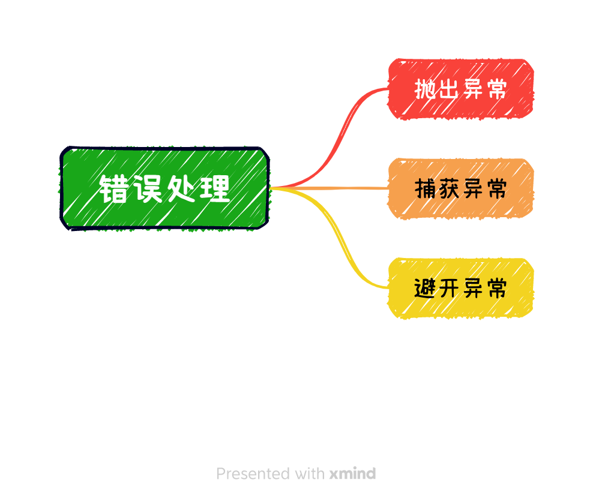

# 经验之谈

## 五年架构

动态前端页面项目，是一个生命周期相对较长，相对复杂的项目。最初定义的协议，在替换了制作平台和渲染平台，依然还在使用。

可见抽象协议的生命力。我所见证动态化落地页项目，从2018年至2023年，依然在迭代开发。

相对漫长生命周期，只有相对稳定的架构设计才能良好支撑迭代。中间也许会经历技术升级，繁杂的日常维护。

越抽象越稳定，越稳定越抽象。系统应当是建构在抽象之上。

- 用抽象来处理复杂性，约定良好的协议和接口等
- 用IoC和DI，解决所抽象的模块的依赖问题
- 用类来表示概念

底层架构的设计，和不断涌来的产品需求一样重要。随着用户数量的增加，场景的增加，问题的难度也会有质的变化。底层架构也会随时间的流逝，体现其价值。

也许为了赶进度，产品没有达到80分，但架构设计上，依然要保留将来达到80分，甚至90分的可能。

## 数据接入层

前端页面在设计的时候，很容易犯一个错误，缺乏统一的数据接入层，也缺乏对应的Model。直接使用后台接口返回的所有数据字段。或者直接从页面组件View中发起请求，更新View的内容。

直接使用API返回数据，后端的Model已经侵入到前端页面。无形中，对具体的后台有依赖。

因此，在一个应用中，对于第三方I/O(Http，JsBridge等)，应该放到单独的Service中。View无需关注Service的实现，只关注Service的接口即可。这样就隔离了第三方I/O的影响。


这个Service还可以支持：

1. 校验数据；失败，则抛出异常，展示兜底页面；
2. 设置默认值；
3. 格式化数据：获取返回的数据以后，格式化数据，将后台的数据，映射为前端所需的数据结构；
4. 作为adapter：支持多个不同的后台，特别是后台数据因种种原因无法保持一致的时候，在Service中可以统一格式；
5. mock数据：在开发、调试或自动化测试阶段，也可以mock数据，解耦前后端依赖；

```javascript

// 前端数据协议
type DataType = {
  attribute: string
};

// 后台定义的数据协议
type HttpDataType = {
  httpAttribute: string
};

// 默认值
const DEFAULT_DATA: DataType = {
  attribute: ''
};

class DataConversionService implements DataType {
  private pAttribute: DataType['attribute'] = DEFAULT_DATA.attribute;

  constructor() {}

  // 数据校验
  public hasAttribute(obj: unknown): obj is HttpDataType {
    return (obj as HttpDataType)?.httpAttribute !== undefined
        && typeof (obj as HttpDataType).httpAttribute === "string";
  }

  public convert(data: unknown) {
    if (this.hasAttribute(data)) {
      this.pAttribute = data?.httpAttribute;
    } else {
      // 日志
      console.log('缺少关键数据');
      // 上报
      // 抛出错误
      // 走兜底等等
    }
  }

  public get attribute(): DataType['attribute'] {
    if (this.pAttribute) {
      return this.pAttribute;
    } else {
      return DEFAULT_DATA.attribute;
    }
  }

  public set attribute(obj: unknown) {
    this.pAttribute = obj as DataType['attribute'];
  }
}

```

数据接入层的Service，隔离了对外的数据的依赖，只要数据通过数据接入的校验、格式化等，View中就可以放心的使用Service中的数据，不用在每一个用到的地方再次校验。

同时，有了这个统一的数据接入层，在页面加载的时候，可以很方便的处理页面的Loading、Success和Failed状态。


## 错误和异常的处理

现实世界不完美，意料之外的事情时有发生。

一个项目项目，不可能运行在一个完美的环境中，不像学校的大作业，完成功能即可，走happy path（也叫One True Path），忽略出错的因素。

现实世界的软件，需要考虑错误的处理。

- 错误可恢复，尽量恢复；
- 不能恢复，妥善退出，保护数据，清理资源，走到兜底
- 有必要，需要记录日志、重启模块

妥善处理错误，构建健壮系统。



### 什么是错误？


前端容易不重视异常的处理。

- [JavaScript 错误处理完全指南](https://www.infoq.cn/article/gls9hjusghqmll1zowwn)
- [错误处理(Error-Handling)：为何、何时、如何](https://blog.csdn.net/pongba/article/details/1815742?spm=1001.2014.3001.5501)
- [C++11（及现代C++风格）和快速迭代式开发](https://blog.csdn.net/pongba/article/details/7911997?spm=1001.2014.3001.5501)


## log

- 2023/7/20 初稿