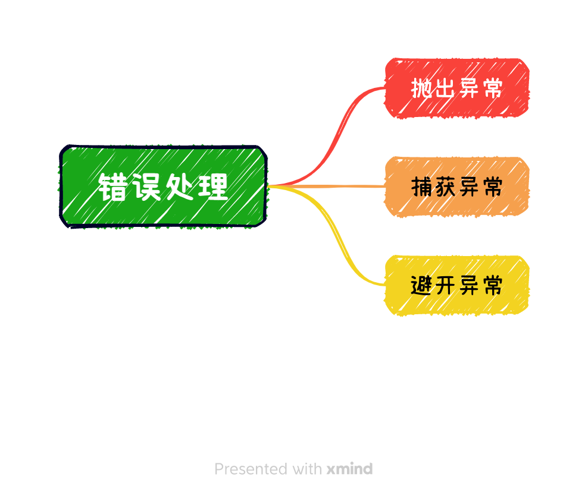

# 错误和异常的处理

#### 2023/7/23

现实世界不完美，意料之外的事情时有发生。

一个项目项目，不可能运行在一个完美的环境中，不像学校的大作业，完成功能即可，走happy path（也叫One True Path），忽略出错的因素。

现实世界的软件，需要考虑错误的处理。

- 错误可恢复，尽量恢复；
- 不能恢复，妥善退出，保护数据，清理资源，走到兜底
- 有必要，需要记录日志、重启模块

妥善处理错误，构建健壮系统。

### 什么是错误？

前端容易不重视异常的处理。

## 阅读资料

- [JavaScript 错误处理完全指南](https://www.infoq.cn/article/gls9hjusghqmll1zowwn)
- [错误处理(Error-Handling)：为何、何时、如何](https://blog.csdn.net/pongba/article/details/1815742?spm=1001.2014.3001.5501)
- [C++11（及现代C++风格）和快速迭代式开发](https://blog.csdn.net/pongba/article/details/7911997?spm=1001.2014.3001.5501)
- [Go 编程模式：错误处理](https://coolshell.org/articles/21140.html)

## log

- 2023/7/23 初稿