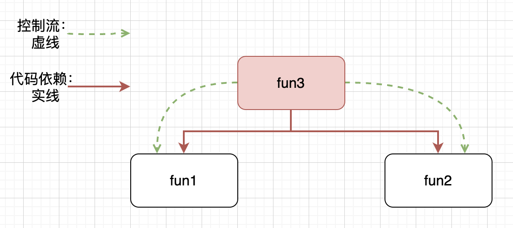

# IoC （控制反转）

#### 2023/8/18

## 编程范式

编程“范式”是公认遵守的“模式”，编程范式（OPP、FP等）是在编程行为上上做减法，得出的具有约束性的解决方案。

### 结构化编程

举例来说：

``` c
tag: fun1()
fun2()
fun3() {
  if (condition) {
    goto tag
  }
}

```

这是一个无约束的模式，非结构化编程，`goto`可以随意控制逻辑跳转，使得代码之间的联系不再是类似树形的结构，而是形成网状的拓扑结构，彼此之间随意跳转，很难从中形成一些彼此独立的单元。`goto`语句的用法，会导致代码无法被拆分为更小、可证明的单元，而这会导致，无法采用分治的策略，将大型问题，逐步拆分为更小、更易证明的单元。

禁止`goto`，禁止了逻辑的任意跳转。用顺序结构、分支结构和循环结构，三种结构来构造程序，即结构化编程。Dijkstra意识到，代码产用结构化编程，则一定可以把程序分解为更小、可证明的单元。Bohm和Jocopini证明了人们可以用顺序结构、分支结构、循环结构这三种结构构造出任何程序。也就证明了：构建可推导证明模块所需要的控制结构集，与构建所有程序所需的控制结构的最小集是等同的。

``` c
fun1()
fun2()
fun3() {
  if (condition) {
    fun1()
  } else {
    fun2()
  }
}

```



结构化编程范式将代码分解为可推导的单元，这就意味着，代码的可分解性质。我们可以把一个大型问题，拆分为一系列的高级模块组合，这些高级模块又可以继续拆分为一系列低级模块，如此递归，直到分解为一系列可以证明的小函数。至此，我们还可以写单元测试，来验证这些函数是否是错误的。如果单元测试无法证伪这些函数，那么我们就可以认为，这些函数足够正确，进而可以推导，整个代码是正确的。

简而言之，结构化编程限制了程序控制权的直接转移。

### OOP（面向对象）范式

上述例子中，`fun3`对`fun1`和`fun2`有直接依赖，`fun3`的实现，直接依赖了`fun1`和`fun2`。我们可以通过抽象接口，来处理直接依赖。

``` c
interface File {
  read()
}

Fun1 implement File {
  read() {
  
  }
}
Fun2 implement File {
  read() {
  
  }
}

fun3(file: File) {
  file.read()
}

```

`fun3`的实现，依赖的抽象出来的接口`File`，而不是直接依赖具体实现`fun1`或`fun2`。代码的依赖顺序，和运行顺序相反。逻辑的顺序（初始化file，调用`file.read()`），和代码的运行顺序（调用`file.read()`,根据file的类型分发，是相反的。这其实就是控制反转。

）


封装、继承和多态，是控制反转的不同侧面。类是逻辑分发规则的集合，对象是标记具有类属性的数据。程序以对象为维度构建，就是面向对象范式。通过控制反转，架构师可以在采用面向对象的编程范式的系统中，控制代码之间的依赖关系，而不再受控制流的限制。无论模块是被调用还是调用，架构师可以随意调整代码之间的依赖关系。

同时，通过控制反转，各模块直接依赖的是抽象的接口，使得模块各自相对独立，我们可以把模块编译为独立的组件或者部署单元，各个模块就可以独立部署演进。某个模块需要修改的时候，仅仅需要重新部署此模块即可。这样，模块可以分给不同的团队并行开发，便于项目分工协作。

#### 控制反转优点

使用传统的过程化程序设计，所创建出来的依赖关系结构，策略是依赖细节的。这是糟糕的，因为这样，会使策略受细节改变的影响。“面向对象”的程序设计，倒置了依赖关系结构，使得细节和策略都依赖于抽象，并且常常是客户拥有服务接口。

依赖倒置原则是实现许多面向对象技术，所宣称的好处的基本底层机制。他的正确应用，对于创建可重用的框架来说是必须的。同时他对于构建，在变化面前富有弹性的代码也是非常重要的。由于抽象和细节被彼此隔离，所以代码也非常容易维护

简而言之，面向对象编程，限制了程序控制权的间接转移。

### FP（函数式编程） 范式

程序在执行过程中，如果要做到，给逻辑单元固定的输入，就能得到固定的输出，那就需要要避免副作用，具体来说，要避免变量及其赋值语句。使用函数去实现没有副作用的单元，以函数为维度去构建程序，就是函数式编程范式。

程序设计中，一种典型的切分，就是切分为可变的组件和不可变组件。不可变组件，用纯函数来执行，期间不修改状态。状态的修改，会导致一系列的并发问题，通常需要用事务型内存来保护变量，避免同步更新和竞争状态。要点是：良好的应用程序，应该将状态修改的部分，和不需要修改状态的部分，隔离成组件，然后用合适的机制来保护可变量。同时，应该尽量将逻辑归于不可变组件，可变组件的逻辑越少越好。例如，事件溯源，数据存储不使用删除和更新，只存储事务记录，应用程序不是CRUD，而是只有CR，无删除和更新，自然就没有并发问题。

简而言之，函数式编程，约束了程序中赋值操作。

总之：
1. 函数式编程和面向对象，并不是完全对立。比如，用函数构建程序，也用对象来实现控制反转，可以是面向对象+函数式，是二者约束的并集；
2. 语言的约束，不等于范式的约束。在C中大量使用goto，就不能算结构化编程。反过来，C中也可以做面向对象；
3. 控制反转不一定要用面向对象，比如基于值的分发等，面向对象只是比较有名的方案。

## 静态与动态、绑定和非绑定

TypeScript的类型系统比较奇怪，主要是结构一致性（Structural Conformance），结构类型，只要语法结构一致即可，比如只需要支持特定的语法接口，拥有类型的属性一致，即使命名不一致，类型也匹配。而TypeScript中的枚举，是名字一致性（Named Conformance），指名类型，枚举的名字必须一致才行，即使结构相同名字不一致，类型也不匹配。主流的语言，如Java、C++，是指名类型。

```javascript
// 枚举值是指名类型
enum Tag1 {
  a = 1,
  b = 2,
}

enum Tag2 {
  a = 1,
  b = 2,
}

// 面向对象写法
const test1 = (p: Tag1) => {
 console.log(p);
}

test1(Tag1.a);
test1(Tag2.a); // Argument of type 'Tag2.a' is not assignable to parameter of type 'Tag1'.

// 泛型写法
const test2 = <T extends number>(p: T) => {
 console.log(p);
}

test2(Tag1.a);
test2(Tag2.a); // 规避了面向对象写法的类型不匹配问题

```

用更严格的语言，更容易暴露不同的多态的差异，如C++或C来考察一下，不同多态实现的成本，主要是耦合的成本。

我们假设有一个函数，参数是Stack，我们用不同方式来实现：

首先，直接传入Stack实体：

```cpp
void f(Stack S)
{
  // ...
}

```

其次，从实体上抽象出Stack接口，满足对应的接口即可：

```cpp
class IStack
{
  // ...
}

void f(IStack s)
{
  // ...
}
```

再次，在C，只需满足签名即可，不用匹配名称：

```c
struct stack
{
  int (*pop)();
  void(*push)(int);
  // ...
}
void f(struct stack s)
{
  // ...
}

```

最后，使用泛型，虚化掉类型，当前无类型语言使用，不依赖具体的接口，只需满足Stack这个概念（Concept）语义即可：

```cpp

void f<Stack>(Stack s){
  // ...
}
```

从接口参数的依赖可以看到，函数与参数的耦合，有不同的层次：

- 最强耦合，是实体耦合；
- 其次是OO的接口耦合；可以看成是：一组方法签名+对应方法名+一个类型的耦合
- 最弱的耦合是：签名耦合和泛型耦合；泛型可以看成是：一组方法签名+对应的方法名的耦合；而签名耦合简化为：一组方法签名的耦合；

在动态语言中，鸭子类型的哈希表也能做到类似效果。

模块之间的设计，重点在于低耦合，越低越好。而模块内，要避免过早抽象，也要避免依赖具体实现。

从写代码过程可知，OO设计的时候，需要事先准备好interface和基类，以及他们之间的关系。组装不同类的时候，还需要粘合层。
而泛型设计和签名耦合，只需要知道相关的接受函数即可。具体类型，可以延迟定义。

动/静和绑定性：

- 动态的绑定多态：基于OOP的虚函数的多态；
- 静态的非绑定多态：C++泛型；
- 动态的非绑定多态：脚本语言的鸭子类型；


## log

- 2023/8/18 初稿


