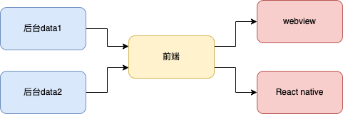

# IoC （控制反转）

#### 2023/8/18

## 编程范式

编程“范式”是公认遵守的“模式”，编程范式（OPP、FP等）是在编程行为上上做减法，得出的具有约束性的解决方案。

### 结构化编程

举例来说：

``` c
tag: fun1()
fun2()
fun3() {
  if (condition) {
    goto tag
  }
}

```

这是一个无约束的模式，非结构化编程，`goto`可以随意控制逻辑跳转，使得代码之间的联系不再是类似树形的结构，而是形成网状的拓扑结构，彼此之间随意跳转，很难从中形成一些彼此独立的单元。`goto`语句的用法，会导致代码无法被拆分为更小、可证明的单元，而这会导致，无法采用分治的策略，将大型问题，逐步拆分为更小、更易证明的单元。

禁止`goto`，禁止了逻辑的任意跳转。用顺序结构、分支结构和循环结构，三种结构来构造程序，即结构化编程。Dijkstra意识到，代码产用结构化编程，则一定可以把程序分解为更小、可证明的单元。Bohm和Jocopini证明了人们可以用顺序结构、分支结构、循环结构这三种结构构造出任何程序。也就证明了：构建可推导证明模块所需要的控制结构集，与构建所有程序所需的控制结构的最小集是等同的。

``` c
fun1()
fun2()
fun3() {
  if (condition) {
    fun1()
  } else {
    fun2()
  }
}

```


结构化编程范式将代码分解为可推导的单元，这就意味着，代码的可分解性质。我们可以把一个大型问题，拆分为一系列的高级模块组合，这些高级模块又可以继续拆分为一系列低级模块，如此递归，直到分解为一系列可以证明的小函数。至此，我们还可以写单元测试，来验证这些函数是否是错误的。如果单元测试无法证伪这些函数，那么我们就可以认为，这些函数足够正确，进而可以推导，整个代码是正确的。

### OOP（面向对象）范式和FP（函数式编程） 范式

上述例子中，`fun3`对`fun1`和`fun2`有直接依赖，`fun3`的实现，直接依赖了`fun1`和`fun2`。我们可以通过抽象接口，来处理直接依赖。

``` c
interface File {
  read()
}

Fun1 implement File {
  read() {
  
  }
}
Fun2 implement File {
  read() {
  
  }
}

fun3(file: File) {
  file.read()
}

```

`fun3`的实现，依赖的抽象出来的接口`File`，而不是直接依赖具体实现`fun1`或`fun2`。代码的依赖顺序，和运行顺序相反。逻辑的顺序（初始化file，调用`file.read()`），和代码的运行顺序（调用`file.read()`,根据file的类型分发，是相反的。这其实就是控制反转。

）


## 产品需求中的控制反转

用户通过所见即所得的编辑页面，生成一份数据。多个后台加工这份数据并添加其他相关数据，发送给前端。前端解析后台所给数据，通过多样化的组件和组件运行的上下文等，支持不同的渲染架构（如webview，React native等），渲染页面，支持交互。不妨称之为LEGO项目，因为通过多个组件拼成一个页面，和LEGO积木类似。



## 使用多态实现控制反转


## log

- 2023/8/18 初稿


