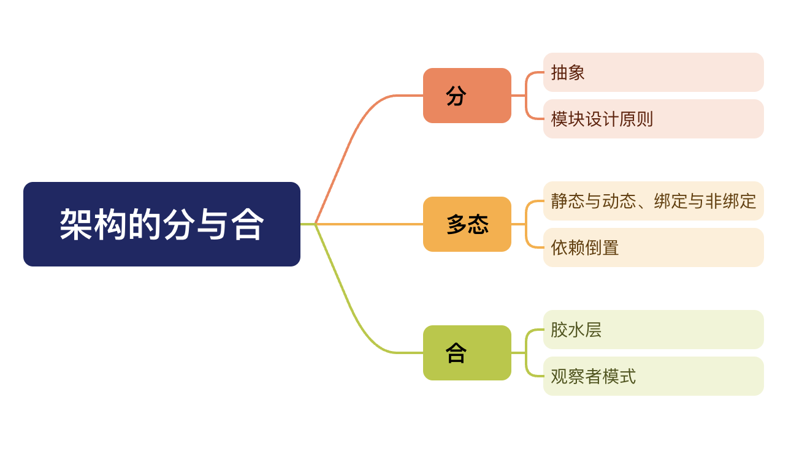
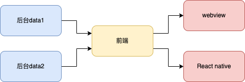

# 架构的分与合

#### 2023/08/10 

## 项目简介

用户通过所见即所得的编辑页面，生成一份数据。多个后台加工这份数据并添加其他相关数据，发送给前端。前端解析后台所给数据，支持不同的渲染架构（如webview，React native等），渲染页面，支持交互。

## 分

### 抽象

### 分层

### 依赖的方向

## 多态

### 静态和动态

### 绑定和非绑定

### 依赖倒置

## 合

### 胶水层

### 观察者模式

### 回调

## 基本设计理念

- 用类来表示概念
- 用抽象来处理复杂性
- 面向对象是手段之一，用具体类型来隐藏派生层次
- 用IoC和DI解决依赖问题

## log

- 2023/08/10 初稿
