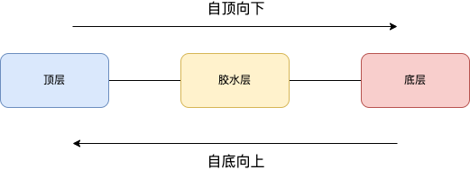

# 架构的分与合

#### 2023/08/10 


## 项目简介

用户通过所见即所得的编辑页面，生成一份数据。多个后台加工这份数据并添加其他相关数据，发送给前端。前端解析后台所给数据，通过多样化的组件和组件运行的上下文等，支持不同的渲染架构（如webview，React native等），渲染页面，支持交互。不妨称之为LEGO项目，因为通过多个组件拼成一个页面，和LEGO积木类似。


## 分

复杂的软件开发，需要遵循模块化的工程实践，用定义好的“界面”把模块连结起来，形成整个系统。这样，局部问题才能在局部得到修正或者优化，而不会破坏整体。

因此，复杂的软件工程，就要两个关键要素，模块的划分，以及模块的耦合。既要分得开，也要合得来。分得开，是指合理划分工程的模块，模块之间解耦，分发给合作的同学。合得来，是指模块分工以后，后面要统筹为一个整体的时候，各个模块能耦合到一起，完成一个完整的工程。

模块划分以后，模块之间有层次特征，在模块层次的时候，有两个方向可以选择：自顶向下和自底向上。

自顶向下设计，从抽象到细节，逐步细化，逐步完善。也可以自底向上推进，从细节到抽象，逐步归纳出概念。二者的关系，类似于演绎和演绎，从总到分，和从分到总。



在实际项目中，很少只使用其中一种，而是二者结合。

因为纯粹的自顶向下，当下到一定程度，发现实际工程无法支持所有顶层设计的原语。纯粹的自底向上，当上到一定层次，可能发现工程中，有很多于实际顶层无关的代码。

实际工程，人力有限，工期有限，为了发挥人力的效能，也为了稳妥起见，会同时使用自顶向下和自底向上。就像打通一个隧道，在山的左右两边同时开工，两端约定好位置，同时推进，在山的中间汇合。理想的汇合是无缝对接，但理想很丰满，现实很骨感，一般很难做到无缝对接。因此，对接的地方，一般会有一个胶水层，把二者结合起来。就像修隧道一样，对接的地方越小越好。工程中，胶水层越薄越好。

具体到LEGO项目，自顶向下设计，有前端的关键要素，页面的结构、样式、逻辑，大致等价于html、CSS和JavaScript。自底向上设计，则需考虑各个渲染架构的功能，如webview的image标签，与React native的image组件，二者支持的接口是否有差异，根据二者接口，抽象出一套基础组件接口，在基础组件实现接口，从而抹平二者差异，使得在上层使用的时候，不需要分别渲染在webview还是React native。实际往往两种设计互相关联，自顶向下需要考虑底层组件image的接口能力，不要设计出image无法支持的功能，而封装image组件为基础组件，则需要考虑封装的组件怎么和上层对接，props接口需要约定一致，使得解析之后的数据，能在组件使用。

### 抽象

**原则一：用抽象来处理复杂性。**

LEGO跑在多个终端APP上，不同的终端因历史版本等原因，实现的JS bridge不一致。比如获取数据的接口：

在A里面是：

```javascript
class DataEntity {
  getData() {
    callNativeMethod('getdata', params, callbackFn);
  }
}

const dataEntity = new DataEntity();
dataEntity.getData();
```

后面发现B里面的JS bridge和A中调用不一样。在B里面是：

```javascript
class DataEntity {
  getData() {
    callNative('getData', params, callbackFn);
  }
}

const dataEntity = new DataEntity();
dataEntity.getData();
```

不同的环境里面，调用方式不一致。后面可能还有其他的环境，获取数据的调用，各不相同，怎么应对呢？

我们把二者共同的部分抽象出来，在这个例子里面，都要调用客户端JS bridge，我们抽象一个公共的invoke接口。为调用方提供稳定的接口。具体所处的环境，留到其他地方处理（下文里面依赖倒置和胶水层等部分，会详细说明）。

```javascript
interface JSBridge {
  invoke(methodName: string, params: unknown, callbackFn: CallbackType): void;
}

export type CallbackFnType = (params: any) => void;

export class JSBridgeService implements JSBridge {
  private static callNativeFn: any;
  private constructor(callNativeMethod: CallbackType) {
    this.callNativeFn = callNativeMethod;
  }

  public invoke(
    methodName: string,
    params: any,
    callback: CallbackType,
  ) {
    // ...
  }
}

class DataEntity {
  constructor(private JSBirdge: JSBridge) {}
  getData() {
    this.JSBirdge.invoke('getData', {id: 123}, (data) => {})
  }
}
// A 环境里面
const dataEntity = new DataEntity(new JSBridgeService(callNativeMethod));
// or B环境里面
const dataEntity = new DataEntity(new JSBridgeService(callNative));
dataEntity.getData(); 
```


由于只需初始化一次，可以优化为用单例实现：

```javascript
interface JSBridge {
  invoke(methodName: string, params: unknown, callbackFn: CallbackType): void;
}

export type CallbackFnType = (params: any) => void;

export class JSBridgeService implements JSBridge {
  private static instance: JSBridgeService;
  private static callNativeFn: any;
  private constructor(callNativeMethod: CallbackType) {
    JSBridgeService.callNativeFn = callNativeMethod;
  }

  public static getInstance(callNativeFn: CallbackType) {
    if (!JSBridgeService.instance) {
      JSBridgeService.instance = new JSBridgeService(callNativeFn);
    }
    return JSBridgeService.instance;
  }

  public invoke(
    methodName: string,
    params: any,
    callback: CallbackType,
  ) {
    // ...
  }
}

class DataEntity {
  constructor(private JSBirdge: JSBridge) {}
  getData() {
    this.JSBirdge.invoke('getData', {id: 123}, (data) => {})
  }
}
// A 环境里面
const dataEntity = new DataEntity(JSBridgeService.getInstance(callNativeMethod));
// or B环境里面
const dataEntity = new DataEntity(JSBridgeService.getInstance(callNative));
dataEntity.getData(); 
```

### 模块设计原则

来自Bob大叔的《架构整洁之道》

聚合原则：

1. CRP-共同重用原则：如果包经常因为不同原因变化，就需要把包拆分为不同的包

2. CCP-共同封闭原则：如果两个包因为相同原因共同变化，就把两个合并


耦合原则：

1. SDP-稳定依赖原则：依赖方向指向稳定模块

2. SAP-稳定抽象原则：越稳定，越抽象

3. ADP-依赖无环原则：依赖图是一个有向无环图


## 多态

原则二：用类来表示概念

### 静态与动态、绑定和非绑定

### 依赖倒置

原则三：用IoC和DI解决依赖问题


## 合

### 胶水层

### 观察者模式


## log

- 2023/08/10 初稿
