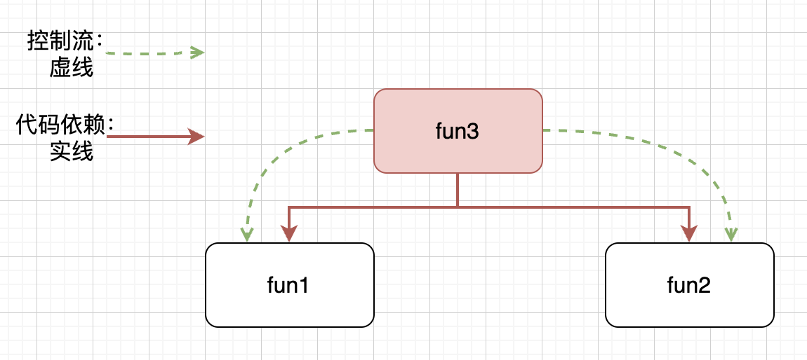
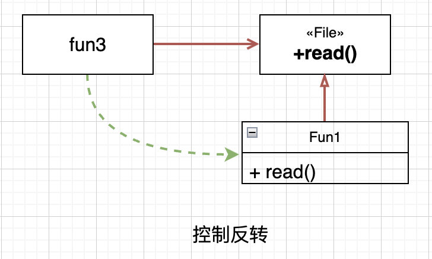
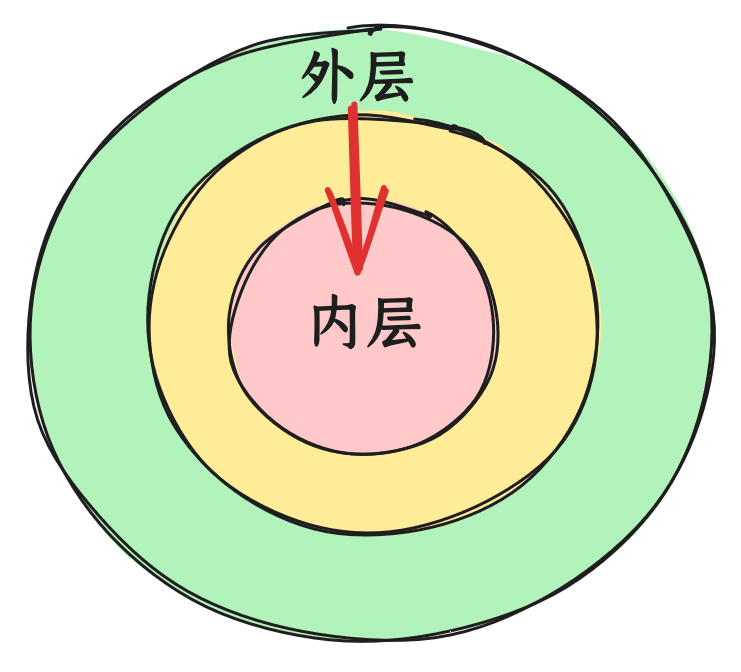

# IoC （控制反转）

#### 2023/8/18

## 编程范式

编程“范式”是公认遵守的“模式”，编程范式（OPP、FP等）是在编程行为上上做减法，得出的具有约束性的解决方案。

### 结构化编程

举例来说：

``` c
tag: fun1()
fun2()
fun3() {
  if (condition) {
    goto tag
  }
}

```

这是一个无约束的模式，非结构化编程，`goto`可以随意控制逻辑跳转，使得代码之间的联系不再是类似树形的结构，而是形成网状的拓扑结构，彼此之间随意跳转，很难从中形成一些彼此独立的单元。`goto`语句的用法，会导致代码无法被拆分为更小、可证明的单元，而这会导致，无法采用分治的策略，将大型问题，逐步拆分为更小、更易证明的单元。

禁止`goto`，禁止了逻辑的任意跳转。用顺序结构、分支结构和循环结构，三种结构来构造程序，即结构化编程。Dijkstra意识到，代码产用结构化编程，则一定可以把程序分解为更小、可证明的单元。Bohm和Jocopini证明了人们可以用顺序结构、分支结构、循环结构这三种结构构造出任何程序。也就证明了：构建可推导证明模块所需要的控制结构集，与构建所有程序所需的控制结构的最小集是等同的。

``` c
fun1()
fun2()
fun3() {
  if (condition) {
    fun1()
  } else {
    fun2()
  }
}

```



结构化编程范式将代码分解为可推导的单元，这就意味着，代码的可分解性质。我们可以把一个大型问题，拆分为一系列的高级模块组合，这些高级模块又可以继续拆分为一系列低级模块，如此递归，直到分解为一系列可以证明的小函数。至此，我们还可以写单元测试，来验证这些函数是否是错误的。如果单元测试无法证伪这些函数，那么我们就可以认为，这些函数足够正确，进而可以推导，整个代码是正确的。

简而言之，结构化编程限制了程序控制权的直接转移。

### OOP（面向对象）范式

上述例子中，`fun3`对`fun1`和`fun2`有直接依赖，`fun3`的实现，直接依赖了`fun1`和`fun2`。我们可以通过抽象接口，来处理直接依赖。

``` javascript
interface File {
  read()
}

Fun1 implement File {
  read() {
  
  }
}
Fun2 implement File {
  read() {
  
  }
}

fun3(file: File) {
  file.read()
}

```

`fun3`的实现，依赖的抽象出来的接口`File`，而不是直接依赖具体实现`fun1`或`fun2`。代码的依赖顺序，和运行顺序相反。逻辑的顺序（初始化file，调用`file.read()`），和代码的运行顺序（调用`file.read()`,根据file的类型分发，是相反的。这其实就是控制反转。



封装、继承和多态，是控制反转的不同侧面。类是逻辑分发规则的集合，对象是标记具有类属性的数据。程序以对象为维度构建，就是面向对象范式。通过控制反转，架构师可以在采用面向对象的编程范式的系统中，控制代码之间的依赖关系，而不再受控制流的限制。无论模块是被调用还是调用，架构师可以随意调整代码之间的依赖关系。

同时，通过控制反转，各模块直接依赖的是抽象的接口，使得模块各自相对独立，我们可以把模块编译为独立的组件或者部署单元，各个模块就可以独立部署演进。某个模块需要修改的时候，仅仅需要重新部署此模块即可。这样，模块可以分给不同的团队并行开发，便于项目分工协作。

#### 控制反转优点

使用传统的过程化程序设计，所创建出来的依赖关系结构，策略是依赖细节的。这是糟糕的，因为这样，会使策略受细节改变的影响。“面向对象”的程序设计，倒置了依赖关系结构，使得细节和策略都依赖于抽象，并且常常是客户拥有服务接口。

依赖倒置原则是实现许多面向对象技术，所宣称的好处的基本底层机制。他的正确应用，对于创建可重用的框架来说是必须的。同时他对于构建，在变化面前富有弹性的代码也是非常重要的。由于抽象和细节被彼此隔离，所以代码也非常容易维护

简而言之，面向对象编程，限制了程序控制权的间接转移。

### FP（函数式编程） 范式

程序在执行过程中，如果要做到，给逻辑单元固定的输入，就能得到固定的输出，那就需要要避免副作用，具体来说，要避免变量及其赋值语句。使用函数去实现没有副作用的单元，以函数为维度去构建程序，就是函数式编程范式。

程序设计中，一种典型的切分，就是切分为可变的组件和不可变组件。不可变组件，用纯函数来执行，期间不修改状态。状态的修改，会导致一系列的并发问题，通常需要用事务型内存来保护变量，避免同步更新和竞争状态。要点是：良好的应用程序，应该将状态修改的部分，和不需要修改状态的部分，隔离成组件，然后用合适的机制来保护可变量。同时，应该尽量将逻辑归于不可变组件，可变组件的逻辑越少越好。例如，事件溯源，数据存储不使用删除和更新，只存储事务记录，应用程序不是CRUD，而是只有CR，无删除和更新，自然就没有并发问题。

简而言之，函数式编程，约束了程序中赋值操作。

总之：
1. 函数式编程和面向对象，并不是完全对立。比如，用函数构建程序，也用对象来实现控制反转，可以是面向对象+函数式，是二者约束的并集；
2. 语言的约束，不等于范式的约束。在C中大量使用goto，就不能算结构化编程。反过来，C中也可以做面向对象；
3. 控制反转不一定要用面向对象，比如基于值的分发等，面向对象只是比较有名的方案。

## 依赖反转

组件从用户的键盘输入获取信息：

``` javascript
class Component {
    read() {
        // 用户键盘输入
    }
}

const component = new Component();
component.read();
```

后面有用户要求支持通过文件批量输入。我们需要支持两种不同的输入方式，就需要去看Component的代码，并修改read方法。

修改一处可能还好，但有可能项目中，其他地方也需要支持新的输入方式，我们不得不全量搜索代码，并修改。本来预期是简单的修改，现在影响到多处，自测和测试验证的工作量巨大，还会增加新版本发布的风险。

所以需要抽象这里代码，首先，我们会想到把输入抽象一下，向调用方提供一套共同的抽象。其次，调用方不需要感知输入的具体实现，不用知道是来源于键盘还是文件。最后，调用不用感知的代码，可以放到其他地方，比如外部注入等等。

### In Unix, everything is a file

计算机输入和输出的抽象，自然就会联想到著名的UNIX操作系统对IO设备的抽象，“In Unix, everything is a file”。基于file，统一了两个方面：

1. 统一命名空间（namespace），参数是文件系统（file system）的路径。保证了系统资源，有相同的方式去发现；
2. 统一访问接口（interface），方式是标准的read、write等。保证了系统资源，能以相同的方式去操作；

系统通过 file的形式，实现了对多种多样系统资源的使用。具体来说，Unix要求IO设备都需要提供open、close、read、write和seek这5个标准函数：

``` c
struct FILE {
  void (*open)(char* name,int mode);
  void (*close)();
  int (*read)();
  void (*write)(char);
  void (*seek)(long index,int mode);
};
```

然后，具体IO设备，如控制台，就需要提供这个5个函数的实际实现，将FILE结构体的函数指针，指向这些对应实现函数：

``` c
#include "file.h"
void open(char* name,int mode){/*...*/}
void close(){/*...*/}
int read(){int c;/*...*/ return c;}
void write(char c){/*...*/}
void seek(long index,int mode){/*...*/}

struct FILE console = {open, close, read, write, seek};
```

现在，标准输入STDIN的定义是`FILE*`， 而`FILE*`指向了控制台这个数据结构。举例来说，`getchar()`的实现：

``` c
extern struct FILE* STDIN;

int getchar(){
  return STDIN-＞read();
}

```

`getchar()`只是通过指针，间接调用了FILE数据结构体中read函数指针，所实际指向的函数。

以前编程方法，其实正是多态的简单实现。在面向对象中，如C++，类的每个虚函数（virtual function）的地址，被记录在vtable的数据结构中，虚函数调用先查询这个表，类似上面C通过指针的调用。通过上面C语言例子，可以知道在C也可以实现多态。因此，面向对象在多态上，其实没有理论创新，只是让多态便于使用，更安全，函数指针比较灵活，需要人为遵循约定。

从例子可以看到多态的优点。如果需要支持新的IO设备，程序不需要修改，而只需要新设备的驱动，实现FILE结构体的5个标准函数即可。这样就实现了，程序与设备无关。程序反过来控制设备了，设备依赖程序的接口约定，依赖也反转了。

#### 一切皆文件的缺点

首先，没有做到一切皆文件。比如，线程不是文件，没有办法用poll等待线程退出，只能join。poll也不能用于磁盘IO。
其次，为了兼顾不同资源的特点，访问操作被定义为，最基础最原始的字符串读写。更高级别的抽象，与普遍性，难以调和，会牺牲掉前面FILE的两个统一性和普遍性。

### 依赖抽象而不是具体实现

从Unix的设计可知，我们可以抽象一个read接口：

``` javascript
interface IO {
    read(): void;
}

class Component {
    constructor(private io: IO) {

    }
    read() {
        this.io.read();
    }
}

class KeyboarInput implements IO {
    read() {

    }
}

class FileInput implements IO {
    read() {
        
    }
}

const component = new Component(new KeyboarInput());
// or
// const component = new Component(new FileInput());
component.read();
```

Component不再直接依赖具体的输入，而是依赖抽象的IO接口。后续如果还有新增的输入，接口可以保持统一，新增一个具体实现即可。Component本身不需要修改。

但还是会有修改的地方，很显然修改无法避免，Component初始化的时候，需要选择具体的输入对象。因此，修改不可避免，但核心模块的修改成本更高，类似Component作为核心模块，依赖抽象的接口，规避修改，让修改发生在外层，降低了修改的成本，代码维护更简易。

Component依赖具体IO对象，一般而言，会放到较外层，典型有以下3种方案：

- 在项目入口的main函数中；
- 用工厂方法创建；
- 使用依赖注入；

### 单向依赖

在工程中，核心逻辑一般相对稳定，外层与输入输出接近的地方，逻辑相对容易变化。

比如前端典型的逻辑与UI分离的设计，UI可能是浏览器，也可能在小程序，或者在iOS或安卓原生化架构。逻辑是核心，UI变化多。我们把业务逻辑放到核心，依赖抽象出来的UI接口，就可以在各种UI上复用逻辑，让UI去适配不同平台即可。具体来说，逻辑是核心，依赖抽象的UI接口，而不依赖具体的渲染架构。而UI可以依赖逻辑，业务逻辑变化的时候，UI需要变化。但UI渲染平台切换的时候，保持逻辑相对不变。

也就是依赖其实有合理的方向，外层模块可以依赖核心模块，但核心模块不应该依赖外层模块。

依赖不仅仅是单向的，而是应该是指向核心模块。



## 工厂模式

在上述例子中，Component不再依赖具体的IO实现，而是依赖接口，在外层将IO的实例，传入Component对象中。然而，有时候核心模块可能需要，在内部创建所依赖的外层对象。单向依赖要求我们，核心模块依赖抽象接口，不应该感知具体对象。怎么办呢？

我们可以进一步抽象，把创建的逻辑，用工厂模式抽象出来。我们抽象出一个IOFactory类，当他被调用的时候，会创建具体的IO对象。


### 工厂模式：简单工厂模式

``` javascript
interface IO {
    read(): void;
}

class Component {
    constructor() {

    }
    read() {
        new IOFactory().createIO('KeyboarInput').read();
    }
}

class IOFactory {
    createIO(type: string): IO {
        if (type === 'KeyboarInput') {
            return new KeyboarInput();
        }
        if (type === 'FileInput') {
            return new FileInput();
        }
        return new KeyboarInput();
    }
}

class KeyboarInput implements IO {
    read() {

    }
}

class FileInput implements IO {
    read() {
        
    }
}

const component = new Component();
component.read();
```


### 工厂模式：工厂方法模式

简单工厂模式，在业务复杂的时候，面临维护问题：

1. 一旦需要新增工厂所需创建对象，需要修改工厂类的内部代码；
2. 部分对象创建比较复杂，可能需要复杂业务计算，这部分放到工厂类中，不易维护；

可以进一步优化为工厂方法模式：

``` javascript
interface IO {
    read(): void;
}

interface IOFactory {
    create(): IO;
}

class KeyboarInputFactory implements IOFactory {
    create(): IO {
        return new KeyboarInput();
    }
}

class FileInputFactory implements IOFactory {
    create(): IO {
        return new FileInput();
    }
}

class Component {
    read(type: string) {
        let ioFactory: IOFactory = new KeyboarInputFactory();
        if (type === 'KeyboarInput') {
            ioFactory = new KeyboarInputFactory();
        } else if (type === 'FileInput') {
            ioFactory = new FileInputFactory();
        }
        ioFactory.create().read();
    }
}

class KeyboarInput implements IO {
    read() {

    }
}

class FileInput implements IO {
    read() {
        
    }
}

const component = new Component();
component.read('KeyboarInput');
```

Component中可能会有大量的if语句，不便于维护。还可以进一步抽象。

抽象工厂模式：

``` javascript
interface IO {
    read(): void;
}

interface IOFactory {
    create(): IO;
}

class KeyboarInputFactory implements IOFactory {
    create(): IO {
        return new KeyboarInput();
    }
}

class FileInputFactory implements IOFactory {
    create(): IO {
        return new FileInput();
    }
}

class IOFactoryFactory {
    constructor(
        private map: Map<string, new (...arg: any[]) => IOFactory> = new Map()
    ) {
        this.init()
    }
    init() {
        this.map.set('KeyboarInput', KeyboarInputFactory);
        this.map.set('FileInput', FileInputFactory);
    }

    createIOFactory(type: string) {
        const IOFactoryClass = this.map.get(type);
        if (IOFactoryClass) {
            return new IOFactoryClass();
        } else {
            throw new Error('类型不存在');
        }
    }

}

class Component {
    read(type: string) {
        new IOFactoryFactory().createIOFactory(type).create().read();
    }
}

class KeyboarInput implements IO {
    read() {

    }
}

class FileInput implements IO {
    read() {
        
    }
}

const component = new Component();
component.read('KeyboarInput');
```

## 胶水层

值得警醒的是：开发的时候，一般有两种策略，自底向上和自顶向下，无论使用那种策略，或者混合使用。不可避免需要一层胶水层，来粘合“底”和“顶”。在OOP中，我们通过IoC，用抽象的接口来实现，由于OOP中抽象接口，既常见又易用，很容易导致胶水层的膨胀，抽象过多的层次，从而增加复杂度。

Unix哲学认为，胶水层，应该尽量的薄。胶水层越多，越复杂。

## 依赖注入（Dependency injection）

工厂模式中，模块本来需要接受各种参数，来构造一个对象。现在通过工厂模式，模块只需接受一个已经实例化的对象。对象的使用，和他的构造方式解耦了，控制操作交给了工厂，也就是所谓的“控制反转”。

工厂模式把对象的创建抽象了，类不再直接依赖对象，而是依赖抽象出来的对象工厂。在工厂模式中，需要new出来的对象，得专门实现对应的工厂。还可以更进一步，用一种通用的模式，去new对象，不用每次遇到类，就要去新增工厂。较为典型的实现有依赖注入。

控制反转是一种思想，依赖注入是这种思想的一种技术实现。这一技术，让一个模块，接受所依赖的对象。所谓“注入”，就是从模块角度来看，依赖的对象是外部传递过来的。模块不需要关心这些对象构建，即new的过程。

TypeScript中简单的依赖注入实现：

``` javascript
import "reflect-metadata";

type Constructor<T = any> = new (...args: any[]) => T;

const Injectable = (): ClassDecorator => target => {};

class Service {
    prop = 1;
}

@Injectable()
class TestService {
    constructor(public readonly service: Service) {}
    test() {
        console.log(this.service.prop);
    }
}

const Factory = <T extends any>(target: Constructor<T>): T => {
    // 获取所有注入服务
    const providers = Reflect.getMetadata('design:paramtypes', target); // [Service]
    const args = providers.map((provider: Constructor) => new provider());
    return new target(...args);
};

Factory(TestService).test(); // 1

```

注：metadata，元数据，即用来定义数据的数据，比如数据A，有数据类型等，来描述这个数据。在JavaScript中，给对象添加额外的元数据，不影响这个对象的结果，不会有多的property。常用来实现依赖注入。


## 阅读资料

- [从面向对象的设计模式看软件设计](https://coolshell.org/articles/8961.html/)

- [详解依赖注入的原理与实现](https://aaaaash.notion.site/e5674b99d1b5480988a1b3b2bdf52370)

## log

- 2023/8/18 初稿
- 2023/8/19 依赖反转初稿
- 2023/8/20 吃辣，肚子不舒服，不能入睡，起来写工厂模式

