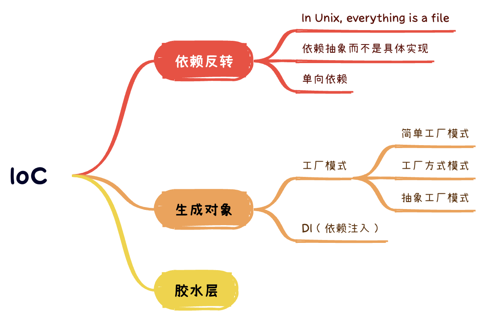

# IoC （控制反转）

#### 2023/8/18



> 着重讲抽象，以Unix的文件设计为例子，讲核心模块应该依赖抽象，而不是具体实现。有核心模块，就有外层模块，外层可以依赖核心模块，而核心模块不应该依赖外层模块，即依赖应该有方向。

> 抽象以后，运行的时候，还需要生成抽象对应的具体对象，这里提到两种常见方案：工厂模式和依赖注入。

> 通过上面的内容，手握抽象利器，可能以为找到的银弹。实际不然，不恰当的抽象，会导致严重的问题。特别是架构设计的时候，要么自顶向下，要么自底向上，无论哪一种，抽象和具体细节，必然如同两列同一个轨道的列车，惨烈的撞在一起。简单提到Unix设计中的原则，胶水层应该尽量薄。


## 依赖反转

不同的编程范式，对程序有不同约束。具体论述见[编程范式](../../PL/2023_08_28_oop_fp.md)。我们从编程设计中，也会有各种各样的约束，常见地是受外部依赖细节的制约。架构设计上，我们怎么应对这种依赖细节的约束呢？

组件从用户的键盘输入获取信息：

``` javascript
class Component {
    read() {
        // 用户键盘输入
    }
}

const component = new Component();
component.read();
```

后面有用户要求支持通过文件批量输入。我们需要支持两种不同的输入方式，就需要去看Component的代码，并修改read方法。

修改一处可能还好，但有可能项目中，其他地方也需要支持新的输入方式，我们不得不全量搜索代码，并修改。本来预期是简单的修改，现在影响到多处，自测和测试验证的工作量巨大，还会增加新版本发布的风险。

所以需要抽象这里代码，首先，我们会想到把输入抽象一下，向调用方提供一套共同的抽象。其次，调用方不需要感知输入的具体实现，不用知道是来源于键盘还是文件。最后，调用不用感知的代码，可以放到其他地方，比如外部注入等等。

### In Unix, everything is a file

计算机输入和输出的抽象，自然就会联想到著名的UNIX操作系统对IO设备的抽象，“In Unix, everything is a file”。基于file，统一了两个方面：

1. 统一命名空间（namespace），参数是文件系统（file system）的路径。保证了系统资源，有统一的方式去获取；
2. 统一访问接口（interface），方式是标准的read、write等。保证了系统资源，能以相同的方式去操作；

系统通过 file的形式，实现了对多种多样系统资源的使用。具体来说，Unix要求IO设备都需要提供open、close、read、write和seek这5个标准函数：

``` c
struct FILE {
  void (*open)(char* name,int mode);
  void (*close)();
  int (*read)();
  void (*write)(char);
  void (*seek)(long index,int mode);
};
```

然后，具体IO设备，如控制台，就需要提供这个5个函数的实际实现，将FILE结构体的函数指针，指向这些对应实现函数：

``` c
#include "file.h"
void open(char* name,int mode){/*...*/}
void close(){/*...*/}
int read(){int c;/*...*/ return c;}
void write(char c){/*...*/}
void seek(long index,int mode){/*...*/}

struct FILE console = {open, close, read, write, seek};
```

现在，标准输入STDIN的定义是`FILE*`， 而`FILE*`指向了控制台这个数据结构。举例来说，`getchar()`的实现：

``` c
extern struct FILE* STDIN;

int getchar(){
  return STDIN-＞read();
}

```

`getchar()`只是通过指针，间接调用了FILE数据结构体中read函数指针，所实际指向的函数。

以前编程方法，其实正是多态的简单实现。在面向对象中，如C++，类的每个虚函数（virtual function）的地址，被记录在vtable的数据结构中，虚函数调用先查询这个表，类似上面C通过指针的调用。通过上面C语言例子，可以知道在C也可以实现多态。因此，面向对象在多态上，其实没有理论创新，只是让多态便于使用，更安全，函数指针比较灵活，需要人为遵循约定。

从例子可以看到多态的优点。如果需要支持新的IO设备，程序不需要修改，而只需要新设备的驱动，实现FILE结构体的5个标准函数即可。这样就实现了，程序与设备无关。程序反过来控制设备了，设备依赖程序的接口约定，依赖也反转了。

#### 一切皆文件的缺点

首先，没有做到一切皆文件。比如，线程不是文件，没有办法用poll等待线程退出，只能join。poll也不能用于磁盘IO。
其次，为了兼顾不同资源的特点，访问操作被定义为，最基础最原始的字符串读写。更高级别的抽象，与普遍性，难以调和，会牺牲掉前面FILE的两个统一性和普遍性。

### 依赖抽象而不是具体实现

从Unix的设计可知，我们可以抽象一个read接口：

``` javascript
interface IO {
    read(): void;
}

class Component {
    constructor(private io: IO) {

    }
    read() {
        this.io.read();
    }
}

class KeyboarInput implements IO {
    read() {

    }
}

class FileInput implements IO {
    read() {
        
    }
}

const component = new Component(new KeyboarInput());
// or
// const component = new Component(new FileInput());
component.read();
```

Component不再直接依赖具体的输入，而是依赖抽象的IO接口。后续如果还有新增的输入，接口可以保持统一，新增一个具体实现即可。Component本身不需要修改。

但还是会有修改的地方，很显然修改无法避免，Component初始化的时候，需要选择具体的输入对象。因此，修改不可避免，但核心模块的修改成本更高，类似Component作为核心模块，依赖抽象的接口，规避修改，让修改发生在外层，降低了修改的成本，代码维护更简易。

Component依赖具体IO对象，一般而言，会放到较外层，典型有以下3种方案：

- 在项目入口的main函数中；
- 用工厂方法创建；
- 使用依赖注入；

### 单向依赖

在工程中，核心逻辑一般相对稳定，外层与输入输出接近的地方，逻辑相对容易变化。

比如前端典型的逻辑与UI分离的设计，UI可能是浏览器，也可能在小程序，或者在iOS或安卓原生化架构。逻辑是核心，UI变化多。我们把业务逻辑放到核心，依赖抽象出来的UI接口，就可以在各种UI上复用逻辑，让UI去适配不同平台即可。具体来说，逻辑是核心，依赖抽象的UI接口，而不依赖具体的渲染架构。而UI可以依赖逻辑，业务逻辑变化的时候，UI需要变化。但UI渲染平台切换的时候，保持逻辑相对不变。

也就是依赖其实有合理的方向，外层模块可以依赖核心模块，但核心模块不应该依赖外层模块。

依赖不仅仅是单向的，而是应该是指向核心模块。


## 生成对象

设计上依赖抽象以后，代码实际执行，仍然需要有实际的对象。怎么生成这些依赖的对象呢？

常见的方案有工厂模式和依赖注入。

### 工厂模式

在上述例子中，Component不再依赖具体的IO实现，而是依赖接口，在外层将IO的实例，传入Component对象中。然而，有时候核心模块可能需要，在内部创建所依赖的外层对象。单向依赖要求我们，核心模块依赖抽象接口，不应该感知具体对象。怎么办呢？

我们可以进一步抽象，把创建的逻辑，用工厂模式抽象出来。我们抽象出一个IOFactory类，当他被调用的时候，会创建具体的IO对象。


### 工厂模式：简单工厂模式

``` javascript
interface IO {
    read(): void;
}

class Component {
    constructor() {

    }
    read() {
        new IOFactory().createIO('KeyboarInput').read();
    }
}

class IOFactory {
    createIO(type: string): IO {
        if (type === 'KeyboarInput') {
            return new KeyboarInput();
        }
        if (type === 'FileInput') {
            return new FileInput();
        }
        return new KeyboarInput();
    }
}

class KeyboarInput implements IO {
    read() {

    }
}

class FileInput implements IO {
    read() {
        
    }
}

const component = new Component();
component.read();
```


### 工厂模式：工厂方法模式

简单工厂模式，在业务复杂的时候，面临维护问题：

1. 一旦需要新增工厂所需创建对象，需要修改工厂类的内部代码；
2. 部分对象创建比较复杂，可能需要复杂业务计算，这部分放到工厂类中，不易维护；

可以进一步优化为工厂方法模式：

``` javascript
interface IO {
    read(): void;
}

interface IOFactory {
    create(): IO;
}

class KeyboarInputFactory implements IOFactory {
    create(): IO {
        return new KeyboarInput();
    }
}

class FileInputFactory implements IOFactory {
    create(): IO {
        return new FileInput();
    }
}

class Component {
    read(type: string) {
        let ioFactory: IOFactory = new KeyboarInputFactory();
        if (type === 'KeyboarInput') {
            ioFactory = new KeyboarInputFactory();
        } else if (type === 'FileInput') {
            ioFactory = new FileInputFactory();
        }
        ioFactory.create().read();
    }
}

class KeyboarInput implements IO {
    read() {

    }
}

class FileInput implements IO {
    read() {
        
    }
}

const component = new Component();
component.read('KeyboarInput');
```

Component中可能会有大量的if语句，不便于维护。还可以进一步抽象。

### 工厂模式：抽象工厂模式

``` javascript
interface IO {
    read(): void;
}

interface IOFactory {
    create(): IO;
}

class KeyboarInputFactory implements IOFactory {
    create(): IO {
        return new KeyboarInput();
    }
}

class FileInputFactory implements IOFactory {
    create(): IO {
        return new FileInput();
    }
}

class IOFactoryFactory {
    constructor(
        private map: Map<string, new (...arg: any[]) => IOFactory> = new Map()
    ) {
        this.init()
    }
    init() {
        this.map.set('KeyboarInput', KeyboarInputFactory);
        this.map.set('FileInput', FileInputFactory);
    }

    createIOFactory(type: string) {
        const IOFactoryClass = this.map.get(type);
        if (IOFactoryClass) {
            return new IOFactoryClass();
        } else {
            throw new Error('类型不存在');
        }
    }

}

class Component {
    read(type: string) {
        new IOFactoryFactory().createIOFactory(type).create().read();
    }
}

class KeyboarInput implements IO {
    read() {

    }
}

class FileInput implements IO {
    read() {
        
    }
}

const component = new Component();
component.read('KeyboarInput');
```

### 依赖注入（Dependency injection）

工厂模式中，模块本来需要接受各种参数，来构造一个对象。现在通过工厂模式，模块只需接受一个已经实例化的对象。对象的使用，和他的构造方式解耦了，控制操作交给了工厂，也就是所谓的“控制反转”。

工厂模式把对象的创建抽象了，类不再直接依赖对象，而是依赖抽象出来的对象工厂。在工厂模式中，需要new出来的对象，得专门实现对应的工厂。还可以更进一步，用一种通用的模式，去new对象，不用每次遇到类，就要去新增工厂。较为典型的实现有依赖注入。

控制反转是一种思想，依赖注入是这种思想的一种技术实现。这一技术，让一个模块，接受所依赖的对象。所谓“注入”，就是从模块角度来看，依赖的对象是外部传递过来的。模块不需要关心这些对象构建，即new的过程。

TypeScript中简单的依赖注入实现：

``` javascript
import "reflect-metadata";

type Constructor<T = any> = new (...args: any[]) => T;

const Injectable = (): ClassDecorator => target => {};

class Service {
    prop = 1;
}

@Injectable()
class TestService {
    constructor(public readonly service: Service) {}
    test() {
        console.log(this.service.prop);
    }
}

const Factory = <T extends any>(target: Constructor<T>): T => {
    // 获取所有注入服务
    const providers = Reflect.getMetadata('design:paramtypes', target); // [Service]
    const args = providers.map((provider: Constructor) => new provider());
    return new target(...args);
};

Factory(TestService).test(); // 1

```

注：metadata，元数据，即用来定义数据的数据，比如数据A，有数据类型等，来描述这个数据。在JavaScript中，给对象添加额外的元数据，不影响这个对象的结果，不会有多的property。常用来实现依赖注入。

## 胶水层

值得警醒的是：开发的时候，一般有两种策略，自底向上和自顶向下，无论使用那种策略，或者混合使用。不可避免需要一层胶水层，来粘合“底”和“顶”。在OOP中，我们通过IoC，用抽象的接口来实现，由于OOP中抽象接口，既常见又易用，很容易导致胶水层的膨胀，抽象过多的层次，从而增加复杂度。

Unix哲学认为，胶水层，应该尽量的薄。胶水层越多，越复杂。

《Uinx编程艺术》：

> 一层胶合层已经很容易出错了，但这还不是最糟糕的。如果一个设计者意识到胶合层的存在，并且试图去用自己的一套数据结构或者对象把这个胶合层组织到一个中间层中，那么结果就会是多出两个胶合层—-一个在那个中间层之上，一个在其下。那些聪明但却欠缺历练的程序员经常积极地跳到这个陷阱里去。他们把基本的类（应用逻辑，中层和元操作）做得像课本上的例子那样漂亮，最后却为了把这些漂亮的代码粘合到一起而在很多个越来越厚的胶合层中忙得团团转，直到困死。

> C语言本身被认为是薄胶合层的良好范例。

## 阅读资料

- [从面向对象的设计模式看软件设计](https://coolshell.org/articles/8961.html/)

- [详解依赖注入的原理与实现](https://aaaaash.notion.site/e5674b99d1b5480988a1b3b2bdf52370)

## log

- 2023/8/18 初稿
- 2023/8/19 依赖反转初稿
- 2023/8/20 吃辣，肚子不舒服，不能入睡，起来写工厂模式
- 2023/8/21 补充依赖注入
- 2023/8/22 修正错别字
- 2023/8/24 添加提纲，并新增过渡段落
- 2023/8/25 修正不通顺语句
- 2023/8/28 补充SICP观点，补充面向对象和函数式编程在何场景使用
