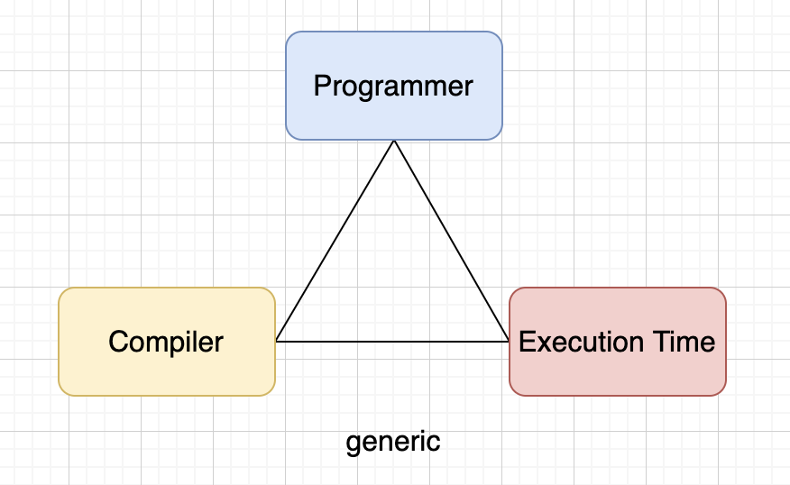

# 多态

## In Unix, everything is a file

计算机输入和输出的抽象，自然就会联想到著名的UNIX操作系统对IO设备的抽象，“In Unix, everything is a file”。基于file，统一了两个方面：

1. 统一命名空间（namespace），参数是文件系统（file system）的路径。保证了系统资源，有相同的方式去发现；
2. 统一访问接口（interface），方式是标准的read、write等。保证了系统资源，能以相同的方式去操作；

系统通过 file的形式，实现了对多种多样系统资源的使用。具体来说，Unix要求IO设备都需要提供open、close、read、write和seek这5个标准函数：

``` c
struct FILE {
  void (*open)(char* name,int mode);
  void (*close)();
  int (*read)();
  void (*write)(char);
  void (*seek)(long index,int mode);
};
```

然后，具体IO设备，如控制台，就需要提供这个5个函数的实际实现，将FILE结构体的函数指针，指向这些对应实现函数：

``` c
#include "file.h"
void open(char* name,int mode){/*...*/}
void close(){/*...*/}
int read(){int c;/*...*/ return c;}
void write(char c){/*...*/}
void seek(long index,int mode){/*...*/}

struct FILE console = {open, close, read, write, seek};
```

现在，标准输入STDIN的定义是`FILE*`， 而`FILE*`指向了控制台这个数据结构。举例来说，`getchar()`的实现：

``` c
extern struct FILE* STDIN;

int getchar(){
  return STDIN-＞read();
}

```

`getchar()`只是通过指针，间接调用了FILE数据结构体中read函数指针，所实际指向的函数。

以前编程方法，其实正是多态的简单实现。在面向对象中，如C++，类的每个虚函数（virtual function）的地址，被记录在vtable的数据结构中，虚函数调用先查询这个表，类似上面C通过指针的调用。通过上面C语言例子，可以知道在C也可以实现多态。因此，面向对象在多态上，其实没有理论创新，只是让多态便于使用，更安全，函数指针比较灵活，需要人为遵循约定。

从例子可以看到多态的优点。如果需要支持新的IO设备，程序不需要修改，而只需要新设备的驱动，实现FILE结构体的5个标准函数即可。这样就实现了，程序与设备无关。程序反过来控制设备了，设备依赖程序的接口约定，依赖也反转了。

### 一切皆文件的缺点

- 首先，没有做到一切皆文件。比如，线程不是文件，没有办法用poll等待线程退出，只能join。poll也不能用于磁盘IO。

- 其次，为了兼顾不同资源的特点，访问操作被定义为，最基础最原始的字符串读写。更高级别的抽象，与普遍性，难以调和，会牺牲掉前面FILE的两个统一性和普遍性。

## 多态中的耦合

TypeScript的类型系统比较奇怪，主要是结构一致性（Structural Conformance），结构类型，只要语法结构一致即可，比如只需要支持特定的语法接口，拥有类型的属性一致，即使命名不一致，类型也匹配。而TypeScript中的枚举，是名字一致性（Named Conformance），指名类型，枚举的名字必须一致才行，即使结构相同名字不一致，类型也不匹配。主流的语言，如Java、C++，是指名类型。

```javascript
// 枚举值是指名类型
enum Tag1 {
  a = 1,
  b = 2,
}

enum Tag2 {
  a = 1,
  b = 2,
}

// 面向对象写法
const test1 = (p: Tag1) => {
 console.log(p);
}

test1(Tag1.a);
test1(Tag2.a); // Argument of type 'Tag2.a' is not assignable to parameter of type 'Tag1'.

// 泛型写法
const test2 = <T extends number>(p: T) => {
 console.log(p);
}

test2(Tag1.a);
test2(Tag2.a); // 规避了面向对象写法的类型不匹配问题

```

用更严格的语言，更容易暴露不同的多态的差异，如C++或C来考察一下，不同多态实现的成本，主要是耦合的成本。

我们假设有一个函数，参数是Stack，我们用不同方式来实现：

首先，直接传入Stack实体：

```cpp
void f(Stack S)
{
  // ...
}

```

其次，从实体上抽象出Stack接口，满足对应的接口即可：

```cpp
class IStack
{
  // ...
}

void f(IStack s)
{
  // ...
}
```

再次，在C，只需满足签名即可，不用匹配名称：

```c
struct stack
{
  int (*pop)();
  void(*push)(int);
  // ...
}
void f(struct stack s)
{
  // ...
}

```

最后，使用泛型，虚化掉类型，当前无类型语言使用，不依赖具体的接口，只需满足Stack这个概念（Concept）语义即可：

```cpp

void f<Stack>(Stack s){
  // ...
}
```

从接口参数的依赖可以看到，函数与参数的耦合，有不同的层次：

- 最强耦合，是实体耦合；
- 其次是OO的接口耦合；可以看成是：一组方法签名+对应方法名+一个类型的耦合
- 最弱的耦合是：签名耦合和泛型耦合；泛型可以看成是：一组方法签名+对应的方法名的耦合；而签名耦合简化为：一组方法签名的耦合；

在动态语言中，鸭子类型的哈希表也能做到类似效果。

模块之间的设计，重点在于低耦合，越低越好。而模块内，要避免过早抽象，也要避免依赖具体实现。

从写代码过程可知，OO设计的时候，需要事先准备好interface和基类，以及他们之间的关系。组装不同类的时候，还需要粘合层。
而泛型设计和签名耦合，只需要知道相关的接受函数即可。具体类型，可以延迟定义。

动/静和绑定性：

- 动态的绑定多态：基于OOP的虚函数的多态；
- 静态的非绑定多态：C++泛型；
- 动态的非绑定多态：脚本语言的鸭子类型；

## 抽象惩罚(abstraction penalty)

所谓抽象惩罚：抽象机制带来的效率降低。例如，虚函数是一种抽象机制，带来的效率降低，至少是一个间接调用的开销。

## 多态的不可能三角

1. 开发效率
2. 编译速度
3. 运行速度



以Golang（早期无泛型的版本）、C++和Java为例，看看他们语言设计上的考量：

Golang早期版本没有支持泛型，缺点：会导致算法，需要重复写不同类型的代码，牺牲了开发效率。优点：编译器实现简单，编译速度快；

Golang的sort中，底层实现是相同逻辑，但由于类型不同，就需要提供多个函数：

``` go
package sort

func Float64s(a []float64)
func Strings(a []string)
func Ints(a []int)

```

C++是重视0零成本抽象的语言，使用编译期类型特化的方式实现泛型。优点：提高了开发效率，同一份逻辑可以支持不同类型，STL也得益于此。缺点：编译实现复杂，泛型展开会生成大量重复代码，导致二进制文件膨胀，编译缓慢。

Java的泛型是类型擦除。泛型只用于编译期检查类型，后面会擦除泛型相关信息，运行时不可用。需要插入额外的类型转换指令，与C++相比，Java的泛型，会减低程序的运行效率。

## 批判的看C++（摘录自云风）

批判：C是C++的子集（从C99开始已经不是了），用C能写出来的代码，C++一样可以写出来，然后可以完成得更好。
Linus回应：你当然可以用任何语言编写糟糕的代码。但是，有些语言，尤其是带有一些心智（mental）包袱的语言，本身就非常糟糕。

Linux说：字符串、内存管理，根本无关紧要。这不是重要的部分，而且不复杂。唯一真正重要的部分是设计。

“抽象”，“面向对象”，“设计模式”，这些重要吗？重要。对软件开发相当重要。但重要不是必要，执迷于“抽象”，会是你离目标越来越远。当我们一次又一次的提取出事物的共性，建立起抽象层的时候，我么可能丢弃了真实。

C++继承了C语言中“信任程序员”这一设计哲学，致力于让程序员建立抽象层时，可以不做出额外的消耗。他的解决方式是提供尽可能多的语言工具和设计选择，任何一个都允许你在不用的时候，不带来额外的性能损失。

这是一个美好的愿景：C++程序员指望，可以建立强大的可复用的抽象层，面对世界上一切的具体应用。同时CPU执行序列在穿越，这个坚厚的抽象层的过程中，居然可以光速通过（通过抽象层，而没有额外的执行效率付出）。为此，C++创造了STL，创造了Boost。他们共同的关键词是：效率，复用。

Linux说：低效的抽象编程模型，可能在两年之后，你会注意到，有些抽象效果不怎么样，但所有代码已经依赖于围绕他设计的“漂亮”对象模型了，如果不重写应用程序，就无法改正。

## 阅读资料

- [解耦的方法远不止依赖注入](https://zhuanlan.zhihu.com/p/550923860)

- [编程思想里面，何谓解耦？](https://www.zhihu.com/question/20821697/answer/2608624207)

- [为什么都反对 XML 而支持使用 JSON？](https://www.zhihu.com/question/25636060)

- [为何编程语言中的反射如此有用？](https://www.zhihu.com/question/604866205)

- [为什么 Go 语言没有泛型](https://draveness.me/whys-the-design-go-generics/)

- [在C++中使用IoC及DSM框架](https://groups.google.com/g/pongba/c/XmQ5h77h_K8#4a11c065a73f9ad8)

- [泛型编程：源起、实现与意义](https://blog.csdn.net/pongba/article/details/2544894?spm=1001.2014.3001.5501)

- [关于C++泛型编程的一些杂感](https://blog.csdn.net/pongba/article/details/391584?spm=1001.2014.3001.5501)

- [代码复用](https://groups.google.com/g/pongba/c/rlb-v8DbWY4)

- [无处不在的抽象惩罚](https://groups.google.com/g/pongba/c/BJup2BEIUTU)

- [C 的回归](https://blog.codingnow.com/2007/09/c_vs_cplusplus.html)

## log

- 2023/08/20 初稿
