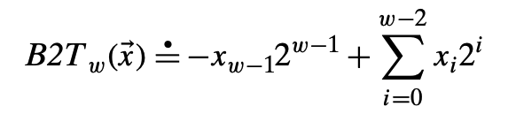
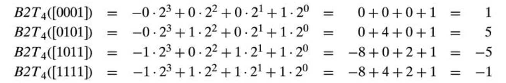
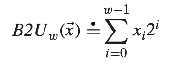
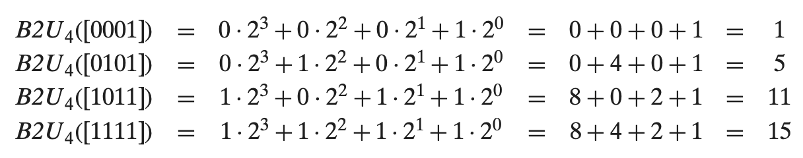

# 半群与计算机编程

## 计算 Fibonacci numbers

### 定义

- F_0 = 0

- F_1 = 1

- F_n = F_n-1 + F_n-2

### 依据定义实现

``` cpp

int fib0(int n) {
  if (n == 0) {
    return 0;
  }
  if (n == 1) {
    return 1;
  }
 return fib0(n - 1) + fib0(n - 2);
}

```

这个实现做了很多重复运算。例如fib0(5):

```

F5 = F4 + F3
   = (F3 + F2) + (F2 + F1)
   = ((F2 + F1) + (F1 + F0)) + ((F1 + F0) + F1)
   = (((F1 + F0) + F1) + (F1 + F0))+ ((F1 + F0) + F1)

```

我们看到`(F1 + F0)`被重复计算了3次。用T(n)标识fib0所需要的基本操作次数。如果`n < 2`，程序很快结束，仅仅执行很少的操作，从而有：

` 当n <= 1 时，T(n) <= 2`

当n增大，fib0被递归调用2次，还有3次基本操作，故：

`等 n >= 1 时，T(n) = T(n-1) + T(n-2) + 3`

我们将此与Fn的递推关系比较，可知`T(n) >= Fn`。即算法的复杂度和Fibonacci数的增长速度一样。而Fibonacci数的与2的幂增长速度相当，大概是`Fn = 2 ^ (0.694n)`


### 求Fibonacci数通项

线性代数办法。


注：生成函数求Fibonacci数通项见《具体数学》。

### 带缓存的实现

``` cpp
#include <utility>

int fib1(int n) {
  if (n == 0) {
    return 0;
  }
  std::pair<int, int> v = {0, 1};
  for (int i = 1; i < n; ++i) {
    v = {v.second, v.firt + v.second};
  }
  return v.second;
}

```

这个算法的复杂度是O(n)。fib1的复杂度是关于n的线性的，从指数降至多项式n。


### 大数的情况

在fib0和fib1中，我们都将`+`操作视为基本操作，认为消耗的时间是常量。而实际上大数的算术操作不能在常量的时间内完成。在大数的情况，我们需要对算法的复杂度重新计算。两个n为的二进制数的加法复杂度正比于n。

那么在fib1算法中，大概进行了Fn次加法操作，即fib2的在大数情况下的复杂度为`n^2`。仍然是n的多项式，依然比fib0的指数级算法优越。

### 用矩阵来求Fibonacci数

我们用矩阵来表示求Fibonacci数的操作：

```
 F_n+1  = 0 1 * F_n
 F_n+2    1 1   F_n+1

```

第n个Fibonacci数的计算：

令:

```
A = 0 1
    1 1
```

```
 F_n+1  = A^n * F_n
 F_n+2          F_n+1

```

记此算法为fib2。

即计算Fn只需要计算矩阵A的自乘。计算`A^n`最少需要多少次矩阵乘法呢？

## 半群

### 求矩阵的n次幂

``` cpp

bool odd(int n) { return n & 0x1; }
int half(int n) { return n >> 1; }

template <Matrix A,  Integer N, MatrixMultiply Op>
A power_matrix(A a, N n, Op op) {

  while(!odd(n)) {
    a = op(a, a);
    n = half(n);
  }

  if (n == 1) {
    return a;
  }
  return power_accumulate_matrix(a, op(a, a), half(n - 1), op);
}

// 计算 r * (a^n)
// 乘积累加函数
// r为运算中持续更新的值
// n和a为乘数
// Op为矩阵乘法操作，此处暂未实现
template <Matrix A,  Integer N, MatrixMultiply Op>
A power_accumulate_matrix(A r, A a, N n, Op op) {
  // precondition(n >= 0);
  if (n == 0) {
    return r;
  }
  while(true) {
    if (odd(n)) {
      r = op(r, a);
      if (n == 1) {
        return r;
      }
    }
    n = half(n);
    a = op(a, a);
  }
}


```

从以上算法，我们知道矩阵的n次方，只需O(logn)次乘法(实际上应该还可以进一步降低，考虑乘法琏)。用矩阵的算法只需O(logn)次，而fib1需要O(n)次，我们的算法又得到新的提升。

### 埃及乘法(Egyptian multiplication)或俄罗斯农夫算法(Russian Peasant Algorithm)

乘法可以看做“某个数多次加到其自身”。即乘法可以用加法来计算。

```
1 * a = a

(n + 1) * a = n * a + a
```

对应的算法：

``` cpp

int multiply0(int n, int a) {
  if (n == 2) {
    return a;
  }
  return multiply0(n - 1, a) + a;
}

```

我们考察：

```
4a = ((a + a) + a) + a
   = (a + a) + (a + a)
```

依赖加法的结合律：`a + (b + c) = (a + b) + c`

这样我们只需计算`a + a`一次即可，降低了加法的运算次数。我们优化multiply0算法，可以得到：

``` cpp

bool odd(int n) { return n & 0x1; }
int half(int n) { return n >> 1; }

int multiply_int(int n, int a) {
  while(!odd(n)) {
    a = a + a;
    n = half(n);
  }
  if (n == 1) {
    return a;
  }
  return mult_acc_int(a, half(n - 1), a + a);
}

// 乘积累加函数
// r为运算中持续更新的值
// n和a为乘数
int mult_acc_int(int r, int n, int a) {
  while(true) {
    if (odd(n)) {
      r = r + a;
      if (n == 1) {
        return r;
      }
    }
    n = half(n);
    a = a + a;
  }
}

```

### 抽象

我们对比power_matrix和multiply_int，发现二者除了类型不一致，其他算法本身是一样的。我们把power_matrix抽象一下：

``` cpp
bool odd(int n) { return n & 0x1; }
int half(int n) { return n >> 1; }

template <Regular A,  Integer N, SemigroupOperation Op>
// requires (Domain<Op, A>) OP运算的定义域必须是A。C++支持concept，则可以转换为类似断言的语句(assertion)，从编译阶段保证类型直接的相互关系
A power_semigroup(A a, N n, Op op) {
  // precondition(n > 0);
  while(!odd(n)) {
    a = op(a, a);
    n = half(n);
  }

  if (n == 1) {
    return a;
  }
  return power_accumulate_semigroup(a, op(a, a), half(n - 1), op);
}

// 计算 r * (a^n)
// 乘积累加函数
// r为运算中持续更新的值
// n和a为乘数
template <Reguler A,  Integer N, SemigroupOperation Op>
// requires (Domain<Op, A>)
A power_accumulate_semigroup(A r, A a, N n, Op op) {
  // precondition(n >= 0);
  if (n == 0) {
    return r;
  }
  while(true) {
    if (odd(n)) {
      r = op(r, a);
      if (n == 1) {
        return r;
      }
    }
    n = half(n);
    a = op(a, a);
  }
}

```

我们考虑类型A所满足的要求。

- 必须具备具有结合性的运算
- 支持数据之间进行构造、赋值(`=`)和等价测试(`==`)的类型

定义常规类型T(regular type)：像int等内置类型一样，支持同类数据之间进行构造、赋值和等价测试的类型。

那么A的要求为：

- 常规类型
- 必须具备具有结合性的运算

### 幺半群(monoid)

半群(semigroup)定义：支持二元运算且运算具有结合性的代数结构。

即：

- 运算：`x * y`

- 结合性公理：` x * (y * z) = (x * y) * z`

举例：正整数构成的加法半群，元素是正整数，运算是加法。

幺半群(monid)定义：支持二元运算，具有结合性，且具有单位元的代数结构。

相对半群，增加了单位元的要求。即：

- 运算：`x * y`

- 结合性公理：` x * (y * z) = (x * y) * z`

- e为单位元：`x * e = e * x = x`

举例：整数构成的乘法幺半群：元素是整数，运算是乘法，单位元是1。

我们可以把power_semigroup算拓展一下，支持单位元。由于不知道op参数代表的运算，我们需要通过op参数来确定单位元。

``` cpp
template <Reguler A,  Integer N, MonoidOperation Op>
// requires (Domain<Op, A>)
A power_monoid(A r, A a, N n, Op op) {
  // precondition(n >= 0);
  if (n == 0) {
    return indentity_element(op);
  }
  return power_semigroup(a, n, op);
}

// + 和 * 的indentity_element 函数
template <NoncommutativeAdditiveMonoid T>
T indentity_element(std::plus<T>) { return T(0);};

template <MultiplicativeMonoid T>
T indentity_element(std::multiplies<T>) { return T(1);};

```

A支持二元运算，支持结合性公理(支持等价判断，且满足结合性)。

我们考察埃及乘法(Egyptian multiplication)和矩阵乘法。二者的对象和运算，整数和加法，矩阵和矩阵乘法，二者构成了乘法幺半群，故二者可以用相同的算法实现。因此，适用于乘法幺半群的power算法，可用用于求解斐波那契数列的矩阵乘法，其复杂度为log(n)。

### 大数情况下Fibonacci numbers算法分析

我们分析一下，矩阵的算法性能提升的原因在于，算法中不只有加法，还有乘法。大数的乘法要慢于加法。考虑大数操作，fib1的复杂度变为`O(n^2)`。

假设两个n二进制数相乘的运行时间是M(n)，在没有优化的情况下，`M(n)=O(n^2)`。那么fib2的复杂度为`O(M(n)logn)`，M(n)的增长大于logn，故fib2的复杂度为O(M(n))。即fib2的算法能否比fib1快，取决于我们能否以少于O(n^2)的次数来完成两个n位数相乘。

实际上我们有处理大数相乘的算法，复杂度为O(nlogn)。我们考虑FFT算法，虽然FFT针对的是多项式相乘，我们可以把多项式的x替换为基数2，并留意进位值，这样多项式相乘就变为了普通乘法。而实际上多项式乘法构成半群，而整数乘法也是半群（考虑单位元1，即为幺半群），二者有代数结构同构。所以，针对多项式的算法，同样可以用在整数相乘上。

## 半群与补码

### 补码(two’s-complement)

将字的最有效位解释为负权(negative weight)，我们用函数B2T(Binary to Two's-complement的缩写，长度为w)来表示。假设一个整数数据类型有w位。我们可以用向量来表示位，向量*x*表示`[x_w-1, ..., x_1, x_0]`，表示向量中的每一位，长度为w。



其中≐表示左边被定义为右边。B2T将一个长度为w的0、1串映射为负整数。最小值的位向量是`[1, 0, ..., 0]`，即最高位为负权1，但其他所有位为0，最小值TMin为`-2^(w-1)`。最大值TMax用位向量`[0, 1, ..., 1]`表示，即最大值为`2^(w-1) - 1`。由定义可知，每一个介于`0 ~ 2^w - 1`之间的数，都有唯一的w位编码。反过来，每一个w长度的位向量，都有一个唯一的值与之对应。用数学语言来说，B2T是一个双射。


最高有效位`w-1`位为符号位，权重为`-2^(w-1)`。符号位为1，为负数，0位正数。我们举例来看B2T从位向量到整数的映射：




### 无符号数的编码

把向量*x*看作一个二进制表示的数，我们就得到了*x*的无符号表示，我们用函数B2U(Binary to Unsigned)来表示，长度为w：




其中≐表示左边被定义为右边。B2U将一个长度为w的0、1串映射为非负整数。最大值UMax用位向量`[1, 1, ..., 1]`表示，即最大值为`2^w - 1`。由定义可知，每一个介于`0 ~ 2^w - 1`之间的数，都有唯一的w位编码。反过来，每一个w长度的位向量，都有一个唯一的值与之对应。用数学语言来说，B2U也是一个双射。



### 分析对比补码和无符号数的编码

第一，从最大值和最小值来看，补码的最大值和最小值是不对称的，负数比非负数多一个。因为一半位模式标识负数，一半标识非负数，而0是非负数，故正数比负数少一个。

第二，最大的无符号数正好比补码的最大值的两倍大1，`UMax=2TMax + 1`。

从数学角度看，无符号整数的加法，构成幺半群。从补码的定义来看，除去最高位表示负权，其他和无符号整数一样，也构成幺半群。二者的加法都是二元运算，无符号整数的幺半群和补码的幺半群是否类似的呢？


我们知道无符号整数A的补码，为对A取反，再加1。取反在二进制中等价于UMax`2^w-1`减去A。即反码B为`2^w - 1 - A`，补码为`2^w - 1 - A + 1`，即`2^w - A`。

### 同构(isomorphic)

在抽象代数中，同构的群具有相同的性质，不需要加以区分。

同构(isomorphic)的定义:如果两个模型的元素之间有一一对应的映射关系，使得无论是先执行前者所定义的运算，然后再将其映射到后者，还是先对前者做映射，然后再执行后者所定义的运算，都能得到相同的结果，那么，这两个模型就是同构。

模型(model)定义：对于集合中的元素，如果涉及这些元素的所有运算都在理论系统中有定义，且涉及这些元素的所有命题都成立，那该集合就称为这套理论系统的模型。

其中g表示映射，f表示运算。

```
          g
    x,y -----> a,b
     |          |
   f |          | f
     ↓          ↓
  f(x,y) --> f(a, b) = g(x, y)
          g

```

举例：自然数加法模型与偶自然数加法模型之间，有乘以2的映射关系。如果两个自然数先运算(相加)，再做映射(乘以2)。那么其结果，与先做映射，再进行运算是一样的。

```
       乘2
   3,4 ---> 6,8
相加 ↓        ↓  相加
    7 ----> 14
      乘2

```

我们来看补码与无符号正整数之间的关系。g表示求补码，f表示相加

```
          g
    x,y -----> 2^w - 1 - x + 1, 2^w - 1 - y + 1
     |          |
   f |          | f
     ↓          ↓
    x+y --> 2^w - (x + y)  ≡ 2 * 2^w - (x + y) (mod (2^w))
          g

```

最后一步同余运算，在补码中是很自然处理的。补码从工程角度看，就是为了把减法转化为加法，这样在硬件层面，就可以省去加法的硬件实现。而补码的之所以能把减法转化为加法，是因为在定长的二进制位上，可以减法可以表示为求模之后的加法。我们可以看到，无论是先求补码，再相加，还是先相加再求补码，结果是一样的。故补码的加法幺半群和普通的无符号正整数的加法幺半群同构。也就是是我们可以在补码上，可以随意执行和无符号正整数一样的加法，无需做额外的处理。

当前计算机对负数主要产用补码表示。我们还有两种负数的表示：

- 原码：最高位为符号位，其他位相对无符号整数保持不变

- 反码：最高位为符号位，其他位取反

使用原码来运算，需要判断最高位符合，做减法还需要判断两个数的大小，然后判断两个数绝对值大小，大的减小的。反码把减法转化为加法了，但反码中有两个0，`+0: 0000`和`-0: 1111`，二者都表示0。虽然从技术角度看，这不过是浪费了一个码点，但从数学的角度看，我们在一个二元运算中，有两个单位元，从而破坏了群结构，无法构成一个加法幺半群。

## change log

- 2020/7/19 下午 created doc
- 2020/8/9 下午
- 2020/8/9 晚上，完成补码与幺半群的描述
- 2020/8/10 上午，修正代码格式；以及斐波那契数列展开错误
