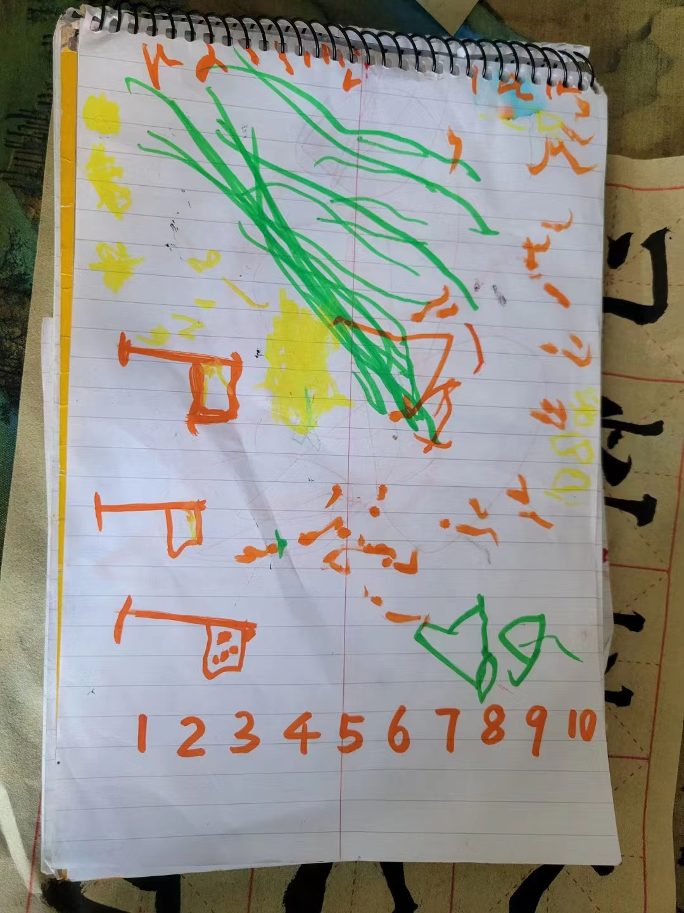
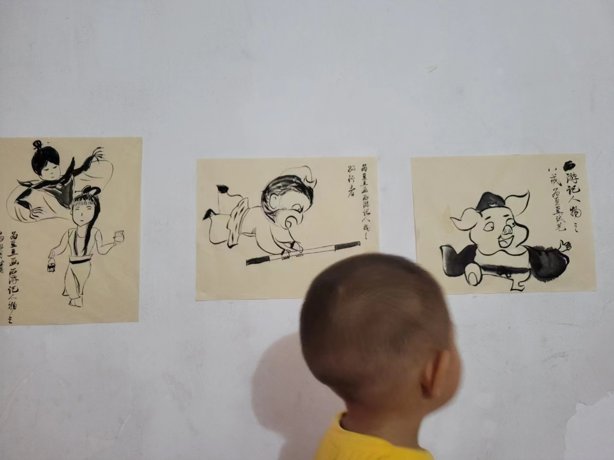
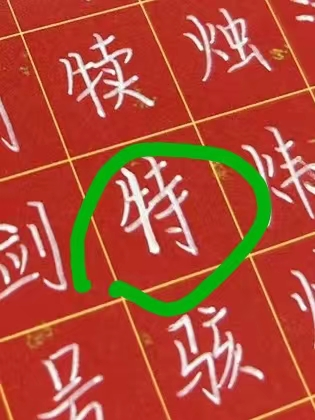
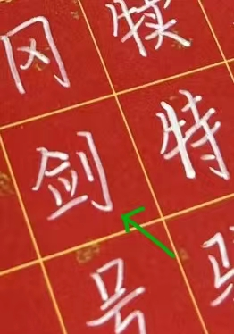
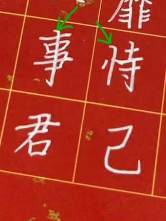

# 和若溪小朋友聊写字

#### 2023年7月15日

## 写字写人生

我家的小朋友叫临溪，小名豆豆，今年2岁多，很喜欢写写画画。我虽然老大不小了，也喜欢跟他一样写写画画。

豆豆在我的本子上，涂涂抹抹。

我也在我的纸上，涂涂抹抹。豆豆很开心，我也很开心。我从来没练习过国画，豆豆要我给他画西游记，就用练字的毛边纸，涂抹几笔，豆豆认出孙悟空、猪八戒和白骨精了，特别开心。

可见，写字画画，日常生活也可以有，可以愉悦小朋友，也可以让大人抒怀。

写字写人生。

这是若溪爸爸的话，发的若溪写的千字文。红底白字，写得很工整，笔画一丝不苟，一笔一划，没有懈怠。见字如面，能感受到写字的认真。

## 我的写字人生

我想起了学生时代的自己。如果把我写字的人生画成一条曲线，将会是一条很奇怪的曲线。出道就是巅峰，然后降到低谷，维持到初三，再慢慢起来。一条U字形曲线。

我读小学一二年级的时候，家里在学校门口开小卖部。放学了，我就在小卖部柜台上写作业。描摹书上的印刷体，慢慢写，一笔一划模仿。别人作业一下子写完了，我还在慢慢抄写题目。很慢，效果还不错。老师来买东西，看到我写的字，说可以比得上六年级小朋友的好字。

来了一位新语文老师，每天布置很多作业，一个生字，要抄写好几页，于是我常常抄写到半夜，还是没写完。第二天不敢去学校，没写完作业的同学，要挨打，一个生字十大板。老师把竹板打破了，每打一下，不仅仅挨打，还要被竹板夹一下。打了好多次，看着发肿的手心，放弃了我的模仿印刷体生涯，开始龙飞凤舞，写的字过几天，别人不认识，自己也不认识。

自从以后，讲作文的时候，必被语文老师点名批评，说作文文采还行，字实在太差，鬼画桃符，老师也不认得写的啥。

字是门面，书是屋。门面太差了，屋里再好，没人看。作文自然是低分。这是爷爷说的，大概是受传统科举考试的影响。

写的字评价这么差，我依然喜欢写字，还要求爷爷教我写毛笔字，爷爷教了怎么拿毛笔，就再也不教了。说写字不能当饭吃，好好读书。

万般皆下品，唯有读书高。

读好数理化，走遍天下都不怕。

都是爷爷的教诲。爷爷去世五年多了。人生苦短，白驹过隙。

那时候我很叛逆，越不让写字，越偷偷练字。练了七八年，终于到了初三，写的字有所改观。那时候没字帖，还是模仿书本上的印刷体。虽然屡被语文老师表扬，但我心中暗暗叫苦。写得太慢了。语文考试作文，至少留一个小时以上。写字太慢了，写不完。

这种困扰，一直持续到现在。有次和朋友出去玩，有人做调查，要我俩填写一个表格，朋友填写好了半天，我才写几个字。旁边调查人员都急了。朋友事后说，我做事认真。我说，不是我认真，而是实在写不快。

在人面前写字，不想被打回原形。

## 和若溪小朋友聊聊人生

若溪爸爸说写字写人生，聊人生，也就是聊写字。

以前的人，写字很神圣，惜字敬纸。我曾祖母曾教我，有文字的纸，要在头顶放一下，才能扔掉。曾祖母在我小学的时候去世了，二十多年了。日月如梭，人生如梦。

若溪小朋友多才多艺，我听过你背诵英语，也听过你弹钢琴。英语说得很流畅，钢琴节奏也非常好。写的字，在小朋友里面，也是顶好。

回想我自己的写字人生，后来字写好了，但一直写得很慢，很吃力。我现在知道原因了。

根本原因就是我在描摹别人的字，而不是自己写字。描摹别人的一笔一划，即使没有字帖在眼前，也是这习惯，一笔一划的写字。写的字就不流畅。就像在练钢琴，练习新曲子，看一句谱子，弹一下。也像初次背英语，背一句，想半天，再背一句。断断续续，停停顿顿。

我喜欢写毛笔字，以至于硬笔字也受毛笔的影响。每一笔开始，也像毛笔一样，带一个开头，再往下写。毛笔里面，这样处理是要把笔毛打开，铺毫，中锋行笔。硬笔则没这个必要。有这个坏习惯，硬笔就写不快。

写字不仅仅要写好，还要写快。甚至有些笔画，只有写快了，才能写好。这样写字，才自然，才不会写一篇字就很累。而成为一种享受，享受写字，享受人生。

为若溪小朋友挑三个小问题。

第一，写字尽量不补笔。补了以后，看起来似乎好了。但笔画不流畅，气韵不生动。“特”字的竖，就用笔描过，比其他笔画要粗。

第二，写字认真很好，还要有点不那么认真，有些笔画，可以直接甩出去，比如一些勾、撇等。写字也很好玩，玩虽然有时候也要较劲，好玩就行。
“剑”字的竖钩，写得太认真，看起来就有点迟疑。

第三，硬笔字有硬笔的特性，虽然可以借鉴毛笔字，但要对毛笔字的技巧有取舍。”恃“和“事”，竖的起笔，典型的毛笔写法。其实硬笔也可以有类似的笔画，这些笔画特点，其实是为了把字写快，上一笔和这一笔有联系，顺着写过来，就自然有这样的起笔。这个话题太大了，有机会再聊

写字也可以很好玩。人生也是，既要认认真真，也要轻轻松松，一张一弛，文武之道。

## log

- 2023/7/15 初稿
- 2023/7/16 修改不通顺语句