# 和小朋友聊写字——从楷书到行书

## 古人的微信

清明时节雨纷纷，唐朝的颜真卿也在清明前后，遇到下雨天。下雨天不便出远门，路滑淋雨，容易感冒。想起来好朋友了，于是写一份信给朋友。说：

> 天气殊未佳，汝定成行否？寒食只数日间，得且住为佳耳。

> 天气不好，老朋友一定要走吗？没几天就是寒食节，你留下了更好哇。

> 注释：现代的清明节是古代上巳·寒食·清明，三节合一。

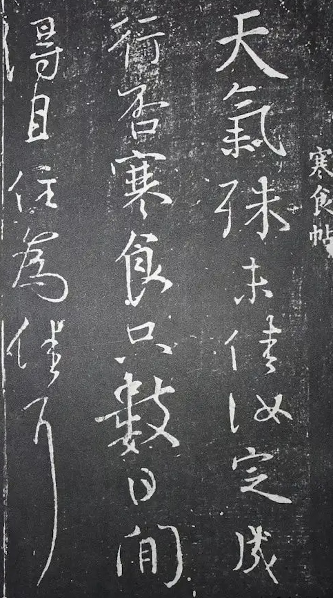

我们现在用微信，发消息给朋友，也是差不多的话。距今一千多年的唐朝没有微信，有纸和笔，颜真卿心里念着朋友，随手写一封信，流传了一千多年。今天读起来，依然能感受到颜真卿对朋友的关切。

更早的时候，东晋的王羲之，在秋天的时候，也想起老朋友了。摘了一些橘子，给朋友送去。写信说：

> 奉橘三百枚，霜未降，未可多得。

> 送上橘子三百个。还没有打霜，不能采摘更多了。

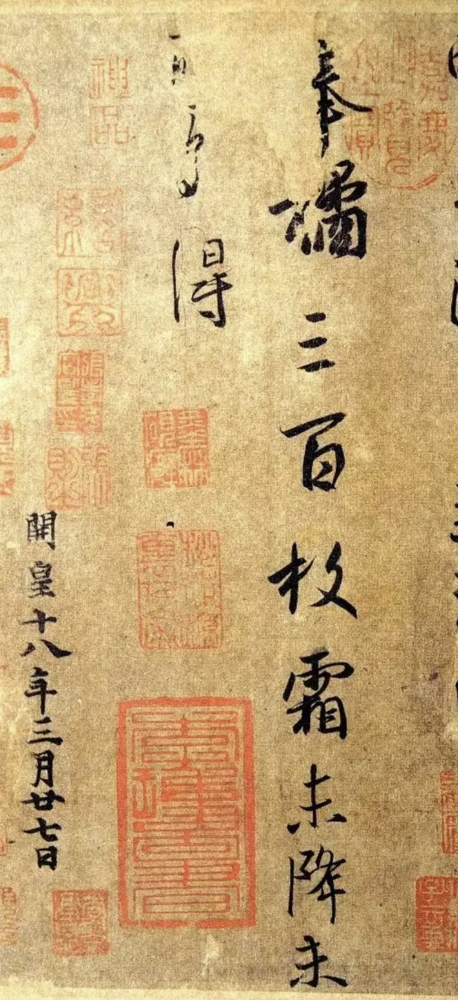

天气寒冷，地上有霜以后，橘子才好吃，也才成熟。冬天吃白菜萝卜也是这样。从生物学角度来看，植物为了抗寒，会积累更多的糖分。水果蔬菜就更甜了。

王羲之看到橘子红了，还没有橘子成熟的时候。有少量早熟的橘子，都就摘了送给朋友，找不到更多的成熟橘子了。就像朋友喜欢吃薯片，就把零花钱都买了薯片，带到学校，都送给朋友吃。很要好的很要好的朋友，才会这样子。

一千多年过去了，颜真卿和王羲之两位书法大师，给朋友写的信，流传下来了。好比我们在2024年写一张便条，人们收藏起来，流传到一千年以后的3024年。能流传这么久远，主要原因是颜真卿和王羲之的书法水平很高，写的字很好。

## 两种书法样式

古代人的书法，从用途来说，可以粗略分为两种：

其一，正式书写，刻在石碑上的碑文，如颜真卿的《多宝塔》；

其二，日常书写，如给朋友写的信。

我们学习书法，通常会从楷书开始学。而楷书的范本，多数是刻在石碑上的。这是很正式的书法。就像今天我们在路上看到的广告牌。广告牌上的字，要显眼，并且让人能认识。要显眼，字就要写很大，让人很远就能看到。所以通常来说，石碑上的字，不会很小。要让人们都认识，就只能选择楷书。草书很多人不懂，也不认识。行书连带的笔画多，远远的看起来也不如楷书易于辨识。不说远远的看了，我们书本上的文字，大部分情况下会选择楷书，比如课本上的宋体字。

写很大的楷书，是颜体字的专长。颜真卿写了不少很大的字。比较有名的有《麻姑仙坛记》和《麻姑仙坛记》

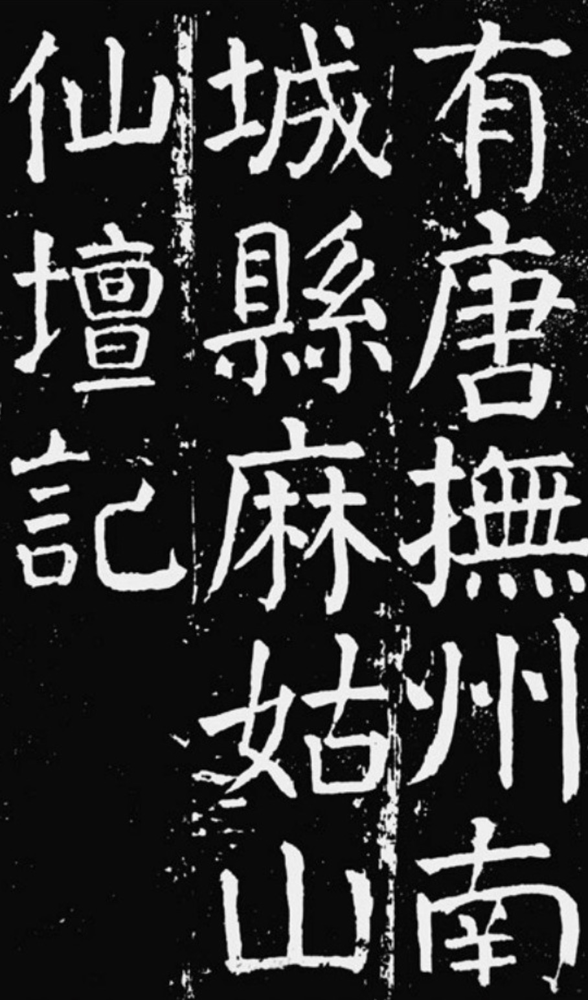

但颜体字，也有日常书写的字。楷书有《自书告身》，行书有天下第二的《祭侄文稿》。《自书告身》是古代官员的正式公文，即使如此，带入的日常书写也比较多，比刻在石碑上的要活波一点。

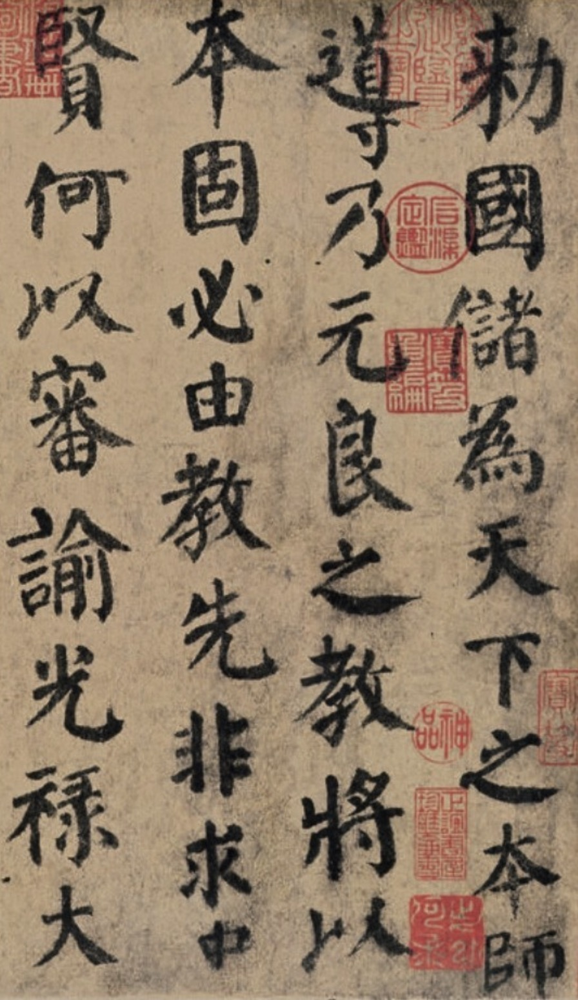

《祭侄文稿》是颜真卿打的草稿，就像做数学题，现在草稿纸上算一遍，再在卷子上写一样。算错了，方便涂改。《祭侄文稿》上，就有不少涂改的痕迹。

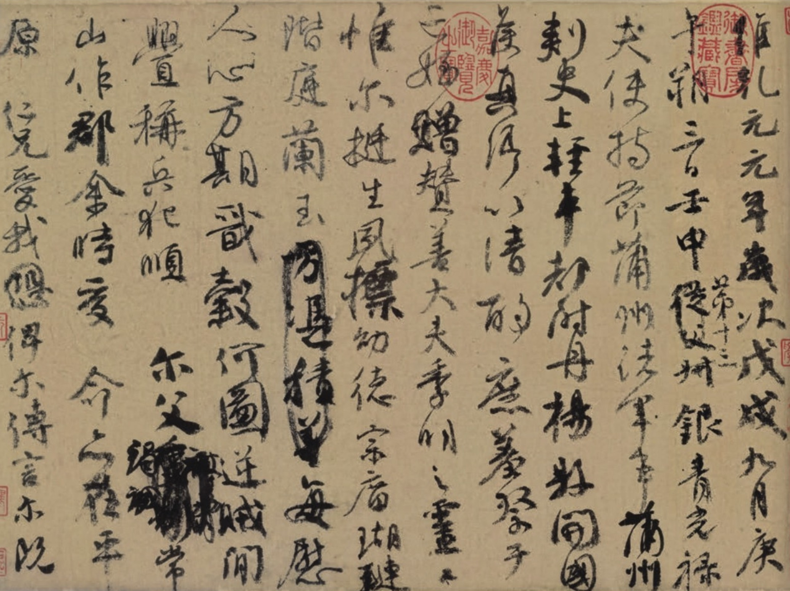

说来奇怪，排名前三的行书，第一名《兰亭序》，也是草稿，也有涂改。书圣直接用毛笔在错字上面涂黑，就这么随意。可是这么随意写的字，比哪些刻意写的还要好。可见练字要认真，还要淘气一点。第三名是苏轼的《寒食帖》，虽然没涂黑，里面也有写错的。这些书法大师，写字很活波，咱们练习写字，也可以活波一点。

## 从楷书到行书

古代书法大师的行书，很活波。其实楷书里面，也有很活波的字。唐朝的褚遂良和元代的赵孟頫的楷书，不同于哪些规规矩矩的楷书，笔画会带上行书的笔意。我们练习楷书以后，想学习行书，就可以考虑用褚遂良的字，或者赵孟頫的字，过渡一下。如果说楷书是很严肃的走路，那行书就是去跑步。那褚遂良和赵孟頫的字，就是跑步之前的拉伸，热热身。

褚遂良是唐代很有名的书法家，在唐朝影响很大。颜真卿也学习了不少。褚遂良的字很活波，像一个女孩子在跳舞。

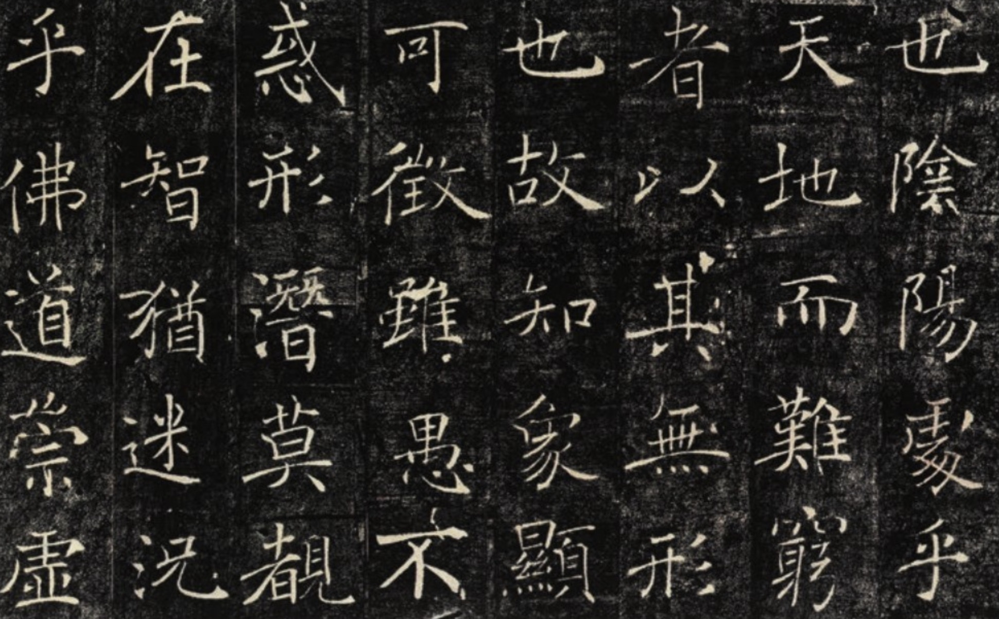

元代的赵孟頫是一位很有才华的书法家，楷书行书都写得很好。赵孟頫写字特别快。要是班上同学一起抄课文，赵孟頫同学，估计是第一个抄完。可能正是因为写得很快，所以赵同学的字，也不是规规矩矩的楷书，而是带了一点行书的楷书，很流美。

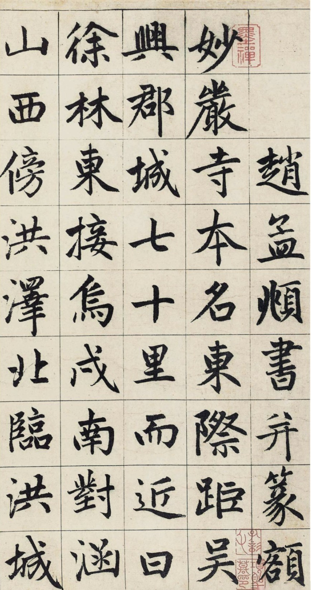

## 赵体的源流

### 宋四家与赵体

说到赵孟頫，他实际是宋朝的皇族，出生成长在宋朝。宋朝有很多书法家，最有名的是苏黄米蔡，通常来说是苏轼、黄庭坚、米芾和蔡襄。他们都很有才华。有才华的同学，通常来说就喜欢张扬自己的个性，个性张扬多了，就特立独行起来。宋四家除了蔡襄，都比较特立独行。

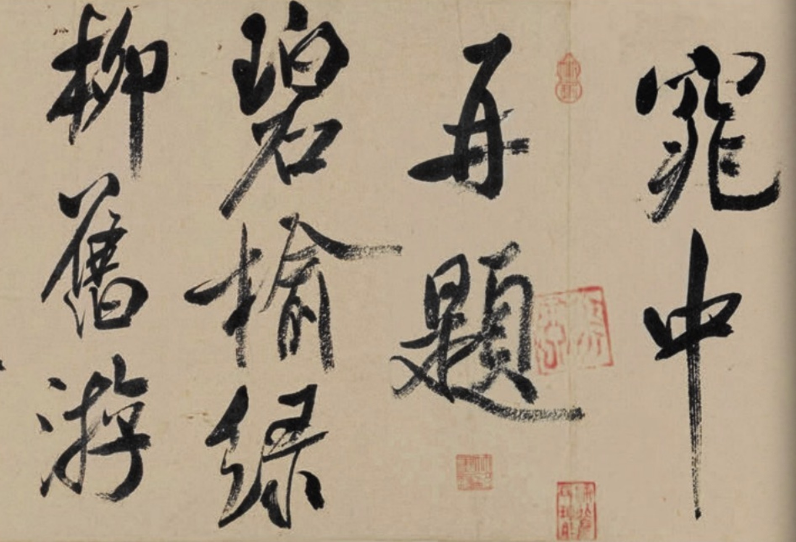
米芾的书法

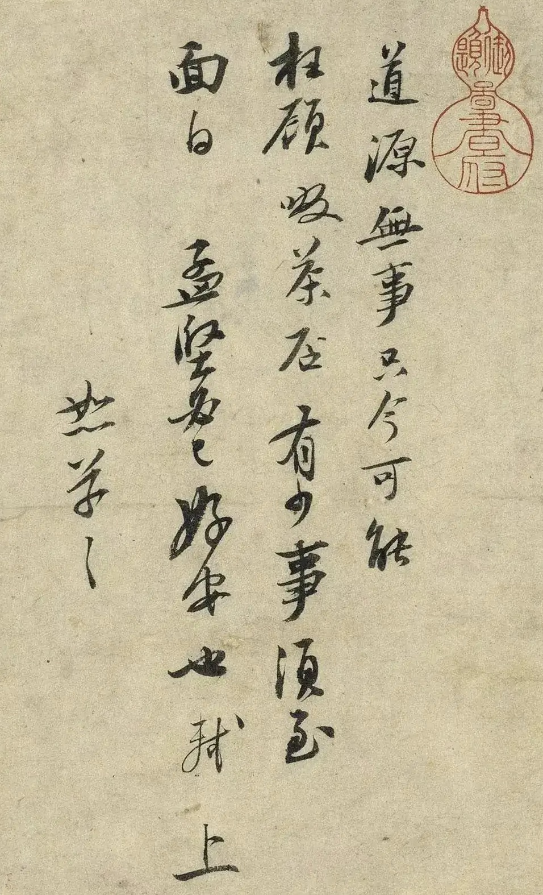
苏轼的书法

宋四家在宋朝影响特别大，大家都跟着张扬起来。物极必反，一个事情极端了，往往会发展到反面。后来南宋的时候，赵孟頫觉得不能再这么张扬下去了，我们也要恪守传统。

### 松雪斋中小学生

赵孟頫的才华特别高，又遵守传统。就像班上有一个同学，特别有才，同时还尊重同学，很有实力，还不张扬。老师、家长和同学，估计都很喜欢。赵孟頫就是这样受人喜欢的同学，整个元朝，直到明初，都有很多人喜欢赵体字，学习赵体字。

赵孟頫的书房叫松雪斋。名字也看好，翠绿的松树上，皑皑白雪。也有寓意，孔子说：岁寒，然后知松柏之后凋也。意思是天寒地冻的时候，才知道松树和柏树的品行，不因为天冷而凋零。人也要有这种品行。赵孟頫不仅会书法，还会绘画，人品也好。就有人来学习。画画也培养了很有名的画家，元四家之一的黄子久，作品有《富春山居图》

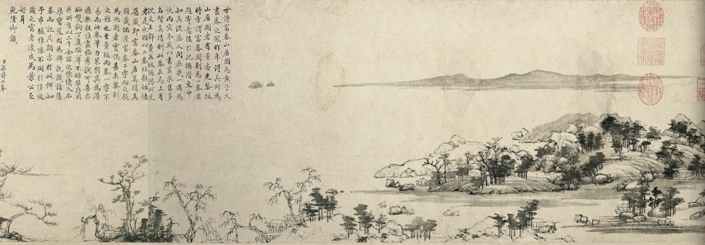

赵孟頫是文人画的祖师爷。所谓文人画，粗略的说，就是用书法的笔法来画画。比如他的画《秀石疏林图》

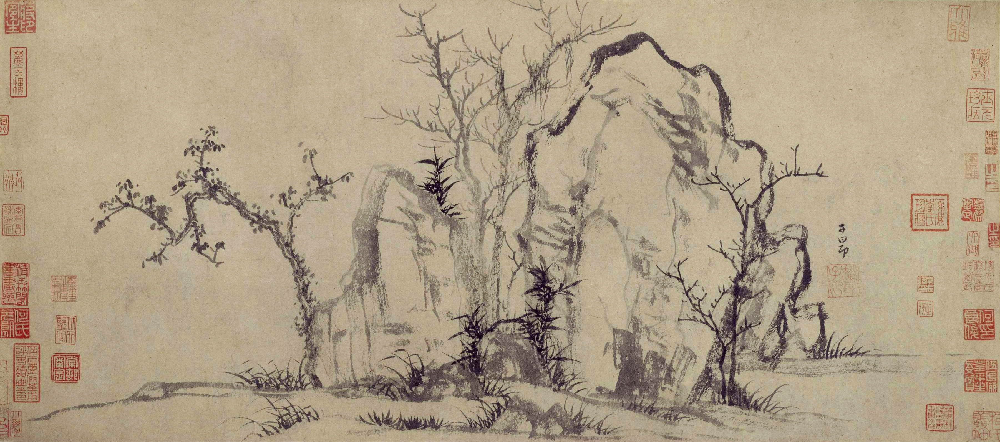

画上有他题的字，说书画同源，意思是书法和绘画差不多是一回事：

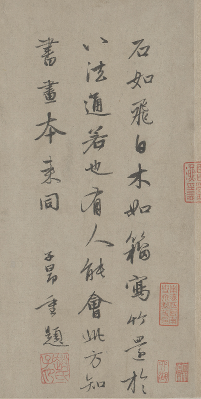

### 赵体简介

赵孟頫这么有才华，书法上就很丰富多彩。流传下来的作品，粗略来说，有日常的写的信。和正式一点，写了给人欣赏的作品。赵孟頫这个学生很有特点，喜欢抄课文，留流传下来很多他抄的文章，如行书《赤壁赋》

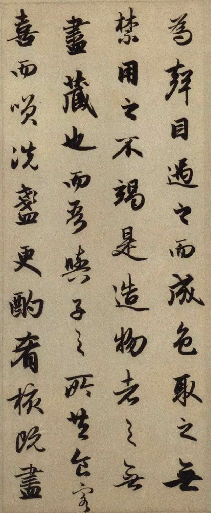
赵孟頫的赤壁赋

赵孟頫的信上的字也特别好，要论艺术水平，可能要算第一。

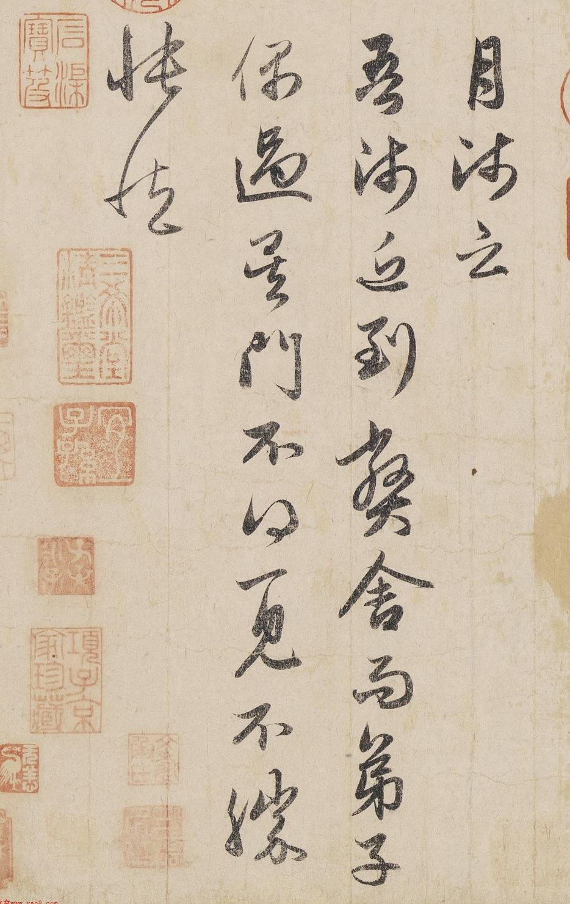
赵孟頫给师傅写的信。

说师傅你来我家，恰好我不在家，太遗憾了，我很忧伤。

