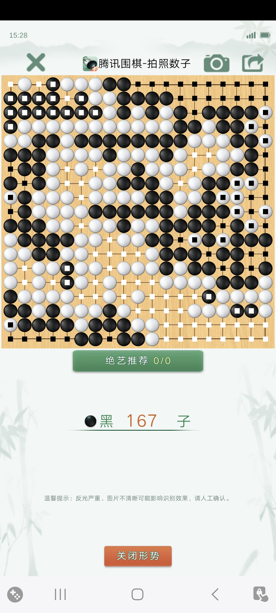
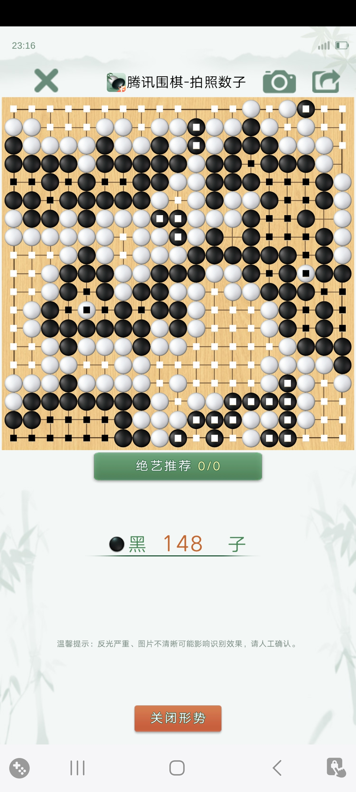

# 下自己的围棋

#### 记2024/11/01 周五晚上2 盘围棋

周五晚上，下了两局围棋。好久没下棋了，以后也难得有空下棋，留下这两局的复盘笔记，日后不能下棋，也可以回味。

千古无同局，但两局里面都有我，就出现了我的相同的关隘。有三个：开局就陷入做活；下错了三次倒扑；怕在角上落子。

第一局的开局，为了断棋，即使看到会陷入征子，看到了可以利用双打吃逃脱。于是落子断棋，结果如看到的，立刻陷入征子困境，也果然逃脱。但上方撞出铁厚的黑棋，黑棋占领边角，毫不费力。收官阶段黑棋疏忽，白棋搜刮左上角，否则很难进入。

第二局的开局，看出左边陷入困境，白棋封锁黑棋，且无两个活眼。赶紧出逃，一路逃跑。十几手棋以后逃脱。但白棋中间很厚，危及右边。最终在黑棋星位加小飞守角的情况下，白棋占据了右下角。

两局棋，出现三次倒扑。其一，第一局右边，白棋大优局面，黑棋棋紧，无故先去做个眼，没看到黑棋三步走出一个倒扑，左边尽死。其二，第一局左下，看出可以倒扑，但又看到上方黑棋还多一口气，以为来不及了，没看到黑棋的断点有两个，还是差一步。错失倒扑。其三，第二局官子，忙着搜刮，没看到自己的棋很危险，送出一个倒扑。

两局棋的角上，都使用的星位加小飞守角。但都没有下出角上的棋，似乎优先不要角上的实地。第二局右下角，为了避免陷入角上做活，考虑托过，与左边连接。结果连也没连上，错过了活棋的机会。角上的定式，需要好好练习。

复盘以后，想起自己的一些惯性。

其一，厌恶损失。在棋局中，一颗子也不愿意失去。为了就一颗棋子，不顾整体局面。下棋不可能一颗棋子也不愿失去，而应该考虑围地。棋子看起来是实在的，地是虚的。二者是相互依存，没有地，棋子没气无法活棋。把棋子和地，一起看，有得有失，有虚有实。小到局部损失一颗棋子，大到损失一个角，选择一个更大的地，失中有得，有得有失。

其二，没有坚持自己的行棋节奏。下自己的棋，你下你的，我下我的。老陷入做活，就被动了，下不了自己的棋了。作为新手，有一个重要的课题，找到自己的行棋感觉，在练习中，逐步找到自己的下棋的感觉。我们可以下出我们自己效率高的一手棋，这手棋也许让对方棋变差了，但这只是结果，起因是走出了适合自己的局面的棋。
