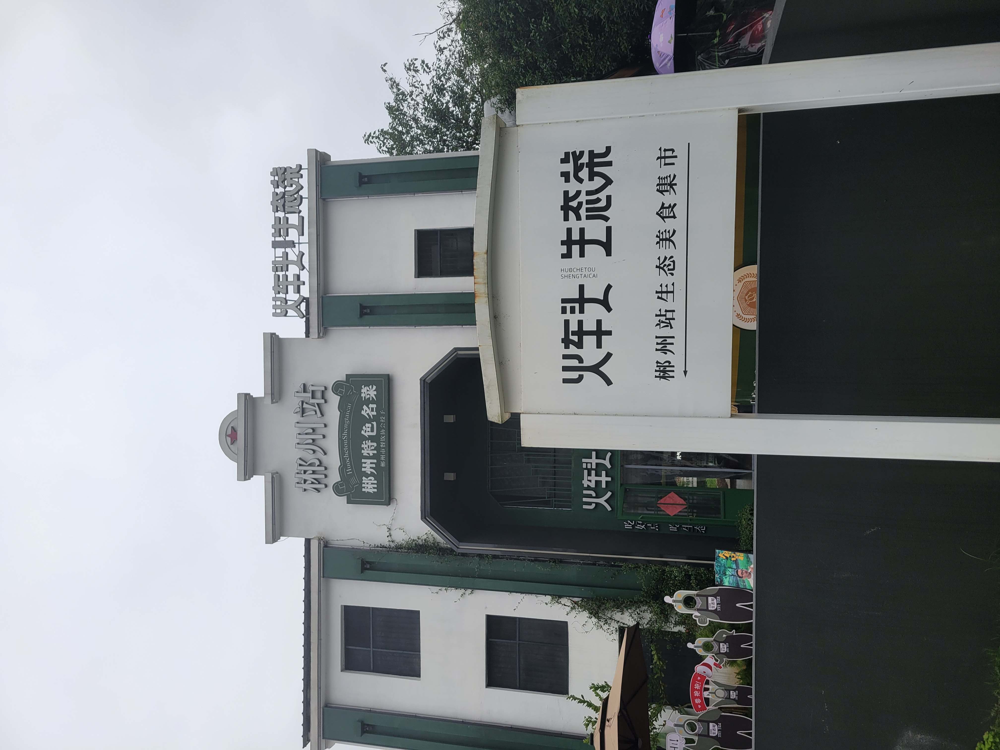
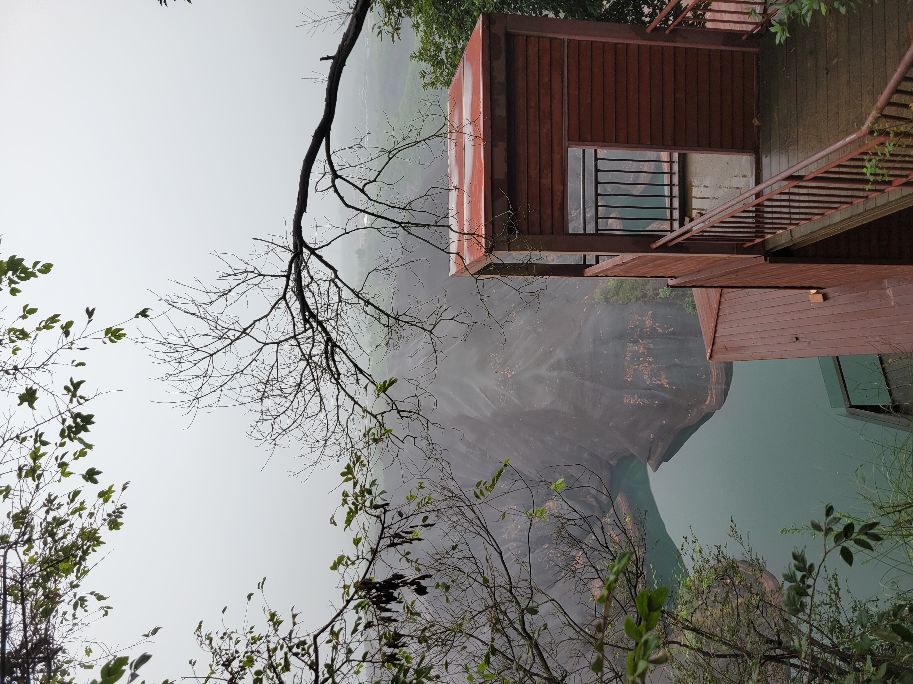

# 寂寞郴州五百年

从老家湖北到深圳，高铁路过郴州，停靠两分钟。来来回回好多年，路过就两分钟的缘分。记得郴州，也是因为秦观的《踏莎行-郴州旅舍》。五百年前秦观的旅程，和我的旅程，时间不同，重点却是一样，都是去谋生。好在我不是贬谪，也就写不出郴江幸自绕郴山，为谁流下潇湘去。五百年了，秦观和我都是旅人，都是郴州的过客。郴州的旅舍，还会可堪孤馆闭春寒，还会杜鹃声里斜阳暮么？自从雾失楼台，郴州就一直弥漫着寂寞的雾，月迷津渡，人也迷津渡。

今年去郴州旅游，下高铁，奔火车头饭店，吃过湘菜，到酒店放好行李，去苏仙岭，抬头一望，浓雾失山头，不知道山有多高。如无边的愁一样的丝雨飘下，似雨又似雾。在漠漠轻寒中，拾级而上。到白鹿洞，遇三绝碑。曾在初中杂志读到过三绝碑，秦少游的词，苏东坡的跋，米芾的字。三绝中，每一绝都有值得商榷的地方。石壁的字，和米芾的大字相去甚远，与《多景楼诗帖》风格迥异，倒有几分像二王。苏东坡的跋也很牵强，老师很欣赏自己的学生，对学生的去世惋惜，所说的话移过来作为此词跋，跋语与词就隔得有点远。至于无可争议的词，与通行的版本有差异，“杜鹃声里斜阳暮”，石壁上写的是“斜阳树”，读起来总觉得不对劲。秦观很喜欢用“斜阳暮”，如《点绛唇》：烟水茫茫，千里斜阳暮。

秦观的人生和词，都别具一格。少年时，喜欢读兵书，胸有大志。很像杜牧。杜牧还给《孙子兵法》做注，我读《十一家注孙子兵法》，杜牧很喜欢跳出来批评前人，后人做注的时候，杜牧一样也被后人批评，说前人说得对。果然是后之视今，亦由今之视昔。不仅仅喜欢读兵书像和杜牧，春风十里也像杜牧。秦观的词长于抒情，爱写抒情之前弥漫的情绪。将抒未抒，就像黄昏，斜阳还留，长夜未来，是非契合秦观的词，仿佛天地黄昏专为此词而设，秦观的灯火黄昏。

入山愈深，雾愈浓，至山腰，下起小雨。山路元无雨，空翠湿人衣？撑伞沿盘山公路走，遇到一群雀跃的小学生，穿着校服，淋着雨，兴冲冲踩着湿漉漉的黑色柏油路下山。其中有一个孩子撑着一片大叶子遮头。

到山顶，购酸萝卜。望风吹山雾，听雨打青瓦，大嚼爽脆萝卜，可与溪边煮茶媲美。山顶有寺庙，曾软禁张学良。进门见青砖铺地，跨门槛，入卧室，见一木床。想起老家的木床，这里缺了左右两侧的挡板，床下少了脚踏。出门下山，见一大牌坊，上书：回头是岸。字是颜体，想当年何绍基在湖南，能从颜体出己意，卓然成大家。湖南大概学颜体、学何绍基体很多。过牌坊，回头一望，正面上书：第十八福地。字是章草，是苏仙岭游玩中所见题字，水平最高的。

暮雨纷纷，重走来时路。到山下，天已黑。去和平夜市，街道冷清少行人。在不远处吃饭，回酒店。

第二天上午去小东江，水很清澈。要是晚上来，说不定能体会一下，微波澄不动，冷浸一天星。下午去高椅岭，典型丹霞地貌，爬山而回。这一天也是烟雨濛濛，无边丝雨细如愁。

秦观年轻时，写过《蚕书》，可以作为养蚕的教材。家乡高邮，也曾盛产蚕丝。以前只知道高邮汪曾祺，咸鸭蛋好吃。

去郴州，逛菜市场。见到门口的辣椒好，问大妈多少钱一斤，大妈说：十块。我有点惊讶，就再问，大妈伸出四个手指头，说：十块。一时不知道听说的还是听手的。于是再问，旁边买菜的大妈也急了，看到年轻，说：小伙子，买菜少吧，这里辣椒很好，是十块。也伸出四个手指头。我最终买了两斤，八块钱。

路边一买竹锅刷的老大爷，穿破旧棉衣，手叉在袖子里，弓着身体，靠在墙角。生锈的自行车上放着几个竹锅刷。望着熙熙攘攘的路人。背后是小河，流水泠聆作响。

便做春江都是泪，流不尽，许多愁。
