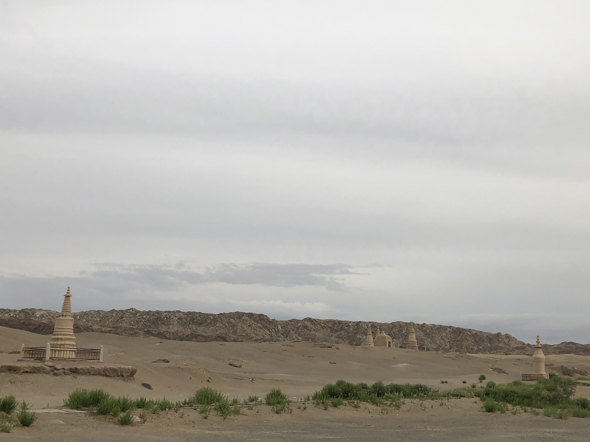
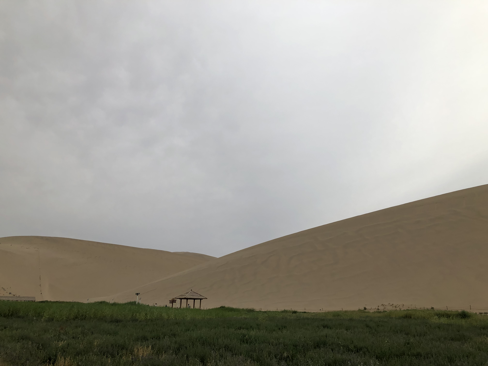
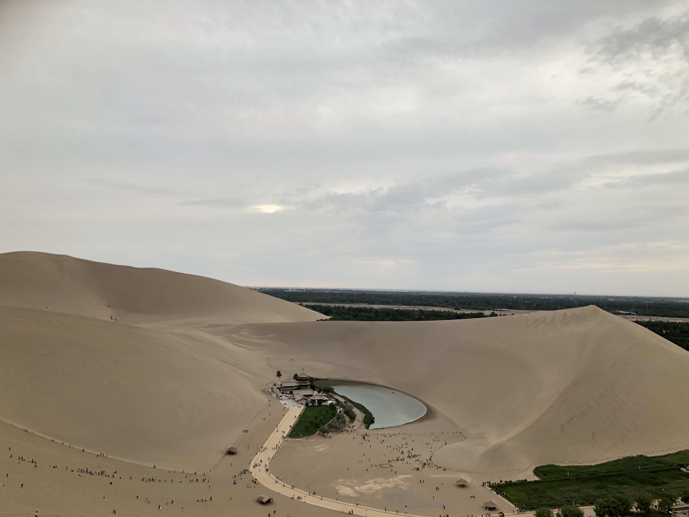

# 走过甘肃

## 莫高窟

从深圳飞到敦煌，坐车到莫高窟。高中读余秋雨的《文化苦旅》，对丝路佛教浮想万千。十几年之后，能来莫高窟，三生有幸。

三危山不高。打江南来的人，看一眼，觉得不过是一个小山丘。有一牌坊，上头题字：三危揽胜，字作赵体，笔画不肥，但字很俗。上墙的大字，为了显得有气势，易识，通常会把字的笔画写得很粗，很多书家知道这个诀窍，春联上的字写得特别壮硕，回家过年，老看到这样子的字，影响心情。写这匾额的人，为了求变化，安排布局，笔画有粗细，写成了赵孟頫在书信中的字体，小字用在大处，还是不好看。

游客得排队，分批游览，每批有导游带领。导游打开洞窟的锁，过狭窄的洞口，到了黑暗的洞窟里。打开小手电筒，照亮佛像和壁画，轻声解说洞窟的特点，如小女生在严肃的语文老师面前背课文，吓得声音细若游丝。快结束的时候，我说：“导游，每天你这样带领游客上上下下走路，不停的讲解，喉咙累，也难得坐着休息，腿也累，得注意身体，小心静脉曲张，买一双预防的袜子，会好些。”导游听了，感叹说：“就是怕呀，你看这不穿着在，每天都穿。我们工作强度太大了，难招到人。我们要通过了专门的考试，才能当导游，招人很难。”

人不是铁打的，整日劳累，难有精神气。导游全程讲解，如老和尚念经，念完了事。导游水平应该不低，曾担任过一些教授和国外嘉宾的导游，讲解一些不对外开放的洞窟。底层员工，做的是体力活，苦也。来莫高窟的游客，应该不少。文物还需保护，要限制游览的人次。文物保护又要经济支撑，得开放游览，在这么一个矛盾的环境中工作，上层限制景区本身的开销，力求收益最大化，底层的员工难免受累了。

莫高窟是在一座沙山侧面，开凿出来的洞窟。颠覆了我之前的印象，以为是洞窟是在石头里开凿的，其实并不是。洞窟类似于窑洞，是挖沙土挖出来的。沙子的材质，怎么雕刻塑像，画壁画？用木棍和稻草，搭建架子，外敷泥土，塑造的佛像。泥土涂在洞壁，就可以画壁画。极少佛像是石头雕刻的，游览的洞窟，印象中只有藏经洞的佛像是石刻的。壁画用矿物颜料，能持久。有很多西夏佛教壁画，人物的衣着依旧色彩缤纷，脸部的铅白，时间久了，氧化成黑色。以前读美术书，里面的莫高窟的壁画，人脸都是黑的，非常疑惑。中国画很难看到人物面部用墨水涂抹，多数是寥寥数笔，勾勒一下，收拾好，就出人物的神采了。直到明朝才有曾鲸的类似素描的明暗手法。所以特别疑惑壁画人面部都是黑色的。

有些壁画很精致。上面的佛教人物头上的光环，不仅仅是画出来的，还是浮雕出来的，增强立体感。壁画有多层，新的覆盖旧的。洞窟有限，适宜壁画的墙也有限，但供养的人很多，一代又一代，后来者会覆盖前朝的壁画。很多精美的唐朝壁画，就被西夏壁画覆盖了。以前看资料，张大千先生来莫高窟演习壁画，剥离现在的壁画，看以前壁画。张大千当得益于莫高窟的艺术不少，他的泼墨泼彩手法等，应该受壁画影响很多。于艺术有益，于文物有损。而文物本身也是当时的艺术，这是对历史尊重，还是轻视，很难说清道明了。

壁画上的佛教本生故事，懂得很少。我对佛教懂得很少，佛教对我们的文化影响很多。有些日常用词就来源于佛教，如：心猿意马。《西游记》里，孙悟空又称心猿，白马又称意马。禅宗的影响就更大了，直到现在依然有影响力。以前参加一个技术讲座，还听到分享嘉宾推荐读《禅者的初心》，我自己也读过《禅与摩托车维修艺术》《箭术与禅心》，也读过受佛教影响的哲学家叔本华的一些书。大家喜闻乐见的还是乔布斯，说一个手机的设计，有直指人心的禅意，作为商业广告，听了很文艺。这是另一种形式的商业广告，现在影响力逐渐式微。如果苹果公司没了，这种影响估计差不多就没了。佛教不一样，几千年了，这些精神上影响力依旧还在。这也是莫高窟能延续很多年被修建的原因所在，每一朝有佛教信徒，每一朝就有人修建洞窟。

佛教对现在人的影响，日趋减少，此地需要坐车横穿茫茫戈壁，身心疲惫，意兴阑珊。洞窟内不准拍照，得到九重楼打卡。小时候，初一十五，跟着奶奶他们去寺庙凑热闹，规矩很多，不能踩寺院的门槛，进门要从左到右或右到左走，记不清了。来此佛教圣地，佛像庄严归庄严，朋友圈的照片却不得不拍，还是要打卡。

想买点小纪念品给女友，选明信片，收费四十，明知被坑，欣然接受。同行看中冰箱贴，上有壁画中很漂亮的藻井，形体威武者买单，二十元整，非形体威武者，肆拾元整。出家人不打诳语。

我来问道无余事，人在敦煌念在深圳。

## 月牙泉和鸣沙山

月牙泉和鸣沙山在一起。非常令人疑惑。茫茫沙漠中的一湾泉水，这么多年，泉水没被沙子埋了？

穿着防沙鞋套，去找月牙泉。穿过骆驼队伍，往前走一段，就到月牙泉了。路上看着不远处的沙丘，大块大块的灰色色块，被风吹皱了。沙丘的山脊，勾勒出的曲线，非常锋利而柔和。走过月牙泉，爬鸣沙山。鸣沙山的沙子非常细腻，脚踩着陷下去，走起来，蹚水一般，沙子顺着山坡往下流，能看到波纹。我们一行人快到山顶时，休息一下，我看到山谷对面的沙丘上写着几个数字：520，想起家里的瑶瑶，很想跑过去拍照。一哥说他要休息一下，刚好等我回来。于是我跑着下山，沿山谷跑一段，爬上山丘，向对面挥手示意，怕看不到，就打电话，无信号。只好继续挥手，不知道拍好还是没拍好，过了一会儿，就往回跑。遇到一个男生在帮一个女孩子拍照，女孩子看起来轻松自在，我以为是一对。于是对小伙子说：

告诉你一秘密，前面的山坡上有人大写着520，快带她去吧。

只是路人，并不认识。

没事，路人也可以变为朋友的，看你的了，加油。

小伙子无奈地苦笑了一下。突然想起我大学爬华山，担心几个女生的安全，义务殿后背包。走几步，拍几张照片，走几步，拍几张，我心里想着相机的硬盘咋还不满。想想现在依然惋惜，华山论剑就这么被耽误了。

一个人在山谷里奔跑，望着远处的沙丘，寂静无人，夕阳西下，听着自己急促的呼吸声，脚踩在沙子上窸窸窣窣的摩擦声，苍凉的孤独感如同四周延绵不绝的沙漠，广袤无边，自在坦荡。

沿着铺在沙子上的绳梯，略有疲惫的往上爬。在沙地里奔跑，很费劲，一脚踩下去，陷入沙中，不得力。从山顶垂下绳梯，游客踩着往上爬。这样爬山，大概也就这地方独有。爬到山顶了，看山下的泉水，正是一钩新月。略作休息，下山。全山全是沙子，有人直接飞奔下山，一路沙尘飞扬。我们几个走下山，一下子就到山下了，感觉是顺着水流流下来的。到山脚，和一哥一起找纪念币，只有月牙泉的寺庙有一个，但没有电，再也找不到售卖机器了，怎么找也没有，未果，打道回府。

想了一下月牙泉没被鸣沙山埋没的原因。鸣沙山由几座山丘组合而成的，只有一个入口，入口以外都是开阔地，如果风从开阔地吹来，就可以把细腻的鸣沙山的沙子，重新吹到山顶。这样沙子就无法淹没月牙泉了。

门口有很多卖纪念品的摊位，想买点回家给瑶瑶。挑了一圈，没啥可买的。子建买小骆驼公仔给孩子，我也跟着一起买了。十块钱，两只。往前走，又遇到买纪念品的，一问，5块钱两只。再往前走，有叫卖声，一块钱一只。游兴大减。

读了一堆经济学的书，货比三家也是知道的，百无一用是书生。

鸣沙山月牙泉的大门的匾额，是启功先生的题字，是这些天所有景点里最好的题字了。启功先生小字很好，大字不如小字，这个匾额上的字，估计也是小字放大的，但依然好看。一个文人写的字，有韵味，耐看。翰墨文章，于面包而言，不过是雕虫的技艺。不过有趣的事情，引人入胜。专心雕虫，晓月当帘挂玉弓，才收拾睡觉。

## 阳关、玉门关和嘉峪关

阳关和玉门关，只剩土丘一个。景点的设置非常鸡贼，景点入口在此处，真正的景点在彼处，离得老远，想去，坐车吧，搜刮一点过路费。来都来了，咋能不去瞧瞧。嘉峪关可能是因为明长城的原因，保存非常完好，只是站在城楼远望，四周工厂烟囱冒着黑烟。游览的时候，下着雨，历史的苍凉感，被淋湿冷透。

一路游玩，变的是风景和人文，不变是统一的现代化仿古建筑，入口卖门票，出口卖纪念品和零食，纪念品全是全国各地都可以买到的批发小商品。这跟在城市里逛商场一样，变的是地点，不变的是里面的店铺，一楼卖金银珠宝、女鞋之类的，二楼三楼女装男装，顶楼是各色吃饭的店铺，或者电影院。周末人挤人，但还是得去挤。如果有网红店，那就是更不得了，怎么着也得排队去体验一下。置身其中，仿佛古代帝王看着自己宫殿，这不人还家说顾客是上帝，比帝王地位高着呢。这种现象，是资本的景观。作为底层劳动人民，去这种地方，只有挨削的份。但资本就是厉害，他能利用一些人心理上的特点，让人自愿挤破头去挨削，并乐此不疲。

我大概也中了文化的毒，小时候背古诗词多了，对这些人文景点，还是有憧憬的。坐在车里，望着窗外茫茫的戈壁，稀稀疏疏长着杂草的盐碱地，天边延绵的雪山，似乎体验到了古代戍边的荒芜落寞。纵然豪情壮志，离家多年，也会心生但愿生入玉门关的念头。

阳关仅剩一座烽燧，跑去看了一下。前面是广阔的平地，不由得想起了古战场。不知道多数平民百姓葬身其中，大将尚可豪言马革裹尸，小兵被淹没在历史的长河里。若是活在古代，我等就是这些无名的小兵了。只是书读多了，多了一些家国情怀，天下兴亡，匹夫有责。若是书生，这样挺好。工作了，就明白“肉食者鄙”，只是很多时候，政治是无可奈何的事情。书生意气的人，难免会被撞得头破血流。只是人要有所作为，年轻切不可轻言看破红尘。投笔从戎是可以的，但也要知道“可怜无定河边骨，犹是春闺梦里人”。

来这些古诗词的地方，大概“已识乾坤大”吧。“忧怜草木青”就是难以做到了。心中的雄关漫道，被资本改成这个鬼模样，实在败兴。只是没有商业资本，怕是我们这一行人也不会来这里。想起了阳关遇到的一个小伙子，穿着古代的铠甲，旁边立一红缨枪，俨然戍边大将。说回答正确了问题才能过关，问：

汉武帝的“列四郡据两关”，是那四郡，那两关？

这话出自《汉书》。一时记不全是那四郡。大家纷纷拿出手机一搜，就过关了。小伙子临了，高喊一声：“过关啦”。我们一行走过去，只是觉得多事。不由想起了堂吉诃德，骑士的铠甲和武器都全了。

去仅存的汉长城游览一下，想起西出阳关无古人。就捡了几颗石头，带回来给同样喜欢读历史的朋友，以慰壮怀。大概这是另一种堂吉诃德。

## 张掖的丹霞

若非亲眼看见，我大概不会相信存在丹霞这样奇特的景色。

也给旅游添加了认知上的改变，有些地方，来过了，会有不一样的体验。比起旅游，我更喜欢读书，读书非常有趣。大有书生不出门，看尽天下景的意气。加上现在旅游蔚然成风，商家发明了各种名目，诸如：毕业旅行之类的。大学毕业定要旅行一下，不旅行是不是大学没毕业呢？有人说，大凡不讲事物本身的价值，大讲特讲意义的，就是等你去割韭菜，深以为然。每一个地方，总有一些必定要去的名目，没去似乎就没到这个地方，比如，深圳的世界之窗。我家妹子说，她就不去，没什么意思。我说，要是亲戚朋友说你来深圳了，这些地方都没去，我就要挨骂了。妹子说，我不爱去这些，就这样。我家妹子是少数，多数人是趁没结婚，先玩好，结婚之后，生活就没得玩了。我觉得如果两个人成家，日子一定要过成枯燥无味，那还是不结婚的好。还有就是以旅游显示一下存在感了，似乎去了一个地方，就了不起了。这个大概跟武侠小说里，令狐冲被关思过崖，得到风清扬指点，学得武林绝学，出来之后就笑傲江湖了，这种故事差不多吧，听听就好了。

然而，有些地方，值得亲眼看看。张掖的丹霞，就是这样的地方。读书可以让你想象没有看过的风景，但仅仅限于你的想象范围，你无法想象从未见过的风景。张掖的丹霞，能拓展想象力的边界。原来世上的确有这样的风景。

早晨我们早早起来，涂防晒霜，戴遮阳帽，坐车去游览丹霞。同行想看日出，有些凌晨就4点多就起来了。景区有四个观景台，爬上去可以看到各式各样的丹霞。在第一个观景台下车，看到前面的一个小山丘上的丹霞。就像彩虹映在山上，条纹状分布着不同的颜色土壤。不同颜色的土，很常见。但这样整齐的一条一条分布的不同颜色的土壤，还是头一次看到。而且相邻颜色差别较大，远处看去泾渭分明。迎着太阳，和背着太阳光，颜色差异明显，来到了印象派的山岚。 水墨晕染远山淡淡的墨色，油画点染近处丹霞的七彩斑斓。

看到土壤上延绵整齐的彩色土壤，不由得怀疑是人工的。大致想了一下成因，估计历史上，不同的地质时期，形成了不同颜色的土壤，后来地壳运动，把如书本的纸张整齐的土壤，皱成了小山丘。虽然不再是直线，但这样形成的曲线，也是整齐划一的，大概是数学中的拓扑变换。

我们游览了一上午，意犹未尽。下午还要赶去看冰川丹霞。

冰川丹霞为什么叫丹霞呢？很奇怪，冰川丹霞不是以色彩取胜，而是以形状闻名。形状奇特，类似于猎户座的马头星云中的创世之柱。

景区也很大，也要坐车游览。走进山谷，看到各式各样的柱状的山体。有些非常高，看起来很壮观，有些古罗马建筑的大柱子。其中有一处，被命名为罗浮魅影。远处望望，确实有点欧式宫殿的感觉。

走山路的时候，发现有鸟叫声，驻足仔细一看，原来是山谷两边的山峰上，各有一只小鸟，在对着鸣叫，演绎了诗经中的名篇：关关雎鸠，在河之洲。

冰川丹霞的成因，大概是不同土质，分化腐蚀不一样，有些难以分化的，存留下来，就形成了眼前的这种不常见的土柱子。也得益于甘肃少雨水，要是老下雨，这个地方风景就没了。

## 路过兰州

兰州的甘肃省博物馆，非常值得去看看。有很多值得一看的文物，远古的时候陶器，丝绸之路的文物，都非常精彩。

子健很早就起来了，一大早奔向甘肃省博物馆，考古爱好者的身份在此彰显。中午的飞机，早餐无事，跑去黄河转转，看着绿色的垂柳下黄色的流水，奔流不息。我站在岸边凝视了一会儿，看着循环不止的浪花和旋涡发呆，大概是物理学家遇到了湍流方程，估计得算到下一个世纪。回过神来，打车去博物馆。到大门口，排队取票，没想到遇到了一哥。约定在一小时后一起出来，去吃兰州拉面，然后赶去机场。

文物非常多。随逛随看，停停走走，走走停停。印象比较深的是一只捕食小动物的兽，张牙舞爪，栩栩如生。一个小朋友看着这个文物写生，我估计这个很难描摹，大凡写神的作品，看起来简单，描摹起来非常难，稍有不慎，形神俱失。还有一个展位，好多金器。大概是读书人怕沾染俗气，我瞧了一眼就走了，毕竟阿堵物有啥好看的。错过了非常精致的一个文物，可惜了。后面看到唐朝的天宝年间的一片残破的记账，书法类似颜真卿的争座位，非常耐看，看了一遍又一遍。

后面去远古时候的展厅了，多数是红山文化前后的陶器。以前教科书上常见，如人面网盆，以及马厂类型的旋涡纹，虽然图案简单，但令人印象深刻。没看讲解，上面有纹饰的演变，不感兴趣。看到一个特殊一点的，瓶子口是一个人脸，非常少见。后面才知道这陶器大概镇馆之宝之类的文物。

转到古生物展厅，入门看到类似银杏叶子的古生物化石，保存非常完好，而且很漂亮，看起来像是一副浮雕作品。里面有很多，像三叶虫，菊石，鱼，恐龙的化石，见多了，且缺乏专业的古生物知识，看起来就平淡无奇，我自己就拥有三叶虫的化石，是我在家乡的山顶上找到的。想起小学课本上的黄河象，特意跑去瞧瞧，发现象有尾巴，失落而出。

跑去一楼看收费的展厅，主题丝绸之路国外的文物，名字取得很好，叫：两端。多数是丝绸做的折扇，各种喝红茶的盘子，材质虽是中国古代传统，东西却是浓浓的异域风情。东西都很精致，大概是欧洲古代贵族的日用品。遇到一哥在逐个拍照，带回家给老婆看，说她特别喜欢看博物馆，今天来全程拍下所有文物带回去。

出了博物馆，才发现我错过了很多有名的文物，马踏飞燕没看，可惜了。

想起得赶飞机，就出去了。跑到大门口拍照，就打车去黄河铁桥，看了一眼白塔山，继续打车去有点名头的兰州拉面店，我是吃不出与深圳的拉面有啥区别，而且服务员态度极差，大概是店大欺人吧。

中国很多有名头的食品，望望冠以地名，常见的如：兰州拉面，武汉热干面，人们吃的时候，往往要求正宗。在兰州吃兰州拉面，该是正宗了吧，然而并不是。出租车司机说，本地人口味和你们外地人，不一样，你们就去外地人吃得下去的店吧。正宗是个啥子概念呢？难以说清道明，我觉得就是个名头，名头是不能吃的，也不能准确定义。吃东西就懒得讲这么虚幻的概念了，你说剑宗是正宗，我说气宗是正宗，那还不得开打一场。笑傲江湖是影射政治的，咱吃东西，纯粹一点，好吃就行。管他正宗不正宗，舌头怎么说都行，但也得舌头尝着好。有些东西，正宗大概约等于你掏钱，你掏钱了，正宗的目的就达到了。钱钟书先生说，识字的人被书骗，深以为然。

匆匆吃完兰州拉面，回酒店，打车去机场，当晚赶回深圳了。结束为期4天的甘肃之行。

## change log

- 2019/7/7 新建文档，确定提纲
- 2019/7/13 写莫高窟，月牙泉和鸣沙山
- 2019/8/3 修改已写文字
- 2019/9/22 完成写作
